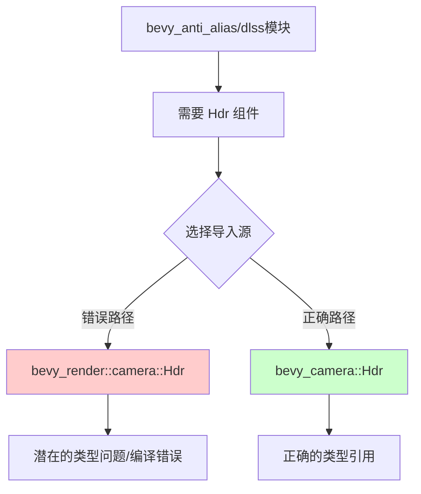

+++
title = "#22689 Fix dlss for real this time :/"
date = "2026-01-25T00:00:00"
draft = false
template = "pull_request_page.html"
in_search_index = false

[extra]
current_language = "zh-cn"
available_languages = {"en" = { name = "English", url = "/pull_request/bevy/2026-01/pr-22689-en-20260125" }, "zh-cn" = { name = "中文", url = "/pull_request/bevy/2026-01/pr-22689-zh-cn-20260125" }}
+++

# Fix dlss for real this time :/

## Basic Information
- **标题**: Fix dlss for real this time :/
- **PR 链接**: https://github.com/bevyengine/bevy/pull/22689
- **作者**: atlv24
- **状态**: 已合并
- **标签**: D-Trivial, A-Rendering, S-Ready-For-Final-Review
- **创建时间**: 2026-01-25T02:02:27Z
- **合并时间**: 2026-01-25T04:11:19Z
- **合并人**: alice-i-cecile

## 描述翻译
#22688 也是错误的，我们需要持续集成 😵‍💫

## 本次 Pull Request 的技术故事

这次 PR 是一个典型的导入路径修复案例。开发者发现之前的修复尝试 (#22688) 仍然存在问题，问题的核心是 DLSS 模块中使用了错误的 `Hdr` 组件导入路径。

在修改之前，`dlss/mod.rs` 从 `bevy_render::camera` 模块导入了 `Hdr` 类型。然而，经过代码重构或模块重组后，`Hdr` 组件的正确定义实际上位于 `bevy_camera` crate 中。`bevy_render` 可能只是重新导出了这个类型，但这种间接依赖可能会导致编译问题或者潜在的版本不一致问题。

修复的方法很直接：将 `Hdr` 的导入从 `bevy_render::camera` 改为直接从定义它的 crate `bevy_camera` 导入。同时，保留从 `bevy_render::camera` 导入的其他类型（`MipBias` 和 `TemporalJitter`），因为这些类型可能仍然是正确通过该路径导出的。

从技术角度看，这种修复有几个好处：

1. **消除潜在的类型混淆**：直接从定义crate导入确保使用的是正确的类型定义，避免由于重新导出导致的版本或路径问题
2. **提高代码清晰度**：明确显示每个类型的来源，让依赖关系更加透明
3. **避免编译错误**：当重新导出路径发生变化或不再可用时，直接导入可以防止编译中断

这个修复虽然看似微小，但对于 DLSS 功能的正常工作是必要的。DLSS (深度学习超级采样) 是 NVIDIA 的抗锯齿技术，需要正确处理高动态范围 (HDR) 渲染才能正常工作。如果 `Hdr` 组件导入错误，可能导致 DLSS 无法正确识别渲染管道的 HDR 状态，从而影响抗锯齿效果或导致渲染错误。

PR 描述中的 "we need ci" 评论反映了这类问题最好通过持续集成测试来避免。一个完善的 CI 系统可以在代码合并前检测到这种导入问题，防止需要多次修复。

## 视觉表示



## 关键文件变更

### `crates/bevy_anti_alias/src/dlss/mod.rs` (+2/-1)

**变更描述**: 修正了 `Hdr` 组件的导入路径，从间接的 `bevy_render::camera` 路径改为直接的 `bevy_camera` 路径。

**代码变更**:
```rust
// 文件: crates/bevy_anti_alias/src/dlss/mod.rs
// 变更前:
use bevy_render::camera::{Hdr, MipBias, TemporalJitter};

// 变更后:
use bevy_camera::Hdr;
use bevy_render::camera::{MipBias, TemporalJitter};
```

**与 PR 目的的关系**: 这个修改是本次 PR 的核心，确保 DLSS 模块使用正确来源的 `Hdr` 组件，避免潜在的编译问题或运行时错误。

## 扩展阅读

- [Bevy 相机系统文档](https://docs.rs/bevy_camera/latest/bevy_camera/) - 了解 `Hdr` 组件在相机系统中的角色
- [Rust 的模块系统与导入最佳实践](https://doc.rust-lang.org/book/ch07-00-managing-growing-projects-with-packages-crates-and-modules.html) - 理解如何正确组织导入
- [NVIDIA DLSS 技术文档](https://developer.nvidia.com/dlss) - 了解 DLSS 技术的工作原理和要求
- [Bevy 渲染管线架构](https://bevyengine.org/learn/book/development/architecture/) - 理解 Bevy 引擎中渲染组件之间的关系

# 完整代码差异
```diff
diff --git a/crates/bevy_anti_alias/src/dlss/mod.rs b/crates/bevy_anti_alias/src/dlss/mod.rs
index 7d97696fd8659..e974d577d5c3d 100644
--- a/crates/bevy_anti_alias/src/dlss/mod.rs
+++ b/crates/bevy_anti_alias/src/dlss/mod.rs
@@ -21,6 +21,7 @@ mod prepare;
 pub use dlss_wgpu::DlssPerfQualityMode;
 
 use bevy_app::{App, Plugin};
+use bevy_camera::Hdr;
 use bevy_core_pipeline::{
     core_3d::graph::{Core3d, Node3d},
     prepass::{DepthPrepass, MotionVectorPrepass},
@@ -29,7 +30,7 @@ use bevy_ecs::prelude::*;
 use bevy_math::{UVec2, Vec2};
 use bevy_reflect::{reflect_remote, Reflect};
 use bevy_render::{
-    camera::{Hdr, MipBias, TemporalJitter},
+    camera::{MipBias, TemporalJitter},
     render_graph::{RenderGraphExt, ViewNodeRunner},
     renderer::{
         raw_vulkan_init::{AdditionalVulkanFeatures, RawVulkanInitSettings},
```