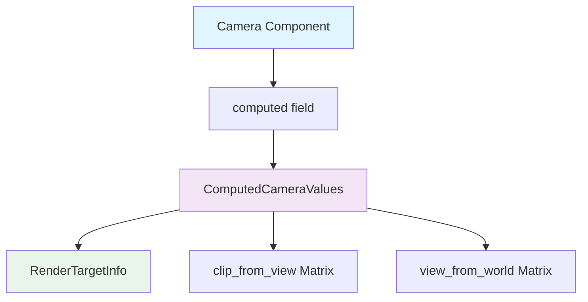

+++
title = "#22691 reflect ComputedCameraValues"
date = "2026-01-25T00:00:00"
draft = false
template = "pull_request_page.html"
in_search_index = true

[taxonomies]
list_display = ["show"]

[extra]
current_language = "en"
available_languages = {"en" = { name = "English", url = "/pull_request/bevy/2026-01/pr-22691-en-20260125" }, "zh-cn" = { name = "中文", url = "/pull_request/bevy/2026-01/pr-22691-zh-cn-20260125" }}
labels = ["D-Trivial", "A-Rendering", "A-Reflection"]
+++

# Title

## Basic Information
- **Title**: reflect ComputedCameraValues
- **PR Link**: https://github.com/bevyengine/bevy/pull/22691
- **Author**: atlv24
- **Status**: MERGED
- **Labels**: D-Trivial, A-Rendering, S-Ready-For-Final-Review, A-Reflection
- **Created**: 2026-01-25T04:13:19Z
- **Merged**: 2026-01-25T21:22:50Z
- **Merged By**: alice-i-cecile

## Description Translation
# Objective

- Don't know why it wasn't reflected

## Solution

- reflect it

## Testing

- ci

## The Story of This Pull Request

This PR addresses a straightforward oversight in Bevy's camera system: the `ComputedCameraValues` struct wasn't configured for reflection. In Bevy's architecture, reflection enables runtime type inspection, serialization, and various editor features. When a type implements the `Reflect` trait, it can be dynamically examined and manipulated at runtime, which is particularly important for editor tooling and scene serialization.

The issue was discovered when working with the camera component. The `Camera` struct already had `#[derive(Reflect)]`, but its `computed` field was marked with `#[reflect(ignore, clone)]`. This meant that while the camera itself was reflectable, its computed values weren't included in reflection operations. Looking deeper, the problem extended to the `ComputedCameraValues` struct itself, which didn't derive `Reflect`, and also to `RenderTargetInfo` which was in the same situation.

The solution was simple and direct: add `Reflect` to the derive macros for both structs and remove the ignore attribute from the `computed` field. This change makes the camera's computed values fully accessible through Bevy's reflection system, which is important for features like scene serialization where these values need to be preserved or for editor tools that might need to inspect camera state.

Interestingly, there's a comment in the code about another field (`output_mode`) not being reflected yet, mentioning "todo: reflect this when #6042 lands." This suggests that camera reflection improvements are being tracked separately, and this PR likely represents a smaller, self-contained piece of that work.

The implementation follows Bevy's established patterns for reflection. By deriving `Reflect` on these structs, they automatically gain the necessary trait implementations to work with Bevy's reflection system. The `clone` attribute was likely removed because `ComputedCameraValues` already implements `Clone`, and with `Reflect` derived, the reflection system can handle cloning through its own mechanisms.

This change doesn't affect runtime performance in normal gameplay since reflection is typically only used during specific operations like serialization or editor interactions. However, it does increase the flexibility of the camera system by making all its data accessible through Bevy's reflection APIs.

## Visual Representation



## Key Files Changed

`crates/bevy_camera/src/camera.rs` (+2/-3)

This file contains the core camera types in Bevy. The changes enable reflection for camera-related data structures that were previously missing this capability.

```rust
// File: crates/bevy_camera/src/camera.rs
// Before:
#[derive(Debug, Clone)]
pub struct RenderTargetInfo {
    // ...
}

#[derive(Default, Debug, Clone)]
pub struct ComputedCameraValues {
    // ...
}

pub struct Camera {
    // ...
    /// Computed values for this camera, such as the projection matrix and the render target size.
    #[reflect(ignore, clone)]
    pub computed: ComputedCameraValues,
    // ...
}

// After:
#[derive(Debug, Reflect, Clone)]
pub struct RenderTargetInfo {
    // ...
}

#[derive(Default, Debug, Reflect, Clone)]
pub struct ComputedCameraValues {
    // ...
}

pub struct Camera {
    // ...
    /// Computed values for this camera, such as the projection matrix and the render target size.
    pub computed: ComputedCameraValues,
    // ...
}
```

The changes are minimal but important:
1. `RenderTargetInfo` now derives `Reflect` in addition to `Debug` and `Clone`
2. `ComputedCameraValues` now derives `Reflect` in addition to `Default`, `Debug`, and `Clone`
3. The `#[reflect(ignore, clone)]` attribute is removed from the `computed` field in the `Camera` struct, allowing it to be included in reflection operations

These changes enable the entire camera data structure to be serialized, deserialized, and inspected at runtime through Bevy's reflection system.

## Further Reading

1. [Bevy Reflection Documentation](https://docs.rs/bevy_reflect/latest/bevy_reflect/) - Comprehensive guide to Bevy's reflection system
2. [Deriving Reflect Trait](https://bevyengine.org/learn/quick-start/reflection/#deriving-reflect) - How to use the Reflect derive macro
3. [Bevy Camera Component Documentation](https://docs.rs/bevy_camera/latest/bevy_camera/) - Detailed information about camera components in Bevy

# Full Code Diff
```
diff --git a/crates/bevy_camera/src/camera.rs b/crates/bevy_camera/src/camera.rs
index 8b2248942e3ef..e8827d7edcee7 100644
--- a/crates/bevy_camera/src/camera.rs
+++ b/crates/bevy_camera/src/camera.rs
@@ -158,7 +158,7 @@ impl Default for SubCameraView {
 }
 
 /// Information about the current [`RenderTarget`].
-#[derive(Debug, Clone)]
+#[derive(Debug, Reflect, Clone)]
 pub struct RenderTargetInfo {
     /// The physical size of this render target (in physical pixels, ignoring scale factor).
     pub physical_size: UVec2,
@@ -179,7 +179,7 @@ impl Default for RenderTargetInfo {
 }
 
 /// Holds internally computed [`Camera`] values.
-#[derive(Default, Debug, Clone)]
+#[derive(Default, Debug, Reflect, Clone)]
 pub struct ComputedCameraValues {
     pub clip_from_view: Mat4,
     pub target_info: Option<RenderTargetInfo>,
@@ -355,7 +355,6 @@ pub struct Camera {
     /// camera will not be rendered.
     pub is_active: bool,
     /// Computed values for this camera, such as the projection matrix and the render target size.
-    #[reflect(ignore, clone)]
     pub computed: ComputedCameraValues,
     // todo: reflect this when #6042 lands
     /// The [`CameraOutputMode`] for this camera.
```