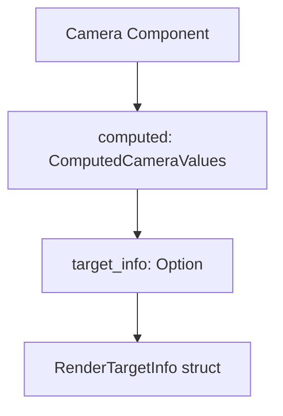

+++
title = "#22691 reflect ComputedCameraValues"
date = "2026-01-25T00:00:00"
draft = false
template = "pull_request_page.html"
in_search_index = false

[extra]
current_language = "zh-cn"
available_languages = {"en" = { name = "English", url = "/pull_request/bevy/2026-01/pr-22691-en-20260125" }, "zh-cn" = { name = "中文", url = "/pull_request/bevy/2026-01/pr-22691-zh-cn-20260125" }}
labels = ["D-Trivial", "A-Rendering", "A-Reflection"]
+++

# Title
reflect ComputedCameraValues

## Basic Information
- **Title**: reflect ComputedCameraValues
- **PR Link**: https://github.com/bevyengine/bevy/pull/22691
- **Author**: atlv24
- **Status**: MERGED
- **Labels**: D-Trivial, A-Rendering, S-Ready-For-Final-Review, A-Reflection
- **Created**: 2026-01-25T04:13:19Z
- **Merged**: 2026-01-25T21:22:50Z
- **Merged By**: alice-i-cecile

## Description Translation
### 目标
- 不知道为什么它没有被反射 (reflected)

### 解决方案
- 反射它

### 测试
- ci

## The Story of This Pull Request

这个PR讲述了一个关于Bevy引擎中反射（Reflection）系统一致性的小故事。反射是Bevy的一个核心特性，它允许在运行时检查和操作类型信息，这对于编辑器集成、序列化和一些动态系统至关重要。

故事始于开发者`atlv24`注意到`Camera`组件中的一个不一致之处。`Camera`结构体的`computed`字段，其类型为`ComputedCameraValues`，没有被标记为可反射。这意味着当通过反射系统查询`Camera`组件时，`computed`字段及其内部数据对反射系统是不可见的。开发者不清楚为什么当初这个字段被排除在外（"Don't know why it wasnt reflected"），但将其纳入反射系统显然是必要的，以保持组件的完整性并支持所有可能的运行时用例。

问题本质上很简单：`ComputedCameraValues`结构体及其内部字段`RenderTargetInfo`没有被`#[derive(Reflect)]`宏标记。同时，`Camera`结构体中的`computed`字段被显式地用`#[reflect(ignore, clone)]`属性忽略了。这使得整个`computed`数据块在反射系统中成为一个“黑洞”。

解决方案同样直接明了。开发者采取了两个步骤来修复这个问题：
1.  为`RenderTargetInfo`和`ComputedCameraValues`这两个结构体都添加了`Reflect`派生宏。这使得它们自身的类型信息可以被反射系统识别。
2.  从`Camera`结构体的`computed`字段上移除了`#[reflect(ignore, clone)]`属性。既然`ComputedCameraValues`现在实现了`Reflect`，这个字段就可以被正确反射了。

从技术实现来看，这个改动非常简洁。`ComputedCameraValues`存储的是由引擎计算得出的值（如视图投影矩阵），而不是由用户直接配置的。这可能解释了为什么它最初被忽略——也许开发者认为只有用户可配置的字段才需要反射。然而，对于需要完整访问`Camera`状态（包括其计算后结果）的工具或系统来说，能够反射这些计算值是很有用的。

这个更改的影响是积极的，它提高了`Camera`组件反射数据的完整性。现在，任何依赖反射来检查或操作`Camera`的代码都能完整地访问其所有字段。这是一个维护性的改进，修复了一个小漏洞，并确保了反射API的一致性。虽然改动很小，但它体现了对代码库细节的关注，有助于保持整个引擎的健壮性。

## Visual Representation



## Key Files Changed

**crates/bevy_camera/src/camera.rs** (+2/-3)

1.  修改描述与原因：此文件包含了`Camera`组件及其相关数据结构的定义。本次修改为`RenderTargetInfo`和`ComputedCameraValues`结构体添加了`Reflect` trait的派生实现，并移除了`Camera`结构体中`computed`字段上的反射忽略属性。这使得`Camera`组件的所有字段都能被引擎的反射系统正确识别和访问。

2.  关键代码片段：

```rust
// File: crates/bevy_camera/src/camera.rs
// 修改1：为 RenderTargetInfo 添加 Reflect
// Before:
#[derive(Debug, Clone)]
pub struct RenderTargetInfo { ... }

// After:
#[derive(Debug, Reflect, Clone)]
pub struct RenderTargetInfo { ... }

// 修改2：为 ComputedCameraValues 添加 Reflect
// Before:
#[derive(Default, Debug, Clone)]
pub struct ComputedCameraValues { ... }

// After:
#[derive(Default, Debug, Reflect, Clone)]
pub struct ComputedCameraValues { ... }

// 修改3：移除 Camera.computed 字段的 reflect(ignore) 属性
// Before:
pub struct Camera {
    ...
    /// Computed values for this camera, such as the projection matrix and the render target size.
    #[reflect(ignore, clone)]
    pub computed: ComputedCameraValues,
    ...
}

// After:
pub struct Camera {
    ...
    /// Computed values for this camera, such as the projection matrix and the render target size.
    pub computed: ComputedCameraValues,
    ...
}
```

3.  与PR目标的关联：这些修改直接实现了PR的目标——使`ComputedCameraValues`能够被反射。通过让底层结构体实现`Reflect`并解除父结构体中对字段的忽略，确保了整个数据链对反射系统可见。

## Further Reading

*   **Bevy Reflection Book**: Bevy官方手册中关于反射系统的章节，详细解释了反射的概念、用途和如何自定义反射。 [https://bevyengine.org/learn/book/reflection/](https://bevyengine.org/learn/book/reflection/)
*   **`bevy_reflect` Crate Documentation**: `bevy_reflect` crate的API文档，是了解`Reflect` trait及其派生宏细节的最佳资源。 [https://docs.rs/bevy_reflect/latest/bevy_reflect/](https://docs.rs/bevy_reflect/latest/bevy_reflect/)
*   **GitHub Issue #6042**: PR描述中提到的一个相关issue（“todo: reflect this when #6042 lands”），可能涉及其他相关字段的反射计划，提供了更广泛的上下文。 [https://github.com/bevyengine/bevy/issues/6042](https://github.com/bevyengine/bevy/issues/6042)