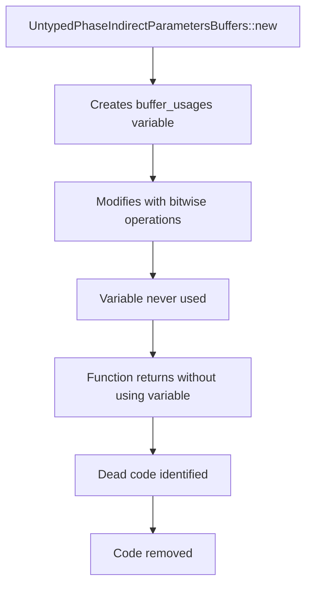

+++
title = "#22692 Remove some dead code"
date = "2026-01-25T00:00:00"
draft = false
template = "pull_request_page.html"
in_search_index = true

[taxonomies]
list_display = ["show"]

[extra]
current_language = "en"
available_languages = {"en" = { name = "English", url = "/pull_request/bevy/2026-01/pr-22692-en-20260125" }, "zh-cn" = { name = "中文", url = "/pull_request/bevy/2026-01/pr-22692-zh-cn-20260125" }}
labels = ["D-Trivial", "A-Rendering"]
+++

# Title
Remove some dead code

## Basic Information
- **Title**: Remove some dead code
- **PR Link**: https://github.com/bevyengine/bevy/pull/22692
- **Author**: atlv24
- **Status**: MERGED
- **Labels**: D-Trivial, A-Rendering, S-Needs-Review
- **Created**: 2026-01-25T04:14:55Z
- **Merged**: 2026-01-25T19:54:25Z
- **Merged By**: mockersf

## Description Translation
# Objective

- This doesn't do anything. Its not caught by dead code analysis because its a bitflag custom operator implementation and has potential side-effects i believe.

## Solution

- yeet

## The Story of This Pull Request

This pull request addresses a straightforward but subtle issue in Bevy's rendering codebase: a chunk of dead code that wasn't being caught by the compiler's dead code analysis. The problem was located in the `gpu_preprocessing` module within the rendering system, specifically in the `UntypedPhaseIndirectParametersBuffers::new` function.

The dead code in question was a block that created and manipulated a `BufferUsages` variable but never actually used it. Here's what the problematic code looked like:

```rust
let mut indirect_parameter_buffer_usages = BufferUsages::STORAGE | BufferUsages::INDIRECT;
if allow_copies_from_indirect_parameter_buffers {
    indirect_parameter_buffer_usages |= BufferUsages::COPY_SRC;
}
```

This code creates a `indirect_parameter_buffer_usages` variable, sets some initial flags, conditionally adds another flag based on a parameter, but then never references this variable again in the function. The function proceeds to create and return a `UntypedPhaseIndirectParametersBuffers` struct without ever using the computed buffer usages.

The interesting technical aspect here is why this dead code wasn't automatically detected by the compiler. The author's note explains the reasoning: "It's not caught by dead code analysis because its a bitflag custom operator implementation and has potential side-effects." This refers to how Rust's dead code analysis works - it typically warns about unused variables and functions, but in this case, the variable was being modified (via the `|=` operator), which involves calling custom implementations of the `BitOrAssign` trait. The compiler can't easily determine whether these operations have side effects, so it conservatively doesn't flag the variable as unused.

From an engineering perspective, this is a clean-up PR that removes unnecessary code without affecting functionality. The removal simplifies the codebase by eliminating computational overhead (creating and modifying a variable that's never used) and reducing cognitive load for developers reading the code. While the performance impact is negligible in this specific case, maintaining clean, dead-code-free codebases is important for long-term maintainability.

The solution approach is minimal and correct: simply remove the dead code block. The `yeet` in the PR description is colloquial developer terminology for removing or discarding something, and in this context, it accurately describes the action taken.

One thing worth noting is that while the `BufferUsages` bitflag operations don't have meaningful side effects in this context (they're just combining enum variants), the compiler's conservative approach is technically correct. Custom implementations of operator traits could potentially have side effects, so the compiler can't assume they're safe to eliminate.

This change demonstrates good code hygiene practices. Even though the dead code wasn't causing functional issues, removing it improves code clarity and prevents potential confusion for future developers who might wonder why buffer usage flags are being computed but not used. It also slightly reduces the compiled binary size and eliminates unnecessary operations at runtime.

## Visual Representation



## Key Files Changed

### `crates/bevy_render/src/batching/gpu_preprocessing.rs` (+0/-5)

This file contains GPU preprocessing logic for batching operations in Bevy's renderer. The change removes a block of dead code that was computing buffer usage flags but never using the result.

**Key modifications:**
```rust
// Before:
pub fn new(
    allow_copies_from_indirect_parameter_buffers: bool,
) -> UntypedPhaseIndirectParametersBuffers {
    let mut indirect_parameter_buffer_usages = BufferUsages::STORAGE | BufferUsages::INDIRECT;
    if allow_copies_from_indirect_parameter_buffers {
        indirect_parameter_buffer_usages |= BufferUsages::COPY_SRC;
    }

    UntypedPhaseIndirectParametersBuffers {
        non_indexed: MeshClassIndirectParametersBuffers::new(
            allow_copies_from_indirect_parameter_buffers,
        ),
        indexed: MeshClassIndirectParametersBuffers::new(
            allow_copies_from_indirect_parameter_buffers,
        ),
    }
}

// After:
pub fn new(
    allow_copies_from_indirect_parameter_buffers: bool,
) -> UntypedPhaseIndirectParametersBuffers {
    UntypedPhaseIndirectParametersBuffers {
        non_indexed: MeshClassIndirectParametersBuffers::new(
            allow_copies_from_indirect_parameter_buffers,
        ),
        indexed: MeshClassIndirectParametersBuffers::new(
            allow_copies_from_indirect_parameter_buffers,
        ),
    }
}
```

The removed code was computing a `BufferUsages` value that was never passed to the `MeshClassIndirectParametersBuffers::new` calls or used elsewhere in the function. The parameter `allow_copies_from_indirect_parameter_buffers` is still passed through to the constructor calls, so functionality remains unchanged.

## Further Reading

1. **Rust Dead Code Warnings**: The Rust compiler's `dead_code` lint and how it works with variables that have trait implementations.
2. **Bevy's BufferUsages Enum**: Understanding how Bevy handles GPU buffer usage flags and bitwise operations on enums.
3. **Operator Overloading in Rust**: How custom implementations of traits like `BitOr` and `BitOrAssign` can affect compiler analysis.
4. **Code Cleanup Best Practices**: General principles for maintaining clean codebases and identifying dead code.
5. **Bevy's Rendering Architecture**: How GPU preprocessing and indirect parameter buffers fit into Bevy's overall rendering pipeline.