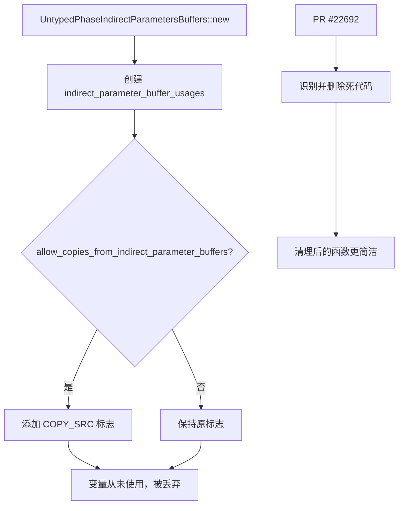

+++
title = "#22692 Remove some dead code"
date = "2026-01-25T00:00:00"
draft = false
template = "pull_request_page.html"
in_search_index = false

[extra]
current_language = "zh-cn"
available_languages = {"en" = { name = "English", url = "/pull_request/bevy/2026-01/pr-22692-en-20260125" }, "zh-cn" = { name = "中文", url = "/pull_request/bevy/2026-01/pr-22692-zh-cn-20260125" }}
+++

# Remove some dead code

## 基本信息
- **标题**: Remove some dead code
- **PR链接**: https://github.com/bevyengine/bevy/pull/22692
- **作者**: atlv24
- **状态**: 已合并
- **标签**: D-Trivial, A-Rendering, S-Needs-Review
- **创建时间**: 2026-01-25T04:14:55Z
- **合并时间**: 2026-01-25T19:54:25Z
- **合并者**: mockersf

## 描述翻译

# 目标

- 这段代码没有任何作用。由于它是位标志（bitflag）自定义运算符实现并且可能有潜在副作用，死代码分析没有捕获到它。

## 解决方案

- 删除（yeet）

## 这个Pull Request的故事

这个PR的故事相对简单直接。开发者在审查代码时发现了一段无效代码，虽然编译器没有标记为死代码，但从功能角度分析，这段代码实际上没有执行任何有用的操作。

问题的核心在于 `UntypedPhaseIndirectParametersBuffers::new` 函数中的一个逻辑缺陷。在修改前，函数内部创建了一个 `indirect_parameter_buffer_usages` 变量，这个变量会根据 `allow_copies_from_indirect_parameter_buffers` 参数的值进行条件性设置，但关键问题在于：这个变量在函数体内从未被使用。

从代码分析来看，`indirect_parameter_buffer_usages` 变量被初始化为 `BufferUsages::STORAGE | BufferUsages::INDIRECT`，如果 `allow_copies_from_indirect_parameter_buffers` 为真，还会添加 `BufferUsages::COPY_SRC` 标志。然而，这个变量在设置后立即被丢弃，没有传递给任何函数，也没有用于结构体初始化或其他任何地方。

开发者指出，这种类型的代码通常不会被标准死代码分析工具捕获，因为它涉及到位标志（bitflag）自定义运算符的实现，编译器可能认为它有潜在副作用。在Rust中，位运算通常被认为是无副作用的，但自定义的运算符重载可能被编译器视为有潜在副作用，因此不会自动优化掉。

这个问题的解决方案非常简单明了：直接删除这些无用的代码行。删除后，函数逻辑更加清晰，减少了不必要的计算和潜在的混淆。

从工程角度看，这个PR展示了几个重要的代码审查实践：
1. **不依赖工具完全替代人工审查**：即使编译器没有报告警告，有经验的开发者仍然能识别出无用的代码路径。
2. **关注实际效果而非语法正确性**：这段代码在语法上是正确的，但从语义上看是无效的。
3. **保持代码简洁性**：删除无用代码减少了认知负荷，让代码更易于理解和维护。

虽然这个改动本身很小，只有5行代码被移除，但它体现了良好的代码卫生习惯。在大型代码库中，累积的无用代码会增加维护成本和潜在的混淆。

## 可视化表示



## 关键文件变更

### `crates/bevy_render/src/batching/gpu_preprocessing.rs`

**变更描述**: 删除了 `UntypedPhaseIndirectParametersBuffers::new` 函数中未使用的 `indirect_parameter_buffer_usages` 变量及其相关逻辑。

**代码变更**:
```rust
// 修改前:
impl UntypedPhaseIndirectParametersBuffers {
    pub fn new(
        allow_copies_from_indirect_parameter_buffers: bool,
    ) -> UntypedPhaseIndirectParametersBuffers {
        let mut indirect_parameter_buffer_usages = BufferUsages::STORAGE | BufferUsages::INDIRECT;
        if allow_copies_from_indirect_parameter_buffers {
            indirect_parameter_buffer_usages |= BufferUsages::COPY_SRC;
        }

        UntypedPhaseIndirectParametersBuffers {
            non_indexed: MeshClassIndirectParametersBuffers::new(
                allow_copies_from_indirect_parameter_buffers,
            ),
            indexed: MeshClassIndirectParametersBuffers::new(
                allow_copies_from_indirect_parameter_buffers,
            ),
        }
    }
}

// 修改后:
impl UntypedPhaseIndirectParametersBuffers {
    pub fn new(
        allow_copies_from_indirect_parameter_buffers: bool,
    ) -> UntypedPhaseIndirectParametersBuffers {
        UntypedPhaseIndirectParametersBuffers {
            non_indexed: MeshClassIndirectParametersBuffers::new(
                allow_copies_from_indirect_parameter_buffers,
            ),
            indexed: MeshClassIndirectParametersBuffers::new(
                allow_copies_from_indirect_parameter_buffers,
            ),
        }
    }
}
```

**与PR目的的关系**: 这个变更直接实现了PR的目标，即移除无用的代码。修改后，函数逻辑更加清晰，只包含必要的操作。

## 完整代码差异
```diff
diff --git a/crates/bevy_render/src/batching/gpu_preprocessing.rs b/crates/bevy_render/src/batching/gpu_preprocessing.rs
index 1c31e894523a3..895c74f01a2db 100644
--- a/crates/bevy_render/src/batching/gpu_preprocessing.rs
+++ b/crates/bevy_render/src/batching/gpu_preprocessing.rs
@@ -860,11 +860,6 @@ impl UntypedPhaseIndirectParametersBuffers {
     pub fn new(
         allow_copies_from_indirect_parameter_buffers: bool,
     ) -> UntypedPhaseIndirectParametersBuffers {
-        let mut indirect_parameter_buffer_usages = BufferUsages::STORAGE | BufferUsages::INDIRECT;
-        if allow_copies_from_indirect_parameter_buffers {
-            indirect_parameter_buffer_usages |= BufferUsages::COPY_SRC;
-        }
-
         UntypedPhaseIndirectParametersBuffers {
             non_indexed: MeshClassIndirectParametersBuffers::new(
                 allow_copies_from_indirect_parameter_buffers,
```

## 延伸阅读

1. **Rust中的死代码分析**: 
   - [Rust Book: Dead Code](https://doc.rust-lang.org/book/ch03-03-how-functions-work.html#dead-code)
   - `#[allow(dead_code)]` 属性的使用和最佳实践

2. **Bevy渲染系统**:
   - [Bevy渲染管线文档](https://bevyengine.org/learn/book/rendering/)
   - GPU预处理和批处理在游戏引擎中的重要性

3. **位标志(bitflags)模式**:
   - [Rust bitflags crate](https://docs.rs/bitflags/latest/bitflags/)
   - 在图形编程中使用位标志表示状态和配置的常见模式

4. **代码卫生最佳实践**:
   - 定期进行代码审查识别无用代码
   - 使用静态分析工具辅助识别潜在问题
   - 保持函数简洁和单一职责原则