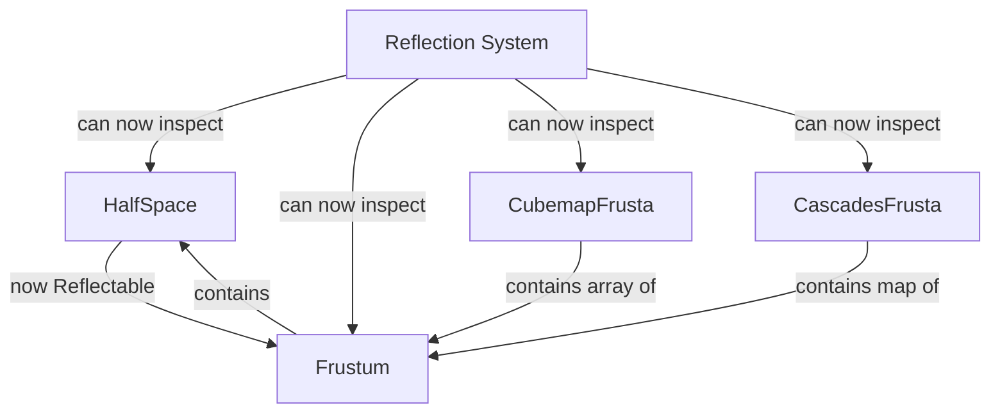

+++
title = "#22693 reflect Frustum and HalfSpace"
date = "2026-01-25T00:00:00"
draft = false
template = "pull_request_page.html"
in_search_index = true

[taxonomies]
list_display = ["show"]

[extra]
current_language = "en"
available_languages = {"en" = { name = "English", url = "/pull_request/bevy/2026-01/pr-22693-en-20260125" }, "zh-cn" = { name = "中文", url = "/pull_request/bevy/2026-01/pr-22693-zh-cn-20260125" }}
labels = ["D-Trivial", "A-Rendering", "A-Reflection"]
+++

# Title
reflect Frustum and HalfSpace

## Basic Information
- **Title**: reflect Frustum and HalfSpace
- **PR Link**: https://github.com/bevyengine/bevy/pull/22693
- **Author**: atlv24
- **Status**: MERGED
- **Labels**: D-Trivial, A-Rendering, S-Ready-For-Final-Review, A-Reflection
- **Created**: 2026-01-25T04:23:07Z
- **Merged**: 2026-01-25T21:21:23Z
- **Merged By**: alice-i-cecile

## Description Translation
**Objective**
- reflect it

**Solution**
- Reflect derive

## The Story of This Pull Request

This PR addresses a straightforward but important gap in Bevy's reflection system by adding the `Reflect` derive to the `HalfSpace` struct and enabling reflection for fields that were previously excluded from reflection in several camera-related components.

The issue was that while Bevy's reflection system allows for runtime type inspection and dynamic operations, two key types in the camera system weren't fully compatible with it. The `HalfSpace` struct, which represents a plane that divides 3D space into two half-spaces, lacked the `Reflect` derive entirely. Additionally, the `Frustum`, `CubemapFrusta`, and `CascadesFrusta` structs had reflection intentionally disabled for their core fields via the `#[reflect(ignore)]` attribute.

The technical problem here is that without reflection support, these types can't participate in Bevy's dynamic systems. For example, they can't be:
- Inspected at runtime through reflection tools
- Used in Bevy's scene serialization/deserialization
- Modified dynamically through editor interfaces
- Included in dynamic queries that rely on reflection

The solution is minimal but complete: add `Reflect` to `HalfSpace`'s derive macro list and remove the `#[reflect(ignore)]` attributes from the fields that contain `HalfSpace` and `Frustum` instances. This change is consistent with how other geometric primitives in Bevy are handled and follows the established pattern of using derive macros for reflection support.

The implementation involves four specific changes in `primitives.rs`:

1. **Adding `Reflect` to `HalfSpace`**: The struct now includes `Reflect` in its derive attributes, making it fully reflectable like other math primitives in Bevy.

2. **Enabling reflection for `Frustum::half_spaces`**: Previously marked with `#[reflect(ignore, clone)]`, this field can now be reflected since its element type (`HalfSpace`) now supports reflection.

3. **Enabling reflection for `CubemapFrusta::frusta`**: Similarly, this array of `Frustum` instances can now be reflected since `Frustum` fully supports reflection (including its now-reflectable `half_spaces` field).

4. **Enabling reflection for `CascadesFrusta::frusta`**: This `EntityHashMap<Vec<Frustum>>` field can now participate in reflection since all nested types in the hierarchy now support reflection.

The key technical insight here is that reflection in Bevy uses a compositional approach. When a struct contains fields of other types, those types must also support reflection for the containing struct to be fully reflectable. The `#[reflect(ignore)]` attribute was being used as a workaround when `HalfSpace` didn't support reflection, but now that it does, the workaround can be removed.

This change doesn't affect runtime performance for systems that don't use reflection, since the reflection metadata is only generated at compile time and stored in the type registry. For systems that do use reflection, this enables complete access to camera frustum data at runtime.

The impact of this change is that camera-related components can now fully participate in Bevy's reflection ecosystem. This is particularly useful for:
- Scene serialization/deserialization (saving and loading camera configurations)
- Editor tools that need to inspect and modify camera properties
- Dynamic systems that work with camera geometry
- Debug visualization tools that rely on reflection

## Visual Representation



## Key Files Changed

### `crates/bevy_camera/src/primitives.rs`

1. **Added `Reflect` derive to `HalfSpace` struct**:
```rust
// Before:
#[derive(Clone, Copy, Debug, Default)]
pub struct HalfSpace {
    normal_d: Vec4,
}

// After:
#[derive(Clone, Copy, Reflect, Debug, Default)]
pub struct HalfSpace {
    normal_d: Vec4,
}
```

2. **Removed reflection ignore from `Frustum::half_spaces`**:
```rust
// Before:
#[derive(Component, Clone, Copy, Debug, Default, Reflect)]
#[reflect(Component, Default, Debug, Clone)]
pub struct Frustum {
    #[reflect(ignore, clone)]
    pub half_spaces: [HalfSpace; 6],
}

// After:
#[derive(Component, Clone, Copy, Debug, Default, Reflect)]
#[reflect(Component, Default, Debug, Clone)]
pub struct Frustum {
    pub half_spaces: [HalfSpace; 6],
}
```

3. **Removed reflection ignore from `CubemapFrusta::frusta`**:
```rust
// Before:
#[derive(Component, Clone, Debug, Default, Reflect)]
#[reflect(Component, Default, Debug, Clone)]
pub struct CubemapFrusta {
    #[reflect(ignore, clone)]
    pub frusta: [Frustum; 6],
}

// After:
#[derive(Component, Clone, Debug, Default, Reflect)]
#[reflect(Component, Default, Debug, Clone)]
pub struct CubemapFrusta {
    pub frusta: [Frustum; 6],
}
```

4. **Removed reflection ignore from `CascadesFrusta::frusta`**:
```rust
// Before:
#[derive(Component, Debug, Default, Reflect, Clone)]
#[reflect(Component, Default, Debug, Clone)]
pub struct CascadesFrusta {
    #[reflect(ignore, clone)]
    pub frusta: EntityHashMap<Vec<Frustum>>,
}

// After:
#[derive(Component, Debug, Default, Reflect, Clone)]
#[reflect(Component, Default, Debug, Clone)]
pub struct CascadesFrusta {
    pub frusta: EntityHashMap<Vec<Frustum>>,
}
```

## Further Reading

- [Bevy Reflection Documentation](https://docs.rs/bevy_reflect/latest/bevy_reflect/) - Comprehensive guide to Bevy's reflection system
- [Derive Macro for Reflection](https://github.com/bevyengine/bevy/blob/main/crates/bevy_reflect/derive/src/lib.rs) - Implementation details of the Reflect derive macro
- [Bevy Camera Primitives](https://github.com/bevyengine/bevy/blob/main/crates/bevy_camera/src/primitives.rs) - Source file containing the camera geometry types
- [Rust Attribute Macros](https://doc.rust-lang.org/reference/attributes.html) - Reference for Rust attribute syntax used by `#[reflect(...)]`

## Full Code Diff
```
diff --git a/crates/bevy_camera/src/primitives.rs b/crates/bevy_camera/src/primitives.rs
index 9d2a5203c6669..e03c07ce99bc3 100644
--- a/crates/bevy_camera/src/primitives.rs
+++ b/crates/bevy_camera/src/primitives.rs
@@ -218,7 +218,7 @@ impl Sphere {
 /// from the plane to the origin is `-8.0` along `NEG_Z`.
 ///
 /// It is used to define a [`Frustum`], but is also a useful mathematical primitive for rendering tasks such as  light computation.
-#[derive(Clone, Copy, Debug, Default)]
+#[derive(Clone, Copy, Reflect, Debug, Default)]
 pub struct HalfSpace {
     normal_d: Vec4,
 }
@@ -285,7 +285,6 @@ impl HalfSpace {
 #[derive(Component, Clone, Copy, Debug, Default, Reflect)]
 #[reflect(Component, Default, Debug, Clone)]
 pub struct Frustum {
-    #[reflect(ignore, clone)]
     pub half_spaces: [HalfSpace; 6],
 }
 
@@ -484,7 +483,6 @@ pub fn face_index_to_name(face_index: usize) -> &'static str {
 #[derive(Component, Clone, Debug, Default, Reflect)]
 #[reflect(Component, Default, Debug, Clone)]
 pub struct CubemapFrusta {
-    #[reflect(ignore, clone)]
     pub frusta: [Frustum; 6],
 }
 
@@ -536,7 +534,6 @@ pub enum CubemapLayout {
 #[derive(Component, Debug, Default, Reflect, Clone)]
 #[reflect(Component, Default, Debug, Clone)]
 pub struct CascadesFrusta {
-    #[reflect(ignore, clone)]
     pub frusta: EntityHashMap<Vec<Frustum>>,
 }
```