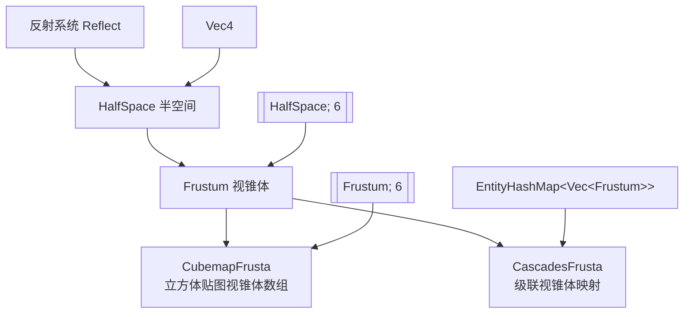

+++
title = "#22693 reflect Frustum and HalfSpace"
date = "2026-01-25T00:00:00"
draft = false
template = "pull_request_page.html"
in_search_index = false

[extra]
current_language = "zh-cn"
available_languages = {"en" = { name = "English", url = "/pull_request/bevy/2026-01/pr-22693-en-20260125" }, "zh-cn" = { name = "中文", url = "/pull_request/bevy/2026-01/pr-22693-zh-cn-20260125" }}
+++

# Title

## Basic Information
- **标题**: reflect Frustum and HalfSpace
- **PR 链接**: https://github.com/bevyengine/bevy/pull/22693
- **作者**: atlv24
- **状态**: 已合并
- **标签**: D-Trivial, A-Rendering, S-Ready-For-Final-Review, A-Reflection
- **创建时间**: 2026-01-25T04:23:07Z
- **合并时间**: 2026-01-25T21:21:23Z
- **合并者**: alice-i-cecile

## 描述翻译

### 目标
- 使其支持反射

### 解决方案
- 使用 Reflect derive 宏

## 本次 Pull Request 的技术解析

这个 PR 的核心目标是扩展 Bevy 引擎的反射系统，使其支持相机模块中的几个几何原语类型：`HalfSpace`（半空间）、`Frustum`（视锥体）、`CubemapFrusta`（立方体贴图视锥体数组）和 `CascadesFrusta`（级联视锥体映射）。

在 Bevy 的反射系统中，`#[derive(Reflect)]` 是一个关键的特性派生宏，它允许类型在运行时被检查、序列化和反序列化。反射系统对于编辑器集成、场景保存/加载、以及需要动态类型操作的特性至关重要。

从 diff 中可以看到，开发者进行了四个简洁但重要的修改：

1. **为 `HalfSpace` 结构体添加 Reflect 派生**：
   这是最基本的一步，因为 `HalfSpace` 是 `Frustum` 的构建块。每个视锥体由六个半空间（对应六个裁剪平面）组成。在修改前，`HalfSpace` 只派生 `Clone`、`Copy`、`Debug` 和 `Default`。添加 `Reflect` 后，它成为了一个完整的反射类型，其字段 `normal_d`（一个 `Vec4` 向量，编码了平面的法向量和到原点的距离）现在可以通过反射系统访问。

2. **移除 `Frustum` 中 `half_spaces` 字段的 `#[reflect(ignore)]` 属性**：
   这是一个关键修正。之前，虽然 `Frustum` 结构体本身派生 `Reflect`，但其 `half_spaces` 字段被标记为 `ignore`，这意味着即使 `Frustum` 在反射元数据中被注册，其内部的实际几何数据在反射时仍然不可见。现在移除了这个标记，由于 `HalfSpace` 现在也支持反射，整个 `[HalfSpace; 6]` 数组就可以被正确地反射了。

3. **类似地，移除 `CubemapFrusta` 中 `frusta` 字段的 `#[reflect(ignore)]` 属性**：
   `CubemapFrusta` 表示六个方向的视锥体（用于立方体贴图等环境映射）。它的 `frusta` 字段是一个 `[Frustum; 6]` 数组。在 `Frustum` 完全可反射后，这个数组也应该被反射。

4. **移除 `CascadesFrusta` 中 `frusta` 字段的 `#[reflect(ignore)]` 属性**：
   这个结构体用于阴影级联技术，其 `frusta` 字段是一个从实体到视锥体列表的映射（`EntityHashMap<Vec<Frustum>>`）。同样，当 `Frustum` 可反射时，这个复杂的嵌套结构现在也能被反射系统处理。

技术细节上需要注意，`#[reflect(ignore)]` 属性中的 `clone` 参数实际上是多余的且无效的。标准的 `Reflect` derive 宏只识别 `ignore`、`default` 等参数。`clone` 可能是一个笔误或误解。`Clone` 行为由结构体级别的 `#[derive(Clone)]` 控制，与反射无关。

这个修改的影响是直接的：任何使用反射系统来检查或序列化这些相机原语的代码现在都可以正常工作。例如，场景序列化到文件时，现在可以包含 `Frustum` 组件的完整数据；编辑器工具可以检查并可能修改这些几何参数；反射驱动的 UI 系统可以显示这些结构的内容。

从工程角度看，这是一个典型的 "completing the reflection support" 类型的修改。它填补了现有功能中的一个空白，确保了类型系统的一致性。由于 `HalfSpace` 和 `Frustum` 是基础渲染原语，使它们完全可反射提高了整个引擎反射能力的完备性。

## 视觉表示



## 关键文件变更

### `crates/bevy_camera/src/primitives.rs`

**变更概述**：为几何原语类型添加完整的反射支持，移除不必要的反射忽略属性。

**关键修改代码**：

```rust
// 修改1: HalfSpace 添加 Reflect 派生
// Before:
#[derive(Clone, Copy, Debug, Default)]
pub struct HalfSpace {
    normal_d: Vec4,
}

// After:
#[derive(Clone, Copy, Reflect, Debug, Default)]
pub struct HalfSpace {
    normal_d: Vec4,
}

// 修改2: Frustum 移除 half_spaces 字段的 reflect(ignore)
// Before:
#[derive(Component, Clone, Copy, Debug, Default, Reflect)]
#[reflect(Component, Default, Debug, Clone)]
pub struct Frustum {
    #[reflect(ignore, clone)]  // 注意：clone 参数无效
    pub half_spaces: [HalfSpace; 6],
}

// After:
#[derive(Component, Clone, Copy, Debug, Default, Reflect)]
#[reflect(Component, Default, Debug, Clone)]
pub struct Frustum {
    pub half_spaces: [HalfSpace; 6],  // 现在可反射
}

// 修改3: CubemapFrusta 类似修改
// Before:
#[derive(Component, Clone, Debug, Default, Reflect)]
#[reflect(Component, Default, Debug, Clone)]
pub struct CubemapFrusta {
    #[reflect(ignore, clone)]
    pub frusta: [Frustum; 6],
}

// After:
#[derive(Component, Clone, Debug, Default, Reflect)]
#[reflect(Component, Default, Debug, Clone)]
pub struct CubemapFrusta {
    pub frusta: [Frustum; 6],  // 现在可反射
}

// 修改4: CascadesFrusta 类似修改
// Before:
#[derive(Component, Debug, Default, Reflect, Clone)]
#[reflect(Component, Default, Debug, Clone)]
pub struct CascadesFrusta {
    #[reflect(ignore, clone)]
    pub frusta: EntityHashMap<Vec<Frustum>>,
}

// After:
#[derive(Component, Debug, Default, Reflect, Clone)]
#[reflect(Component, Default, Debug, Clone)]
pub struct CascadesFrusta {
    pub frusta: EntityHashMap<Vec<Frustum>>,  // 现在可反射
}
```

**与 PR 目的的关系**：这些修改直接实现了 PR 描述中的目标——"reflect it"。通过使 `HalfSpace` 可反射，并移除相关结构体中对包含 `HalfSpace` 或 `Frustum` 字段的反射忽略，确保了整个相机原语层次结构的完整反射支持。

## 延伸阅读

1. **Bevy 反射系统官方文档**：https://bevyengine.org/learn/book/features/reflection/
2. **Rust 过程宏与派生宏**：理解 `#[derive(Reflect)]` 背后的机制
3. **计算机图形学中的视锥体裁剪**：了解 `Frustum` 和 `HalfSpace` 在渲染管线中的作用
4. **场景图与序列化**：反射系统在游戏引擎场景管理中的应用