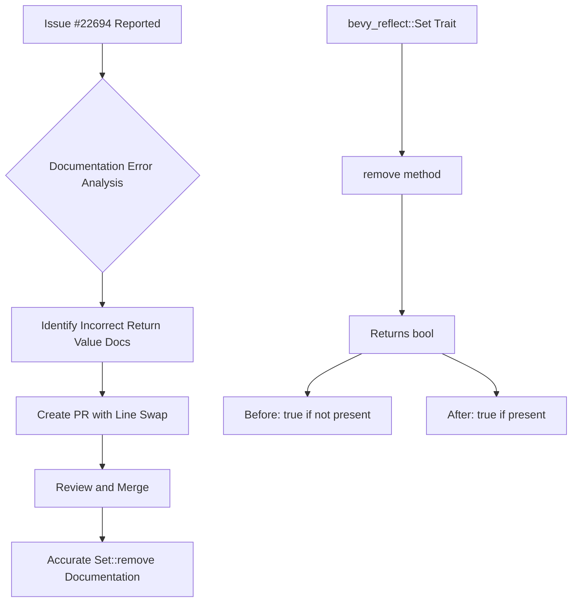

+++
title = "#22696 Fix documentation for `bevy_reflect::Set::remove`"
date = "2026-01-25T00:00:00"
draft = false
template = "pull_request_page.html"
in_search_index = true

[taxonomies]
list_display = ["show"]

[extra]
current_language = "en"
available_languages = {"en" = { name = "English", url = "/pull_request/bevy/2026-01/pr-22696-en-20260125" }, "zh-cn" = { name = "中文", url = "/pull_request/bevy/2026-01/pr-22696-zh-cn-20260125" }}
labels = ["C-Docs", "D-Trivial", "A-Reflection"]
+++

# Title
Fix documentation for `bevy_reflect::Set::remove`

## Basic Information
- **Title**: Fix documentation for `bevy_reflect::Set::remove`
- **PR Link**: https://github.com/bevyengine/bevy/pull/22696
- **Author**: AoGao-Kedoka
- **Status**: MERGED
- **Labels**: C-Docs, D-Trivial, S-Ready-For-Final-Review, A-Reflection
- **Created**: 2026-01-25T12:11:20Z
- **Merged**: 2026-01-25T19:49:10Z
- **Merged By**: mockersf

## Description Translation
The PR description is already in English, so it is included exactly as-is:

# Objective

fix https://github.com/bevyengine/bevy/issues/22694

## Solution
update the documentation
`true` if the set have this value,  `false` if not

## The Story of This Pull Request

This PR addresses a straightforward but important documentation issue in the Bevy game engine's reflection system. The problem was discovered in issue #22694, which reported that the documentation for the `Set::remove` method in the `bevy_reflect` crate was incorrect. Specifically, the return value documentation was reversed.

The `Set` trait in Bevy's reflection system provides a dynamic way to work with sets of values that can be reflected. This is part of Bevy's broader reflection infrastructure, which allows for runtime inspection and manipulation of types and data structures. The `remove` method is a core operation that removes a value from a set and returns a boolean indicating whether the value was present.

The documentation error was simple but potentially misleading. Before the fix, the documentation stated that the method would return `true` if the set did *not* have the value, and `false` if it did. This contradicted both common convention and the actual implementation. In standard Rust collections and most other programming languages, methods like `remove` typically return `true` when the element was present and successfully removed, and `false` when the element was not found. This consistency helps developers reason about code behavior across different parts of the codebase.

The fix involved swapping two lines of documentation. The change was minimal but important for maintaining accurate API documentation. Accurate documentation is crucial in a large codebase like Bevy, where developers rely on documentation to understand how to use APIs correctly without needing to inspect the source code.

From an engineering perspective, this PR demonstrates the importance of clear and correct documentation, especially for public APIs. Even small documentation errors can lead to confusion and bugs when developers misinterpret the expected behavior of a method. The fix ensures that developers reading the documentation will have the correct understanding of what the return value means, which aligns with both the implementation and established conventions in Rust and other languages.

The PR was labeled as trivial (D-Trivial) and focused on documentation (C-Docs), which accurately reflects its scope. It was quickly reviewed and merged, showing how the Bevy community efficiently handles small but important corrections to maintain code quality.

## Visual Representation



## Key Files Changed

### `crates/bevy_reflect/src/set.rs` (+2/-2)

This file contains the `Set` trait definition in Bevy's reflection system. The only change was to the documentation comments for the `remove` method.

**Before:**
```rust
/// Removes a value from the set.
///
/// If the set did not have this value present, `true` is returned.
/// If the set did have this value present, `false` is returned.
fn remove(&mut self, value: &dyn PartialReflect) -> bool;
```

**After:**
```rust
/// Removes a value from the set.
///
/// If the set did have this value present, `true` is returned.
/// If the set did not have this value present, `false` is returned.
fn remove(&mut self, value: &dyn PartialReflect) -> bool;
```

The change corrects the documentation to match the expected behavior: returning `true` when the value was present and removed, and `false` when it was not present. This aligns with common patterns in Rust's standard library (like `HashSet::remove`) and avoids confusion for developers.

## Full Code Diff
```
diff --git a/crates/bevy_reflect/src/set.rs b/crates/bevy_reflect/src/set.rs
index 8d1fc851dbd86..815ae920a1826 100644
--- a/crates/bevy_reflect/src/set.rs
+++ b/crates/bevy_reflect/src/set.rs
@@ -93,8 +93,8 @@ pub trait Set: PartialReflect {
 
     /// Removes a value from the set.
     ///
-    /// If the set did not have this value present, `true` is returned.
-    /// If the set did have this value present, `false` is returned.
+    /// If the set did have this value present, `true` is returned.
+    /// If the set did not have this value present, `false` is returned.
     fn remove(&mut self, value: &dyn PartialReflect) -> bool;
 
     /// Checks if the given value is contained in the set
```

## Further Reading

1. **Rust API Guidelines - Documentation**: The Rust API guidelines emphasize the importance of clear and correct documentation. [Rust API Guidelines](https://rust-lang.github.io/api-guidelines/documentation.html)
2. **Bevy Reflection System**: Learn more about Bevy's reflection system in the official Bevy documentation. [Bevy Reflection](https://bevyengine.org/learn/book/reflection/)
3. **Standard Library Conventions**: Understanding common patterns in Rust's standard library helps maintain consistency. [std::collections::HashSet::remove](https://doc.rust-lang.org/std/collections/struct.HashSet.html#method.remove)
4. **Writing Good Documentation**: A guide to writing effective documentation for Rust projects. [The Rust Documentation Book](https://doc.rust-lang.org/rustdoc/)