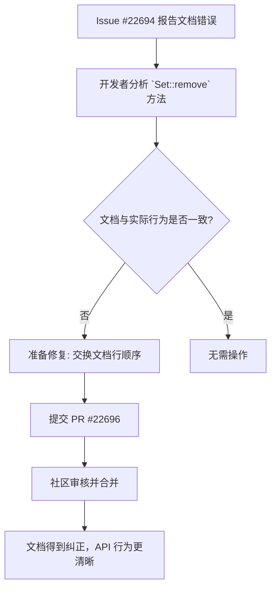

+++
title = "#22696 Fix documentation for `bevy_reflect::Set::remove"
date = "2026-01-25T00:00:00"
draft = false
template = "pull_request_page.html"
in_search_index = false

[extra]
current_language = "zh-cn"
available_languages = {"en" = { name = "English", url = "/pull_request/bevy/2026-01/pr-22696-en-20260125" }, "zh-cn" = { name = "中文", url = "/pull_request/bevy/2026-01/pr-22696-zh-cn-20260125" }}
+++

# 标题

## 基本信息
- **标题**: Fix documentation for `bevy_reflect::Set::remove`
- **PR 链接**: https://github.com/bevyengine/bevy/pull/22696
- **作者**: AoGao-Kedoka
- **状态**: 已合并
- **标签**: C-Docs, D-Trivial, S-Ready-For-Final-Review, A-Reflection
- **创建时间**: 2026-01-25T12:11:20Z
- **合并时间**: 2026-01-25T19:49:10Z
- **合并者**: mockersf

## 描述翻译
### Objective（目标）
修复 https://github.com/bevyengine/bevy/issues/22694

### Solution（解决方案）
更新文档。
`true` 表示集合原本包含这个值，`false` 表示不包含。

## 本 Pull Request 的故事

在软件开发中，文档是代码契约的重要组成部分。一个错误的注释可能比没有注释更具误导性，因为它会引导开发者走向错误的方向。这次提交的 Pull Request #22696 就修复了这样一个看似微小但至关重要的文档错误。

问题始于 GitHub Issue #22694，该问题报告了 `bevy_reflect::Set::remove` 方法的文档描述与方法的实际行为不符。具体来说，文档错误地描述了返回值 `true` 和 `false` 所代表的含义。

`bevy_reflect` 是 Bevy 游戏引擎的反射系统，它允许在运行时检查和操作类型。`Set` trait 定义了一个类似于标准库 `HashSet` 的集合接口，但其元素是实现了 `PartialReflect` 的动态类型对象。`remove` 方法是这个接口中的一个关键操作，用于从集合中移除一个元素。其返回值是一个布尔值，用于指示操作结果。

在修复前的文档中，返回值被描述为：
> If the set did not have this value present, `true` is returned.
> If the set did have this value present, `false` is returned.

按照这个描述，如果元素**不存在**于集合中，方法返回 `true`；如果元素**存在**，则返回 `false`。这与大多数集合类库的约定（包括 Rust 标准库的 `HashSet::remove`）是相反的。通常，`remove` 方法在成功移除元素（即元素原本存在）时返回 `true`，在元素不存在时返回 `false`。这种约定使得返回值可以直接用于条件判断，例如 `if set.remove(item) { ... }` 可以表示“如果成功移除了一个项，则执行某些操作”。

开发者 AoGao-Kedoka 识别到了这个不一致性，并提交了修复。解决方案直接而有效：交换文档中两句话的顺序，使描述与实际行为（以及通用的编程约定）保持一致。

从技术角度来看，这个修复虽然只涉及两行注释，但它对于维护 API 的一致性、避免开发者误解以及潜在的 bug 至关重要。反射系统（reflection system）本身是一个复杂的基础设施，被用于实现引擎的序列化、编辑器集成和动态系统等高级功能。一个错误的核心 API 文档可能会在多个使用场景中传播混淆，影响依赖这些 API 的上层代码的正确性。

这个 PR 的代码修改非常简洁，仅更改了 `crates/bevy_reflect/src/set.rs` 文件中的注释。它迅速通过了审查并被合并，这体现了 Bevy 社区对文档准确性的重视以及处理简单但重要问题的效率。

作为软件工程师，我们可以从这个 PR 中学到的是：永远不要低估文档的价值。即使是微小的文档错误，也可能破坏开发者对 API 的心智模型（mental model），导致错误的代码逻辑。定期审查和更新文档，尤其是核心库的文档，应该成为开发流程中不可或缺的一部分。

## 视觉表示



## 关键文件变更

**修改的唯一文件：`crates/bevy_reflect/src/set.rs`**

1.  **变更描述与原因**：
    - 该文件包含了 `bevy_reflect::Set` trait 的定义。`remove` 方法的文档字符串（doc-comment）中，关于返回值含义的两行描述被错误地颠倒了。本次 PR 交换了这两行的顺序，使其正确反映方法的实际行为（移除成功返回 `true`，元素不存在返回 `false`）。

2.  **代码片段**：
    ```rust
    // 文件: crates/bevy_reflect/src/set.rs
    // 修复前 (第93-94行):
    /// Removes a value from the set.
    ///
    /// If the set did not have this value present, `true` is returned.
    /// If the set did have this value present, `false` is returned.
    fn remove(&mut self, value: &dyn PartialReflect) -> bool;

    // 修复后:
    /// Removes a value from the set.
    ///
    /// If the set did have this value present, `true` is returned.
    /// If the set did not have this value present, `false` is returned.
    fn remove(&mut self, value: &dyn PartialReflect) -> bool;
    ```

3.  **与 PR 目标的关联**：
    - 此变更直接实现了 PR 的目标：修复 `bevy_reflect::Set::remove` 的文档，使其准确描述返回值条件。

## 进一步阅读

对于希望深入了解本 PR 所涉及概念的读者，可以参考以下资源：

1.  **Rust 官方文档指南**：了解如何编写清晰、准确的 Rust 文档注释（包括 `///` 的使用和约定）。
2.  **Bevy 反射系统文档**：研究 `bevy_reflect` crate 的设计和目标，理解动态类型（dynamic typing）在静态类型（statically-typed）游戏引擎中的作用。
3.  **Rust 标准库 `std::collections::HashSet`**：查看标准库中 `HashSet::remove` 方法的签名和文档，这是本 PR 所遵循的通用约定来源。
4.  **语义版本控制（Semantic Versioning）与文档**：理解文档更正如何影响公共 API 的维护和版本管理。

# 完整代码差异
```
diff --git a/crates/bevy_reflect/src/set.rs b/crates/bevy_reflect/src/set.rs
index 8d1fc851dbd86..815ae920a1826 100644
--- a/crates/bevy_reflect/src/set.rs
+++ b/crates/bevy_reflect/src/set.rs
@@ -93,8 +93,8 @@ pub trait Set: PartialReflect {
 
     /// Removes a value from the set.
     ///
-    /// If the set did not have this value present, `true` is returned.
-    /// If the set did have this value present, `false` is returned.
+    /// If the set did have this value present, `true` is returned.
+    /// If the set did not have this value present, `false` is returned.
     fn remove(&mut self, value: &dyn PartialReflect) -> bool;
 
     /// Checks if the given value is contained in the set
```