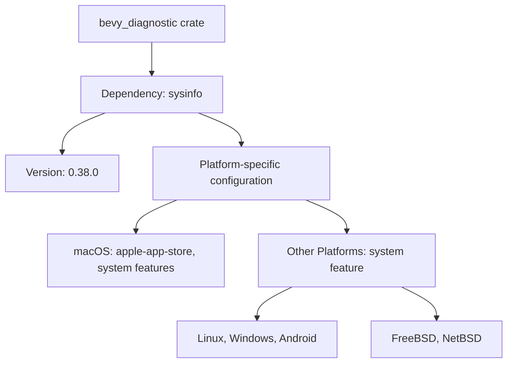

+++
title = "#22697 Update `sysinfo` version to `0.38.0`"
date = "2026-01-25T00:00:00"
draft = false
template = "pull_request_page.html"
in_search_index = true

[taxonomies]
list_display = ["show"]

[extra]
current_language = "en"
available_languages = {"en" = { name = "English", url = "/pull_request/bevy/2026-01/pr-22697-en-20260125" }, "zh-cn" = { name = "中文", url = "/pull_request/bevy/2026-01/pr-22697-zh-cn-20260125" }}
labels = ["C-Dependencies"]
+++

# Title

## Basic Information
- **Title**: Update `sysinfo` version to `0.38.0`
- **PR Link**: https://github.com/bevyengine/bevy/pull/22697
- **Author**: GuillaumeGomez
- **Status**: MERGED
- **Labels**: C-Dependencies, S-Ready-For-Final-Review
- **Created**: 2026-01-25T15:07:32Z
- **Merged**: 2026-01-25T22:00:09Z
- **Merged By**: alice-i-cecile

## Description Translation
This new version fixes some bugs and adds support for `NetBSD`.

## The Story of This Pull Request

This pull request addresses a routine but important maintenance task: updating a system information dependency to gain bug fixes and expanded platform support. The Bevy engine uses the `sysinfo` crate to collect system diagnostics and hardware information, which powers features like system resource monitoring and platform-specific optimizations.

The problem was straightforward - the Bevy diagnostic module was locked to an older version of `sysinfo` (0.37.0), which lacked support for NetBSD and contained known bugs that had been addressed in subsequent releases. For a game engine targeting multiple platforms, maintaining current dependencies is crucial for ensuring compatibility, security, and access to the latest features across all supported operating systems.

The solution approach was minimal and targeted: update the version constraint in the Cargo.toml file from 0.37.0 to 0.38.0. This required updating the version in two separate dependency declarations because Bevy's diagnostic module configures `sysinfo` differently based on the target operating system. The macOS configuration is separate due to Apple's platform restrictions, while other platforms share a common feature set.

The implementation reveals an important pattern in Rust dependency management for cross-platform crates. Bevy uses conditional compilation via `cfg` attributes to include platform-specific dependencies with appropriate feature flags. The update needed to be applied consistently across both conditional dependency blocks:

1. For macOS targets, the version was updated while preserving the "apple-app-store" and "system" features
2. For other platforms (Linux, Windows, Android, FreeBSD), the version was updated and NetBSD was added to the target condition list

The technical insight here is in understanding how Rust's Cargo handles conditional dependencies. By specifying `target.'cfg(...)'.dependencies`, the build system only includes these dependencies when building for the specified target configurations. This minimizes the dependency graph for platforms that don't need `sysinfo` and avoids pulling in unnecessary code.

The impact of this change is threefold:
1. NetBSD users can now use Bevy's diagnostic features
2. Bug fixes from `sysinfo` 0.38.0 are now available across all supported platforms
3. The dependency remains current, reducing technical debt and ensuring compatibility with the broader Rust ecosystem

From an engineering perspective, this PR demonstrates proper dependency maintenance practices. Regular updates to minor versions of well-maintained dependencies typically bring bug fixes and performance improvements with minimal risk of breaking changes. The fact that only version numbers and a platform condition needed updating suggests good API stability in the `sysinfo` crate between these releases.

The change also highlights the importance of comprehensive platform targeting in game engines. By explicitly adding NetBSD to the condition, the maintainers ensure that the dependency is correctly included for this platform without affecting others. This careful platform targeting prevents build errors and ensures consistent functionality across the engine's supported operating systems.

## Visual Representation



## Key Files Changed

### `crates/bevy_diagnostic/Cargo.toml` (+4/-4)

This file contains the dependency configuration for Bevy's diagnostic subsystem. The changes update the `sysinfo` crate version and extend platform support.

**Before:**
```toml
# macOS
[target.'cfg(all(target_os="macos"))'.dependencies]
# Some features of sysinfo are not supported by apple. This will disable those features on apple devices
sysinfo = { version = "0.37.0", optional = true, default-features = false, features = [
  "apple-app-store",
  "system",
] }

# Only include when on linux/windows/android/freebsd
[target.'cfg(any(target_os = "linux", target_os = "windows", target_os = "android", target_os = "freebsd"))'.dependencies]
sysinfo = { version = "0.37.0", optional = true, default-features = false, features = [
  "system",
] }
```

**After:**
```toml
# macOS
[target.'cfg(all(target_os="macos"))'.dependencies]
# Some features of sysinfo are not supported by apple. This will disable those features on apple devices
sysinfo = { version = "0.38.0", optional = true, default-features = false, features = [
  "apple-app-store",
  "system",
] }

# Only include when on linux/windows/android/freebsd/netbsd
[target.'cfg(any(target_os = "linux", target_os = "windows", target_os = "android", target_os = "freebsd", target_os = "netbsd"))'.dependencies]
sysinfo = { version = "0.38.0", optional = true, default-features = false, features = [
  "system",
] }
```

**Changes:**
1. Updated `sysinfo` version from `0.37.0` to `0.38.0` in both dependency declarations
2. Added `target_os = "netbsd"` to the second dependency's condition list
3. Updated the comment to reflect the new platform inclusion

These changes ensure that:
- The diagnostic system uses the latest `sysinfo` version with bug fixes
- NetBSD is properly supported as a target platform
- Platform-specific feature configurations remain intact

## Further Reading

1. [sysinfo crate documentation](https://docs.rs/sysinfo/latest/sysinfo/) - Official documentation for the system information library
2. [Cargo conditional dependencies](https://doc.rust-lang.org/cargo/reference/specifying-dependencies.html#platform-specific-dependencies) - How to specify platform-specific dependencies in Rust
3. [NetBSD operating system](https://www.netbsd.org/) - Official NetBSD website for understanding this target platform
4. [Semantic Versioning in Rust](https://doc.rust-lang.org/cargo/reference/semver.html) - How versioning works in the Rust ecosystem