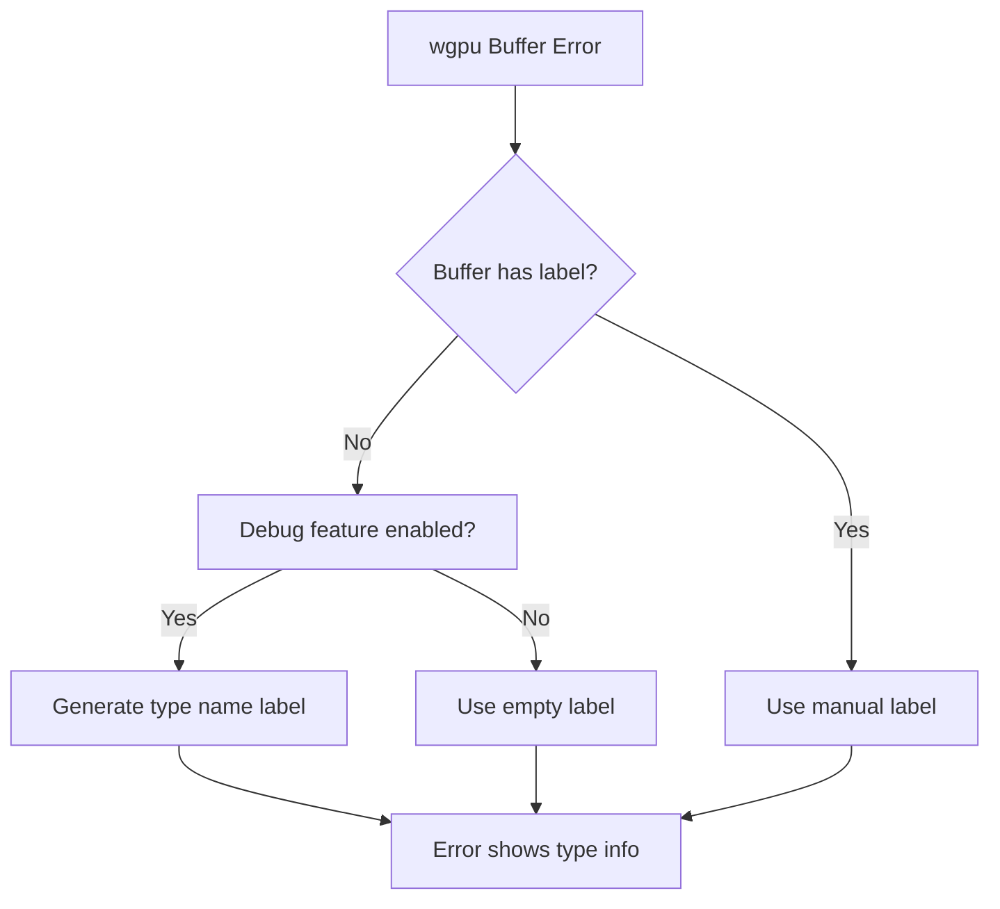

+++
title = "#22698"
date = "2026-01-26T00:00:00"
draft = false
template = "pull_request_page.html"
in_search_index = false

[extra]
current_language = "zh-cn"
available_languages = {"en" = { name = "English", url = "/pull_request/bevy/2026-01/pr-22698-en-20260126" }, "zh-cn" = { name = "中文", url = "/pull_request/bevy/2026-01/pr-22698-zh-cn-20260126" }}
+++

# Title
render buffer debug label type prepopulation

## 基本資訊
- **標題**: render buffer debug label type prepopulation
- **PR連結**: https://github.com/bevyengine/bevy/pull/22698
- **作者**: atlv24
- **狀態**: 已合併
- **標籤**: A-Rendering, S-Ready-For-Final-Review, A-Dev-Tools, X-Uncontroversial, C-Refinement
- **建立時間**: 2026-01-25T16:05:10Z
- **合併時間**: 2026-01-26T00:35:30Z
- **合併者**: alice-i-cecile

## 描述翻譯
### Objective（目標）
- 我們絕大多數的緩衝區（buffers）都沒有標籤（unlabelled）。這讓除錯 wgpu 錯誤變得很麻煩，因為它們缺乏上下文資訊。

### Solution（解決方案）
- 我們有型別資訊，而且緩衝區大多是自訂結構型別，少數不是的情況似乎也都手動命名了。我們可以利用型別資訊，在除錯模式下預先填入緩衝區名稱。

### Testing（測試）
- 在啟用和未啟用除錯功能的情況下執行 occlusion_culling 範例，目前由於 wgpu 28 的變更而崩潰。

### Showcase（展示）
**Before（之前）**:
```
Caused by:
  In a CommandEncoder
    In a dispatch command, indirect:true
      Attempted to use Buffer with '' label with conflicting usages. Current usage BufferUses(STORAGE_READ_WRITE) and new usage BufferUses(INDIRECT). BufferUses(STORAGE_READ_WRITE) is an exclusive usage and cannot be used with any other usages within the usage scope (renderpass or compute dispatch).
```

**After（之後）**:
```
Caused by:
  In a CommandEncoder
    In a dispatch command, indirect:true
      Attempted to use Buffer with 'bevy_render::render_resource::buffer_vec::RawBufferVec<bevy_render::batching::gpu_preprocessing::LatePreprocessWorkItemIndirectParameters>' label with conflicting usages. Current usage BufferUses(STORAGE_READ_WRITE) and new usage BufferUses(INDIRECT). BufferUses(STORAGE_READ_WRITE) is an exclusive usage and cannot be used with any other usages within the usage scope (renderpass or compute dispatch).
```

現在我們知道：1. 它是 `RawBufferVec`；2. 它儲存的是 `LatePreprocessWorkItemIndirectParameters`。這讓我們可以大大縮小尋找問題根源的範圍。

**注意**：這是多次嘗試改進除錯資訊的演進結果。第一次嘗試使用 `#[track_caller]`，但這在 const 上下文中無效，因為 Location 不允許在那裡使用。第二次嘗試是在建構子中預先填入型別名稱資訊，但 `std::any::type_name()` 返回 `&'static str`，而標籤是 `Option<String>`，而且 `.into()` 和 `.to_string()` 都不是 const，因為 `String` 是堆積分配的。最後，我將其移到緩衝區建立的地方，然後提取成一個泛型函數以消除重複。

## 這個 Pull Request 的故事

### 問題與背景
在 Bevy 渲染系統中，wgpu 緩衝區（buffers）在建立時通常沒有設定標籤（label）。當發生緩衝區使用衝突（buffer usage conflict）或其他 wgpu 錯誤時，錯誤訊息只會顯示一個空字串作為標籤，這對於除錯來說幾乎沒有幫助。開發者需要花費大量時間追蹤哪個緩衝區出了問題，特別是當應用程式中有數十或數百個緩衝區時。

### 解決方案演進
這個問題的解決方案經歷了幾次迭代。最初嘗試使用 `#[track_caller]` 來自動捕捉呼叫位置，但這個方法在 const 上下文中不可行。接著嘗試在建構子中預先填入型別名稱，但遇到了型別轉換問題：`std::any::type_name()` 返回 `&'static str`，而緩衝區標籤需要 `Option<String>`，且轉換操作無法在 const 環境中進行。

最終的解決方案是將標籤生成邏輯推遲到實際建立緩衝區的時刻。這個方法利用了 Rust 的泛型系統和條件編譯（conditional compilation），只在啟用除錯功能時自動填入型別資訊。

### 技術實作細節
核心實作是一個名為 `make_buffer_label` 的泛型函數，它接受當前緩衝區的標籤（`Option<String>`）並返回最終使用的標籤（`Option<&str>`）。這個函數的關鍵特性是：

1. **條件編譯**：使用 `#[cfg(feature = "type_label_buffers")]` 來控制功能啟用
2. **型別資訊擷取**：使用 `core::any::type_name::<T>()` 取得緩衝區的完整型別名稱
3. **優先級處理**：如果手動設定了標籤，就使用手動標籤；否則在除錯模式下使用型別名稱

```rust
#[inline]
pub(crate) fn make_buffer_label<'a, T>(label: &'a Option<String>) -> Option<&'a str> {
    #[cfg(feature = "type_label_buffers")]
    if label.is_none() {
        return Some(core::any::type_name::<T>());
    }
    label.as_deref()
}
```

這個函數被整合到三種主要的緩衝區類型中：`RawBufferVec`、`StorageBuffer`/`DynamicStorageBuffer`，以及 `UniformBuffer`/`DynamicUniformBuffer`。每個緩衝區建立點都從原本直接使用 `self.label.as_deref()` 改為呼叫 `make_buffer_label::<Self>(&self.label)`。

### 工程決策考量
1. **零成本抽象**：在未啟用 `type_label_buffers` 功能時，生成的程式碼與原本相同，沒有額外開銷
2. **向後相容性**：手動設定的標籤永遠優先於自動生成的標籤，確保現有程式碼不受影響
3. **功能隔離**：將此功能放在獨立的 Cargo feature 中，讓開發者可以選擇性啟用
4. **維護性**：將邏輯提取到共用函數中，避免了程式碼重複

### 實際影響
這個改動顯著改善了除錯體驗。以前，當發生緩衝區使用衝突時，錯誤訊息只會顯示空的標籤。現在，錯誤訊息會顯示完整的型別路徑，例如 `bevy_render::render_resource::buffer_vec::RawBufferVec<bevy_render::batching::gpu_preprocessing::LatePreprocessWorkItemIndirectParameters>`。這樣的資訊讓開發者能夠：

1. 立即知道是哪種類型的緩衝區出問題
2. 了解緩衝區儲存的資料型別
3. 快速定位到相關的原始碼位置

### 架構整合
這個改動保持了 Bevy 渲染系統的架構一致性。緩衝區標籤原本就是可選的，這個 PR 只是在未提供標籤時提供了一個有意義的預設值。功能通過 Cargo features 進行控制，與 Bevy 的模組化設計哲學一致。

## 視覺化表示



## 主要檔案變更

### 1. `crates/bevy_render/src/render_resource/buffer_vec.rs` (+12/-3)
**變更原因**：將標籤生成邏輯提取到共用函數，並在 `RawBufferVec` 的三個緩衝區建立點使用新函數。

**關鍵修改**：
```rust
// Before:
label: self.label.as_deref(),

// After:
label: make_buffer_label::<Self>(&self.label),
```

**新增函數**：
```rust
#[inline]
pub(crate) fn make_buffer_label<'a, T>(label: &'a Option<String>) -> Option<&'a str> {
    #[cfg(feature = "type_label_buffers")]
    if label.is_none() {
        return Some(core::any::type_name::<T>());
    }
    label.as_deref()
}
```

### 2. `crates/bevy_render/src/render_resource/storage_buffer.rs` (+6/-3)
**變更原因**：在 `StorageBuffer` 和 `DynamicStorageBuffer` 中整合自動標籤生成。

**關鍵修改**：
```rust
// 新增導入
use crate::{
    render_resource::make_buffer_label,
    renderer::{RenderDevice, RenderQueue},
};

// 在緩衝區建立點
label: make_buffer_label::<Self>(&self.label),
```

### 3. `crates/bevy_render/src/render_resource/uniform_buffer.rs` (+3/-3)
**變更原因**：在 `UniformBuffer` 和 `DynamicUniformBuffer` 中整合自動標籤生成。

**關鍵修改**：
```rust
// 新增導入
use crate::render_resource::{make_buffer_label, Buffer};

// 在緩衝區建立點
label: make_buffer_label::<Self>(&self.label),
```

### 4. Cargo.toml 檔案變更
- **根目錄 Cargo.toml**：新增 `type_label_buffers` feature
- **crates/bevy_internal/Cargo.toml**：將 `debug` feature 擴展到包含 `bevy_render/debug`
- **crates/bevy_render/Cargo.toml**：新增 `type_label_buffers` 和 `debug` features

**功能依賴關係**：
```
debug → bevy_render/debug → type_label_buffers
```

### 5. `docs/cargo_features.md` (+1/-0)
**變更原因**：文件化新的 `type_label_buffers` feature。

**新增內容**：
```
|type_label_buffers|Pre-populate buffer labels with buffer types for debugging.|
```

## 延伸閱讀

1. **Rust 型別名稱**：`std::any::type_name` 函數的官方文件，了解如何取得型別的靜態字串表示
2. **wgpu 緩衝區標籤**：wgpu 文件中關於緩衝區標籤和除錯的章節
3. **Cargo features**：Rust Cargo 的功能系統，了解如何條件編譯程式碼
4. **Bevy 渲染系統架構**：Bevy 官方文件中有關渲染資源管理的章節
5. **GPU 除錯技術**：現代圖形 API 中的除錯工具和技術概覽

## 完整程式碼差異
（已在上述各節中涵蓋主要變更，此處不再重複）