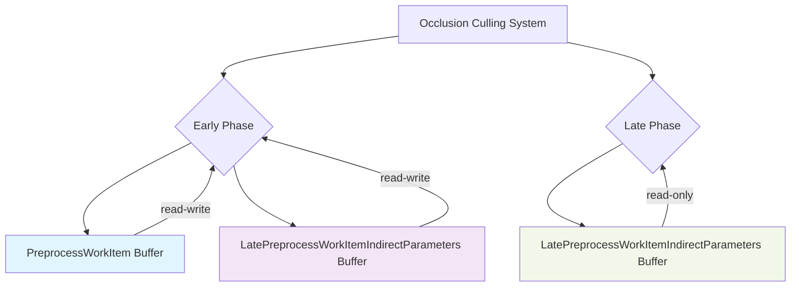

+++
title = "#22699 Fix occlusion culling"
date = "2026-01-25T00:00:00"
draft = false
template = "pull_request_page.html"
in_search_index = true

[taxonomies]
list_display = ["show"]

[extra]
current_language = "en"
available_languages = {"en" = { name = "English", url = "/pull_request/bevy/2026-01/pr-22699-en-20260125" }, "zh-cn" = { name = "中文", url = "/pull_request/bevy/2026-01/pr-22699-zh-cn-20260125" }}
labels = ["C-Bug", "A-Rendering", "P-Crash", "P-Regression"]
+++

# Title
Fix occlusion culling

## Basic Information
- **Title**: Fix occlusion culling
- **PR Link**: https://github.com/bevyengine/bevy/pull/22699
- **Author**: atlv24
- **Status**: MERGED
- **Labels**: C-Bug, A-Rendering, P-Crash, S-Ready-For-Final-Review, P-Regression
- **Created**: 2026-01-25T19:53:20Z
- **Merged**: 2026-01-25T20:44:04Z
- **Merged By**: alice-i-cecile

## Description Translation

# Objective

- fix #22655

## Solution

- separate readonly storage binding for late phase to make wgpu happy

## Testing

- occlusion_culling example no longer crashes

finding this was very difficult lol

## The Story of This Pull Request

This PR fixes a crash in the occlusion_culling example that was caused by an incorrect WebGPU buffer binding configuration. The issue was a regression introduced in the GPU-driven occlusion culling system, where a buffer that should have been read-only in the late phase of occlusion culling was incorrectly configured as read-write.

The problem manifested as a WebGPU validation error because the same buffer resource was being bound with different usage flags (read-write vs read-only) across different pipeline stages. WebGPU's strict validation requires consistent buffer usage declarations, and when the late phase shader only needed read access but the binding was declared as read-write, it caused a validation failure that resulted in a crash.

The developer traced this to a mismatch between the Rust-side bind group layout definitions and the WGSL shader bindings. In the `gpu_preprocess.rs` file, both early and late phase occlusion culling used the same bind group layout entries, including a read-write storage buffer for `LatePreprocessWorkItemIndirectParameters`. However, in the WGSL shader (`mesh_preprocess.wgsl`), the late phase only needed read access to this buffer.

The solution involved creating two separate bind group layouts:
1. For the early phase: Includes read-write storage buffers for both `PreprocessWorkItem` (binding 11) and `LatePreprocessWorkItemIndirectParameters` (binding 12)
2. For the late phase: Uses a read-only storage buffer for `LatePreprocessWorkItemIndirectParameters` (binding 12)

This required modifying the bind group layout creation in Rust to differentiate between the two phases and updating the WGSL shader to conditionally bind the buffer with the appropriate access mode based on the compilation phase.

The fix is minimal and surgical - it only changes the binding declarations without altering any actual rendering logic. The `LatePreprocessWorkItemIndirectParameters` buffer contains indirect draw parameters that the late phase reads to determine what to render, but doesn't need to modify. By declaring it as read-only in the late phase, we comply with WebGPU's safety guarantees while maintaining the necessary functionality.

This type of issue is particularly challenging to debug because WebGPU validation errors often provide limited context about the exact mismatch. The developer's note "finding this was very difficult lol" reflects the difficulty of tracing GPU validation errors back to specific binding declarations in a complex rendering pipeline.

## Visual Representation



## Key Files Changed

### `crates/bevy_pbr/src/render/gpu_preprocess.rs` (+17/-10)

This file contains the Rust-side bind group layout definitions for the GPU preprocess pipelines. The key change was separating the bind group layouts for early and late phase occlusion culling to use different buffer access modes.

**Before:**
```rust
let gpu_early_occlusion_culling_bind_group_layout_entries =
    gpu_occlusion_culling_bind_group_layout_entries().extend_with_indices(((
        11,
        storage_buffer::<PreprocessWorkItem>(/*has_dynamic_offset=*/ false),
    ),));
let gpu_late_occlusion_culling_bind_group_layout_entries =
    gpu_occlusion_culling_bind_group_layout_entries();
```

**After:**
```rust
let gpu_early_occlusion_culling_bind_group_layout_entries =
    gpu_occlusion_culling_bind_group_layout_entries().extend_with_indices((
        (
            11,
            storage_buffer::<PreprocessWorkItem>(/*has_dynamic_offset=*/ false),
        ),
        (
            12,
            storage_buffer::<LatePreprocessWorkItemIndirectParameters>(
                /*has_dynamic_offset=*/ false,
            ),
        ),
    ));
let gpu_late_occlusion_culling_bind_group_layout_entries =
    gpu_occlusion_culling_bind_group_layout_entries().extend_with_indices(((
        12,
        storage_buffer_read_only::<LatePreprocessWorkItemIndirectParameters>(
            /*has_dynamic_offset=*/ false,
        ),
    ),));
```

The `gpu_occlusion_culling_bind_group_layout_entries()` function was also modified to remove the binding for `LatePreprocessWorkItemIndirectParameters` at index 12, since it's now added separately for each phase.

### `crates/bevy_pbr/src/render/mesh_preprocess.wgsl` (+6/-1)

This WGSL shader file needed corresponding updates to match the Rust-side binding changes. The buffer binding declarations were split between early and late phases with different access modes.

**Before:**
```wgsl
#ifdef EARLY_PHASE
@group(0) @binding(11) var<storage, read_write> late_preprocess_work_items:
    array<PreprocessWorkItem>;
#endif  // EARLY_PHASE

@group(0) @binding(12) var<storage, read_write> late_preprocess_work_item_indirect_parameters:
    array<LatePreprocessWorkItemIndirectParameters>;
```

**After:**
```wgsl
#ifdef EARLY_PHASE
@group(0) @binding(11) var<storage, read_write> late_preprocess_work_items:
    array<PreprocessWorkItem>;

@group(0) @binding(12) var<storage, read_write> late_preprocess_work_item_indirect_parameters:
    array<LatePreprocessWorkItemIndirectParameters>;
#endif  // EARLY_PHASE

#ifdef LATE_PHASE
@group(0) @binding(12) var<storage, read> late_preprocess_work_item_indirect_parameters:
    array<LatePreprocessWorkItemIndirectParameters>;
#endif  // LATE_PHASE
```

The key change here is that in the late phase, the indirect parameters buffer is now declared as `read` instead of `read_write`, matching the Rust-side binding declaration.

## Further Reading

1. [WebGPU Buffer Usage Validation](https://www.w3.org/TR/webgpu/#buffer-usage) - Official WebGPU specification on buffer usage constraints
2. [wgpu Buffer Binding Types](https://docs.rs/wgpu/latest/wgpu/struct.BufferBindingType.html) - Documentation on different buffer binding types in wgpu
3. [Bevy Rendering Pipeline](https://bevyengine.org/learn/quick-start/getting-started/systems/) - Overview of Bevy's ECS and rendering architecture
4. [GPU-Driven Rendering Techniques](https://interplayoflight.wordpress.com/2023/05/29/a-history-of-gpu-driven-rendering/) - Background on GPU-driven rendering approaches including occlusion culling
5. [WGSL Storage Buffer Access Modes](https://www.w3.org/TR/WGSL/#storage-buffer) - WGSL specification for storage buffer access modes