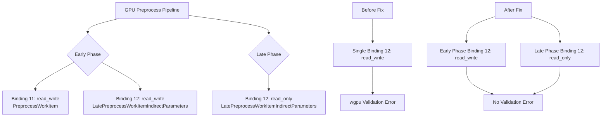

+++
title = "#22699 修复遮挡剔除"
date = "2026-01-25T00:00:00"
draft = false
template = "pull_request_page.html"
in_search_index = false

[extra]
current_language = "zh-cn"
available_languages = {"en" = { name = "English", url = "/pull_request/bevy/2026-01/pr-22699-en-20260125" }, "zh-cn" = { name = "中文", url = "/pull_request/bevy/2026-01/pr-22699-zh-cn-20260125" }}
+++

# Title
Fix occlusion culling

## Basic Information
- **标题**: 修复遮挡剔除
- **PR链接**: https://github.com/bevyengine/bevy/pull/22699
- **作者**: atlv24
- **状态**: 已合并
- **标签**: C-Bug (错误), A-Rendering (渲染), P-Crash (崩溃), S-Ready-For-Final-Review (准备最终审核), P-Regression (回归问题)
- **创建时间**: 2026-01-25T19:53:20Z
- **合并时间**: 2026-01-25T20:44:04Z
- **合并者**: alice-i-cecile

## Description Translation
**目标**
- 修复 issue #22655

**解决方案**
- 为后期阶段分离只读存储绑定以适配 wgpu

**测试**
- occlusion_culling 示例不再崩溃

找到这个问题的根源非常困难

## The Story of This Pull Request

这是一个关于修复渲染管线中遮挡剔除功能崩溃问题的PR。问题出现在Bevy引擎的`occlusion_culling`示例中，该示例在执行时会触发崩溃。根据标签可以看出，这是一个回归问题（P-Regression），意味着之前的功能正常，但在某个后续改动中出现了问题。

### 问题根源：WGSL绑定冲突
问题的核心在于GPU预处理管线中绑定组的配置。在WGSL着色器中，同一个绑定点（binding point）在不同渲染阶段被重复使用，但访问模式（access mode）不兼容。具体来说，在遮挡剔除的早期阶段（EARLY_PHASE），着色器代码需要以`read_write`模式访问`late_preprocess_work_item_indirect_parameters`缓冲区。然而，在后期阶段（LATE_PHASE），同一个绑定点也需要访问相同的缓冲区，但wgpu要求如果同一绑定点在管线不同阶段使用，其访问模式必须兼容。

### 技术细节：WGSL访问模式约束
在WebGPU/WGSL规范中，存储缓冲区的访问模式有严格限制：
- `read_write`模式允许读写操作
- `read`模式只允许读取操作
- 同一绑定资源在不同着色器阶段使用时，访问模式必须一致或兼容

问题出现在`mesh_preprocess.wgsl`文件中，第112-115行在早期阶段（EARLY_PHASE）定义了`read_write`访问：
```wgsl
@group(0) @binding(12) var<storage, read_write> late_preprocess_work_item_indirect_parameters:
    array<LatePreprocessWorkItemIndirectParameters>;
```

但在后期阶段（LATE_PHASE），代码也需要访问同一个绑定点12。虽然原代码中没有显式定义后期阶段的绑定，但渲染管线配置期望这个绑定在后期阶段也可用。wgpu的验证层检测到这种不一致而引发崩溃。

### 解决方案：分离只读绑定
修复方案是在Rust代码中为早期阶段和后期阶段创建不同的绑定组布局。具体来说：

1. **早期阶段绑定组**：继续使用`storage_buffer`（默认可读写）
2. **后期阶段绑定组**：使用`storage_buffer_read_only`（只读）

这通过修改`gpu_preprocess.rs`中的绑定组布局实现：
```rust
let gpu_early_occlusion_culling_bind_group_layout_entries =
    gpu_occlusion_culling_bind_group_layout_entries().extend_with_indices((
        (
            11,
            storage_buffer::<PreprocessWorkItem>(/*has_dynamic_offset=*/ false),
        ),
        (
            12,
            storage_buffer::<LatePreprocessWorkItemIndirectParameters>(
                /*has_dynamic_offset=*/ false,
            ),
        ),
    ));
let gpu_late_occlusion_culling_bind_group_layout_entries =
    gpu_occlusion_culling_bind_group_layout_entries().extend_with_indices(((
        12,
        storage_buffer_read_only::<LatePreprocessWorkItemIndirectParameters>(
            /*has_dynamic_offset=*/ false,
        ),
    ),));
```

关键改动是从`gpu_occlusion_culling_bind_group_layout_entries()`函数中移除了绑定点12的定义，然后在两个不同的布局中分别添加：早期阶段用可读写存储缓冲区，后期阶段用只读存储缓冲区。

### WGSL着色器同步更新
相应地，WGSL着色器也需要更新以反映这种分离：
```wgsl
#ifdef EARLY_PHASE
@group(0) @binding(11) var<storage, read_write> late_preprocess_work_items:
    array<PreprocessWorkItem>;

@group(0) @binding(12) var<storage, read_write> late_preprocess_work_item_indirect_parameters:
    array<LatePreprocessWorkItemIndirectParameters>;
#endif  // EARLY_PHASE

#ifdef LATE_PHASE
@group(0) @binding(12) var<storage, read> late_preprocess_work_item_indirect_parameters:
    array<LatePreprocessWorkItemIndirectParameters>;
#endif  // LATE_PHASE
```

这样，在早期阶段使用`read_write`访问模式，在后期阶段使用`read`访问模式，避免了wgpu验证错误。

### 技术洞察：GPU驱动的遮挡剔除
这个PR涉及的遮挡剔除是Bevy中GPU驱动的剔除系统的一部分。该系统分为两个阶段：
1. **早期阶段**：执行初步的剔除计算，可能需要写入间接参数
2. **后期阶段**：使用早期阶段计算的结果执行进一步处理，只需要读取这些参数

这种设计允许GPU高效地执行复杂的场景剔除，减少CPU-GPU之间的数据传输。但是，它也需要仔细管理GPU资源的状态和访问权限。

### 影响与教训
这个修复解决了`occlusion_culling`示例的崩溃问题，恢复了遮挡剔除功能的正常工作。从工程角度看，这个PR提醒我们：

1. **WebGPU访问模式约束**：在多个渲染阶段使用同一资源时，必须确保访问模式兼容
2. **绑定组布局分离**：当不同阶段需要不同访问权限时，应该使用不同的绑定组布局
3. **调试难度**：作者提到"finding this was very difficult lol"，这反映了GPU编程调试的挑战性，尤其是涉及底层API验证错误时

## Visual Representation



## Key Files Changed

### 1. `crates/bevy_pbr/src/render/gpu_preprocess.rs` (+17/-10)
这个文件负责创建GPU预处理管线的绑定组布局。主要改动是分离了早期阶段和后期阶段的绑定组布局。

**关键改动：**
```rust
// 之前：早期和后期阶段共享同一个绑定组布局
let gpu_early_occlusion_culling_bind_group_layout_entries =
    gpu_occlusion_culling_bind_group_layout_entries().extend_with_indices(((
        11,
        storage_buffer::<PreprocessWorkItem>(/*has_dynamic_offset=*/ false),
    ),));
let gpu_late_occlusion_culling_bind_group_layout_entries =
    gpu_occlusion_culling_bind_group_layout_entries();

// 之后：早期阶段使用可读写绑定，后期阶段使用只读绑定
let gpu_early_occlusion_culling_bind_group_layout_entries =
    gpu_occlusion_culling_bind_group_layout_entries().extend_with_indices((
        (
            11,
            storage_buffer::<PreprocessWorkItem>(/*has_dynamic_offset=*/ false),
        ),
        (
            12,
            storage_buffer::<LatePreprocessWorkItemIndirectParameters>(
                /*has_dynamic_offset=*/ false,
            ),
        ),
    ));
let gpu_late_occlusion_culling_bind_group_layout_entries =
    gpu_occlusion_culling_bind_group_layout_entries().extend_with_indices(((
        12,
        storage_buffer_read_only::<LatePreprocessWorkItemIndirectParameters>(
            /*has_dynamic_offset=*/ false,
        ),
    ),));
```

同时从`gpu_occlusion_culling_bind_group_layout_entries()`函数中移除了绑定点12的定义：
```rust
// 移除这部分代码：
(
    12,
    storage_buffer::<LatePreprocessWorkItemIndirectParameters>(
        /*has_dynamic_offset=*/ false,
    ),
),
```

### 2. `crates/bevy_pbr/src/render/mesh_preprocess.wgsl` (+6/-1)
WGSL着色器文件，更新了绑定声明以匹配新的绑定组布局。

**关键改动：**
```wgsl
// 之前：只在早期阶段定义绑定
#ifdef EARLY_PHASE
@group(0) @binding(11) var<storage, read_write> late_preprocess_work_items:
    array<PreprocessWorkItem>;

@group(0) @binding(12) var<storage, read_write> late_preprocess_work_item_indirect_parameters:
    array<LatePreprocessWorkItemIndirectParameters>;
#endif  // EARLY_PHASE

// 之后：早期阶段和后期阶段分别定义绑定
#ifdef EARLY_PHASE
@group(0) @binding(11) var<storage, read_write> late_preprocess_work_items:
    array<PreprocessWorkItem>;

@group(0) @binding(12) var<storage, read_write> late_preprocess_work_item_indirect_parameters:
    array<LatePreprocessWorkItemIndirectParameters>;
#endif  // EARLY_PHASE

#ifdef LATE_PHASE
@group(0) @binding(12) var<storage, read> late_preprocess_work_item_indirect_parameters:
    array<LatePreprocessWorkItemIndirectParameters>;
#endif  // LATE_PHASE
```

## Further Reading
1. **WebGPU Specification** - 了解WGSL绑定和访问模式的官方规范
2. **Bevy Rendering Architecture** - Bevy引擎的渲染架构文档
3. **GPU-Driven Rendering Techniques** - GPU驱动渲染和剔除技术的现代方法
4. **wgpu Validation Errors** - 理解wgpu验证错误和调试方法

# Full Code Diff
```diff
diff --git a/crates/bevy_pbr/src/render/gpu_preprocess.rs b/crates/bevy_pbr/src/render/gpu_preprocess.rs
index 6260d43694faf..60a0f014f79b6 100644
--- a/crates/bevy_pbr/src/render/gpu_preprocess.rs
+++ b/crates/bevy_pbr/src/render/gpu_preprocess.rs
@@ -1302,12 +1302,25 @@ impl FromWorld for PreprocessPipelines {
         let direct_bind_group_layout_entries = preprocess_direct_bind_group_layout_entries();
         let gpu_frustum_culling_bind_group_layout_entries = gpu_culling_bind_group_layout_entries();
         let gpu_early_occlusion_culling_bind_group_layout_entries =
+            gpu_occlusion_culling_bind_group_layout_entries().extend_with_indices((
+                (
+                    11,
+                    storage_buffer::<PreprocessWorkItem>(/*has_dynamic_offset=*/ false),
+                ),
+                (
+                    12,
+                    storage_buffer::<LatePreprocessWorkItemIndirectParameters>(
+                        /*has_dynamic_offset=*/ false,
+                    ),
+                ),
+            ));
+        let gpu_late_occlusion_culling_bind_group_layout_entries =
             gpu_occlusion_culling_bind_group_layout_entries().extend_with_indices(((
-                11,
-                storage_buffer::<PreprocessWorkItem>(/*has_dynamic_offset=*/ false),
+                12,
+                storage_buffer_read_only::<LatePreprocessWorkItemIndirectParameters>(
+                    /*has_dynamic_offset=*/ false,
+                ),
             ),));
-        let gpu_late_occlusion_culling_bind_group_layout_entries =
-            gpu_occlusion_culling_bind_group_layout_entries();
 
         let reset_indirect_batch_sets_bind_group_layout_entries =
             DynamicBindGroupLayoutEntries::sequential(
@@ -1495,12 +1508,6 @@ fn gpu_occlusion_culling_bind_group_layout_entries() -> DynamicBindGroupLayoutEn
             10,
             texture_2d(TextureSampleType::Float { filterable: true }),
         ),
-        (
-            12,
-            storage_buffer::<LatePreprocessWorkItemIndirectParameters>(
-                /*has_dynamic_offset=*/ false,
-            ),
-        ),
     ))
 }
 
diff --git a/crates/bevy_pbr/src/render/mesh_preprocess.wgsl b/crates/bevy_pbr/src/render/mesh_preprocess.wgsl
index c7cc5deeca878..aec0226cf7bbf 100644
--- a/crates/bevy_pbr/src/render/mesh_preprocess.wgsl
+++ b/crates/bevy_pbr/src/render/mesh_preprocess.wgsl
@@ -112,10 +112,15 @@ struct Immediates {
 #ifdef EARLY_PHASE
 @group(0) @binding(11) var<storage, read_write> late_preprocess_work_items:
     array<PreprocessWorkItem>;
-#endif  // EARLY_PHASE
 
 @group(0) @binding(12) var<storage, read_write> late_preprocess_work_item_indirect_parameters:
     array<LatePreprocessWorkItemIndirectParameters>;
+#endif  // EARLY_PHASE
+
+#ifdef LATE_PHASE
+@group(0) @binding(12) var<storage, read> late_preprocess_work_item_indirect_parameters:
+    array<LatePreprocessWorkItemIndirectParameters>;
+#endif  // LATE_PHASE
 
 var<immediate> immediates: Immediates;
 #endif  // OCCLUSION_CULLING
```