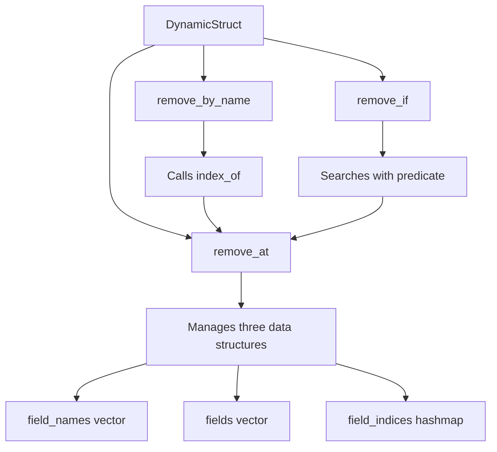

+++
title = "#22702 Reflect DynamicStruct field removal methods"
date = "2026-01-27T00:00:00"
draft = false
template = "pull_request_page.html"
in_search_index = true

[taxonomies]
list_display = ["show"]

[extra]
current_language = "en"
available_languages = {"en" = { name = "English", url = "/pull_request/bevy/2026-01/pr-22702-en-20260127" }, "zh-cn" = { name = "中文", url = "/pull_request/bevy/2026-01/pr-22702-zh-cn-20260127" }}
labels = ["C-Feature", "A-Reflection", "D-Modest"]
+++

# Title: Reflect DynamicStruct field removal methods

## Basic Information
- **Title**: Reflect DynamicStruct field removal methods
- **PR Link**: https://github.com/bevyengine/bevy/pull/22702
- **Author**: Diddykonga
- **Status**: MERGED
- **Labels**: C-Feature, S-Ready-For-Final-Review, A-Reflection, X-Uncontroversial, D-Modest
- **Created**: 2026-01-25T21:37:52Z
- **Merged**: 2026-01-27T06:44:28Z
- **Merged By**: alice-i-cecile

## Description
# Objective / Solution

Add methods for field removal on `DynamicStruct`:
```rust
DynamicStruct::remove_at( &mut self, index: usize ) -> Option<(Cow<'static, str>, Box<dyn PartialReflect>)>
DynamicStruct::remove_by_name( &mut self, name: &str ) -> Option<(Cow<'static, str>, Box<dyn PartialReflect>)>
DynamicStruct::remove_if( &mut self, f: FnMut((&str, &dyn PartialReflect))->bool ) -> Option<(Cow<'static, str>, Box<dyn PartialReflect>)>
```

## Testing

4 New Tests, located in [bevy_reflect/structs.rs](https://github.com/bevyengine/bevy/blob/aa0c0b966c3463a6f39a5b961be91722b13dfb6a/crates/bevy_reflect/src/structs.rs):
`dynamic_struct_remove_at`
`dynamic_struct_remove_by_name`
`dynamic_struct_remove_with`
`dynamic_struct_remove_combo`

---

## Showcase

<details>
  <summary>Click to view showcase</summary>

```rust
#[derive(Reflect, Default)]
struct MyStruct {
    a: (),
    b: (),
    c: (),
}

 #[test]
fn dynamic_struct_remove_combo() {
    let mut my_struct = MyStruct::default().to_dynamic_struct();

    assert_eq!(my_struct.field_len(), 3);

    let field_2 = my_struct
        .remove_at(
            my_struct
                .index_of(
                    my_struct
                        .field("b")
                        .expect("Invalid name for `my_struct.field(name)`"),
                )
                .expect("Invalid field for `my_struct.index_of(field)`"),
        )
        .expect("Invalid index for `my_struct.remove_at(index)`");

    assert_eq!(my_struct.field_len(), 2);
    assert_eq!(field_2.0, "b");

    let field_3_name = my_struct
        .name_of(
            my_struct
                    .field_at(1)
                    .expect("Invalid index for `my_struct.field_at(index)`"),
            )
            .expect("Invalid field for `my_struct.name_of(field)`")
            .to_owned();
    let field_3 = my_struct
        .remove_by_name(field_3_name.as_ref())
        .expect("Invalid name for `my_struct.remove_by_name(name)`");

    assert_eq!(my_struct.field_len(), 1);
    assert_eq!(field_3.0, "c");

    let field_1_name = my_struct
        .name_at(0)
        .expect("Invalid name for `my_struct.name_at(name)`")
        .to_owned();
    let field_1 = my_struct
        .remove_if(|(name, _field)| name == field_1_name)
        .expect("No valid name/field found for `my_struct.remove_if(|(name, field)|{})`");

    assert_eq!(my_struct.field_len(), 0);
    assert_eq!(field_1.0, "a");
}
```

</details>

## The Story of This Pull Request

This pull request addresses a gap in the Bevy reflection system by adding field removal capabilities to `DynamicStruct`. The problem was straightforward: `DynamicStruct` already had methods for adding fields (`insert`, `insert_boxed`), but no symmetrical way to remove them. This created an asymmetry in the API that limited dynamic manipulation of reflected data structures.

The solution follows a logical progression by providing three removal methods that mirror common use cases. The most fundamental is `remove_at`, which removes a field by index and handles the necessary bookkeeping of the field indices. The implementation of `remove_at` needs to carefully manage three data structures: the `field_names` vector, the `fields` vector, and the `field_indices` hashmap that maps field names to their positions.

The `remove_at` method implementation demonstrates careful index management:
```rust
pub fn remove_at(
    &mut self,
    index: usize,
) -> Option<(Cow<'static, str>, Box<dyn PartialReflect>)> {
    let mut i: usize = 0;
    let mut extract = self.field_names.extract_if(0..self.field_names.len(), |n| {
        let mut result = false;
        if i == index {
            self.field_indices
                .remove(n)
                .expect("Invalid name for `field_indices.remove(name)`");
            result = true;
        } else if i > index {
            *self
                .field_indices
                .get_mut(n)
                .expect("Invalid name for `field_indices.get_mut(name)`") -= 1;
        }
        i += 1;
        result
    });
    // ...
}
```

The method uses `extract_if`, a relatively new Rust API that removes elements matching a predicate and returns an iterator over the removed items. This requires updating the minimum Rust version from 1.85.0 to 1.87.0 in `Cargo.toml` to access this stabilized feature.

Once the field name is removed from `field_names` and the index mapping is updated, the actual field value is removed from the `fields` vector. The method returns both the field name and the removed value, maintaining consistency with insertion operations that also accept boxed `dyn PartialReflect` values.

The other two methods build on `remove_at` for convenience. `remove_by_name` first looks up the field's index using the existing `index_of` method, then calls `remove_at`. `remove_if` searches for the first field matching a predicate and removes it using `remove_at`. This layered approach minimizes code duplication and ensures consistent behavior across all removal operations.

The testing strategy is comprehensive, with four new unit tests that validate the behavior of each removal method and their interactions. The `dynamic_struct_remove_combo` test demonstrates how the different removal methods can be used together, showing a practical workflow where you might locate a field by name, get its index, remove it, then use other methods to continue processing the remaining fields.

From a design perspective, these methods follow Rust's error handling conventions by returning `Option` types rather than panicking. This gives callers control over how to handle missing fields or invalid indices. The implementation also maintains the internal consistency of the `DynamicStruct` - after any removal operation, the indices in `field_indices` are correctly adjusted for all remaining fields, and the `field_names` and `fields` vectors remain synchronized.

The changes are minimal and focused, affecting only 174 lines across two files. The implementation leverages existing infrastructure like the `index_of` method and maintains the same patterns used elsewhere in the reflection system. This makes the changes predictable for developers already familiar with the Bevy reflection API.

## Visual Representation



## Key Files Changed

1. **crates/bevy_reflect/Cargo.toml** (+1/-1)
   - Updated the minimum Rust version from 1.85.0 to 1.87.0 to use the stabilized `extract_if` method

2. **crates/bevy_reflect/src/structs.rs** (+173/-0)
   - Added three new public methods to `DynamicStruct`: `remove_at`, `remove_by_name`, and `remove_if`
   - Added comprehensive test coverage with four new test functions

Key implementation code:
```rust
/// Removes a field at `index`.
pub fn remove_at(
    &mut self,
    index: usize,
) -> Option<(Cow<'static, str>, Box<dyn PartialReflect>)> {
    let mut i: usize = 0;
    let mut extract = self.field_names.extract_if(0..self.field_names.len(), |n| {
        let mut result = false;
        if i == index {
            self.field_indices
                .remove(n)
                .expect("Invalid name for `field_indices.remove(name)`");
            result = true;
        } else if i > index {
            *self
                .field_indices
                .get_mut(n)
                .expect("Invalid name for `field_indices.get_mut(name)`") -= 1;
        }
        i += 1;
        result
    });

    let name = extract
        .nth(0)
        .expect("Invalid index for `extract.nth(index)`");
    extract.for_each(drop); // Fully evaluate the rest of the iterator, so we don't short-circuit the extract.

    Some((name, self.fields.remove(index)))
}
```

The other two methods build on this foundation:
```rust
/// Removes the first field that satisfies the given predicate, `f`.
pub fn remove_if<F>(&mut self, mut f: F) -> Option<(Cow<'static, str>, Box<dyn PartialReflect>)>
where
    F: FnMut((&str, &dyn PartialReflect)) -> bool,
{
    if let Some(index) = self
        .field_names
        .iter()
        .zip(self.fields.iter())
        .position(|(name, field)| f((name.as_ref(), field.as_ref())))
    {
        self.remove_at(index)
    } else {
        None
    }
}

/// Removes a field by `name`.
pub fn remove_by_name(
    &mut self,
    name: &str,
) -> Option<(Cow<'static, str>, Box<dyn PartialReflect>)> {
    if let Some(index) = self.index_of(name) {
        self.remove_at(index)
    } else {
        None
    }
}
```

## Further Reading

1. [Rust `extract_if` method documentation](https://doc.rust-lang.org/std/vec/struct.Vec.html#method.extract_if) - Details on the stabilized method used in this implementation
2. [Bevy Reflection System](https://bevy-cheatbook.github.io/programming/reflection.html) - Overview of Bevy's reflection capabilities
3. [Dynamic Types in Bevy](https://github.com/bevyengine/bevy/tree/main/crates/bevy_reflect) - Source code for the reflection system
4. [Rust Iterator `position` method](https://doc.rust-lang.org/std/iter/trait.Iterator.html#method.position) - Used in `remove_if` to find matching fields