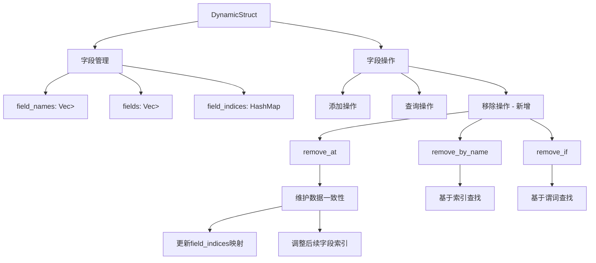

+++
title = "#22702 Reflect DynamicStruct field removal methods"
date = "2026-01-27T00:00:00"
draft = false
template = "pull_request_page.html"
in_search_index = false

[extra]
current_language = "zh-cn"
available_languages = {"en" = { name = "English", url = "/pull_request/bevy/2026-01/pr-22702-en-20260127" }, "zh-cn" = { name = "中文", url = "/pull_request/bevy/2026-01/pr-22702-zh-cn-20260127" }}
labels = ["C-Feature", "A-Reflection", "D-Modest"]
+++

# Title: Reflect DynamicStruct field removal methods

## Basic Information
- **Title**: Reflect DynamicStruct field removal methods
- **PR Link**: https://github.com/bevyengine/bevy/pull/22702
- **Author**: Diddykonga
- **Status**: MERGED
- **Labels**: C-Feature, S-Ready-For-Final-Review, A-Reflection, X-Uncontroversial, D-Modest
- **Created**: 2026-01-25T21:37:52Z
- **Merged**: 2026-01-27T06:44:28Z
- **Merged By**: alice-i-cecile

## Description Translation
这个 PR 为 `DynamicStruct` 添加了字段移除方法：
```rust
DynamicStruct::remove_at( &mut self, index: usize ) -> Option<(Cow<'static, str>, Box<dyn PartialReflect>)>
DynamicStruct::remove_by_name( &mut self, name: &str ) -> Option<(Cow<'static, str>, Box<dyn PartialReflect>)>
DynamicStruct::remove_if( &mut self, f: FnMut((&str, &dyn PartialReflect))->bool ) -> Option<(Cow<'static, str>, Box<dyn PartialReflect>)>
```

## 测试 (Testing)

在 [bevy_reflect/structs.rs](https://github.com/bevyengine/bevy/blob/aa0c0b966c3463a6f39a5b961be91722b13dfb6a/crates/bevy_reflect/src/structs.rs) 中添加了 4 个新测试：
`dynamic_struct_remove_at`
`dynamic_struct_remove_by_name`
`dynamic_struct_remove_with`
`dynamic_struct_remove_combo`

---

## 展示 (Showcase)

<details>
  <summary>点击查看展示</summary>

```rust
#[derive(Reflect, Default)]
struct MyStruct {
    a: (),
    b: (),
    c: (),
}

 #[test]
fn dynamic_struct_remove_combo() {
    let mut my_struct = MyStruct::default().to_dynamic_struct();

    assert_eq!(my_struct.field_len(), 3);

    let field_2 = my_struct
        .remove_at(
            my_struct
                .index_of(
                    my_struct
                        .field("b")
                        .expect("Invalid name for `my_struct.field(name)`"),
                )
                .expect("Invalid field for `my_struct.index_of(field)`"),
        )
        .expect("Invalid index for `my_struct.remove_at(index)`");

    assert_eq!(my_struct.field_len(), 2);
    assert_eq!(field_2.0, "b");

    let field_3_name = my_struct
        .name_of(
            my_struct
                    .field_at(1)
                    .expect("Invalid index for `my_struct.field_at(index)`"),
            )
            .expect("Invalid field for `my_struct.name_of(field)`")
            .to_owned();
    let field_3 = my_struct
        .remove_by_name(field_3_name.as_ref())
        .expect("Invalid name for `my_struct.remove_by_name(name)`");

    assert_eq!(my_struct.field_len(), 1);
    assert_eq!(field_3.0, "c");

    let field_1_name = my_struct
        .name_at(0)
        .expect("Invalid name for `my_struct.name_at(name)`")
        .to_owned();
    let field_1 = my_struct
        .remove_if(|(name, _field)| name == field_1_name)
        .expect("No valid name/field found for `my_struct.remove_if(|(name, field)|{})`");

    assert_eq!(my_struct.field_len(), 0);
    assert_eq!(field_1.0, "a");
}
```

</details>

## The Story of This Pull Request

在 Bevy 反射系统中，`DynamicStruct` 是运行时动态结构体的核心表示。它提供了一系列方法来动态操作结构体字段，包括添加字段和查询字段信息。然而，在 PR #22702 之前，这个 API 缺少一个关键功能：字段移除。

这个 PR 从一个实际需求出发：开发者在动态操作结构体时，不仅需要添加字段，还需要在特定条件下移除字段。这在使用反射系统进行数据转换、协议反序列化或动态系统配置时都是常见需求。

PR 作者识别到现有的 `DynamicStruct` API 存在不完整性。虽然已经有了 `insert()` 方法添加字段，以及 `index_of()`、`name_at()` 等方法查询字段信息，但缺少对称的移除操作。这导致开发者在使用动态结构体时，要么需要手动管理字段集合，要么需要创建新的结构体来模拟移除效果。

解决方案采用了经典的三种移除模式：按索引移除、按名称移除和按条件移除。这三种模式覆盖了大多数使用场景：
1. `remove_at()` 用于已知字段位置的精确移除
2. `remove_by_name()` 用于通过字段名直接移除
3. `remove_if()` 提供了灵活性，允许通过谓词函数决定移除哪个字段

`remove_at()` 的实现需要特别注意数据一致性维护。`DynamicStruct` 内部使用三个数据结构来管理字段：`field_names` 存储字段名，`fields` 存储字段值，`field_indices` 维护字段名到索引的映射。移除操作需要同步更新这三个数据结构：

```rust
pub fn remove_at(
    &mut self,
    index: usize,
) -> Option<(Cow<'static, str>, Box<dyn PartialReflect>)> {
    let mut i: usize = 0;
    let mut extract = self.field_names.extract_if(0..self.field_names.len(), |n| {
        let mut result = false;
        if i == index {
            self.field_indices
                .remove(n)
                .expect("Invalid name for `field_indices.remove(name)`");
            result = true;
        } else if i > index {
            *self
                .field_indices
                .get_mut(n)
                .expect("Invalid name for `field_indices.get_mut(name)`") -= 1;
        }
        i += 1;
        result
    });

    let name = extract
        .nth(0)
        .expect("Invalid index for `extract.nth(index)`");
    extract.for_each(drop); // 完全评估迭代器的其余部分，避免短路

    Some((name, self.fields.remove(index)))
}
```

这段代码有几个技术要点：
1. 使用 `extract_if()` 方法同时遍历和移除字段名，这比先查找再移除更高效
2. 需要调整移除位置之后所有字段的索引（递减1），保持 `field_indices` 映射的正确性
3. `extract.for_each(drop)` 确保迭代器完全消费，避免资源泄漏

`remove_if()` 的实现基于现有方法构建，体现了良好的代码复用：

```rust
pub fn remove_if<F>(&mut self, mut f: F) -> Option<(Cow<'static, str>, Box<dyn PartialReflect>)>
where
    F: FnMut((&str, &dyn PartialReflect)) -> bool,
{
    if let Some(index) = self
        .field_names
        .iter()
        .zip(self.fields.iter())
        .position(|(name, field)| f((name.as_ref(), field.as_ref())))
    {
        self.remove_at(index)
    } else {
        None
    }
}
```

这里使用了 Rust 的迭代器组合子 `position()` 来查找满足条件的第一个字段索引，然后委托给 `remove_at()` 执行移除操作。

PR 还包含了全面的测试用例，展示了不同移除方法的使用方式，包括一个"组合测试"展示了多种方法如何协同工作。这些测试不仅验证了功能正确性，还提供了清晰的 API 使用示例。

值得注意的一个细节是，PR 作者将 Rust 版本要求从 1.85.0 提升到 1.87.0，这可能是为了确保某些稳定 API 的可用性。

从架构角度看，这个 PR 完善了 `DynamicStruct` 的 API 完整性，使其具备了完整的 CRUD 操作能力。移除操作返回被移除字段的元组（字段名和值的 Box），这在很多场景下是有用的，比如需要在移除字段的同时获取其值进行进一步处理。

总的来说，这个 PR 展示了良好 API 设计的几个原则：完整性（提供对称的操作）、实用性（覆盖常见用例）和一致性（与现有 API 保持相似的签名和返回类型）。

## Visual Representation



## Key Files Changed

### 1. `crates/bevy_reflect/src/structs.rs` (+173/-0)

**主要变化**：为 `DynamicStruct` 类型添加了三个字段移除方法和对应的测试用例。

**核心代码示例**：
```rust
// 添加的三个新方法
impl DynamicStruct {
    /// Removes a field at `index`.
    pub fn remove_at(
        &mut self,
        index: usize,
    ) -> Option<(Cow<'static, str>, Box<dyn PartialReflect>)> {
        // 实现细节...
    }

    /// Removes the first field that satisfies the given predicate, `f`.
    pub fn remove_if<F>(&mut self, mut f: F) -> Option<(Cow<'static, str>, Box<dyn PartialReflect>)>
    where
        F: FnMut((&str, &dyn PartialReflect)) -> bool,
    {
        // 实现细节...
    }

    /// Removes a field by `name`.
    pub fn remove_by_name(
        &mut self,
        name: &str,
    ) -> Option<(Cow<'static, str>, Box<dyn PartialReflect>)> {
        // 实现细节...
    }
}
```

### 2. `crates/bevy_reflect/Cargo.toml` (+1/-1)

**主要变化**：将 Rust 最低版本要求从 1.85.0 提升到 1.87.0。

**代码差异**：
```toml
# Before:
rust-version = "1.85.0"

# After:
rust-version = "1.87.0"
```

## Further Reading

1. **Rust 迭代器文档**：了解 `extract_if()`、`position()` 和迭代器组合子的使用
2. **Bevy 反射系统文档**：理解 `DynamicStruct` 和反射系统的整体设计
3. **Rust 的 Cow (Copy on Write) 类型**：了解 `Cow<'static, str>` 在性能优化中的作用
4. **Rust 1.87.0 变更日志**：查看版本升级引入的新特性或稳定化API