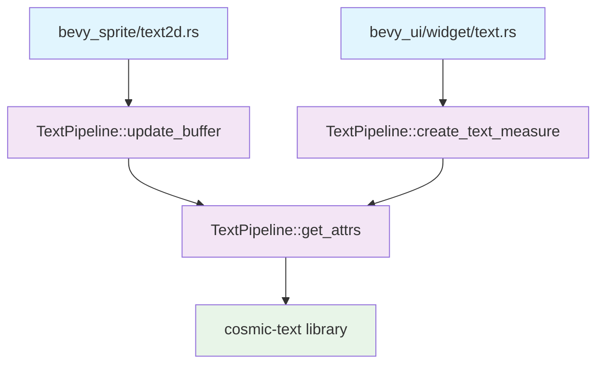

+++
title = "#22703 Use an `f32` `scale_factor` in `TextPipeline`"
date = "2026-01-25T00:00:00"
draft = false
template = "pull_request_page.html"
in_search_index = true

[taxonomies]
list_display = ["show"]

[extra]
current_language = "en"
available_languages = {"en" = { name = "English", url = "/pull_request/bevy/2026-01/pr-22703-en-20260125" }, "zh-cn" = { name = "中文", url = "/pull_request/bevy/2026-01/pr-22703-zh-cn-20260125" }}
labels = ["D-Trivial", "C-Code-Quality", "A-Text"]
+++

# Title: Use an `f32` `scale_factor` in `TextPipeline`

## Basic Information
- **Title**: Use an `f32` `scale_factor` in `TextPipeline`
- **PR Link**: https://github.com/bevyengine/bevy/pull/22703
- **Author**: ickshonpe
- **Status**: MERGED
- **Labels**: D-Trivial, C-Code-Quality, S-Ready-For-Final-Review, A-Text
- **Created**: 2026-01-25T21:46:54Z
- **Merged**: 2026-01-25T22:52:31Z
- **Merged By**: alice-i-cecile

## Description Translation
# Objective

`TextPipeline`'s methods don't need to take an `f64` scalefactor (cosmic text used to want `f64`s but not anymore), it just gets converted back to an `f32`.

## Solution

* Changed the types of the `scale_factor` parameters belonging to `update_buffer`, `create_text_measure`, and `get_attrs` from `f64` to `f32`

* Removed some needless conversions.

## The Story of This Pull Request

This pull request addresses a straightforward type mismatch in Bevy's text rendering pipeline. The issue originated from a historical requirement in the cosmic-text library, which previously used `f64` values for scaling factors. Over time, cosmic-text transitioned to using `f32`, but Bevy's text pipeline methods still accepted `f64` parameters that were immediately converted to `f32` internally. This created unnecessary conversions and potential precision loss at the API boundary.

The problem manifested in three key methods within the `TextPipeline` implementation: `update_buffer`, `create_text_measure`, and the helper function `get_attrs`. Each of these methods accepted a `scale_factor` parameter as `f64`, but then immediately converted it to `f32` for actual use in font size calculations and layout computations.

The solution was conceptually simple but required coordinated changes across multiple files. The developer changed the parameter types from `f64` to `f32` in the method signatures and then updated all call sites to pass `f32` values directly, removing the intermediate `as f64` conversions. This cleanup affected three different crates: `bevy_text`, `bevy_sprite`, and `bevy_ui`, each of which uses the text pipeline for different rendering contexts.

The implementation details show careful attention to consistency. In `pipeline.rs`, the `update_buffer` method's signature changed from accepting `scale_factor: f64` to `scale_factor: f32`. Within the method body, calculations like `text_font.font_size * scale_factor as f32` were simplified to `text_font.font_size * scale_factor`, since the parameter was already the correct type. Similarly, in the `get_attrs` helper function, both font size and line height calculations were simplified by removing the redundant type conversions.

The changes in `text2d.rs` and `text.rs` demonstrate how call sites were updated. Previously, these files were passing `scale_factor as f64` to the text pipeline methods. After the parameter type change, they simply pass the `f32` value directly, which is more efficient and avoids unnecessary precision conversions.

This PR represents a typical example of cleaning up technical debt that accumulates when external dependencies change their APIs. The cosmic-text library's transition from `f64` to `f32` for scaling factors was not immediately reflected in Bevy's API, leading to this inconsistency. By updating the parameter types, the code becomes more efficient (eliminating unnecessary type conversions), clearer (the API accurately reflects what the underlying library expects), and more consistent (matching the actual precision requirements of the text rendering system).

The impact of these changes is primarily in code quality and minor performance improvements. While the performance gain from removing a few `f64` to `f32` conversions is minimal, the cleaner API surface makes the code easier to understand and maintain. Developers working with text rendering no longer need to wonder why `f64` is being used when the underlying system only needs `f32` precision.

From an architectural perspective, this change demonstrates good API design principles: exposing only the precision actually needed by the implementation, avoiding unnecessary type conversions at API boundaries, and keeping the public interface aligned with the capabilities of underlying dependencies. It also shows the importance of periodically reviewing APIs when dependencies change to ensure consistency throughout the codebase.

## Visual Representation



## Key Files Changed

### 1. `crates/bevy_text/src/pipeline.rs` (+6/-6)
This is the core file where the text pipeline implementation resides. The changes update method signatures and remove unnecessary type conversions.

**Key changes:**
```rust
// Before:
pub fn update_buffer(
    // ... other parameters
    scale_factor: f64,
    // ... rest of implementation
) {
    // Inside method: using scale_factor as f64, converting to f32 when needed
    if text_font.font_size * scale_factor as f32 > WARN_FONT_SIZE {
        // warning logic
    }
}

// After:
pub fn update_buffer(
    // ... other parameters
    scale_factor: f32,  // Changed from f64 to f32
    // ... rest of implementation
) {
    // Now scale_factor is already f32, no conversion needed
    if text_font.font_size * scale_factor > WARN_FONT_SIZE {
        // warning logic
    }
}
```

The `create_text_measure` method and `get_attrs` function received similar updates, changing their `scale_factor` parameters from `f64` to `f32` and removing the `as f32` conversions in calculations.

### 2. `crates/bevy_sprite/src/text2d.rs` (+1/-1)
This file handles 2D text rendering for sprites. The change updates the call to `update_buffer` to pass the `f32` value directly instead of converting to `f64`.

```rust
// Before:
TextPipeline::update_buffer(
    // ... other parameters
    scale_factor as f64,  // Converting f32 to f64
    // ... rest of call
);

// After:
TextPipeline::update_buffer(
    // ... other parameters
    scale_factor,  // Now passes f32 directly
    // ... rest of call
);
```

### 3. `crates/bevy_ui/src/widget/text.rs` (+1/-1)
This file manages UI text rendering. The change updates the call to `create_text_measure` to pass the `f32` value directly.

```rust
// Before:
TextPipeline::create_text_measure(
    // ... other parameters
    computed_target.scale_factor.into(),  // Converting to f64
    // ... rest of call
);

// After:
TextPipeline::create_text_measure(
    // ... other parameters
    computed_target.scale_factor,  // Now passes f32 directly
    // ... rest of call
);
```

## Further Reading

1. **Bevy Text Rendering Documentation**: For understanding Bevy's text rendering pipeline and how text components work
2. **Cosmic-text Library**: The underlying text layout library used by Bevy, which originally motivated the `f64` requirement
3. **Floating-Point Precision in Graphics**: Technical discussions about when to use `f32` vs `f64` in game development and graphics programming
4. **Rust Type Conversions**: Best practices for type conversions in Rust, particularly between floating-point types
5. **API Design Principles**: Guidelines for designing clean, efficient APIs that minimize unnecessary type conversions