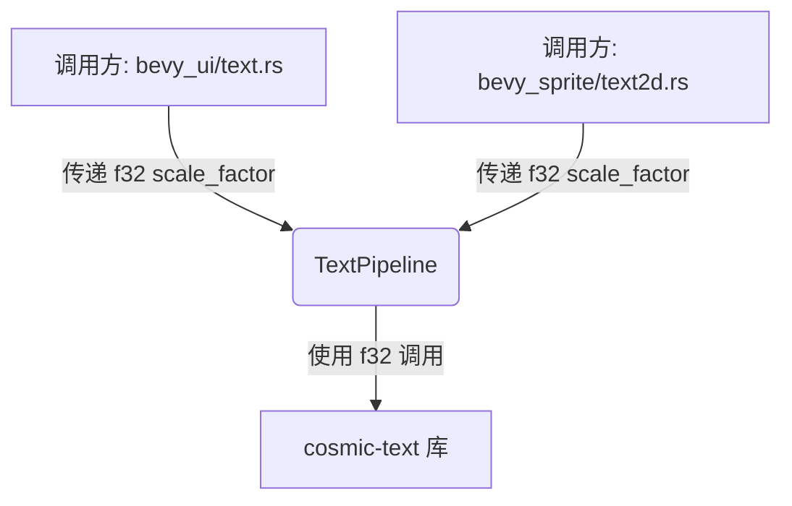

+++
title = "#22703 Use an `f32` `scale_factor` in `TextPipeline`"
date = "2026-01-25T00:00:00"
draft = false
template = "pull_request_page.html"
in_search_index = false

[extra]
current_language = "zh-cn"
available_languages = {"en" = { name = "English", url = "/pull_request/bevy/2026-01/pr-22703-en-20260125" }, "zh-cn" = { name = "中文", url = "/pull_request/bevy/2026-01/pr-22703-zh-cn-20260125" }}
labels = ["D-Trivial", "C-Code-Quality", "A-Text"]
+++

# Title

## Basic Information
- **Title**: Use an `f32` `scale_factor` in `TextPipeline`
- **PR Link**: https://github.com/bevyengine/bevy/pull/22703
- **Author**: ickshonpe
- **Status**: MERGED
- **Labels**: D-Trivial, C-Code-Quality, S-Ready-For-Final-Review, A-Text
- **Created**: 2026-01-25T21:46:54Z
- **Merged**: 2026-01-25T22:52:31Z
- **Merged By**: alice-i-cecile

## Description Translation

# Objective（目标）

`TextPipeline` 的方法不再需要接受一个 `f64` 类型的 scale_factor（缩放因子）（cosmic text 过去需要 `f64` 但现在不再需要了），它最终只是被转换回 `f32`。

## Solution（解决方案）

* 将属于 `update_buffer`、`create_text_measure` 和 `get_attrs` 方法的 `scale_factor` 参数类型从 `f64` 更改为 `f32`。
* 移除了一些不必要的转换。

## The Story of This Pull Request

这个 Pull Request 处理的是一个纯粹的代码质量优化问题，旨在简化 Bevy 引擎中文本渲染管道的类型使用，移除不必要的精度转换。

问题的根源在于底层文本布局库的历史依赖。Bevy 的 `TextPipeline` 使用了 `cosmic-text` 库进行文本测量和布局。在某个历史阶段，`cosmic-text` 的 API 要求使用 `f64` 精度的 `scale_factor` 参数。因此，Bevy 的代码为了兼容，也沿用了 `f64` 类型。然而，在 `cosmic-text` 的后续更新中，这个 API 需求发生了变化，它不再需要 `f64`，内部处理也是用 `f32`。这就导致 Bevy 代码中存在一个“过时”的设计：调用者传入 `f64`，`TextPipeline` 在将其传递给 `cosmic-text` 之前或内部计算时，又将其转换（cast）回 `f32`。这种模式引入了多余的类型转换，增加了认知负担，并且可能带来微小的、不必要的运行时开销。

开发者识别到这个问题后，采取的解决方案是直接、精准的。他们没有修改任何算法或逻辑，而是专注于修正类型签名以反映实际需求。核心思路是：既然最终只需要 `f32`，那么接口就应该直接使用 `f32`。这遵循了 API 设计应尽可能简单、直接的通用原则。

具体实现体现在三个关键文件的修改上。首先，在 `TextPipeline` 的实现文件 (`crates/bevy_text/src/pipeline.rs`) 中，相关方法的签名被更新：
```rust
// 之前: scale_factor: f64
// 之后: scale_factor: f32
pub fn update_buffer(... scale_factor: f32, ...)
pub fn create_text_measure(... scale_factor: f32, ...)
fn get_attrs(... scale_factor: f32, ...)
```
签名更改后，方法内部所有使用 `scale_factor` 的地方都无需再进行 `as f32` 的显式转换。例如，之前计算字体大小时是 `text_font.font_size * scale_factor as f32`，现在可以直接写成 `text_font.font_size * scale_factor`。同样，对 `LineHeight::Px` 的处理也移除了转换。这个改动消除了好几处冗余的类型转换操作。

其次，为了保持整个调用链的一致性，调用 `TextPipeline::update_buffer` 的两个地方也需要同步更新。在 `bevy_sprite` 的 `text2d.rs` 和 `bevy_ui` 的 `text.rs` 中，调用时传递的 `scale_factor` 参数原本是 `f64` 类型（在 UI 模块中通过 `.into()` 转换而来），现在直接传递已有的 `f32` 值。这进一步清理了调用方的代码，移除了像 `scale_factor as f64` 或 `.into()` 这样的转换。

从技术角度看，这个修改有几方面的积极影响。最直接的是代码简洁性（code cleanliness）和可读性的提升。移除不必要的类型转换使代码意图更清晰，开发者更容易理解数据流的实际精度。其次，虽然单个转换的开销可以忽略不计，但消除它们遵循了“零成本抽象”的精神，确保了代码路径是最精简的。更重要的是，它提高了API的一致性（consistency）和真实性（truthfulness），接口现在准确反映了其内部需求和依赖库的当前状态，避免了给使用者留下可能需要高精度的误导印象。

这个 PR 是一个很好的范例，展示了如何通过关注底层依赖的变更来持续优化和清理代码库。它不需要复杂的架构调整，而是通过细致的观察和对代码“真理”的追求——即让类型系统尽可能准确地描述运行时行为——来实现质量的提升。合并后，与文本缩放因子相关的代码变得更加清晰和高效。

## Visual Representation



## Key Files Changed

1.  **`crates/bevy_text/src/pipeline.rs`**
    *   **修改说明**：这是核心修改文件。`TextPipeline` 结构体内部处理文本布局和测量的方法将其 `scale_factor` 参数类型从 `f64` 统一改为 `f32`，并移除了方法内部所有与之相关的冗余 `as f32` 类型转换。
    *   **关键代码片段**：
        ```rust
        // 方法签名更改示例
        pub fn update_buffer(
            // ...
            scale_factor: f32, // 之前是 f64
            // ...
        )
        
        // 内部使用更改示例
        // 之前: if text_font.font_size * scale_factor as f32 > WARN_FONT_SIZE {
        // 之后:
        if text_font.font_size * scale_factor > WARN_FONT_SIZE {
        
        // 另一个内部函数签名更改
        // 之前: scale_factor: f64,
        // 之后:
        fn get_attrs<'a>(..., scale_factor: f32, ...) -> Attrs<'a> {
            // 内部计算也移除了 `as f32`
            let font_size = (text_font.font_size * scale_factor).round(); // 之前有 as f32
        }
        ```
    *   **与整体目标的关系**：此文件的修改是本次 PR 的核心，它定义了新的、更简洁的接口并清理了内部实现。

2.  **`crates/bevy_sprite/src/text2d.rs`**
    *   **修改说明**：更新了对 `TextPipeline::update_buffer` 的调用，以适配其新的 `f32` 参数签名，移除了先前需要的 `as f64` 转换。
    *   **关键代码片段**：
        ```rust
        // 调用处更改
        // 之前: scale_factor as f64,
        // 之后:
        scale_factor,
        ```
    *   **与整体目标的关系**：作为 `TextPipeline` 的调用方之一，此修改保证了整个调用链的类型一致性。

3.  **`crates/bevy_ui/src/widget/text.rs`**
    *   **修改说明**：同样更新了对 `TextPipeline::create_text_measure` 的调用。原先通过 `.into()` 将 `f32` 转换为 `f64`，现在直接传递 `f32` 值。
    *   **关键代码片段**：
        ```rust
        // 调用处更改
        // 之前: computed_target.scale_factor.into(),
        // 之后:
        computed_target.scale_factor,
        ```
    *   **与整体目标的关系**：作为另一个主要的调用方，此修改完成了从 UI 系统到文本管道接口的类型简化。

## Further Reading

*   **Cosmic Text**: 了解 Bevy 所使用的底层文本 shaping 和布局库。[Cosmic Text GitHub Repository](https://github.com/pop-os/cosmic-text)
*   **Bevy 官方文档 - Text**: 关于如何在 Bevy 中使用和自定义文本渲染的官方指南。[Bevy Text Documentation](https://docs.rs/bevy/latest/bevy/text/index.html)
*   **Rust 类型转换 (`as` 与 `into/from`)**: 深入理解 Rust 中不同精度类型转换的机制与选择。可参考 Rust 官方书籍相关章节。