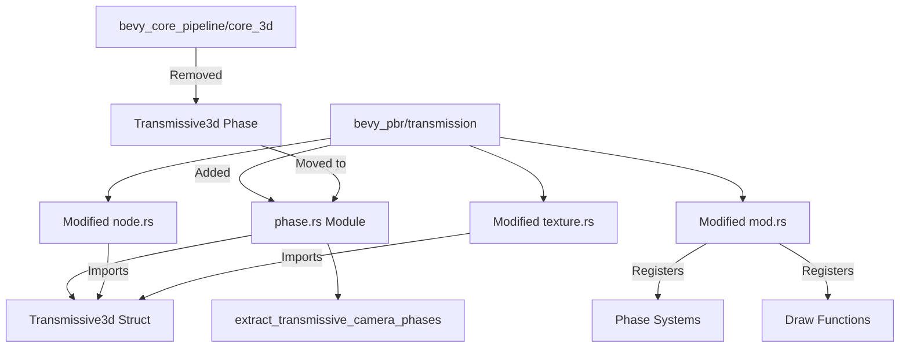

+++
title = "#22706 Move Transmissive3d phase to pbr/transmission"
date = "2026-01-27T00:00:00"
draft = false
template = "pull_request_page.html"
in_search_index = true

[taxonomies]
list_display = ["show"]

[extra]
current_language = "en"
available_languages = {"en" = { name = "English", url = "/pull_request/bevy/2026-01/pr-22706-en-20260127" }, "zh-cn" = { name = "中文", url = "/pull_request/bevy/2026-01/pr-22706-zh-cn-20260127" }}
labels = ["A-Rendering", "C-Code-Quality", "C-Usability", "D-Straightforward"]
+++

# Title
Move Transmissive3d phase to pbr/transmission

## Basic Information
- **Title**: Move Transmissive3d phase to pbr/transmission
- **PR Link**: https://github.com/bevyengine/bevy/pull/22706
- **Author**: atlv24
- **Status**: MERGED
- **Labels**: A-Rendering, C-Code-Quality, C-Usability, S-Ready-For-Final-Review, X-Uncontroversial, D-Straightforward
- **Created**: 2026-01-25T23:16:23Z
- **Merged**: 2026-01-27T06:58:55Z
- **Merged By**: alice-i-cecile

## Description Translation

# Objective

- Further consolidate transmission to pbr

## Solution

- Move phase code over

## Testing

- transmission example and bistro look fine in deferred and forward etc.

## The Story of This Pull Request

This pull request continues a refactoring effort to consolidate transmission-related code within the PBR (Physically Based Rendering) system of the Bevy game engine. The specific goal was to move the `Transmissive3d` phase implementation from the core 3D pipeline to the transmission module within the PBR system.

The context for this change is part of a broader effort to improve code organization by grouping related functionality together. Transmission rendering - the simulation of light passing through semi-transparent materials like glass - is fundamentally a PBR feature, so its implementation should reside within the PBR system rather than the general-purpose core pipeline. This follows good software architecture principles of high cohesion and separation of concerns.

The developer took a straightforward approach: physically moving the existing `Transmissive3d` phase implementation from `bevy_core_pipeline` to `bevy_pbr/transmission` while maintaining all existing functionality. The implementation consists of several coordinated changes across multiple files to ensure the system remains functional after the relocation.

From a technical perspective, the `Transmissive3d` phase item is a render phase that handles transmissive materials, similar to how `Opaque3d`, `AlphaMask3d`, and `Transparent3d` handle their respective material types. The phase item implements several key traits:
- `PhaseItem` for basic render phase functionality
- `SortedPhaseItem` for depth-based sorting (using `radsort` for performance)
- `CachedRenderPipelinePhaseItem` for pipeline caching

One important technical detail is that automatic batching is disabled for transmissive items (`const AUTOMATIC_BATCHING: bool = false;`) because their rendering is split into multiple steps depending on `ScreenSpaceTransmission::screen_space_specular_transmission_steps`. The batching system doesn't currently understand this multi-step rendering process, which could cause items to be drawn incorrectly across step boundaries.

The implementation successfully relocates all related components:
1. The `Transmissive3d` struct definition and its trait implementations
2. The phase extraction system (`extract_transmissive_camera_phases`)
3. Phase sorting system registration
4. Draw function registration for the `DrawMaterial` render command

After these changes, the transmission system is more logically organized, with all transmission-related code residing in the `bevy_pbr/transmission` module. This makes the codebase easier to understand and maintain, as developers working on transmission features can find all related code in one place rather than scattered across different modules.

The changes have minimal performance impact since they're primarily organizational - the same code executes, just from a different location. The testing mentioned in the PR description confirms that both the transmission example and more complex scenes like bistro continue to render correctly in both deferred and forward rendering modes.

## Visual Representation



## Key Files Changed

### `crates/bevy_pbr/src/transmission/phase.rs` (+129/-0)
**New file created** - Contains the complete `Transmissive3d` phase implementation moved from `bevy_core_pipeline`.

```rust
pub struct Transmissive3d {
    pub distance: f32,
    pub pipeline: CachedRenderPipelineId,
    pub entity: (Entity, MainEntity),
    pub draw_function: DrawFunctionId,
    pub batch_range: Range<u32>,
    pub extra_index: PhaseItemExtraIndex,
    /// Whether the mesh in question is indexed (uses an index buffer in
    /// addition to its vertex buffer).
    pub indexed: bool,
}

impl PhaseItem for Transmissive3d {
    /// For now, automatic batching is disabled for transmissive items because their rendering is
    /// split into multiple steps depending on [`crate::ScreenSpaceTransmission::screen_space_specular_transmission_steps`],
    /// which the batching system doesn't currently know about.
    const AUTOMATIC_BATCHING: bool = false;
    
    // ... trait implementations
}

pub fn extract_transmissive_camera_phases(
    mut transmissive_3d_phases: ResMut<ViewSortedRenderPhases<Transmissive3d>>,
    cameras: Extract<Query<(Entity, &Camera), With<Camera3d>>>,
    mut live_entities: Local<HashSet<RetainedViewEntity>>,
) {
    // ... implementation
}
```

### `crates/bevy_core_pipeline/src/core_3d/mod.rs` (+0/-95)
**Removed** - The `Transmissive3d` phase implementation and related system registrations were removed from this file.

```rust
// Before: 95 lines of Transmissive3d implementation including:
pub struct Transmissive3d { /* ... */ }
impl PhaseItem for Transmissive3d { /* ... */ }
impl SortedPhaseItem for Transmissive3d { /* ... */ }
impl CachedRenderPipelinePhaseItem for Transmissive3d { /* ... */ }

// Also removed from systems:
.init_resource::<DrawFunctions<Transmissive3d>>()
.init_resource::<ViewSortedRenderPhases<Transmissive3d>>()
sort_phase_system::<Transmissive3d>.in_set(RenderSystems::PhaseSort)

// And from function signatures:
mut transmissive_3d_phases: ResMut<ViewSortedRenderPhases<Transmissive3d>>
```

### `crates/bevy_pbr/src/transmission/mod.rs` (+14/-1)
**Modified** - Updated to register the moved phase systems and re-export the `Transmissive3d` type.

```rust
// Before:
mod node;
mod texture;

// After:
mod node;
mod phase;
mod texture;

pub use phase::Transmissive3d;

// Added system registrations in the plugin:
init_resource::<DrawFunctions<Transmissive3d>>()
init_resource::<ViewSortedRenderPhases<Transmissive3d>>()
add_render_command::<Transmissive3d, DrawMaterial>()
sort_phase_system::<Transmissive3d>.in_set(RenderSystems::PhaseSort)
add_systems(ExtractSchedule, phase::extract_transmissive_camera_phases)
```

### `crates/bevy_pbr/src/material.rs` (+1/-4)
**Modified** - Removed the `Transmissive3d` import from `bevy_core_pipeline` and the corresponding render command registration.

```rust
// Before:
use bevy_core_pipeline::{
    core_3d::{
        AlphaMask3d, Opaque3d, Opaque3dBatchSetKey, Opaque3dBinKey, Transmissive3d, Transparent3d,
    },
    // ...
}

// In plugin setup:
add_render_command::<Transmissive3d, DrawMaterial>()

// After:
use bevy_core_pipeline::{
    core_3d::{AlphaMask3d, Opaque3d, Opaque3dBatchSetKey, Opaque3dBinKey, Transparent3d},
    // ...
}

// Removed: add_render_command::<Transmissive3d, DrawMaterial>()
```

### `crates/bevy_pbr/Cargo.toml` (+1/-0)
**Modified** - Added `radsort` dependency needed for sorting the `Transmissive3d` phase items.

```toml
# Added dependency:
radsort = "0.1"
```

### `release-content/migration-guides/transmission.md` (+1/-1)
**Updated** - Added reference to this PR and noted that `Transmissive3d` has been moved.

```markdown
# Before:
pull_requests: [22687]

`ViewTransmissionTexture` has been moved from `bevy_core_pipelines` to `bevy_pbr`.

# After:
pull_requests: [22687, 22706]

`ViewTransmissionTexture` and `Transmissive3d` has been moved from `bevy_core_pipelines` to `bevy_pbr`.
```

## Further Reading

- [Bevy Rendering Architecture](https://bevy-cheatbook.github.io/programming/rendering.html) - Overview of Bevy's render graph and phase system
- [Physically Based Rendering](https://en.wikipedia.org/wiki/Physically_based_rendering) - General concepts of PBR
- [Render Phases in Bevy](https://github.com/bevyengine/bevy/blob/main/crates/bevy_render/src/render_phase/mod.rs) - Source code for the render phase system
- [Screen Space Transmission](https://github.com/bevyengine/bevy/blob/main/examples/3d/transmission.rs) - Example demonstrating transmission rendering