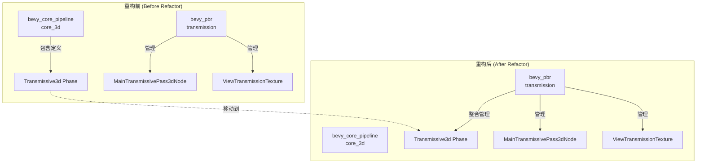

+++
title = "#22706 Move Transmissive3d phase to pbr/transmission"
date = "2026-01-27T00:00:00"
draft = false
template = "pull_request_page.html"
in_search_index = false

[extra]
current_language = "zh-cn"
available_languages = {"en" = { name = "English", url = "/pull_request/bevy/2026-01/pr-22706-en-20260127" }, "zh-cn" = { name = "中文", url = "/pull_request/bevy/2026-01/pr-22706-zh-cn-20260127" }}
+++

# Title: Move Transmissive3d phase to pbr/transmission

## Basic Information
- **标题**: Move Transmissive3d phase to pbr/transmission
- **PR 链接**: https://github.com/bevyengine/bevy/pull/22706
- **作者**: atlv24
- **状态**: MERGED
- **标签**: A-Rendering, C-Code-Quality, C-Usability, S-Ready-For-Final-Review, X-Uncontroversial, D-Straightforward
- **创建时间**: 2026-01-25T23:16:23Z
- **合并时间**: 2026-01-27T06:58:55Z
- **合并人**: alice-i-cecile

## Description Translation
**目标 (Objective)**
- 进一步将透射（transmission）功能整合至 PBR（Physically Based Rendering）系统。

**解决方案 (Solution)**
- 将阶段（phase）相关代码迁移过来。

**测试 (Testing)**
- transmission 示例和 bistro 场景在延迟渲染（deferred）和正向渲染（forward）等模式下表现正常。

## The Story of This Pull Request

这是一个关于代码组织（code organization）和模块边界（module boundaries）的PR。故事的核心是移动一段定义好的代码，从一个通用的地方到一个更专门的、逻辑上归属的地方。这不是为了修复缺陷或添加功能，而是为了提高代码的可维护性和架构的清晰度。

之前，与透射渲染相关的 `Transmissive3d` 渲染阶段（Render Phase）定义和相关系统（system）都位于 `bevy_core_pipeline::core_3d` 模块中。这个模块负责处理所有通用的3D渲染管线阶段，如不透明物体（`Opaque3d`）、透明遮罩（`AlphaMask3d`）和透明物体（`Transparent3d`）阶段。透射（`Transmissive3d`）虽然是3D渲染的一个重要组成部分，但它本质上是一个特定的、基于物理的渲染（PBR）效果，其渲染逻辑（节点、纹理处理）已经从核心管道移出，放在了 `bevy_pbr::transmission` 模块中。

这就留下了一个架构上的不一致性：与透射渲染相关的绝大部分逻辑都已集中在 `bevy_pbr` 中，唯独其核心的渲染阶段定义还留在通用的 `core_3d` 模块里。这种分离增加了理解的认知负担，也使得未来修改透射特性时需要跨模块操作。因此，开发者 `atlv24` 提出了这个PR，目的是“进一步巩固透射功能到PBR模块中”，其解决方案就是物理移动 `Transmissive3d` 阶段的定义和生命周期管理代码。

这个重构（refactor）的实现方式是典型的“剪切-粘贴并更新引用”。首先，开发者从 `bevy_core_pipeline/src/core_3d/mod.rs` 中完整地删除了 `Transmissive3d` 结构体定义、它的 trait 实现（`PhaseItem`， `SortedPhaseItem`， `CachedRenderPipelinePhaseItem`），以及三个在系统（如 `extract_core_3d_camera_phases` 和 `prepare_core_3d_depth_textures`）中对其资源的引用。这表明了完全移除的决心，而不是保留副本。

然后，在目标模块 `bevy_pbr/src/transmission/` 中，新建了一个名为 `phase.rs` 的文件。这个文件将刚刚删除的所有 `Transmissive3d` 定义和其专用的提取系统 `extract_transmissive_camera_phases` 原封不动地复制了进去。关键的是，这个新的提取系统与原来的逻辑略有不同，它只提取 `Transmissive3d` 阶段，而原先在 `core_3d` 中的系统是一次性提取所有核心3D阶段（不透明、遮罩、透射、透明）。这种分离使得 `bevy_pbr::transmission` 模块对它的渲染阶段有了完全的控制权。

为了使这块移动的代码能够正常工作，还需要在模块的“接线（wiring）”处进行更新。这包括：
1.  在 `bevy_pbr/src/transmission/mod.rs` 中导入新的 `phase` 模块，并公开 `Transmissive3d`。
2.  在同一个文件中，修改 `ScreenSpaceTransmissionPlugin` 的 `build` 函数，注册之前由 `Core3dPlugin` 管理的资源（`DrawFunctions<Transmissive3d>`， `ViewSortedRenderPhases<Transmissive3d>`）、渲染命令（`DrawMaterial`）以及排序系统。这确保了透射阶段在新的上下文中被正确地初始化和执行。
3.  更新所有文件中对 `Transmissive3d` 的导入路径，从 `bevy_core_pipeline::core_3d::Transmissive3d` 改为 `crate::transmission::Transmissive3d` 或等价的路径。
4.  因为新的 `phase.rs` 使用了 `radsort` 进行排序，所以需要将其添加为 `bevy_pbr` crate 的依赖项。

从技术角度看，这个改动展示了 Bevy 渲染架构的高度模块化。渲染阶段（`PhaseItem`）作为渲染管线中的一个环节，可以与具体的渲染节点（`Node`）、材质绘制命令（`RenderCommand`）和资源准备逻辑封装在同一个功能模块内。这种封装使得像透射这样的高级渲染特性成为一个自包含的、可插拔的单元，更容易被理解、测试和迭代。

这次重构带来的直接影响是代码库的组织结构变得更清晰。所有与屏幕空间透射相关的代码现在都位于同一目录下。对于新开发者来说，找到并理解透射渲染的逻辑变得更加直观。此外，这也为未来可能只针对透射特性进行的优化或修改铺平了道路，减少了意外影响其他无关3D渲染阶段的风险。合并前的测试（transmission示例和bistro场景）证实了这次纯粹的代码搬迁没有改变任何运行时行为，确保了重构的安全性。

总而言之，这个PR是一个“整理家务”式的优秀范例。它没有增加新功能，但通过将代码移动到更合适的位置，提升了项目的整体代码质量、可维护性和架构的一致性，这正是成熟软件项目中至关重要的一类工作。

## Visual Representation



## Key Files Changed

**主要文件变更列表:**

1.  `crates/bevy_pbr/src/transmission/phase.rs` (+129/-0) **【新增文件】**
    *   **变更描述与原因**：这是本次重构的核心产出。它将 `Transmissive3d` 渲染阶段的完整定义及其专用的相机阶段提取系统从 `core_3d` 模块迁移到了 `transmission` 模块中。
    *   **关键代码片段**：
        ```rust
        // 文件内容是从 core_3d/mod.rs 中原样复制过来的
        pub struct Transmissive3d {
            pub distance: f32,
            pub pipeline: CachedRenderPipelineId,
            // ... 其他字段
        }
        // ... PhaseItem, SortedPhaseItem, CachedRenderPipelinePhaseItem 的实现
        pub fn extract_transmissive_camera_phases(...) { ... }
        ```

2.  `crates/bevy_core_pipeline/src/core_3d/mod.rs` (+0/-95)
    *   **变更描述与原因**：这是代码迁出的源文件。移除了 `Transmissive3d` 结构体定义、相关的 trait 实现、以及在插件和系统函数中对该阶段资源的注册和引用。这保持了 `core_3d` 模块的通用性，使其只处理最基础的渲染阶段。
    *   **关键代码片段（展示移除）**：
        ```rust
        // 在 `impl Plugin for Core3dPlugin` 中，不再初始化 Transmissive3d 的资源
        // 之前：
        .init_resource::<DrawFunctions<Transmissive3d>>()
        .init_resource::<ViewSortedRenderPhases<Transmissive3d>>()
        // 以及排序系统：
        sort_phase_system::<Transmissive3d>.in_set(RenderSystems::PhaseSort),
        // 之后：以上行被删除

        // `extract_core_3d_camera_phases` 函数签名和实现中移除了 transmissive_3d_phases 参数
        // 之前：
        pub fn extract_core_3d_camera_phases(
            mut opaque_3d_phases: ...,
            mut transmissive_3d_phases: ResMut<ViewSortedRenderPhases<Transmissive3d>>, // <- 被移除
            ...
        // 实现中也移除了对该 phase 的 prepare/retain 操作
        ```

3.  `crates/bevy_pbr/src/transmission/mod.rs` (+14/-1)
    *   **变更描述与原因**：这是模块的入口文件，需要更新以集成新移入的 `phase` 模块，并在插件中注册相关的渲染资源和系统。这是“接线”工作，将移过来的组件接入 `bevy_pbr` 的运行体系。
    *   **关键代码片段**：
        ```rust
        // 导入新模块并导出类型
        mod phase;
        pub use phase::Transmissive3d;

        // 在 ScreenSpaceTransmissionPlugin 的 build 方法中，添加初始化代码
        render_app
            .init_resource::<DrawFunctions<Transmissive3d>>()
            .init_resource::<ViewSortedRenderPhases<Transmissive3d>>()
            .add_render_command::<Transmissive3d, DrawMaterial>() // 重新注册渲染命令
            .add_systems(
                Render,
                sort_phase_system::<Transmissive3d>.in_set(RenderSystems::PhaseSort),
            )
            .add_systems(ExtractSchedule, phase::extract_transmissive_camera_phases) // 使用新的提取系统
        ```

4.  `crates/bevy_pbr/src/material.rs` (+1/-4)
    *   **变更描述与原因**：由于 `Transmissive3d` 类型的来源发生了变化，需要更新其导入路径。同时，`DrawMaterial` 渲染命令的注册已转移到 `transmission/mod.rs` 的插件中，因此在此处移除对应的注册代码。
    *   **关键代码片段**：
        ```rust
        // 更新导入：移除来自 core_3d 的 Transmissive3d
        use bevy_core_pipeline::core_3d::{AlphaMask3d, Opaque3d, Opaque3dBatchSetKey, Opaque3dBinKey, Transparent3d};

        // 在 MaterialsPlugin 中，不再为 Transmissive3d 添加渲染命令
        // 之前：
        .add_render_command::<Transmissive3d, DrawMaterial>()
        // 之后：该行被删除
        ```

5.  `release-content/migration-guides/transmission.md` (内容更新)
    *   **变更描述与原因**：更新迁移指南文档，反映 `Transmissive3d` 类型也和 `ViewTransmissionTexture` 一样，从 `bevy_core_pipeline` 移动到了 `bevy_pbr`。这保持了文档与代码变更的同步。

## Further Reading

1.  **Bevy 官方文档：渲染阶段 (Render Phases)**
    *   链接: (需参考 Bevy 官方文档，了解 `PhaseItem`, `SortedPhaseItem`, `ViewSortedRenderPhases` 等概念)
    *   说明：理解渲染阶段是理解本次代码移动的基础。它代表了渲染管线中一个可排序、可批处理的物体集合。

2.  **Bevy 官方示例：`transmission`**
    *   链接: https://github.com/bevyengine/bevy/tree/main/examples/3d/transmission.rs
    *   说明：运行这个示例可以直观地看到 `Transmissive3d` 阶段所负责渲染的透射效果。

3.  **软件设计原则：内聚性与模块化 (Cohesion and Modularity)**
    *   说明：本次重构是提高模块内聚性（将相关功能放在一起）的一个实践案例。可以阅读相关的软件设计资料来深入理解其重要性。

4.  **《重构：改善既有代码的设计》（Refactoring: Improving the Design of Existing Code）**
    *   作者：Martin Fowler
    *   说明：本书系统介绍了各种重构手法，其中“搬移函数（Move Function）”和“搬移字段（Move Field）”与本次PR的操作直接相关。