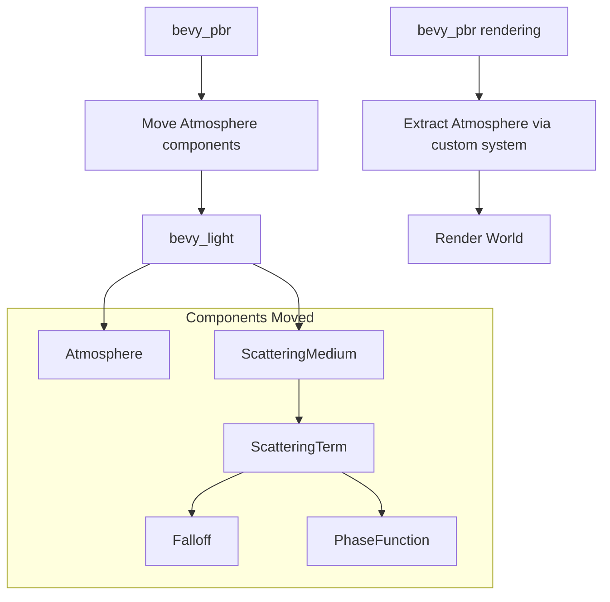

+++
title = "#22709 move Atmosphere to bevy_light"
date = "2026-01-27T00:00:00"
draft = false
template = "pull_request_page.html"
in_search_index = true

[taxonomies]
list_display = ["show"]

[extra]
current_language = "en"
available_languages = {"en" = { name = "English", url = "/pull_request/bevy/2026-01/pr-22709-en-20260127" }, "zh-cn" = { name = "中文", url = "/pull_request/bevy/2026-01/pr-22709-zh-cn-20260127" }}
labels = ["A-Rendering"]
+++

# Title: move Atmosphere to bevy_light

## Basic Information
- **Title**: move Atmosphere to bevy_light
- **PR Link**: https://github.com/bevyengine/bevy/pull/22709
- **Author**: atlv24
- **Status**: MERGED
- **Labels**: A-Rendering, S-Ready-For-Final-Review
- **Created**: 2026-01-26T00:31:22Z
- **Merged**: 2026-01-27T22:15:53Z
- **Merged By**: alice-i-cecile

## Description

# Objective

- Another day, another step towards scene description outside of render crates

## Solution

- Move Atmosphere to bevy_light.

## Testing

- atmosphere example looks good.

## The Story of This Pull Request

This PR is part of an ongoing architectural refactoring in the Bevy game engine to separate scene description components from rendering implementation details. The goal is to move scene-related types out of rendering crates and into more appropriate locations, making the engine's architecture cleaner and more maintainable.

The specific task here was to move the `Atmosphere` component and its related types from `bevy_pbr` (which handles physically-based rendering) to `bevy_light` (which contains lighting-related components). This makes architectural sense because atmospheric scattering is fundamentally a lighting effect that describes how light interacts with a planetary atmosphere.

The implementation required moving several interconnected components: the main `Atmosphere` struct, the `ScatteringMedium` asset, and supporting types like `ScatteringTerm`, `Falloff`, and `PhaseFunction`. These types define how light scatters through different atmospheric layers and are essential for creating realistic sky rendering.

One technical challenge emerged due to Rust's orphan rules. The `Atmosphere` type needed to implement the `ExtractComponent` trait (defined in `bevy_pbr`) for extraction to the render world. However, since `Atmosphere` was moved to `bevy_light`, we couldn't implement a trait from `bevy_pbr` on a type from `bevy_light`. The solution was to replace the trait implementation with a custom extraction system that manually extracts `Atmosphere` components during the render extraction phase.

The changes affect multiple parts of the codebase:
1. A new `atmosphere.rs` module was created in `bevy_light` containing all the moved types
2. The `bevy_pbr::medium` module was significantly reduced since most of its content moved
3. Import statements throughout the codebase were updated to reference the new location
4. Plugin initialization was adjusted to register the `ScatteringMedium` asset in `LightPlugin` instead of `ScatteringMediumPlugin`

This refactoring doesn't change the functionality but improves the code organization. Atmospheric scattering remains a complex system involving multiple scattering terms, falloff distributions, and phase functions that simulate how light interacts with atmospheric particles. The moved code includes physically-based defaults for Earth-like atmospheres with Rayleigh scattering (for gas molecules), Mie scattering (for aerosols), and ozone absorption layers.

The architectural benefit is that scene description components are now better separated from rendering implementation. This makes the codebase more modular and easier to maintain, and sets the stage for future improvements where scene description might be used by multiple rendering backends or for non-rendering purposes like physics simulations.

## Visual Representation



## Key Files Changed

### 1. `crates/bevy_light/src/atmosphere.rs` (+400/-0)
This is a new file containing all the atmosphere-related types moved from `bevy_pbr`. It includes the `Atmosphere` component, `ScatteringMedium` asset, and supporting enums and structs.

Key code snippets:
```rust
// The main Atmosphere component that enables atmospheric scattering
#[derive(Clone, Component)]
#[require(Hdr)]
pub struct Atmosphere {
    pub bottom_radius: f32,
    pub top_radius: f32,
    pub ground_albedo: Vec3,
    pub medium: Handle<ScatteringMedium>,
}

// The ScatteringMedium asset defining how light interacts with the atmosphere
#[derive(TypePath, Asset, Clone)]
pub struct ScatteringMedium {
    pub label: Option<Cow<'static, str>>,
    pub falloff_resolution: u32,
    pub phase_resolution: u32,
    pub terms: SmallVec<[ScatteringTerm; 1]>,
}

// Default Earth-like atmosphere configuration
impl ScatteringMedium {
    pub fn earthlike(falloff_resolution: u32, phase_resolution: u32) -> Self {
        Self::new(
            falloff_resolution,
            phase_resolution,
            [
                // Rayleigh scattering Term (atmospheric gases)
                ScatteringTerm {
                    absorption: Vec3::ZERO,
                    scattering: Vec3::new(5.802e-6, 13.558e-6, 33.100e-6),
                    falloff: Falloff::Exponential { scale: 8.0 / 60.0 },
                    phase: PhaseFunction::Rayleigh,
                },
                // Mie scattering Term (aerosols/dust)
                ScatteringTerm {
                    absorption: Vec3::splat(3.996e-6),
                    scattering: Vec3::splat(0.444e-6),
                    falloff: Falloff::Exponential { scale: 1.2 / 60.0 },
                    phase: PhaseFunction::Mie { asymmetry: 0.8 },
                },
                // Ozone absorption Term
                ScatteringTerm {
                    absorption: Vec3::new(0.650e-6, 1.881e-6, 0.085e-6),
                    scattering: Vec3::ZERO,
                    falloff: Falloff::Tent {
                        center: 0.75,
                        width: 0.3,
                    },
                    phase: PhaseFunction::Isotropic,
                },
            ],
        )
        .with_label("earthlike_atmosphere")
    }
}
```

### 2. `crates/bevy_pbr/src/medium.rs` (+4/-359)
This file was significantly reduced as most of its content moved to `bevy_light`. It now only contains the GPU representation of scattering media and the plugin setup.

Key changes:
```rust
// Before: Contained full ScatteringMedium, ScatteringTerm, Falloff, PhaseFunction definitions
// After: Only contains GpuScatteringMedium and plugin initialization

pub struct ScatteringMediumPlugin;

impl Plugin for ScatteringMediumPlugin {
    fn build(&self, app: &mut App) {
        // Removed: app.init_asset::<ScatteringMedium>()
        app.add_plugins(RenderAssetPlugin::<GpuScatteringMedium>::default());

        if let Some(render_app) = app.get_sub_app_mut(RenderApp) {
            render_app.add_systems(RenderStartup, init_scattering_medium_sampler);
        }
    }
}
```

### 3. `crates/bevy_pbr/src/atmosphere/mod.rs` (+32/-63)
Updated to handle the moved `Atmosphere` component with a custom extraction system instead of using the `ExtractComponent` trait.

Key changes:
```rust
// Replaced ExtractComponent implementation with custom extraction system
pub fn extract_atmosphere(
    mut commands: Commands,
    mut previous_len: Local<usize>,
    query: Extract<Query<(RenderEntity, &Atmosphere), With<Camera3d>>>,
) {
    let mut values = Vec::with_capacity(*previous_len);
    for (entity, item) in &query {
        values.push((
            entity,
            ExtractedAtmosphere {
                bottom_radius: item.bottom_radius,
                top_radius: item.top_radius,
                ground_albedo: item.ground_albedo,
                medium: item.medium.id(),
            },
        ));
    }
    *previous_len = values.len();
    commands.try_insert_batch(values);
}

// Updated plugin to use the custom extraction system
impl Plugin for AtmospherePlugin {
    fn build(&self, app: &mut App) {
        // ... other setup ...
        
        if let Some(render_app) = app.get_sub_app_mut(RenderApp) {
            render_app.add_systems(ExtractSchedule, extract_atmosphere);
        }
    }
}
```

### 4. `crates/bevy_light/src/lib.rs` (+7/-1)
Updated to include the new atmosphere module and register the `ScatteringMedium` asset.

```rust
// Added module declaration and re-export
pub mod atmosphere;
pub use atmosphere::Atmosphere;

// Updated LightPlugin to initialize ScatteringMedium asset
impl Plugin for LightPlugin {
    fn build(&self, app: &mut App) {
        // ... other initialization ...
        app.init_asset::<ScatteringMedium>();
        // ... rest of plugin setup ...
    }
}
```

### 5. `examples/3d/atmosphere.rs` (+4/-4)
Updated import statements to use the new location of `Atmosphere` and `ScatteringMedium`.

```rust
// Before:
use bevy::pbr::{Atmosphere, ScatteringMedium};

// After:
use bevy::light::{atmosphere::ScatteringMedium, Atmosphere};
```

## Further Reading

1. **Bevy Engine Architecture**: For understanding the separation between scene description and rendering systems in Bevy.
2. **Atmospheric Scattering Theory**: The "Physically Based Rendering" book has excellent sections on volume scattering and phase functions.
3. **Rust Orphan Rules**: Understanding Rust's coherence rules helps explain why the custom extraction system was necessary.
4. **Game Engine Design Patterns**: For insights into modular architecture and component organization in large codebases.
5. **Computer Graphics References**: For deeper understanding of Rayleigh and Mie scattering models used in the atmosphere system.