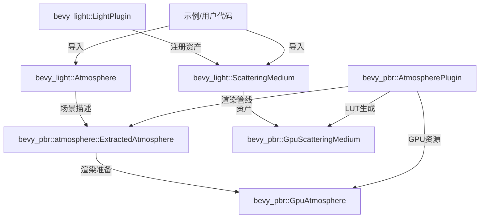

+++
title = "#22709 move Atmosphere to bevy_light"
date = "2026-01-27T00:00:00"
draft = false
template = "pull_request_page.html"
in_search_index = false

[extra]
current_language = "zh-cn"
available_languages = {"en" = { name = "English", url = "/pull_request/bevy/2026-01/pr-22709-en-20260127" }, "zh-cn" = { name = "中文", url = "/pull_request/bevy/2026-01/pr-22709-zh-cn-20260127" }}
+++

# 将 Atmosphere 移动到 bevy_light

## 基本信息
- **标题**: move Atmosphere to bevy_light
- **PR链接**: https://github.com/bevyengine/bevy/pull/22709
- **作者**: atlv24
- **状态**: 已合并
- **标签**: A-Rendering, S-Ready-For-Final-Review
- **创建时间**: 2026-01-26T00:31:22Z
- **合并时间**: 2026-01-27T22:15:53Z
- **合并者**: alice-i-cecile

## 描述翻译
# 目标

- 场景描述与渲染模块分离的又一步

## 解决方案

- 将Atmosphere移动到bevy_light。

## 测试

- atmosphere示例运行良好。

## 这个PR的技术分析

这个PR是Bevy引擎架构演进的一部分，核心目标是将场景描述相关的组件从渲染专用模块中分离出来。具体来说，它将大气散射（Atmosphere）系统从`bevy_pbr`模块迁移到`bevy_light`模块，这是实现"场景描述独立于渲染实现"这一长期架构目标的重要一步。

### 问题背景和架构考量

在原始的代码结构中，`Atmosphere`及其相关的散射介质（ScatteringMedium）类型都定义在`bevy_pbr`模块中。这种安排存在架构上的问题：大气散射本质上是一种光照效果，属于场景描述的一部分，而不应该与具体的PBR渲染实现紧密耦合。

从架构角度看，`bevy_pbr`应该专注于实现基于物理的渲染管线，而`bevy_light`应该负责管理所有与光照相关的场景描述组件。将`Atmosphere`移动到`bevy_light`可以：
1. 提高代码的模块化和可维护性
2. 减少渲染模块与场景描述之间的耦合
3. 为未来可能的其他渲染后端提供更好的抽象

### 实现方案和技术细节

PR采取了相对直接的迁移策略，但遇到了一些技术挑战需要解决：

1. **完整类型迁移**：将`Atmosphere`、`ScatteringMedium`、`ScatteringTerm`、`Falloff`、`PhaseFunction`等所有相关类型从`bevy_pbr::medium`模块完整迁移到新的`bevy_light::atmosphere`模块。

2. **孤儿规则（orphan rule）的处理**：由于`Atmosphere`现在定义在`bevy_light`中，而`ExtractComponent`trait需要在`bevy_pbr`中实现，这违反了Rust的孤儿规则（不能为外部类型实现外部trait）。解决方案是创建一个自定义的提取函数：

```rust
// crates/bevy_pbr/src/atmosphere/mod.rs
pub fn extract_atmosphere(
    mut commands: Commands,
    mut previous_len: Local<usize>,
    query: Extract<Query<(RenderEntity, &Atmosphere), With<Camera3d>>>,
) {
    let mut values = Vec::with_capacity(*previous_len);
    for (entity, item) in &query {
        values.push((
            entity,
            ExtractedAtmosphere {
                bottom_radius: item.bottom_radius,
                top_radius: item.top_radius,
                ground_albedo: item.ground_albedo,
                medium: item.medium.id(),
            },
        ));
    }
    *previous_len = values.len();
    commands.try_insert_batch(values);
}
```

这个函数手动执行了原本由`ExtractComponent`trait自动处理的组件提取工作，绕过了孤儿规则的限制。

3. **资产注册的重新定位**：`ScatteringMedium`资产现在由`bevy_light::LightPlugin`注册，而不是原来的`bevy_pbr::ScatteringMediumPlugin`：

```rust
// crates/bevy_light/src/lib.rs
impl Plugin for LightPlugin {
    fn build(&self, app: &mut App) {
        app.add_plugins((
            // ...
        ))
        .init_asset::<ScatteringMedium>()  // 资产注册移到这里
        .configure_sets(
            // ...
        );
    }
}
```

4. **依赖管理**：`bevy_light`现在需要`smallvec`依赖来支持`ScatteringMedium`中的术语列表：

```toml
# crates/bevy_light/Cargo.toml
smallvec = { version = "1", default-features = false }
```

### 代码组织的变化

迁移后的代码组织更加合理：

- **`bevy_light::atmosphere`**：包含所有大气散射的场景描述类型
  - `Atmosphere`：组件，附加到HDR相机上启用大气散射
  - `ScatteringMedium`：资产，描述介质的散射属性
  - `ScatteringTerm`、`Falloff`、`PhaseFunction`：辅助类型

- **`bevy_pbr::atmosphere`**：保留渲染相关的逻辑
  - `GpuAtmosphere`、`GpuScatteringMedium`：GPU表示
  - `AtmospherePlugin`：渲染插件
  - 提取和准备系统

这种分离遵循了"关注点分离"原则：`bevy_light`处理场景描述，`bevy_pbr`处理渲染实现。

### 技术实现细节

值得注意的是，虽然类型被迁移了，但渲染管线的核心算法没有变化。大气散射的计算仍然基于相同的物理模型：

```rust
// 大气散射的核心参数仍然保持相同
pub struct Atmosphere {
    pub bottom_radius: f32,    // 星球半径（单位：米）
    pub top_radius: f32,       // 大气顶部半径（单位：米）
    pub ground_albedo: Vec3,   // 地面反照率
    pub medium: Handle<ScatteringMedium>,  // 散射介质
}
```

地球大气预设也保持相同，使用物理准确的比例高度：
- Rayleigh（分子）散射：8公里比例高度
- Mie（气溶胶）散射：1.2公里比例高度

### 向后兼容性和迁移

这个PR包含了完整的迁移指南，指导用户如何更新他们的代码：

```rust
// 迁移前
use bevy::pbr::{Atmosphere, ScatteringMedium};

// 迁移后
use bevy::light::Atmosphere;
use bevy::light::atmosphere::ScatteringMedium;
```

示例文件`examples/3d/atmosphere.rs`也相应更新，确保所有导入路径正确。

## 可视化表示



## 关键文件变更

### 1. `crates/bevy_light/src/atmosphere.rs` (+400/-0)
**变化描述**：新文件，包含从`bevy_pbr`迁移过来的所有大气散射相关类型。

**关键代码片段**：
```rust
/// Enables atmospheric scattering for an HDR camera.
#[derive(Clone, Component)]
#[require(Hdr)]
pub struct Atmosphere {
    /// Radius of the planet
    ///
    /// units: m
    pub bottom_radius: f32,

    /// Radius at which we consider the atmosphere to 'end' for our
    /// calculations (from center of planet)
    ///
    /// units: m
    pub top_radius: f32,

    /// An approximation of the average albedo (or color, roughly) of the
    /// planet's surface. This is used when calculating multiscattering.
    ///
    /// units: N/A
    pub ground_albedo: Vec3,

    /// A handle to a [`ScatteringMedium`], which describes the substance
    /// of the atmosphere and how it scatters light.
    pub medium: Handle<ScatteringMedium>,
}
```

**与PR目标的关系**：这是迁移的核心，将场景描述类型从渲染模块分离出来。

### 2. `crates/bevy_pbr/src/medium.rs` (+4/-359)
**变化描述**：大幅删减，只保留GPU表示和渲染逻辑，移除类型定义。

**关键代码片段**：
```rust
// 迁移前：包含完整的ScatteringMedium、ScatteringTerm等类型定义
// 迁移后：只导入并使用这些类型
use bevy_light::atmosphere::{ScatteringMedium, ScatteringTerm};

// 只保留GpuScatteringMedium和渲染相关实现
pub struct GpuScatteringMedium {
    /// The terms of the scattering medium.
    pub terms: Vec<GpuScatteringTerm>,
    /// The precomputed LUT for the falloff distribution of each term.
    pub falloff_lut: Texture,
    /// The precomputed LUT for the phase function of each term.
    pub phase_lut: Texture,
}
```

**与PR目标的关系**：清理渲染模块，移除不属于渲染核心的场景描述类型。

### 3. `crates/bevy_pbr/src/atmosphere/mod.rs` (+32/-63)
**变化描述**：更新导入，添加自定义提取函数处理孤儿规则问题。

**关键代码片段**：
```rust
// 移除原本的ExtractComponent实现，改为自定义函数
pub fn extract_atmosphere(
    mut commands: Commands,
    mut previous_len: Local<usize>,
    query: Extract<Query<(RenderEntity, &Atmosphere), With<Camera3d>>>,
) {
    // 手动提取逻辑
}
```

**与PR目标的关系**：解决技术限制，确保渲染管线能访问迁移后的组件。

### 4. `crates/bevy_light/src/lib.rs` (+7/-1)
**变化描述**：导出新模块并注册资产。

**关键代码片段**：
```rust
pub mod atmosphere;
pub use atmosphere::Atmosphere;

// 在LightPlugin中
.init_asset::<ScatteringMedium>()
```

**与PR目标的关系**：将大气散射整合到光照模块的生态系统中。

### 5. `examples/3d/atmosphere.rs` (+4/-4)
**变化描述**：更新导入路径。

**关键代码片段**：
```rust
// 迁移前
use bevy::pbr::{Atmosphere, AtmosphereMode, AtmosphereSettings, ScatteringMedium};

// 迁移后  
use bevy::light::{atmosphere::ScatteringMedium, Atmosphere};
use bevy::pbr::{AtmosphereMode, AtmosphereSettings};
```

**与PR目标的关系**：确保示例代码正确工作，为用户提供迁移参考。

## 进一步阅读

1. **Bevy模块架构设计**：
   - [Bevy Engine Architecture](https://bevyengine.org/learn/quick-start/architecture/)
   - [Bevy's Module Structure](https://github.com/bevyengine/bevy/tree/main/crates)

2. **大气散射技术**：
   - [Physically Based Atmospheric Scattering](https://developer.nvidia.com/gpugems/gpugems2/part-ii-shading-lighting-and-shadows/chapter-16-accurate-atmospheric-scattering)
   - [Bruneton的Precomputed Atmospheric Scattering论文](https://hal.inria.fr/inria-00288758/document)

3. **Rust孤儿规则**：
   - [The Orphan Rules in Rust](https://doc.rust-lang.org/book/ch10-02-traits.html#implementing-a-trait-on-a-type)
   - [Rust Trait Coherence](https://rust-lang.github.io/chalk/book/coherence.html)

4. **游戏引擎中的场景描述与渲染分离**：
   - [Unity的ECS与渲染分离](https://unity.com/dots)
   - [Godot的渲染架构](https://docs.godotengine.org/en/stable/tutorials/rendering/rendering_introduction.html)