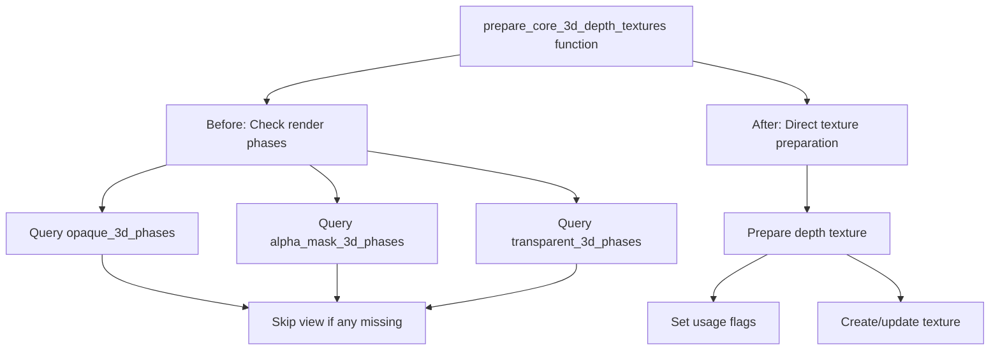

+++
title = "#22711 remove conditional that never runs"
date = "2026-01-27T00:00:00"
draft = false
template = "pull_request_page.html"
in_search_index = true

[taxonomies]
list_display = ["show"]

[extra]
current_language = "en"
available_languages = {"en" = { name = "English", url = "/pull_request/bevy/2026-01/pr-22711-en-20260127" }, "zh-cn" = { name = "中文", url = "/pull_request/bevy/2026-01/pr-22711-zh-cn-20260127" }}
labels = ["A-Rendering", "C-Code-Quality"]
+++

# Title

## Basic Information
- **Title**: remove conditional that never runs
- **PR Link**: https://github.com/bevyengine/bevy/pull/22711
- **Author**: atlv24
- **Status**: MERGED
- **Labels**: A-Rendering, C-Code-Quality, S-Ready-For-Final-Review
- **Created**: 2026-01-26T01:38:55Z
- **Merged**: 2026-01-27T07:55:25Z
- **Merged By**: alice-i-cecile

## Description Translation

# Objective

- this code doesn't run as far as i can tell, and doesn't seem to serve any purpose. custom render phases can't add themselves to this list, so if render phases must be here for some reason this is broken anyways for 3rd party users.

## Solution

- yeet and regression test for confidence

## Testing

- i ran bistro and a few other examples, gonna ask pixel smeagol now

## The Story of This Pull Request

This PR addresses a code quality issue in Bevy's 3D rendering pipeline. The developer identified a conditional check in the `prepare_core_3d_depth_textures` function that appeared to serve no practical purpose and potentially created confusion for third-party developers working with custom render phases.

The function in question is responsible for preparing depth textures for 3D rendering. Before the change, it performed a check to see if three specific render phase collections (`opaque_3d_phases`, `alpha_mask_3d_phases`, and `transparent_3d_phases`) contained entries for each view. If any of these were missing, the function would skip that view entirely. However, as the developer noted, this check effectively never runs because these render phases are always present for 3D views in Bevy's current implementation.

More importantly, the check created a misleading API constraint. The condition implied that views without these specific render phases shouldn't have depth textures prepared, but third-party developers can't add their custom render phases to these built-in collections. This meant the code was essentially enforcing a requirement that couldn't be met by custom render pipelines, creating confusion about whether such pipelines needed to provide these specific phases.

The implementation approach was straightforward: remove the unnecessary check and the associated parameters that were only used for that check. The changes are minimal but meaningful:

1. Removed the three `Res` parameters for the render phase collections
2. Removed the conditional check that used these parameters
3. Simplified the tuple destructuring in the query to remove the now-unused `ExtractedView` reference

The developer tested the change by running several examples including Bistro, ensuring no regression in rendering behavior. They also sought review from a rendering expert ("pixel smeagol") to confirm the change was safe.

This cleanup demonstrates good code hygiene practices. Removing dead code simplifies the codebase, reduces cognitive load for developers reading the function, and eliminates a potential source of confusion about API requirements. It also slightly improves performance by avoiding unnecessary hash map lookups, though this is likely negligible in practice.

From a technical perspective, this change highlights an important principle: code that appears to enforce requirements should actually be enforceable. If the requirement can't be satisfied by the API, it shouldn't be checked for. The original code created a false impression about what constraints existed in the system.

## Visual Representation



## Key Files Changed

### `crates/bevy_core_pipeline/src/core_3d/mod.rs` (+2/-13)

This file contains the core 3D rendering pipeline logic. The changes remove an unnecessary conditional check and clean up function parameters that were only used for that check.

**Key Changes:**

1. **Removed render phase parameters and conditional check**:

Before:
```rust
pub fn prepare_core_3d_depth_textures(
    mut commands: Commands,
    mut texture_cache: ResMut<TextureCache>,
    render_device: Res<RenderDevice>,
    opaque_3d_phases: Res<ViewBinnedRenderPhases<Opaque3d>>,
    alpha_mask_3d_phases: Res<ViewBinnedRenderPhases<AlphaMask3d>>,
    transparent_3d_phases: Res<ViewSortedRenderPhases<Transparent3d>>,
    views_3d: Query<(
        Entity,
        &ExtractedCamera,
        &ExtractedView,
        Option<&DepthPrepass>,
        &Camera3d,
        &Msaa,
    )>,
) {
    let mut render_target_usage = <HashMap<_, _>>::default();
    for (_, camera, extracted_view, depth_prepass, camera_3d, _msaa) in &views_3d {
        if !opaque_3d_phases.contains_key(&extracted_view.retained_view_entity)
            || !alpha_mask_3d_phases.contains_key(&extracted_view.retained_view_entity)
            || !transparent_3d_phases.contains_key(&extracted_view.retained_view_entity)
        {
            continue;
        };
```

After:
```rust
pub fn prepare_core_3d_depth_textures(
    mut commands: Commands,
    mut texture_cache: ResMut<TextureCache>,
    render_device: Res<RenderDevice>,
    views_3d: Query<(
        Entity,
        &ExtractedCamera,
        Option<&DepthPrepass>,
        &Camera3d,
        &Msaa,
    )>,
) {
    let mut render_target_usage = <HashMap<_, _>>::default();
    for (_, camera, depth_prepass, camera_3d, _msaa) in &views_3d {
```

2. **Simplified the second loop iteration**:

Before:
```rust
    for (entity, camera, _, _, camera_3d, msaa) in &views_3d {
```

After:
```rust
    for (entity, camera, _, camera_3d, msaa) in &views_3d {
```

The changes relate to the overall purpose by eliminating code that:
- Was effectively dead (the condition never triggered)
- Created misleading API constraints for third-party developers
- Added unnecessary complexity to the function signature and logic

## Further Reading

1. **Bevy Render Phases Documentation**: Understanding how render phases work in Bevy's rendering architecture
2. **ECS Systems and Queries**: How Bevy's Entity Component System handles system parameters and queries
3. **Code Quality Practices**: The importance of removing dead code and simplifying complex conditionals
4. **Rendering Pipeline Architecture**: How depth textures are managed in modern game engines
5. **Third-party Extension Patterns**: Best practices for designing extensible APIs in game engines