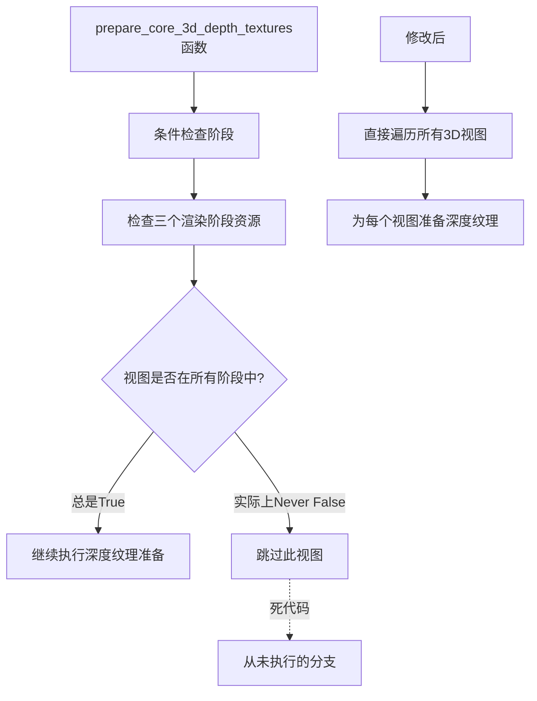

+++
title = "#22711 remove conditional that never runs"
date = "2026-01-27T00:00:00"
draft = false
template = "pull_request_page.html"
in_search_index = false

[extra]
current_language = "zh-cn"
available_languages = {"en" = { name = "English", url = "/pull_request/bevy/2026-01/pr-22711-en-20260127" }, "zh-cn" = { name = "中文", url = "/pull_request/bevy/2026-01/pr-22711-zh-cn-20260127" }}
+++

# Title

## 基本信息
- **标题**: remove conditional that never runs
- **PR链接**: https://github.com/bevyengine/bevy/pull/22711
- **作者**: atlv24
- **状态**: 已合并
- **标签**: A-Rendering, C-Code-Quality, S-Ready-For-Final-Review
- **创建时间**: 2026-01-26T01:38:55Z
- **合并时间**: 2026-01-27T07:55:25Z
- **合并者**: alice-i-cecile

## 描述翻译

# 目标
- 据我所知，这段代码从未运行过，而且似乎没有任何作用。自定义渲染阶段无法将自己添加到这个列表中，因此如果由于某种原因渲染阶段必须在这里，这对第三方用户来说就已经是损坏的。

## 解决方案
- 移除并进行回归测试以确认

## 测试
- 我运行了bistro和其他几个示例，现在请渲染专家检查一下

## 这个PR的故事

这个PR解决了一个看似微不足道但实际上是代码质量问题的bug：一段永远不会执行的冗余条件检查。在分析渲染管线的`prepare_core_3d_depth_textures`函数时，开发者发现了一段检查三个渲染阶段资源是否包含特定视图的条件代码。

问题的核心在于这段条件检查的逻辑是有缺陷的。在Bevy的架构中，`Opaque3d`、`AlphaMask3d`和`Transparent3d`这些渲染阶段是通过核心3D渲染图自动为所有3D视图添加的。这意味着对于一个有效的3D视图，这三个渲染阶段资源都必然包含对应的视图实体。因此，这个条件检查永远不会失败，代码也永远不会跳过循环。

更深入地看，这个条件检查不仅冗余，还可能造成混淆。如果有人想添加自定义的渲染阶段，他们无法通过常规方式将自己添加到这些核心的渲染阶段资源中。这意味着如果这个条件检查对于渲染深度纹理确实是必要的，那么第三方开发者根本无法使用这个功能。实际上，这种设计暴露了接口一致性问题。

开发者采用的解决方案很直接：删除这段永远不会执行的条件代码，并相应地调整函数参数。具体来说，他们：
1. 从函数参数中移除了三个不再需要的渲染阶段资源
2. 从查询中移除了`ExtractedView`组件，因为它只在被删除的条件检查中使用
3. 调整了循环结构，移除了条件检查和相关的continue语句

这个修改体现了良好的代码维护实践。删除死代码有几个好处：减少代码复杂度、提高可读性、减少维护负担，并且让新开发者更容易理解系统的工作原理。经过测试，bistro和其他示例都正常运行，确认了这个修改不会影响现有的渲染行为。

从技术角度来看，这个修复也符合最小化修改原则。开发者没有重新设计整个系统，而是精确地移除了无效的代码。这降低了引入新bug的风险，同时解决了实际问题。PR的标签"Code-Quality"准确地反映了它的性质：这是一个代码质量改进，而不是功能变更或性能优化。

## 视觉表示



## 主要文件更改

### `crates/bevy_core_pipeline/src/core_3d/mod.rs` (+2/-13)

这个文件包含了3D核心管线的实现。修改移除了`prepare_core_3d_depth_textures`函数中冗余的条件检查。

**关键修改：**
```rust
// 修改前：
pub fn prepare_core_3d_depth_textures(
    mut commands: Commands,
    mut texture_cache: ResMut<TextureCache>,
    render_device: Res<RenderDevice>,
    opaque_3d_phases: Res<ViewBinnedRenderPhases<Opaque3d>>,  // 不再需要的参数
    alpha_mask_3d_phases: Res<ViewBinnedRenderPhases<AlphaMask3d>>,  // 不再需要的参数
    transparent_3d_phases: Res<ViewSortedRenderPhases<Transparent3d>>,  // 不再需要的参数
    views_3d: Query<(
        Entity,
        &ExtractedCamera,
        &ExtractedView,  // 只在条件检查中使用
        Option<&DepthPrepass>,
        &Camera3d,
        &Msaa,
    )>,
) {
    let mut render_target_usage = <HashMap<_, _>>::default();
    for (_, camera, extracted_view, depth_prepass, camera_3d, _msaa) in &views_3d {
        // 冗余的条件检查 - 永远不会跳过
        if !opaque_3d_phases.contains_key(&extracted_view.retained_view_entity)
            || !alpha_mask_3d_phases.contains_key(&extracted_view.retained_view_entity)
            || !transparent_3d_phases.contains_key(&extracted_view.retained_view_entity)
        {
            continue;
        };
        
        // 实际的工作代码...

// 修改后：
pub fn prepare_core_3d_depth_textures(
    mut commands: Commands,
    mut texture_cache: ResMut<TextureCache>,
    render_device: Res<RenderDevice>,
    // 移除了三个渲染阶段资源参数
    views_3d: Query<(
        Entity,
        &ExtractedCamera,
        // 移除了ExtractedView，因为它不再被使用
        Option<&DepthPrepass>,
        &Camera3d,
        &Msaa,
    )>,
) {
    let mut render_target_usage = <HashMap<_, _>>::default();
    for (_, camera, depth_prepass, camera_3d, _msaa) in &views_3d {
        // 直接执行实际工作，没有冗余的条件检查
        
        // 实际的工作代码...
```

这些修改直接移除了死代码，简化了函数签名和实现，同时保持了功能的完整性。

## 进一步阅读

- [Bevy渲染阶段文档](https://docs.rs/bevy_render/latest/bevy_render/render_phase/index.html) - 理解Bevy中渲染阶段的工作原理
- [Bevy ECS查询系统](https://bevy-cheatbook.github.io/programming/queries.html) - 了解Query系统如何工作
- [代码质量：识别和移除死代码](https://refactoring.guru/smells/dead-code) - 关于死代码识别和处理的通用指南
- [Bevy 3D渲染管线架构](https://github.com/bevyengine/bevy/blob/main/crates/bevy_core_pipeline/src/core_3d/mod.rs) - 理解完整的3D渲染管线实现

# 完整代码差异

diff --git a/crates/bevy_core_pipeline/src/core_3d/mod.rs b/crates/bevy_core_pipeline/src/core_3d/mod.rs
index 64db62dec5ea4..46e2acaa0491e 100644
--- a/crates/bevy_core_pipeline/src/core_3d/mod.rs
+++ b/crates/bevy_core_pipeline/src/core_3d/mod.rs
@@ -690,27 +690,16 @@ pub fn prepare_core_3d_depth_textures(
     mut commands: Commands,
     mut texture_cache: ResMut<TextureCache>,
     render_device: Res<RenderDevice>,
-    opaque_3d_phases: Res<ViewBinnedRenderPhases<Opaque3d>>,
-    alpha_mask_3d_phases: Res<ViewBinnedRenderPhases<AlphaMask3d>>,
-    transparent_3d_phases: Res<ViewSortedRenderPhases<Transparent3d>>,
     views_3d: Query<(
         Entity,
         &ExtractedCamera,
-        &ExtractedView,
         Option<&DepthPrepass>,
         &Camera3d,
         &Msaa,
     )>,
 ) {
     let mut render_target_usage = <HashMap<_, _>>::default();
-    for (_, camera, extracted_view, depth_prepass, camera_3d, _msaa) in &views_3d {
-        if !opaque_3d_phases.contains_key(&extracted_view.retained_view_entity)
-            || !alpha_mask_3d_phases.contains_key(&extracted_view.retained_view_entity)
-            || !transparent_3d_phases.contains_key(&extracted_view.retained_view_entity)
-        {
-            continue;
-        };
-
+    for (_, camera, depth_prepass, camera_3d, _msaa) in &views_3d {
         // Default usage required to write to the depth texture
         let mut usage: TextureUsages = camera_3d.depth_texture_usages.into();
         if depth_prepass.is_some() {
@@ -724,7 +713,7 @@ pub fn prepare_core_3d_depth_textures(
     }
 
     let mut textures = <HashMap<_, _>>::default();
-    for (entity, camera, _, _, camera_3d, msaa) in &views_3d {
+    for (entity, camera, _, camera_3d, msaa) in &views_3d {
         let Some(physical_target_size) = camera.physical_target_size else {
             continue;
         };