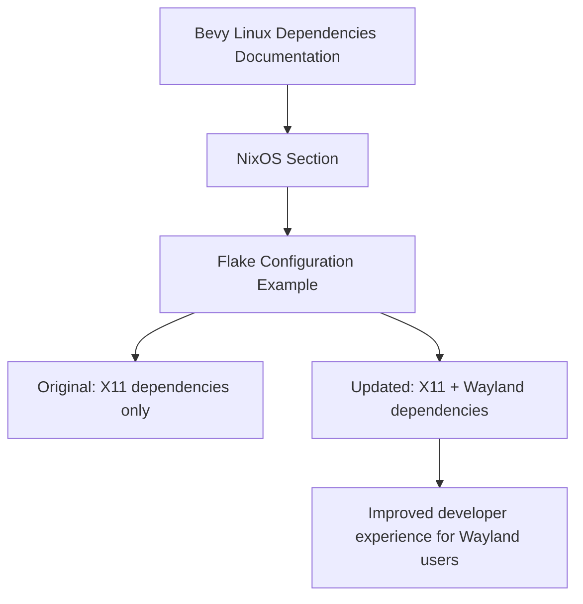

+++
title = "#22712 Update linux_dependencies.md NixOS Wayland Dependency"
date = "2026-01-26T00:00:00"
draft = false
template = "pull_request_page.html"
in_search_index = true

[taxonomies]
list_display = ["show"]

[extra]
current_language = "en"
available_languages = {"en" = { name = "English", url = "/pull_request/bevy/2026-01/pr-22712-en-20260126" }, "zh-cn" = { name = "中文", url = "/pull_request/bevy/2026-01/pr-22712-zh-cn-20260126" }}
labels = ["C-Docs", "O-Linux"]
+++

# Update linux_dependencies.md NixOS Wayland Dependency

## Basic Information
- **Title**: Update linux_dependencies.md NixOS Wayland Dependency
- **PR Link**: https://github.com/bevyengine/bevy/pull/22712
- **Author**: DefectiveDev
- **Status**: MERGED
- **Labels**: C-Docs, O-Linux, S-Ready-For-Final-Review
- **Created**: 2026-01-26T12:56:54Z
- **Merged**: 2026-01-26T18:48:03Z
- **Merged By**: james7132

## Description Translation
Added a line for Wayland NixOS users!

## The Story of This Pull Request

This pull request addresses a documentation gap in the Bevy game engine's Linux dependencies guide, specifically for NixOS users who work with Wayland display servers. The change is small but meaningful, representing the type of incremental improvements that make open-source projects more accessible to diverse development environments.

The problem was straightforward: when following the existing NixOS setup instructions, developers using Wayland would encounter missing dependencies when building or running Bevy applications. While X11 dependencies were correctly listed, the Wayland library was omitted. This oversight could lead to compilation errors or runtime issues for users on Wayland-based NixOS systems, requiring them to manually discover and add the missing dependency.

The solution approach was minimal and precise - simply add `wayland` to the list of native dependencies in the Nix flake configuration example. This follows the established pattern in the documentation where dependencies are explicitly listed in the Nix package specification. The developer recognized that both X11 and Wayland support are important for Linux graphics applications, and Bevy needs to accommodate both display server protocols.

Looking at the implementation, this is a one-line addition to a documentation file. The change occurs within a Nix flake configuration block where system dependencies are specified:

```nix
nativeBuildInputs = with pkgs; [
  # existing dependencies...
  wayland  # new addition
];
```

The placement of this addition is logical - it's added alongside other graphics-related libraries like `libxkbcommon` and the X11 libraries. This organization maintains consistency with how dependencies are grouped in the configuration.

From a technical perspective, this change reflects an important consideration for Linux graphics programming. Modern Linux desktop environments increasingly use Wayland as their display server protocol, while X11 remains widely used. Applications built with frameworks like Bevy need to support both, especially when using windowing libraries that abstract over these protocols (such as winit, which Bevy uses). The `wayland` package in NixOS provides the necessary client libraries for Wayland protocol communication.

The impact of this documentation update is practical rather than technical. It doesn't change Bevy's codebase but improves the developer experience for NixOS users. By ensuring the documentation accurately reflects the complete set of dependencies, the project reduces friction for developers setting up their environments. This type of documentation maintenance is particularly valuable for niche setups like NixOS, where dependency management differs significantly from more common Linux distributions.

This PR demonstrates how small, focused documentation improvements contribute to a project's overall quality. While the change itself is simple, it represents attention to detail and consideration for users across different Linux configurations. The merge happened quickly (within about 6 hours), indicating both the straightforward nature of the change and its alignment with project maintenance priorities.

## Visual Representation



## Key Files Changed

**File:** `docs/linux_dependencies.md` (+1/-0)

This is a documentation file that provides Linux distribution-specific dependency instructions for Bevy developers. The change adds the `wayland` package to the NixOS flake configuration example.

**Key modification:**
```nix
# File: docs/linux_dependencies.md
# Before:
            nativeBuildInputs = with pkgs; [
              clang
              mold
              pkg-config
              xorg.libX11
              xorg.libXrandr
              xorg.libXext
              xorg.libXcursor
              xorg.libXi
              xorg.libXcursor
              libxkbcommon
            ];

# After:
            nativeBuildInputs = with pkgs; [
              clang
              mold
              pkg-config
              xorg.libX11
              xorg.libXrandr
              xorg.libXext
              xorg.libXcursor
              xorg.libXi
              xorg.libXcursor
              libxkbcommon
              wayland
            ];
```

The change adds `wayland` to the list of `nativeBuildInputs` in the Nix flake configuration. This ensures NixOS users with Wayland display servers have the necessary libraries available when building Bevy applications.

## Further Reading

- [Wayland Protocol Documentation](https://wayland.freedesktop.org/) - Official documentation for the Wayland display server protocol
- [NixOS Manual: Declarative Package Management](https://nixos.org/manual/nixos/stable/#sec-declarative-package-management) - Guide to package management in NixOS
- [Bevy Engine: Getting Started on Linux](https://bevyengine.org/learn/book/getting-started/setup/#linux) - Official Bevy setup guide for Linux
- [winit: Cross-platform window creation and management](https://github.com/rust-windowing/winit) - The windowing library Bevy uses, which supports both X11 and Wayland
- [Nix Pills: Understanding Nix Language and Flakes](https://nixos.org/guides/nix-pills/) - Comprehensive guide to Nix package manager concepts

# Full Code Diff
```
diff --git a/docs/linux_dependencies.md b/docs/linux_dependencies.md
index 9050e7495f0ae..8be5db98e72c8 100644
--- a/docs/linux_dependencies.md
+++ b/docs/linux_dependencies.md
@@ -165,6 +165,7 @@ Add a `flake.nix` file to the root of your GitHub repository containing:
               xorg.libXi
               xorg.libXcursor
               libxkbcommon
+              wayland
             ];
           };
       }
```