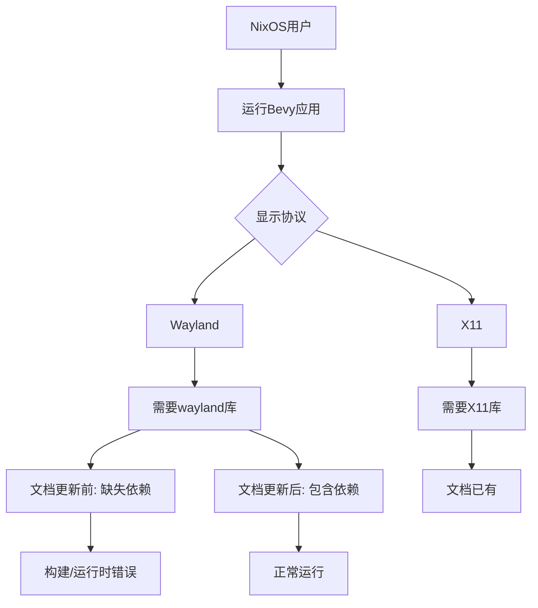

+++
title = "#22712 Update linux_dependencies.md NixOS Wayland Dependency"
date = "2026-01-26T00:00:00"
draft = false
template = "pull_request_page.html"
in_search_index = false

[extra]
current_language = "zh-cn"
available_languages = {"en" = { name = "English", url = "/pull_request/bevy/2026-01/pr-22712-en-20260126" }, "zh-cn" = { name = "中文", url = "/pull_request/bevy/2026-01/pr-22712-zh-cn-20260126" }}
+++

# Title
Update linux_dependencies.md NixOS Wayland Dependency

## Basic Information
- **Title**: Update linux_dependencies.md NixOS Wayland Dependency
- **PR Link**: https://github.com/bevyengine/bevy/pull/22712
- **作者**: DefectiveDev
- **状态**: 已合并
- **标签**: C-Docs, O-Linux, S-Ready-For-Final-Review
- **创建时间**: 2026-01-26T12:56:54Z
- **合并时间**: 2026-01-26T18:48:03Z
- **合并者**: james7132

## Description Translation
为使用Wayland的NixOS用户添加了一行依赖说明！

## The Story of This Pull Request

这是一个关于文档更新的简单PR，但背后反映了Bevy引擎在Linux平台上对多种显示协议的支持需求。PR #22712专门针对NixOS用户在Wayland环境下的依赖配置进行了文档补充。

**问题与背景**：在Linux系统中，图形应用需要与显示服务器（display server）通信。传统上主要使用X11（X Window System），而现代Linux桌面环境逐渐转向Wayland协议。NixOS是一个独特的Linux发行版，采用声明式配置和可复现的包管理方式。Bevy作为跨平台游戏引擎，需要确保在不同Linux环境和显示协议下都能正常工作。

问题的核心在于文档不完整。现有的`linux_dependencies.md`文件已经为NixOS用户提供了依赖配置示例，但只包含了X11相关的库，缺少了Wayland支持所需的依赖。当NixOS用户使用Wayland协议运行Bevy应用时，可能会遇到链接错误或运行时问题，因为缺少必要的Wayland客户端库。

**解决方案方法**：这个PR采用了最直接的解决方案——在现有的NixOS配置示例中添加缺失的依赖。由于NixOS使用Nix包管理器，开发者只需要在`flake.nix`文件的`buildInputs`列表中添加`wayland`包即可。这种方式既保持了向后兼容性（X11用户不受影响），又为Wayland用户提供了完整的支持。

**实现细节**：PR的修改非常简单，只涉及一个文件的单行添加。在`docs/linux_dependencies.md`文件的NixOS章节中，开发者需要在现有的依赖列表中加入`wayland`包。修改后的配置确保Bevy应用在Wayland环境下能够正确链接和使用Wayland协议相关的功能。

```nix
buildInputs = [
    # ... 其他依赖
    wayland  # 新增的Wayland依赖
];
```

这个修改遵循了NixOS的配置惯例，将Wayland作为一个普通的系统依赖添加到构建输入中。值得注意的是，Wayland和X11可以共存，因此即使系统同时支持两种协议，这个添加也不会产生冲突。

**技术洞察**：从技术角度看，Wayland协议需要客户端库（`libwayland-client`）来与Wayland合成器（compositor）通信。在大多数Linux发行版中，这个库通常作为`wayland`或`libwayland`包提供。NixOS的包命名遵循类似约定，使用`wayland`作为包名称。

Bevy的图形后端（如winit）会根据运行时环境自动选择合适的显示协议。在支持Wayland的系统上，应用会优先使用Wayland协议，除非显式禁用。因此，提供Wayland依赖对于确保Bevy应用在现代Linux桌面环境上正常运行至关重要。

**影响**：这个PR虽然修改量很小，但对NixOS用户的使用体验有实际影响。完整的文档能帮助开发者更快地设置开发环境，避免因缺少依赖导致的构建失败或运行时问题。这也体现了开源项目文档维护的重要性——即使是很小的疏漏，也可能给特定用户群体带来困扰。

从工程角度看，这个PR展示了良好的维护实践：及时识别文档缺口，提供精确的最小化修复，并保持与现有配置模式的一致性。对于使用Wayland的NixOS开发者来说，这个简单的修改意味着他们可以按照文档一次性正确配置所有依赖，而不需要额外搜索或调试。

## Visual Representation



## Key Files Changed

### `docs/linux_dependencies.md` (+1/-0)
这是一个文档文件，列出了在Linux各发行版上运行Bevy所需的依赖。

**修改内容**：在NixOS章节的示例配置中，向`buildInputs`列表添加了`wayland`依赖。

**代码对比**：
```nix
# 修改前：
buildInputs = [
    # ... 其他依赖
    xorg.libXi
    xorg.libXcursor
    libxkbcommon
];

# 修改后：
buildInputs = [
    # ... 其他依赖
    xorg.libXi
    xorg.libXcursor
    libxkbcommon
    wayland  # 新增
];
```

**与PR目标的关系**：这个修改直接解决了问题——为NixOS上的Wayland用户提供完整的依赖文档。修改后的配置示例现在包含了Bevy在Wayland环境下运行所需的所有必要库。

## Further Reading

1. **Wayland协议**：
   - [Wayland官方文档](https://wayland.freedesktop.org/)
   - [Wayland架构介绍](https://wayland.freedesktop.org/architecture.html)

2. **NixOS和Nix包管理器**：
   - [NixOS官方手册](https://nixos.org/manual/nixos/stable/)
   - [Nix语言基础](https://nixos.org/guides/nix-language.html)

3. **Bevy的跨平台支持**：
   - [Bevy官方文档：跨平台开发](https://bevyengine.org/learn/book/getting-started/setup/#cross-platform)
   - [Bevy在GitHub上的Linux支持问题](https://github.com/bevyengine/bevy/issues?q=is%3Aissue+label%3AA-Linux)

4. **Linux图形栈**：
   - [X11 vs Wayland比较](https://www.howtogeek.com/771207/x11-vs-wayland-whats-the-difference/)
   - [现代Linux图形栈概述](https://blogs.gnome.org/uraeus/2022/01/26/on-the-road-to-fedora-workstation-36/)

5. **游戏引擎的显示后端集成**：
   - [winit库（Bevy使用的窗口管理库）](https://github.com/rust-windowing/winit)
   - [Rust中的跨平台图形开发](https://rust-gamedev.github.io/2021/12/14/graphics-ecosystem.html)

# Full Code Diff
diff --git a/docs/linux_dependencies.md b/docs/linux_dependencies.md
index 9050e7495f0ae..8be5db98e72c8 100644
--- a/docs/linux_dependencies.md
+++ b/docs/linux_dependencies.md
@@ -165,6 +165,7 @@ Add a `flake.nix` file to the root of your GitHub repository containing:
               xorg.libXi
               xorg.libXcursor
               libxkbcommon
+              wayland
             ];
           };
       }