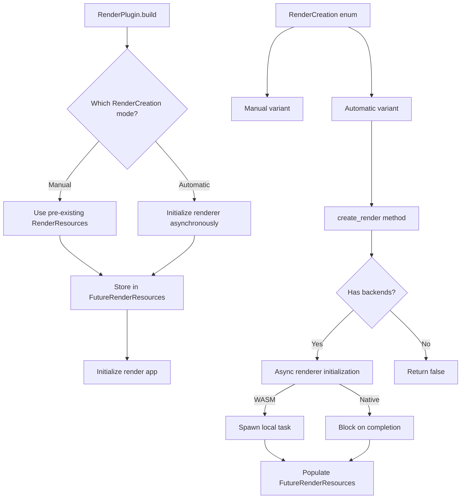

+++
title = "#22714 RenderCreation refactor"
date = "2026-01-29T00:00:00"
draft = false
template = "pull_request_page.html"
in_search_index = true

[taxonomies]
list_display = ["show"]

[extra]
current_language = "en"
available_languages = {"en" = { name = "English", url = "/pull_request/bevy/2026-01/pr-22714-en-20260129" }, "zh-cn" = { name = "中文", url = "/pull_request/bevy/2026-01/pr-22714-zh-cn-20260129" }}
labels = ["A-Rendering", "C-Code-Quality", "D-Modest"]
+++

# Title
RenderCreation refactor

## Basic Information
- **Title**: RenderCreation refactor
- **PR Link**: https://github.com/bevyengine/bevy/pull/22714
- **Author**: atlv24
- **Status**: MERGED
- **Labels**: A-Rendering, C-Code-Quality, S-Ready-For-Final-Review, D-Modest
- **Created**: 2026-01-26T14:56:49Z
- **Merged**: 2026-01-29T22:50:29Z
- **Merged By**: mockersf

## Description Translation
**Objective**
- work towards renderer recovery

**Solution**
- make render creation reusable
- document weird stuff thats going

**Testing**
- ci

note: reviewing by commit is easier. when a big block moves its just a copy paste, the minor tweaks are separated into other commits

## The Story of This Pull Request

This pull request refactors the render creation logic in Bevy's renderer to improve code organization and prepare for renderer recovery scenarios. The main goal was to extract the complex render initialization logic into a reusable method and clean up the implementation while maintaining the same functionality.

The problem centered around the `RenderPlugin::build` method, which contained a substantial amount of inline logic for handling two different render creation modes: manual and automatic. This code was difficult to reuse and made the plugin's build method overly complex. The automatic creation path involved asynchronous renderer initialization with different behavior for WebAssembly vs native targets, while the manual path simply used pre-created resources.

The developer took a straightforward approach by moving the render creation logic into a new `create_render` method on the `RenderCreation` enum. This extraction follows standard refactoring practices where complex conditional logic is moved to dedicated methods on the types that control that logic. The solution maintains all existing functionality while making the code more modular and easier to understand.

Looking at the implementation, the key change was extracting 50+ lines of render initialization code from `RenderPlugin::build` and moving it to `RenderCreation::create_render`. This method now handles both creation modes and returns a boolean indicating whether creation was successful. The signature includes parameters for the future resources container, primary window handle, and Vulkan initialization settings (when the feature is enabled).

An important aspect of this refactor is how it handles the `FutureRenderResources` type. This resource acts as a synchronization point between the main thread and potential asynchronous render initialization. The PR makes this type `pub(crate)` and adds `Default` and `Clone` derives, which simplifies its usage. The `MainWorld` type also benefits from using the `Deref` and `DerefMut` derives from `bevy_derive` instead of manual implementations, reducing boilerplate code.

The `RenderPlugin::ready` method received significant documentation improvements. The original implementation had complex logic for checking if render resources were ready, but the reasoning behind this logic wasn't clearly documented. The PR adds a detailed comment explaining the synchronization behavior: `FutureRenderResources` is added in `build` before `ready` runs, and the lock behavior indicates whether resources are being populated or are already available. This documentation is crucial because the pattern of checking a mutex-protected option is non-obvious and could lead to bugs if misunderstood.

From an architectural perspective, this refactor improves separation of concerns. The `RenderCreation` enum now encapsulates all logic related to creating render resources, while `RenderPlugin` focuses on coordinating plugin initialization. This makes the codebase easier to maintain and sets the stage for future renderer recovery features where render resources might need to be recreated at runtime.

The changes also include minor improvements like using `renderer::` prefix consistently instead of `crate::renderer::` in type paths, which improves code readability. The conditional compilation for the `raw_vulkan_init` feature is also cleaned up in the `RenderResources` tuple struct definition.

Overall, this PR demonstrates effective incremental refactoring: extracting complex logic into dedicated methods, improving documentation for tricky synchronization patterns, and standardizing type implementations with derive macros. While the functional behavior remains unchanged, the code quality improvements make the render initialization system more maintainable and better documented for future development.

## Visual Representation



## Key Files Changed

### `crates/bevy_render/src/lib.rs` (+38/-77)

**What changed**: This file contains the main refactoring of the `RenderPlugin` to use the new `create_render` method and improvements to the `MainWorld` and `FutureRenderResources` types.

**Key modifications**:
1. `MainWorld` now uses derive macros for `Deref` and `DerefMut` instead of manual implementations:
```rust
// Before:
#[derive(Resource, Default)]
pub struct MainWorld(World);

impl Deref for MainWorld {
    type Target = World;
    fn deref(&self) -> &Self::Target { &self.0 }
}

impl DerefMut for MainWorld {
    fn deref_mut(&mut self) -> &mut Self::Target { &mut self.0 }
}

// After:
#[derive(Resource, Default, Deref, DerefMut)]
pub struct MainWorld(World);
```

2. `FutureRenderResources` is now `pub(crate)` with additional derives:
```rust
// Before:
#[derive(Resource)]
struct FutureRenderResources(Arc<Mutex<Option<RenderResources>>>);

// After:
#[derive(Resource, Default, Clone, Deref)]
pub(crate) struct FutureRenderResources(Arc<Mutex<Option<RenderResources>>>);
```

3. Simplified `RenderPlugin::build` method that delegates to `RenderCreation::create_render`:
```rust
let future_resources = FutureRenderResources::default();
if self.render_creation.create_render(
    future_resources.clone(),
    primary_window,
    #[cfg(feature = "raw_vulkan_init")]
    raw_vulkan_init_settings,
) {
    // Note that `future_resources` is not necessarily populated here yet.
    app.insert_resource(future_resources);
    // SAFETY: Plugins should be set up on the main thread.
    unsafe { initialize_render_app(app) };
};
```

4. Improved documentation in `RenderPlugin::ready`:
```rust
// Added detailed comment explaining the synchronization logic:
// This is a little tricky. `FutureRenderResources` is added in `build`, which runs synchronously before `ready`.
// It is only added if there is a wgpu backend and thus the renderer can be created.
// Hence, if we try and get the resource and it is not present, that means we are ready, because we dont need it.
// On the other hand, if the resource is present, then we try and lock on it. The lock can fail, in which case
// we currently can assume that means the `FutureRenderResources` is in the act of being populated, because
// that is the only other place the lock may be held. If it is being populated, we can assume we're ready. This
// happens via the `and_then` falling through to the same `unwrap_or(true)` case as when there's no resource.
// If the lock succeeds, we can straightforwardly check if it is populated. If it is not, then we're not ready.
```

### `crates/bevy_render/src/settings.rs` (+55/-5)

**What changed**: This file adds the new `create_render` method to the `RenderCreation` enum and cleans up some type references.

**Key modifications**:
1. Added the `create_render` method to handle both manual and automatic render creation:
```rust
pub(crate) fn create_render(
    &self,
    future_resources: FutureRenderResources,
    primary_window: Option<RawHandleWrapperHolder>,
    #[cfg(feature = "raw_vulkan_init")]
    raw_vulkan_init_settings: renderer::raw_vulkan_init::RawVulkanInitSettings,
) -> bool {
    match self {
        RenderCreation::Manual(resources) => {
            *future_resources.lock().unwrap() = Some(resources.clone());
        }
        RenderCreation::Automatic(render_creation) => {
            let Some(backends) = render_creation.backends else {
                return false;
            };
            let settings = render_creation.clone();

            let async_renderer = async move {
                let render_resources = renderer::initialize_renderer(
                    backends,
                    primary_window,
                    &settings,
                    #[cfg(feature = "raw_vulkan_init")]
                    raw_vulkan_init_settings,
                )
                .await;

                *future_resources.lock().unwrap() = Some(render_resources);
            };

            // In wasm, spawn a task and detach it for execution
            #[cfg(target_arch = "wasm32")]
            bevy_tasks::IoTaskPool::get()
                .spawn_local(async_renderer)
                .detach();
            // Otherwise, just block for it to complete
            #[cfg(not(target_arch = "wasm32"))]
            bevy_tasks::block_on(async_renderer);
        }
    }
    true
}
```

2. Cleaned up type references in `RenderResources` tuple struct:
```rust
// Before:
#[cfg(feature = "raw_vulkan_init")]
pub  crate::renderer::raw_vulkan_init::AdditionalVulkanFeatures,

// After:
#[cfg(feature = "raw_vulkan_init")] pub renderer::raw_vulkan_init::AdditionalVulkanFeatures,
```

## Further Reading

1. **Bevy's Renderer Architecture**: For understanding how Bevy's renderer works, check the [Bevy Render Book](https://bevy-cheatbook.github.io/programming/render.html)
2. **wgpu and Async Rendering**: The [wgpu documentation](https://wgpu.rs/) provides details on the graphics abstraction layer used by Bevy
3. **Rust Synchronization Patterns**: The [Rust Book chapter on concurrency](https://doc.rust-lang.org/book/ch16-00-concurrency.html) covers Arc, Mutex, and other synchronization primitives used in this PR
4. **Bevy Plugin System**: The [Bevy Plugin guide](https://bevy-cheatbook.github.io/programming/plugins.html) explains how plugins like `RenderPlugin` work
5. **Refactoring Techniques**: Martin Fowler's [Refactoring: Improving the Design of Existing Code](https://refactoring.com/) provides general principles for code restructuring