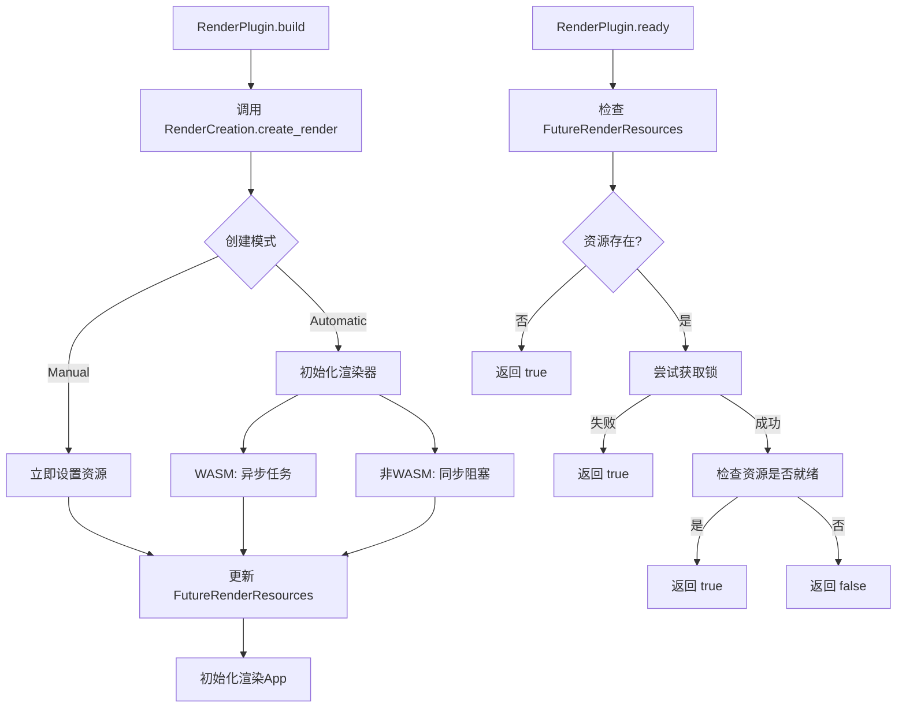

+++
title = "#22714 RenderCreation refactor"
date = "2026-01-29T00:00:00"
draft = false
template = "pull_request_page.html"
in_search_index = false

[extra]
current_language = "zh-cn"
available_languages = {"en" = { name = "English", url = "/pull_request/bevy/2026-01/pr-22714-en-20260129" }, "zh-cn" = { name = "中文", url = "/pull_request/bevy/2026-01/pr-22714-zh-cn-20260129" }}
labels = ["A-Rendering", "C-Code-Quality", "D-Modest"]
+++

# Title
RenderCreation refactor

## Basic Information
- **Title**: RenderCreation refactor
- **PR Link**: https://github.com/bevyengine/bevy/pull/22714
- **Author**: atlv24
- **Status**: MERGED
- **Labels**: A-Rendering, C-Code-Quality, S-Ready-For-Final-Review, D-Modest
- **Created**: 2026-01-26T14:56:49Z
- **Merged**: 2026-01-29T22:50:29Z
- **Merged By**: mockersf

## Description Translation
### 目标
- 为渲染器恢复做准备

### 解决方案
- 使渲染创建可重用
- 记录正在进行的奇怪行为

### 测试
- CI

注意：按提交审查更容易。当大块代码移动时，只是复制粘贴，小的调整被分成其他提交。

## The Story of This Pull Request

这个PR的核心是对Bevy渲染系统的初始化逻辑进行重构，目标是使渲染器创建过程更加模块化和可重用，为未来的"渲染器恢复"功能奠定基础。在深入代码细节之前，我们先理解这个重构解决的实际问题。

在原始代码中，`RenderPlugin`的`build`方法包含大量渲染器初始化的逻辑，这些逻辑根据`RenderCreation`配置（手动或自动模式）分散在两个分支中。手动模式直接使用提供的渲染资源，而自动模式则异步或同步地初始化渲染器。这种实现方式有几个问题：代码重复、初始化逻辑与插件绑定过紧、难以理解渲染器就绪状态的检查逻辑。

开发者采取的方法是将渲染创建逻辑从`RenderPlugin`中提取出来，封装到`RenderCreation`结构体的一个新方法`create_render`中。这使得渲染初始化成为一个独立的、可重用的单元。PR作者特别提到要"记录奇怪的行为"，这体现在对`RenderPlugin::ready`方法添加的详细注释中，解释了为什么资源存在性检查和锁定操作是正确且必要的。

实现过程采用了逐步重构的方式。首先，通过使用`bevy_derive`的`Deref`和`DerefMut`派生宏简化了`MainWorld`和`FutureRenderResources`的类型定义。然后，将复杂的初始化逻辑从`RenderPlugin::build`移动到`RenderCreation::create_render`。这个新方法统一处理手动和自动两种创建模式，接收必要的参数并操作`FutureRenderResources`来存储结果。

一个关键的技术细节是处理跨平台的异步初始化。在WASM平台上，渲染器初始化需要异步执行，而在其他平台上则可以同步阻塞等待。重构后的代码保持了这种区别，但逻辑现在更加清晰集中。

`RenderPlugin::ready`方法的逻辑也得到了澄清。它需要检查渲染资源是否已经就绪，但这个过程需要考虑多种情况：资源可能不存在（不需要渲染器）、资源存在但锁被持有（正在初始化）、或者资源已完全就绪。新增的注释详细解释了这些边界情况。

从架构角度看，这个重构将关注点分离得更好。`RenderPlugin`现在主要关注插件生命周期管理，而具体的渲染器创建逻辑由`RenderCreation`负责。这种分离使得代码更容易测试和维护，也为将来实现渲染器恢复功能提供了基础——恢复过程很可能需要重新调用类似的初始化逻辑。

## Visual Representation



## Key Files Changed

### 1. `crates/bevy_render/src/lib.rs` (+38/-77)
这个文件包含了渲染模块的主要结构和`RenderPlugin`的实现。

**主要变更：**
- 使用`Deref`/`DerefMut`派生宏简化了`MainWorld`和`FutureRenderResources`的实现
- 重构了`RenderPlugin::build`方法，将渲染创建逻辑委托给`RenderCreation::create_render`
- 增强了`RenderPlugin::ready`方法的文档，解释了复杂的就绪检查逻辑

**代码片段示例：**

```rust
// Before: 手动实现 Deref 和 DerefMut
impl Deref for MainWorld {
    type Target = World;

    fn deref(&self) -> &Self::Target {
        &self.0
    }
}

impl DerefMut for MainWorld {
    fn deref_mut(&mut self) -> &mut Self::Target {
        &mut self.0
    }
}

// After: 使用派生宏
#[derive(Resource, Default, Deref, DerefMut)]
pub struct MainWorld(World);

// Before: 复杂的渲染创建逻辑分散在多个分支
match &self.render_creation {
    RenderCreation::Manual(resources) => {
        // 手动模式的处理逻辑
    }
    RenderCreation::Automatic(render_creation) => {
        // 自动模式的处理逻辑，包含大量异步/同步初始化代码
    }
}

// After: 统一的创建调用
let future_resources = FutureRenderResources::default();
if self.render_creation.create_render(
    future_resources.clone(),
    primary_window,
    #[cfg(feature = "raw_vulkan_init")]
    raw_vulkan_init_settings,
) {
    app.insert_resource(future_resources);
    unsafe { initialize_render_app(app) };
};
```

### 2. `crates/bevy_render/src/settings.rs` (+55/-5)
这个文件定义了渲染设置和`RenderCreation`枚举。

**主要变更：**
- 添加了`create_render`方法到`RenderCreation`枚举
- 统一了手动和自动模式的渲染创建逻辑
- 保持了平台特定的异步/同步初始化行为

**代码片段示例：**

```rust
pub(crate) fn create_render(
    &self,
    future_resources: FutureRenderResources,
    primary_window: Option<RawHandleWrapperHolder>,
    #[cfg(feature = "raw_vulkan_init")]
    raw_vulkan_init_settings: renderer::raw_vulkan_init::RawVulkanInitSettings,
) -> bool {
    match self {
        RenderCreation::Manual(resources) => {
            *future_resources.lock().unwrap() = Some(resources.clone());
        }
        RenderCreation::Automatic(render_creation) => {
            let Some(backends) = render_creation.backends else {
                return false;
            };
            let settings = render_creation.clone();

            let async_renderer = async move {
                let render_resources = renderer::initialize_renderer(
                    backends,
                    primary_window,
                    &settings,
                    #[cfg(feature = "raw_vulkan_init")]
                    raw_vulkan_init_settings,
                )
                .await;

                *future_resources.lock().unwrap() = Some(render_resources);
            };

            // 平台特定的执行方式
            #[cfg(target_arch = "wasm32")]
            bevy_tasks::IoTaskPool::get()
                .spawn_local(async_renderer)
                .detach();
            #[cfg(not(target_arch = "wasm32"))]
            bevy_tasks::block_on(async_renderer);
        }
    }
    true
}
```

## Further Reading

1. **Bevy渲染架构文档** - 了解Bevy渲染系统的整体设计
2. **wgpu异步初始化模式** - 理解底层图形API的异步初始化机制
3. **Rust的Arc和Mutex模式** - 掌握多线程环境下的资源共享和同步
4. **Bevy插件系统** - 理解Bevy的插件生命周期和资源管理
5. **条件编译在跨平台开发中的应用** - 学习如何使用`#[cfg]`属性处理平台差异