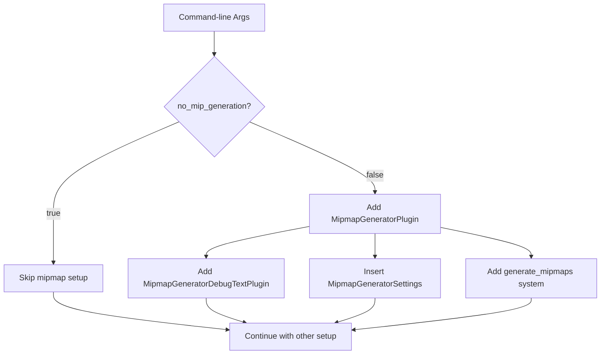

+++
title = "#22720 Add option to turn of mip generation in bistro"
date = "2026-01-27T00:00:00"
draft = false
template = "pull_request_page.html"
in_search_index = true

[taxonomies]
list_display = ["show"]

[extra]
current_language = "en"
available_languages = {"en" = { name = "English", url = "/pull_request/bevy/2026-01/pr-22720-en-20260127" }, "zh-cn" = { name = "中文", url = "/pull_request/bevy/2026-01/pr-22720-zh-cn-20260127" }}
labels = ["A-Rendering"]
+++

# Title
Add option to turn of mip generation in bistro

## Basic Information
- **Title**: Add option to turn of mip generation in bistro
- **PR Link**: https://github.com/bevyengine/bevy/pull/22720
- **Author**: atlv24
- **Status**: MERGED
- **Labels**: A-Rendering, S-Ready-For-Final-Review
- **Created**: 2026-01-27T08:31:34Z
- **Merged**: 2026-01-27T19:36:06Z
- **Merged By**: alice-i-cecile

## Description Translation

# Objective

- mips use vram

## Solution

- option to not mip

## Testing

- run it

## The Story of This Pull Request

This PR addresses a straightforward but important optimization concern in the Bevy bistro example. The problem is that mipmap generation consumes VRAM, and for users who don't need mipmaps or want to minimize memory usage, there should be a way to disable this feature. The bistro example is a large scene that demonstrates Bevy's rendering capabilities, and the mipmap generation for its textures can be resource-intensive.

The solution implemented here is pragmatic and follows established patterns in the codebase. The developer added a new command-line argument `--no-mip-generation` that conditionally disables mipmap generation. This approach gives users control over this resource consumption without affecting the default behavior of the example.

From an architectural perspective, the implementation is clean. Instead of having the mipmap generation plugins and systems always active, they are now conditionally added based on the command-line flag. This is more efficient than having the systems run and then skip processing based on a flag at runtime.

The key insight here is recognizing that mipmap generation in large scenes involves two main components: the plugins that provide the functionality (`MipmapGeneratorPlugin` and `MipmapGeneratorDebugTextPlugin`), the configuration resource (`MipmapGeneratorSettings`), and the system that processes the materials (`generate_mipmaps::<StandardMaterial>`). All of these need to be disabled together for the feature to be fully turned off.

The implementation shows good understanding of Bevy's ECS architecture. The mipmap generation system operates on `StandardMaterial` components, and by conditionally adding this system only when mipmap generation is enabled, we avoid unnecessary system execution overhead. This is particularly important for the bistro example which handles a large number of entities.

There's also consideration for the user experience. The PR preserves the existing command-line options while adding the new one, maintaining backward compatibility. Users who don't specify the flag will continue to get mipmaps generated as before.

One technical nuance worth noting is that the mipmap generation was previously part of a chain of systems in the `Update` schedule. The PR restructures this by moving the mipmap generation system into the conditional block and keeping the other systems in the main chain. This maintains the same execution order for the non-mipmap systems while properly isolating the mipmap generation functionality.

The impact of this change is primarily on performance and resource usage. For users running the bistro example on hardware with limited VRAM, or for those who want faster startup times, disabling mipmap generation provides a tangible benefit. The trade-off is potentially lower visual quality at distance, but this is acceptable for a configuration option in an example.

From an engineering perspective, this PR demonstrates good practice in feature flag implementation. The conditional logic is cleanly separated from the main application setup, making the code easier to understand and maintain. The pattern of conditionally adding plugins and systems based on configuration is a common and effective approach in Bevy applications.

## Visual Representation



## Key Files Changed

### `examples/large_scenes/bistro/src/main.rs` (+23/-24)

This is the only file modified in the PR. The changes add a new command-line option to disable mipmap generation and conditionally set up the mipmap generation systems based on this option.

**Key modifications:**

1. **Added the command-line argument option:**

```rust
// After (new code added):
pub struct Args {
    // ... existing fields ...
    
    /// disable mip map generation.
    #[argh(switch)]
    no_mip_generation: bool,
}
```

2. **Restructured the application setup to conditionally add mipmap generation:**

```rust
// Before (mipmap setup was unconditional):
app.insert_resource(MipmapGeneratorSettings {
    // ... settings ...
})
.add_plugins((MipmapGeneratorPlugin, MipmapGeneratorDebugTextPlugin))
.add_systems(
    Update,
    (
        generate_mipmaps::<StandardMaterial>,
        input,
        run_animation,
        spin,
        frame_time_system,
        benchmark,
    )
        .chain(),
);

// After (mipmap setup is conditional):
// Note: The MipmapGeneratorSettings, MipmapGeneratorPlugin, 
// MipmapGeneratorDebugTextPlugin, and generate_mipmaps system
// are now only added when !args.no_mip_generation

if !args.no_mip_generation {
    app.add_plugins((MipmapGeneratorPlugin, MipmapGeneratorDebugTextPlugin))
        .insert_resource(MipmapGeneratorSettings {
            // ... settings ...
        })
        .add_systems(Update, generate_mipmaps::<StandardMaterial>);
}
```

3. **Updated the system chain to exclude the mipmap generation system when disabled:**

```rust
// Before (generate_mipmaps was in the chain):
.add_systems(
    Update,
    (
        generate_mipmaps::<StandardMaterial>,
        input,
        run_animation,
        spin,
        frame_time_system,
        benchmark,
    )
        .chain(),
);

// After (generate_mipmaps removed from the main chain):
.add_systems(
    Update,
    (input, run_animation, spin, frame_time_system, benchmark).chain(),
);
```

The changes are minimal but effective. They move from an always-on mipmap generation approach to an opt-out model where users can disable the feature via command-line argument. This provides better control over resource usage while maintaining the existing default behavior.

## Further Reading

1. **Bevy Mipmap Generation Documentation**: The official Bevy documentation on texture mipmap generation and the `MipmapGeneratorPlugin`.
2. **Bevy Command-line Arguments with Argh**: The `argh` crate documentation for understanding how command-line argument parsing works in Bevy examples.
3. **Texture Mipmapping Fundamentals**: Resources on computer graphics explaining what mipmaps are, why they're used (for texture filtering and performance), and their memory costs.
4. **Bevy Conditional System Setup**: Patterns for conditionally adding systems and plugins in Bevy applications based on configuration or runtime conditions.
5. **Bistro Example Source Code**: The full bistro example to understand the context of these changes within a large scene rendering example.