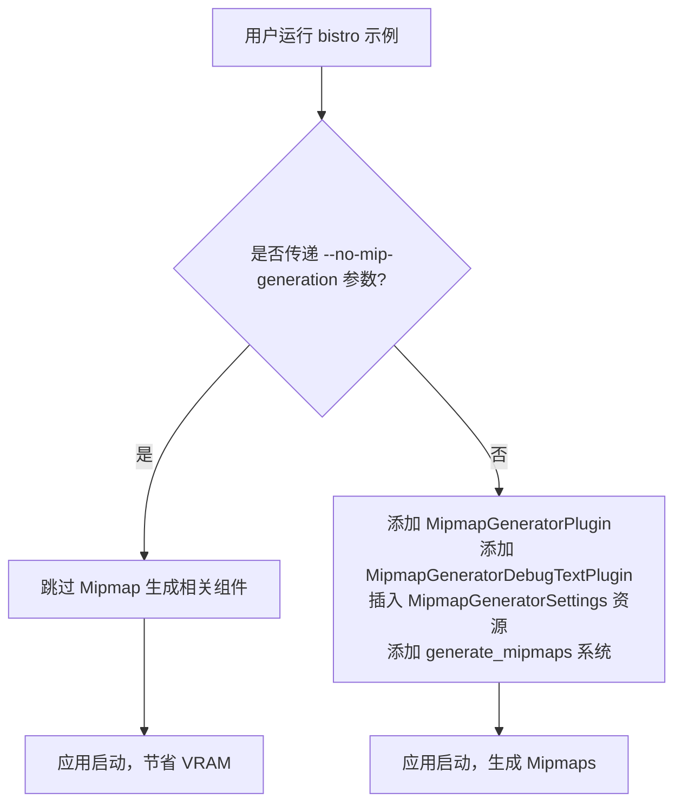

+++
title = "#22720 Add option to turn of mip generation in bistro"
date = "2026-01-27T00:00:00"
draft = false
template = "pull_request_page.html"
in_search_index = false

[extra]
current_language = "zh-cn"
available_languages = {"en" = { name = "English", url = "/pull_request/bevy/2026-01/pr-22720-en-20260127" }, "zh-cn" = { name = "中文", url = "/pull_request/bevy/2026-01/pr-22720-zh-cn-20260127" }}
+++

# Title

## 基本信息
- **标题**: Add option to turn of mip generation in bistro
- **PR 链接**: https://github.com/bevyengine/bevy/pull/22720
- **作者**: atlv24
- **状态**: 已合并
- **标签**: A-Rendering, S-Ready-For-Final-Review
- **创建时间**: 2026-01-27T08:31:34Z
- **合并时间**: 2026-01-27T19:36:06Z
- **合并者**: alice-i-cecile

## 描述翻译

# 目标
- mipmap 占用显存（VRAM）

## 解决方案
- 提供不生成 mipmap 的选项

## 测试
- 运行示例

---

## 本 PR 的技术叙事

本 PR 解决了一个在 Bevy 大型场景示例 `bistro` 中遇到的实际问题：mipmap 生成会消耗显存，并且在某些开发或测试场景下可能并非必需。

问题的核心在于，`bistro` 示例在启动时会默认加载并处理场景中的所有纹理，并为它们生成 mipmap。Mipmap 是一系列预计算、逐渐缩小的纹理图像，用于在物体渲染到屏幕上较远（较小）时，防止纹理采样出现锯齿（aliasing）和闪烁（moiré patterns）。然而，生成它们需要额外的计算时间和显存开销。对于 `bistro` 这种旨在展示大型、复杂场景的示例，其纹理资源可能非常庞大，生成的 mipmap 链会显著增加初始的显存占用。

开发者 `atlv24` 的解决方案简单而有效：为示例添加一个命令行开关（command-line switch），允许用户在运行示例时选择禁用 mipmap 生成。这样，在需要快速启动、进行功能性测试，或者显存资源受限的环境中，用户可以跳过这一步，从而节省时间和资源。

实现方式上，开发者对 `bistro` 示例的主入口文件 `main.rs` 进行了修改。首先，在命令行参数结构体 `Args` 中新增了一个布尔字段 `no_mip_generation`，它对应 `--no-mip-generation` 开关。

```rust
/// disable mip map generation.
#[argh(switch)]
no_mip_generation: bool,
```

随后，对应用程序的构建逻辑进行了重构。原先，与 mipmap 生成相关的插件（`MipmapGeneratorPlugin`, `MipmapGeneratorDebugTextPlugin`）、资源（`MipmapGeneratorSettings`）和系统（`generate_mipmaps::<StandardMaterial>`）是无条件添加的。

```rust
// 修改前的代码逻辑（简化示意）
app.insert_resource(MipmapGeneratorSettings { ... })
   .add_plugins((MipmapGeneratorPlugin, MipmapGeneratorDebugTextPlugin))
   .add_systems(Update, (generate_mipmaps::<StandardMaterial>, ...));
```

修改后，这些组件的添加被包装在一个条件判断块中。只有当用户没有提供 `--no-mip-generation` 参数（即 `!args.no_mip_generation` 为真）时，才会执行原来的添加逻辑。

```rust
if !args.no_mip_generation {
    app.add_plugins((MipmapGeneratorPlugin, MipmapGeneratorDebugTextPlugin))
        .insert_resource(MipmapGeneratorSettings { ... })
        .add_systems(Update, generate_mipmaps::<StandardMaterial>);
}
```

这个改动展示了 Bevy ECS 框架的一个优点：插件和系统的添加是声明式的，可以方便地根据配置进行条件化组合。这种模式在游戏开发中很常见，允许为不同平台（如桌面与移动设备）或不同质量预设轻松切换渲染特性。

从技术角度看，这个 PR 的改动范围很小，只影响一个示例文件，没有触及引擎核心。但其价值在于提升了示例的实用性和灵活性。它为其他开发者提供了一个清晰的模式：如何通过命令行参数来条件化地控制渲染管线的特性。同时，它也提醒我们，即使是像 mipmap 生成这样的标准优化技术，在某些场景下也可能成为需要权衡的负担。

潜在的改进方向包括：将这个选项从示例提升到更通用的配置层面，或者提供更细粒度的控制（例如，只为特定纹理生成 mipmap）。不过，对于当前 PR 的目标——快速提供一个节省显存的途径——来说，现有的实现已经足够简洁有效。

## 可视化表示



## 关键文件更改

### `examples/large_scenes/bistro/src/main.rs` (+23/-24)

**变更描述**：
此文件是 `bistro` 示例的入口点。主要变更包括：
1.  在命令行参数结构体中添加了 `no_mip_generation` 开关。
2.  将原来无条件添加的 mipmap 生成相关逻辑，重构为根据新开关进行条件添加。

**关键代码片段**：
变更的核心是将固定的插件、资源和系统注册，改为条件注册。以下是对比：

**修改前（逻辑示意）**：
```rust
// 在构建 app 时直接插入资源
app.insert_resource(MipmapGeneratorSettings { ... })
   // 直接添加插件
   .add_plugins((MipmapGeneratorPlugin, MipmapGeneratorDebugTextPlugin, ...))
   // 在更新系统中包含 mipmap 生成
   .add_systems(Update, (generate_mipmaps::<StandardMaterial>, ...));
```

**修改后（关键逻辑）**：
```rust
// 先添加不依赖于 mipmap 的插件和系统
app.add_plugins((FrameTimeDiagnosticsPlugin, FreeCameraPlugin))
   .add_systems(Update, (input, run_animation, spin, frame_time_system, benchmark).chain());

// 然后，仅在需要时添加 mipmap 相关组件
if !args.no_mip_generation {
    app.add_plugins((MipmapGeneratorPlugin, MipmapGeneratorDebugTextPlugin))
        .insert_resource(MipmapGeneratorSettings { ... })
        .add_systems(Update, generate_mipmaps::<StandardMaterial>);
}
```

**与 PR 目标的关联**：
这个条件逻辑直接实现了 PR 的目标：当用户指定 `--no-mip-generation` 时，所有与生成 mipmap 相关的代码都不会执行，从而避免了相应的计算和显存开销。

## 延伸阅读

1.  **Bevy 官方文档 - 插件（Plugins）**：
    *   https://bevyengine.org/learn/quick-start/plugins/ - 了解 Bevy 中插件的基本概念和工作原理。
    *   https://bevy-cheatbook.github.io/programming/plugins.html - 更深入的插件编程指南。

2.  **Mipmapping 技术**：
    *   Wikipedia - Mipmap: https://en.wikipedia.org/wiki/Mipmap - 概述 mipmap 的历史、原理和作用。
    *   LearnOpenGL - Texture: https://learnopengl.com/Getting-started/Textures - 包含关于纹理过滤和 mipmap 的实践教程（使用 OpenGL）。

3.  **argh（命令行参数解析库）**：
    *   GitHub 仓库: https://github.com/google/argh - 了解本示例中使用的命令行参数解析库的 API 和特性。