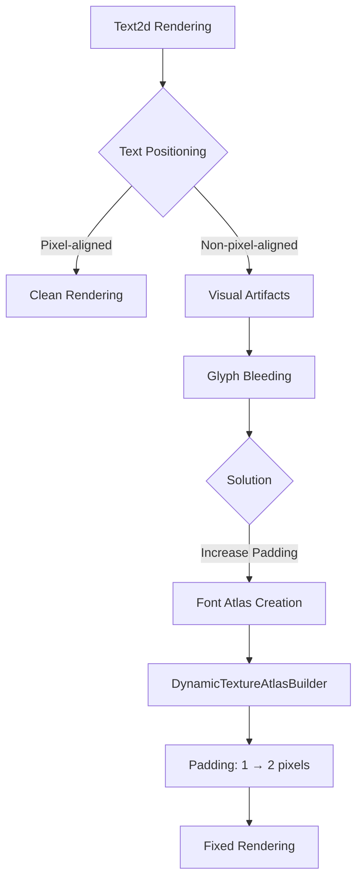

+++
title = "#22722 Add extra padding to font atlases"
date = "2026-01-31T00:00:00"
draft = false
template = "pull_request_page.html"
in_search_index = true

[taxonomies]
list_display = ["show"]

[extra]
current_language = "en"
available_languages = {"en" = { name = "English", url = "/pull_request/bevy/2026-01/pr-22722-en-20260131" }, "zh-cn" = { name = "中文", url = "/pull_request/bevy/2026-01/pr-22722-zh-cn-20260131" }}
labels = ["C-Bug", "A-Rendering", "A-Text", "D-Straightforward"]
+++

# Title

## Basic Information
- **Title**: Add extra padding to font atlases
- **PR Link**: https://github.com/bevyengine/bevy/pull/22722
- **Author**: ickshonpe
- **Status**: MERGED
- **Labels**: C-Bug, A-Rendering, A-Text, D-Straightforward, S-Needs-Review
- **Created**: 2026-01-27T11:03:32Z
- **Merged**: 2026-01-30T23:11:25Z
- **Merged By**: mockersf

## Description Translation

# Objective

Text rendered with Text2d sometimes shows visual artifacts:

https://cdn.discordapp.com/attachments/885021580353237032/1465484728512675902/screenshot-2026-01-26-at-15.08.45.png?ex=69794682&is=6977f502&hm=e22ced378cafba3d97d77d322c41405e01e1027cdaf8108ff300c0f3f174c0f8&

Fixes #22716

## Solution

This is probably because the font atlases are too tightly packed for non-pixel aligned text. Add an extra pixel of padding to the font atlases.

#

Adding extra padding is enough to remove the artifacts as reported, but longer term:

1.  We should look into better font rendering for Text2d that produces high quality text regardless of scaling and sub pixel coords.

2. The texture atlas builder should support extrusion.

## The Story of This Pull Request

This PR addresses a specific visual artifact issue in Bevy's text rendering system. The problem manifested as rendering artifacts when displaying text using the Text2d component, particularly with non-pixel-aligned text positioning. The provided screenshot shows visible artifacts that degrade text quality.

The root cause was identified as insufficient padding between glyphs in the font texture atlases. Font atlases in Bevy pack multiple glyphs into a single texture to reduce draw calls. When text isn't perfectly aligned to pixel boundaries (due to sub-pixel positioning or scaling), neighboring glyphs in the atlas can "bleed" into each other because texture sampling may interpolate across the tight boundaries between glyphs.

The fix is straightforward but effective: increasing the padding between glyphs from 1 pixel to 2 pixels in the `DynamicTextureAtlasBuilder`. This additional space provides a buffer that prevents texture sampling from adjacent glyphs when rendering text at non-integer coordinates or with scaling applied.

The implementation changed a single line in the font atlas initialization code. While simple, this change required understanding the relationship between texture atlas packing, texture filtering, and sub-pixel rendering. The one-pixel increase doubles the padding, which is significant because it creates a full pixel of transparent space on all sides of each glyph, ensuring that bilinear filtering won't sample from neighboring glyphs even with sub-pixel offsets.

Looking at the broader context, this fix represents a pragmatic short-term solution. As noted in the PR description, more comprehensive solutions would involve either improved font rendering techniques that handle sub-pixel positioning more gracefully, or implementing texture extrusion in the atlas builder itself. Texture extrusion duplicates border pixels outward, creating natural padding without increasing the actual distance between glyph rectangles in UV coordinates. However, implementing extrusion would require more extensive changes to the texture atlas system.

The choice to simply increase padding reflects good engineering judgment: it solves the immediate problem with minimal risk and code changes, while acknowledging that more sophisticated solutions could be implemented later if needed. This approach balances fix delivery speed with technical debt considerations.

The change is localized to the font atlas creation process, so it doesn't affect other systems using texture atlases. The performance impact is minimal - slightly larger texture atlases that may hold fewer glyphs before requiring expansion, but the memory increase is proportional to the padding increase, which for typical font sizes represents a small percentage increase in texture memory usage.

## Visual Representation



## Key Files Changed

### `crates/bevy_text/src/font_atlas.rs` (+1/-1)

This file contains the `FontAtlas` struct responsible for managing font texture atlases. The change modifies the padding value when creating a new `DynamicTextureAtlasBuilder`.

**Before:**
```rust
dynamic_texture_atlas_builder: DynamicTextureAtlasBuilder::new(size, 1),
```

**After:**
```rust
dynamic_texture_atlas_builder: DynamicTextureAtlasBuilder::new(size, 2),
```

The change increases the padding parameter from 1 to 2 pixels. This padding is used when packing glyphs into the texture atlas to prevent texture bleeding between adjacent glyphs during rendering, especially when text is not pixel-aligned.

## Further Reading

1. **Texture Atlas Techniques**: For understanding advanced texture packing methods including extrusion and rotation
   - [Texture Packing Algorithms](https://github.com/nothings/stb/blob/master/stb_rect_pack.h)
   - [Texture Atlas Generation with Extrusion](https://github.com/libgdx/libgdx/wiki/Texture-packer)

2. **Font Rendering and Sub-pixel Positioning**: 
   - [FreeType Glyph Metrics](https://freetype.org/freetype2/docs/glyphs/glyphs-3.html)
   - [Subpixel Rendering Techniques](https://developer.apple.com/library/archive/documentation/TextFonts/Conceptual/CocoaTextArchitecture/Art/Subpixel_Antialiasing/subpixel_antialiasing_2x.png)

3. **Bevy Text Rendering**:
   - [Bevy Text Documentation](https://docs.rs/bevy_text/latest/bevy_text/)
   - [Bevy Render Pipeline for Text](https://github.com/bevyengine/bevy/tree/main/crates/bevy_text)

4. **Texture Filtering and Bleeding**:
   - [OpenGL Texture Filtering](https://www.khronos.org/opengl/wiki/Texture#Filtering)
   - [Mipmapping and Texture Borders](https://learnopengl.com/Advanced-OpenGL/Texturing)