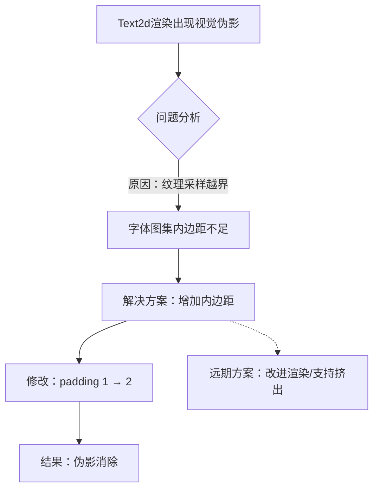

+++
title = "#22722 Add extra padding to font atlases"
date = "2026-01-31T00:00:00"
draft = false
template = "pull_request_page.html"
in_search_index = false

[extra]
current_language = "zh-cn"
available_languages = {"en" = { name = "English", url = "/pull_request/bevy/2026-01/pr-22722-en-20260131" }, "zh-cn" = { name = "中文", url = "/pull_request/bevy/2026-01/pr-22722-zh-cn-20260131" }}
+++

# Add extra padding to font atlases

## 基本信息
- **标题**: Add extra padding to font atlases
- **PR链接**: https://github.combevyengine/bevy/pull/22722
- **作者**: ickshonpe
- **状态**: 已合并
- **标签**: C-Bug, A-Rendering, A-Text, D-Straightforward, S-Needs-Review
- **创建时间**: 2026-01-27T11:03:32Z
- **合并时间**: 2026-01-30T23:11:25Z
- **合并者**: mockersf

## 描述翻译
# 目标（Objective）

使用 Text2d 渲染的文本有时会显示视觉伪影（visual artifacts）：
https://cdn.discordapp.com/attachments/885021580353237032/1465484728512675902/screenshot-2026-01-26-at-15.08.45.png?ex=69794682&is=6977f502&hm=e22ced378cafba3d97d77d322c41405e01e1027cdaf8108ff300c0f3f174c0f8&

修复 #22716

## 解决方案（Solution）

这很可能是因为对于非像素对齐的文本，字体图集（font atlases）的排列过于紧凑。为字体图集增加一个额外的像素内边距（padding）。

#

添加额外内边距足以消除所报告的那些伪影，但从长远来看：
1.  我们应该研究能产生高质量文本的、更好的 Text2d 字体渲染方案，无论其缩放和亚像素坐标如何。
2.  纹理图集构建器（texture atlas builder）应该支持挤出（extrusion）。

## 本次Pull Request的技术故事

本次Pull Request的核心是解决一个由纹理采样（texture sampling）边界问题引发的渲染缺陷。问题的起因是，Bevy引擎在使用`Text2d`渲染非像素对齐的文本时，有时会在字符边缘看到来自相邻字符的“杂色”像素，即视觉伪影（visual artifacts）。

**问题的根源在于纹理图集的打包策略。** 为了提高渲染效率，Bevy将许多字体字形（glyph）预先光栅化并打包到一张大的纹理图集（texture atlas）中。在渲染时，每个文本字符通过其对应的纹理坐标（UV coordinates）从这个图集上取样。当文本的位置不是完美的整数像素（即存在亚像素偏移）或者经过缩放时，GPU在纹理上进行双线性过滤（bilinear filtering）采样。如果两个字形在图集上紧挨着排列，且它们之间没有足够的缓冲区（即内边距，padding），那么对某个字形边缘的采样就可能会“越界”，取到相邻字形的颜色数据，从而在屏幕上显示为错误的颜色像素。这类似于图像处理中的“出血（bleeding）”现象。

原代码中，创建动态纹理图集构建器（`DynamicTextureAtlasBuilder`）时，指定的内边距参数是`1`。这个`1`可能指的是物理像素。然而，在现代GPU纹理采样和亚像素渲染的场景下，这个单像素的缓冲区显得不足，尤其是在进行双线性过滤时，采样点会考虑目标像素周围2x2区域的纹素（texel）。

**解决方案非常直接且具有针对性。** 既然根本原因是内边距不足，那么最快速的修复方法就是增加内边距。PR将内边距从`1`增加到了`2`。这意味着在图集中打包每个字形后，会在其周围预留至少2个像素的透明（或背景色）区域。这样，即使因为过滤或坐标偏移导致采样范围稍微超出字形边界，也只会采样到这块预留的透明区域，而不会触及相邻字形，从而彻底消除了视觉伪影。

这个修复虽然简单，但背后反映了图形渲染中一个经典的空间换质量的权衡。增加内边距会略微降低纹理图集的空间利用率（因为每个字形占用的面积变大了），但换取了渲染质量的稳定性和正确性。这是一种可靠且被广泛采用的工程实践。

作者在解决方案中也清醒地指出了这只是权宜之计，并展望了未来的优化方向：一是从根本上改进`Text2d`的字体渲染管线，使其在任何变换下都能保持高质量；二是增强纹理图集构建器的功能，支持更高级的“挤出（extrusion）”技术。挤出技术不是简单地留出空白，而是将字形边缘的像素颜色向外复制填充到内边距区域，这样在过滤时能产生更平滑的边缘，是比单纯增加透明内边距更优的解决方案，但实现也更为复杂。

总的来说，这个PR是一个教科书式的针对特定渲染缺陷的精准修复。它没有过度设计，而是用最小的改动（仅修改一个常量参数）解决了实际问题，并为进一步的架构优化留下了清晰的注释和方向。

## 可视化表示



## 关键文件更改

本次PR仅修改了一个文件，改动非常集中。

- `crates/bevy_text/src/font_atlas.rs` (+1/-1)
    1.  **修改内容与原因**：修改了`FontAtlas`结构体构造函数中`DynamicTextureAtlasBuilder`的初始化参数。将内边距（padding）从`1`增加至`2`，以解决非像素对齐文本渲染时的采样伪影问题。
    2.  **代码片段**：
        ```rust
        // 文件: crates/bevy_text/src/font_atlas.rs
        // 修改前：
        dynamic_texture_atlas_builder: DynamicTextureAtlasBuilder::new(size, 1),
        
        // 修改后：
        dynamic_texture_atlas_builder: DynamicTextureAtlasBuilder::new(size, 2),
        ```
    3.  **与PR目标的关系**：这是实现本PR解决方案的唯一且直接的代码修改。通过增加这一个像素的内边距，为图集中的每个字形创建了足够的安全边界，阻断了因纹理过滤导致的颜色“渗漏”。

## 延伸阅读

1.  **纹理图集与打包**：了解纹理图集（Texture Atlas）如何优化绘制调用，以及各种打包算法（如rectpack2D, skyline等）。
2.  **字体渲染与抗锯齿**：深入了解字体光栅化、亚像素渲染（subpixel rendering）、以及不同的抗锯齿技术（如MSAA、FXAA、以及针对字体的SDFs有符号距离场）。
3.  **纹理采样与过滤**：学习GPU的纹理采样机制，特别是最近邻（nearest-neighbor）、双线性（bilinear）过滤的工作原理，以及Mipmapping如何影响采样。
4.  **纹理边界处理**：在OpenGL/DirectX/Vulkan中，`GL_CLAMP_TO_EDGE`等环绕模式（wrap mode）如何处理纹理坐标超出[0,1]范围的情况，这与图集内边距解决的问题相关但层面不同。
5.  **Bevy渲染管线**：可以查阅Bevy官方文档，了解其`Text2d`组件是如何与`Sprite`系统、材质和着色器协同工作的。