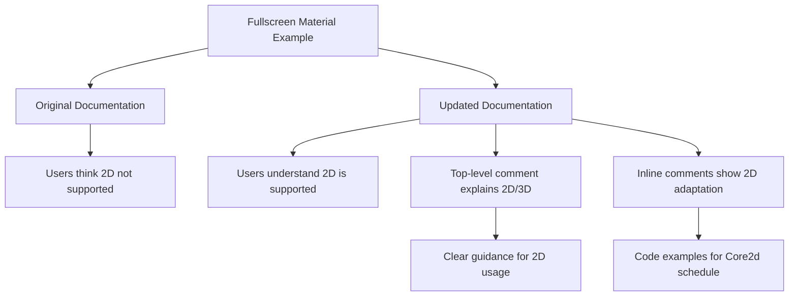

+++
title = "#22730 Clarifying 2D Support in Bevy's Fullscreen Material Example"
date = "2026-01-29T00:00:00"
draft = false
template = "pull_request_page.html"
in_search_index = true

[taxonomies]
list_display = ["show"]

[extra]
current_language = "en"
available_languages = {"en" = { name = "English", url = "/pull_request/bevy/2026-01/pr-22730-en-20260129" }, "zh-cn" = { name = "中文", url = "/pull_request/bevy/2026-01/pr-22730-zh-cn-20260129" }}
labels = ["A-Rendering", "C-Examples"]
+++

# Title: Clarifying 2D Support in Bevy's Fullscreen Material Example

## Basic Information
- **Title**: update fullscreen material example comment to be clear about 2d support
- **PR Link**: https://github.com/bevyengine/bevy/pull/22730
- **Author**: ChristopherBiscardi
- **Status**: MERGED
- **Labels**: A-Rendering, C-Examples, S-Ready-For-Final-Review
- **Created**: 2026-01-28T21:26:26Z
- **Merged**: 2026-01-28T23:40:54Z
- **Merged By**: alice-i-cecile

## Description Translation

# Objective

Due to comments in the current fullscreen material example, some users have thought that fullscreenmaterial doesn't work in 2d. It does.

## Solution

Update the comment to reflect the fact that this works with 2d, the example is just showcasing 3d.

## Showcase

Rectangle and Circle after swapping "3d" for "2d" in all example locations.


## The Story of This Pull Request

This PR addresses a documentation issue in Bevy's example code that was causing confusion among users. The problem was straightforward but had meaningful implications for developer experience: the existing comments in the fullscreen material example incorrectly suggested that fullscreen materials only work in 3D contexts. In reality, the fullscreen material system supports both 2D and 3D rendering, but the example was written to demonstrate 3D usage specifically.

The core issue stemmed from the example file's documentation comments. When developers encountered the example, they saw it was implemented with 3D components and scheduled in the Core3d schedule. The original comments didn't clarify that this was a design choice for the example, not a limitation of the underlying system. This led some users to incorrectly assume that fullscreen materials couldn't be used in 2D projects.

The solution implemented in this PR is minimal but effective: it updates the documentation comments to explicitly state that fullscreen materials work in both 2D and 3D contexts, and provides guidance on how to adapt the example for 2D use. The author added a clear note at the top of the example file explaining that while the example demonstrates 3D usage, 2D usage is possible by replacing 3D components with their 2D counterparts and adjusting the scheduling.

More importantly, the PR adds detailed inline documentation within the `FullscreenMaterial` implementation. This documentation explains that the default scheduling uses 3D systems, then provides commented-out code showing exactly what changes are needed to make the material work in 2D. This practical, copy-paste ready guidance is particularly valuable because it addresses the specific points where users were getting confused.

The implementation approach demonstrates good documentation practices. Instead of just stating that 2D is supported, it shows users how to achieve it. The commented code snippets provide concrete examples of the necessary changes: switching from `Core3d` to `Core2d` schedule and from `Core3dSystems::PostProcess` to `Core2dSystems::PostProcess`. This level of detail eliminates ambiguity and reduces the cognitive load for developers trying to understand how to adapt the example for their use case.

From a technical perspective, this change doesn't affect runtime behavior or API design—it's purely documentation. However, it addresses an important aspect of developer experience: clear, accurate documentation that prevents misinterpretation of system capabilities. The PR shows how small documentation improvements can have significant impact by preventing users from going down incorrect paths or abandoning features they believe don't support their use cases.

The screenshots included in the PR description provide visual proof that the system works in 2D, showing both rectangle and circle shapes rendered with the fullscreen material effect. These visuals reinforce the technical documentation and help users quickly verify that the approach works as described.

This PR serves as a good example of how to handle documentation for systems that support multiple contexts (2D/3D in this case). The key lesson is that when an example demonstrates only one usage pattern, it's important to explicitly document alternative patterns and provide clear migration guidance. This prevents users from making incorrect assumptions about system limitations based on the specific implementation choices made in example code.

## Visual Representation



## Key Files Changed

- `examples/shader_advanced/fullscreen_material.rs` (+16/-2)

This is the only file modified in this PR. The changes consist entirely of documentation improvements:

1. **Top-level documentation comment**: Updated to explicitly state that the example demonstrates 3D usage but 2D is also supported, with instructions on how to adapt it.

```rust
// File: examples/shader_advanced/fullscreen_material.rs
// Before:
//! Demonstrates how to write a custom fullscreen shader.

// After:
//! Demonstrates how to write a custom fullscreen shader
//!
//! This example demonstrates working in 3d. To make the example work in 2d,
//! replace 3d components with their 2d counterparts, and schedule the work
//! to run in the `Core2d` schedule as described in the `FullscreenMaterial`
//! comment in this file.
```

2. **Implementation comment within FullscreenMaterial trait**: Added detailed explanation and code examples showing how to adapt the implementation for 2D.

```rust
// File: examples/shader_advanced/fullscreen_material.rs
// Before:
    // Uses default run_in (Core3dSystems::PostProcess)

// After:
    // The `FullscreenMaterial` uses 3d schedules by default.
    // To make this work in 2d, you would need to schedule to
    // run in `Core2d` and in a `Core2dSystems` set.
    //
    // fn schedule() -> impl bevy::ecs::schedule::ScheduleLabel + Clone {
    //     bevy::core_pipeline::Core2d
    // }
    // fn run_in() -> impl SystemSet {
    //     bevy::core_pipeline::Core2dSystems::PostProcess
    // }
```

These changes directly address the PR's objective by clarifying that fullscreen materials work in both 2D and 3D contexts, and providing practical guidance for users who want to use them in 2D projects. The inline code examples are particularly valuable because they show users exactly what changes to make, reducing the barrier to adopting the feature in different contexts.

## Further Reading

1. **Bevy's Fullscreen Material Documentation**: For more details on the fullscreen material system and its capabilities
2. **Bevy's Scheduling System**: Understanding how Core2d and Core3d schedules work in Bevy's ECS
3. **Bevy's 2D Rendering Guide**: Comprehensive guide to 2D rendering in Bevy, including material systems
4. **Bevy's Example Documentation Standards**: Best practices for writing clear, comprehensive examples in the Bevy codebase

# Full Code Diff
```
diff --git a/examples/shader_advanced/fullscreen_material.rs b/examples/shader_advanced/fullscreen_material.rs
index 4e8f24c7724df..225186bf22539 100644
--- a/examples/shader_advanced/fullscreen_material.rs
+++ b/examples/shader_advanced/fullscreen_material.rs
@@ -1,4 +1,9 @@
-//! Demonstrates how to write a custom fullscreen shader.
+//! Demonstrates how to write a custom fullscreen shader
+//!
+//! This example demonstrates working in 3d. To make the example work in 2d,
+//! replace 3d components with their 2d counterparts, and schedule the work
+//! to run in the `Core2d` schedule as described in the `FullscreenMaterial`
+//! comment in this file.
 
 use bevy::{
     core_pipeline::fullscreen_material::{FullscreenMaterial, FullscreenMaterialPlugin},
@@ -50,5 +55,14 @@ impl FullscreenMaterial for FullscreenEffect {
         "shaders/fullscreen_effect.wgsl".into()
     }
 
-    // Uses default run_in (Core3dSystems::PostProcess)
+    // The `FullscreenMaterial` uses 3d schedules by default.
+    // To make this work in 2d, you would need to schedule to
+    // run in `Core2d` and in a `Core2dSystems` set.
+    //
+    // fn schedule() -> impl bevy::ecs::schedule::ScheduleLabel + Clone {
+    //     bevy::core_pipeline::Core2d
+    // }
+    // fn run_in() -> impl SystemSet {
+    //     bevy::core_pipeline::Core2dSystems::PostProcess
+    // }
 }
```