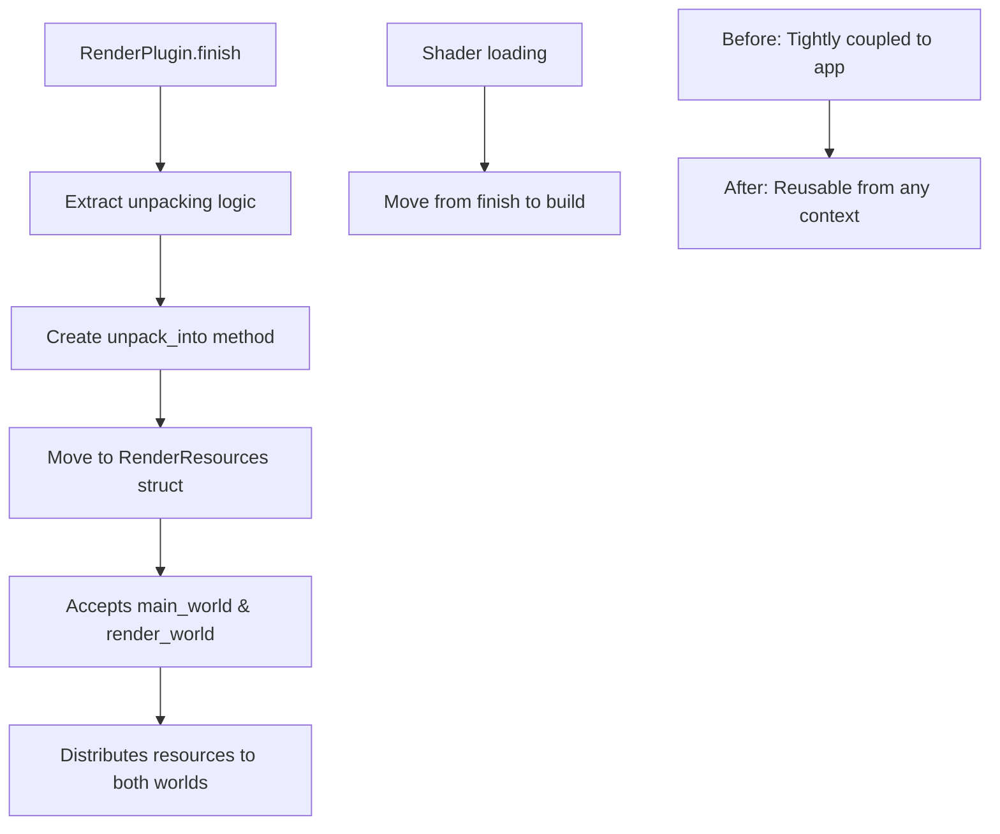

+++
title = "#22737 RenderResources refactor"
date = "2026-01-31T00:00:00"
draft = false
template = "pull_request_page.html"
in_search_index = true

[taxonomies]
list_display = ["show"]

[extra]
current_language = "en"
available_languages = {"en" = { name = "English", url = "/pull_request/bevy/2026-01/pr-22737-en-20260131" }, "zh-cn" = { name = "中文", url = "/pull_request/bevy/2026-01/pr-22737-zh-cn-20260131" }}
labels = ["A-Rendering", "C-Code-Quality", "D-Straightforward"]
+++

# RenderResources refactor

## Basic Information
- **Title**: RenderResources refactor
- **PR Link**: https://github.com/bevyengine/bevy/pull/22737
- **Author**: atlv24
- **Status**: MERGED
- **Labels**: A-Rendering, C-Code-Quality, D-Straightforward, S-Needs-Review
- **Created**: 2026-01-30T06:24:14Z
- **Merged**: 2026-01-30T23:10:16Z
- **Merged By**: mockersf

## Description Translation
# Objective

- Another step towards render recovery after #22714 and #16481
- We need RenderResource unpacking to be reusable from a non-app context

## Solution

- Make it take main and render worlds as input
- Use subapp destructure to get mutable access to both worlds simultaneously
- Move it to live next to the struct def
- Document
- Also move shader library loads up to build because theres no reason for them to be in finish

## Testing

- 3d_scene runs

Note: reviewing commit by commit is easier, when a large block moves its just copy paste

## The Story of This Pull Request

This PR addresses a specific architectural issue in Bevy's rendering system: the lack of reusability in render resource initialization. After two previous PRs (#22714 and #16481) disrupted the rendering pipeline, this change represents a step toward recovery by refactoring how render resources are unpacked and distributed between the main and render worlds.

The core problem was that the logic for unpacking `RenderResources` was embedded directly within the `RenderPlugin::finish()` method, making it tightly coupled to the app lifecycle and difficult to reuse in other contexts. This became apparent during the render recovery effort, where developers needed to initialize render resources from non-app contexts but found the existing implementation wasn't designed for that.

The solution implemented here is straightforward but significant. The developer extracted the resource unpacking logic from `RenderPlugin::finish()` and moved it to a new method `unpack_into()` on the `RenderResources` struct itself. This method now accepts both the main world and render world as parameters, making the unpacking operation reusable from any context that has access to these worlds.

Here's the key insight: by moving this logic to the `RenderResources` struct and accepting worlds as parameters rather than working directly with the app, we decouple resource initialization from the specific plugin lifecycle. This follows good software engineering practice - keeping related functionality together (the unpacking logic now lives with the struct it operates on) and designing for reusability.

The implementation required careful handling of resource distribution. The `RenderResources` struct contains critical rendering components like the `RenderDevice`, `RenderQueue`, `RenderAdapter`, and others. These need to be distributed to both the main world (for general use) and the render world (for rendering-specific operations). The new `unpack_into()` method handles this distribution correctly, including conditional compilation for Vulkan features and proper initialization of dependent resources like `PipelineCache` and `CompressedImageFormats`.

An additional improvement made in this PR is moving shader library loading from the `finish()` method to the `build()` method of `RenderPlugin`. The developer correctly noted that there was no functional reason for this loading to happen in `finish()` rather than `build()`. This is a small but meaningful cleanup that simplifies the plugin lifecycle and follows the principle of doing work as early as possible.

The technical approach uses Bevy's subapp system effectively. In the updated `finish()` method, we see:
```rust
let bevy_app::SubApps { main, sub_apps } = app.sub_apps_mut();
let render = sub_apps.get_mut(&RenderApp.intern()).unwrap();
```
This pattern demonstrates how to safely obtain mutable references to both the main world and render world simultaneously, which is necessary for the unpacking operation.

From an architectural perspective, this change makes the codebase more modular and testable. The `unpack_into()` method can now be called independently of the plugin system, which could facilitate unit testing or alternative initialization paths in the future. The documentation added to the method clearly explains its purpose and the side effects (recompilation of shaders, potential changes to supported image formats).

The PR represents incremental but important progress toward render recovery. It doesn't fix the underlying rendering issues from previous PRs, but it provides a cleaner foundation for subsequent fixes by improving the structure of resource initialization.

## Visual Representation



## Key Files Changed

### `crates/bevy_render/src/settings.rs` (+48/-0)

This file received the major addition - the `unpack_into()` method for the `RenderResources` struct. The method encapsulates all the logic previously in `RenderPlugin::finish()` for distributing render resources.

Key code addition:
```rust
impl RenderResources {
    /// Effectively, this replaces the current render backend entirely with the given resources.
    ///
    /// We deconstruct the [`RenderResources`] and make them usable by the main and render worlds,
    /// and insert [`PipelineCache`] and [`CompressedImageFormats`] which directly depend on having
    /// references to these resources within them to be accurate. This causes all shaders to
    /// be recompiled, and the set of supported images to possibly change. This is necessary
    /// because the new backend may have different compression support or shader language.
    pub(crate) fn unpack_into(
        self,
        main_world: &mut World,
        render_world: &mut World,
        synchronous_pipeline_compilation: bool,
    ) {
        let RenderResources(device, queue, adapter_info, render_adapter, instance, ..) = self;

        let compressed_image_format_support =
            CompressedImageFormatSupport(CompressedImageFormats::from_features(device.features()));

        main_world.insert_resource(device.clone());
        main_world.insert_resource(queue.clone());
        main_world.insert_resource(adapter_info.clone());
        main_world.insert_resource(render_adapter.clone());
        main_world.insert_resource(compressed_image_format_support);

        #[cfg(feature = "raw_vulkan_init")]
        {
            let additional_vulkan_features: renderer::raw_vulkan_init::AdditionalVulkanFeatures =
                self.5;
            render_world.insert_resource(additional_vulkan_features);
        }

        render_world.insert_resource(instance);
        render_world.insert_resource(PipelineCache::new(
            device.clone(),
            render_adapter.clone(),
            synchronous_pipeline_compilation,
        ));
        render_world.insert_resource(device);
        render_world.insert_resource(queue);
        render_world.insert_resource(render_adapter);
        render_world.insert_resource(adapter_info);
    }
}
```

### `crates/bevy_render/src/lib.rs` (+9/-35)

This file was simplified by removing the inline unpacking logic and replacing it with a call to the new `unpack_into()` method. It also moved shader library loading earlier in the plugin lifecycle.

Key changes:
```rust
// Shader loading moved from finish() to build()
impl Plugin for RenderPlugin {
    fn build(&self, app: &mut App) {
        app.init_asset::<Shader>()
            .init_asset_loader::<ShaderLoader>();
        load_shader_library!(app, "maths.wgsl");
        load_shader_library!(app, "color_operations.wgsl");
        load_shader_library!(app, "bindless.wgsl");
        // ... rest of build method
    }

    fn finish(&self, app: &mut App) {
        // Old unpacking logic replaced with:
        if let Some(future_render_resources) =
            app.world_mut().remove_resource::<FutureRenderResources>()
        {
            let bevy_app::SubApps { main, sub_apps } = app.sub_apps_mut();
            let render = sub_apps.get_mut(&RenderApp.intern()).unwrap();
            let render_resources = future_render_resources.0.lock().unwrap().take().unwrap();

            render_resources.unpack_into(
                main.world_mut(),
                render.world_mut(),
                self.synchronous_pipeline_compilation,
            );
        }
    }
}
```

## Further Reading

- [Bevy ECS: Worlds and Resources](https://bevyengine.org/learn/book/ecs/worlds-resources/) - Understanding how resources work in Bevy's ECS
- [Bevy Plugins](https://bevyengine.org/learn/book/plugins/) - Plugin system architecture
- [wgpu: WebGPU implementation in Rust](https://github.com/gfx-rs/wgpu) - The rendering backend Bevy uses
- [Previous PR #22714](https://github.com/bevyengine/bevy/pull/22714) and [#16481](https://github.com/bevyengine/bevy/pull/16481) - Context for the render recovery effort