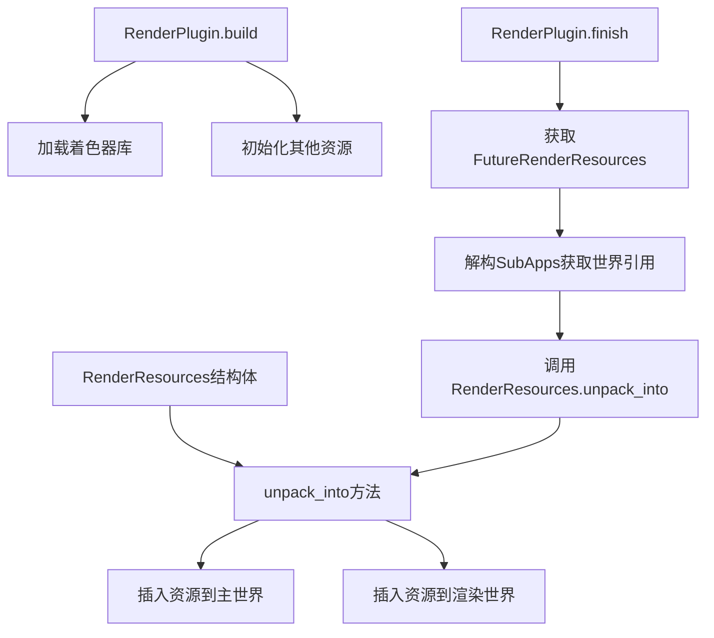

+++
title = "#22737 RenderResources refactor"
date = "2026-01-31T00:00:00"
draft = false
template = "pull_request_page.html"
in_search_index = false

[extra]
current_language = "zh-cn"
available_languages = {"en" = { name = "English", url = "/pull_request/bevy/2026-01/pr-22737-en-20260131" }, "zh-cn" = { name = "中文", url = "/pull_request/bevy/2026-01/pr-22737-zh-cn-20260131" }}
+++

# RenderResources 重构

## 基本信息
- **标题**: RenderResources refactor
- **PR链接**: https://github.com/bevyengine/bevy/pull/22737
- **作者**: atlv24
- **状态**: 已合并
- **标签**: A-Rendering, C-Code-Quality, D-Straightforward, S-Needs-Review
- **创建时间**: 2026-01-30T06:24:14Z
- **合并时间**: 2026-01-30T23:10:16Z
- **合并者**: mockersf

## 描述翻译

### 目标
- 继 #22714 和 #16481 之后，向渲染恢复迈出的另一步
- 我们需要使 RenderResource 的解包操作可以在非应用上下文中重用

### 解决方案
- 使其接收主世界和渲染世界作为输入
- 使用子应用解构来同时获取对两个世界的可变访问权限
- 将其移动到结构定义旁边
- 添加文档说明
- 同时将着色器库加载移动到构建阶段，因为没有理由让它们留在完成阶段

### 测试
- 3d_scene 正常运行

注意：逐提交审查更容易，当大块代码移动时，只是复制粘贴

## 本次PR的技术分析

这个PR主要解决了一个架构问题：`RenderResources`结构的解包逻辑被硬编码在`RenderPlugin::finish`方法中，导致这段代码难以在其他上下文中重用。这是继之前两个PR之后，为了完善渲染系统架构而进行的必要重构。

### 问题背景与上下文

在Bevy的渲染系统中，`RenderResources`结构体包含了所有渲染所需的底层资源，如GPU设备、队列、适配器信息等。之前，这些资源的初始化逻辑直接写在`RenderPlugin::finish`方法中：

```rust
// 之前：在 finish 方法中直接处理
let RenderResources(device, queue, adapter_info, render_adapter, instance, ..) =
    render_resources;
// ... 大量资源插入逻辑
```

这种设计有几个问题：
1. 代码紧耦合到特定的插件生命周期方法中
2. 难以在非应用上下文中重用相同的初始化逻辑
3. 不符合关注点分离的原则
4. 着色器库的加载时机不合理（在`finish`阶段）

### 解决方案的设计思路

开发者采用了典型的重构方法：提取方法并将逻辑移动到更合适的位置。核心思路是将资源解包逻辑从插件生命周期方法中提取出来，封装为`RenderResources`结构体的一个方法。

技术决策包括：
1. 创建`unpack_into`方法，接收`main_world`和`render_world`作为参数
2. 使用子应用解构模式安全地获取两个世界的可变引用
3. 将着色器库加载从`finish`阶段移到`build`阶段，因为这是初始化时应该完成的工作
4. 为方法添加详细的文档说明，解释其作用和注意事项

### 具体实现细节

#### 关键重构：创建 unpack_into 方法

在`settings.rs`中新增的`unpack_into`方法实现了完整的资源解包逻辑：

```rust
pub(crate) fn unpack_into(
    self,
    main_world: &mut World,
    render_world: &mut World,
    synchronous_pipeline_compilation: bool,
) {
    let RenderResources(device, queue, adapter_info, render_adapter, instance, ..) = self;

    let compressed_image_format_support =
        CompressedImageFormatSupport(CompressedImageFormats::from_features(device.features()));

    main_world.insert_resource(device.clone());
    main_world.insert_resource(queue.clone());
    main_world.insert_resource(adapter_info.clone());
    main_world.insert_resource(render_adapter.clone());
    main_world.insert_resource(compressed_image_format_support);

    #[cfg(feature = "raw_vulkan_init")]
    {
        let additional_vulkan_features: renderer::raw_vulkan_init::AdditionalVulkanFeatures =
            self.5;
        render_world.insert_resource(additional_vulkan_features);
    }

    render_world.insert_resource(instance);
    render_world.insert_resource(PipelineCache::new(
        device.clone(),
        render_adapter.clone(),
        synchronous_pipeline_compilation,
    ));
    render_world.insert_resource(device);
    render_world.insert_resource(queue);
    render_world.insert_resource(render_adapter);
    render_world.insert_resource(adapter_info);
}
```

这个方法的设计有几个值得注意的技术点：
- 使用`self`作为参数（所有权转移），确保资源只能被解包一次
- 明确区分哪些资源放入主世界，哪些放入渲染世界
- 正确处理条件编译特性（如`raw_vulkan_init`）
- 根据设备特性动态计算支持的压缩图像格式

#### 插件逻辑的简化

在`lib.rs`中，`RenderPlugin::finish`方法从原来的46行代码简化为：

```rust
fn finish(&self, app: &mut App) {
    if let Some(future_render_resources) =
        app.world_mut().remove_resource::<FutureRenderResources>()
    {
        let bevy_app::SubApps { main, sub_apps } = app.sub_apps_mut();
        let render = sub_apps.get_mut(&RenderApp.intern()).unwrap();
        let render_resources = future_render_resources.0.lock().unwrap().take().unwrap();

        render_resources.unpack_into(
            main.world_mut(),
            render.world_mut(),
            self.synchronous_pipeline_compilation,
        );
    }
}
```

这种重构带来了明显的代码清晰度提升，同时保持了完全相同的功能。

#### 着色器库加载时机的调整

着色器库加载从`finish`方法移到了`build`方法：

```rust
fn build(&self, app: &mut App) {
    app.init_asset::<Shader>()
        .init_asset_loader::<ShaderLoader>();
    load_shader_library!(app, "maths.wgsl");
    load_shader_library!(app, "color_operations.wgsl");
    load_shader_library!(app, "bindless.wgsl");
    // ... 其他初始化代码
}
```

这是更合理的安排，因为着色器库是渲染系统的静态依赖，应该在构建阶段就准备好，而不是等到完成阶段。

### 技术洞察与设计考量

1. **所有权模式**：`unpack_into`方法接收`self`（所有权），这确保了`RenderResources`实例只能被解包一次，避免了资源重复插入可能导致的问题。

2. **世界访问模式**：通过`app.sub_apps_mut()`获取子应用结构，然后分别获取主世界和渲染世界的可变引用。这种方式比直接使用`app.sub_app_mut(RenderApp)`更清晰，因为它明确展示了同时访问两个世界的意图。

3. **关注点分离**：将资源解包逻辑从插件中分离出来，使`RenderResources`成为更自包含的模块。这种设计符合单一职责原则。

4. **条件编译的处理**：在`unpack_into`方法中正确处理了`#[cfg(feature = "raw_vulkan_init")]`条件编译，确保特定功能只在启用相应特性时才会编译和运行。

5. **错误处理**：使用`unwrap()`获取渲染应用，这假设渲染应用一定存在。在Bevy的架构中，这是一个合理的假设，因为渲染应用是在插件构建阶段创建的。

### 影响与改进

这次重构带来的主要改进包括：

1. **代码可重用性**：现在`RenderResources`的解包逻辑可以在任何需要初始化渲染资源的上下文中使用，而不仅限于`RenderPlugin`内部。

2. **架构清晰度**：将资源管理逻辑集中到`RenderResources`结构体相关代码中，而不是分散在插件生命周期方法中。

3. **测试友好性**：由于解包逻辑现在是一个独立的方法，可以更容易地编写单元测试来验证资源初始化的正确性。

4. **维护性**：减少了`RenderPlugin::finish`方法的复杂度，使其更容易理解和维护。

5. **初始化顺序优化**：将着色器库加载提前到构建阶段，确保了在需要时着色器已经可用。

从工程角度看，这是一个典型的"提取方法"重构，但应用在系统级架构层面。它展示了如何通过合理的抽象来改善代码的组织结构，同时保持功能的完整性。

## 视觉表示



## 关键文件变更

### 1. `crates/bevy_render/src/settings.rs` (+48/-0)

**变更描述**：新增`RenderResources::unpack_into`方法，将资源解包逻辑从插件中提取到结构体方法中。

**关键代码**：
```rust
impl RenderResources {
    /// Effectively, this replaces the current render backend entirely with the given resources.
    ///
    /// We deconstruct the [`RenderResources`] and make them usable by the main and render worlds,
    /// and insert [`PipelineCache`] and [`CompressedImageFormats`] which directly depend on having
    /// references to these resources within them to be accurate. This causes all shaders to
    /// be recompiled, and the set of supported images to possibly change. This is necessary
    /// because the new backend may have different compression support or shader language.
    pub(crate) fn unpack_into(
        self,
        main_world: &mut World,
        render_world: &mut World,
        synchronous_pipeline_compilation: bool,
    ) {
        // 解包逻辑实现
    }
}
```

**与PR目的的关系**：这是本次重构的核心，实现了可重用的资源解包逻辑。

### 2. `crates/bevy_render/src/lib.rs` (+9/-35)

**变更描述**：简化`RenderPlugin::finish`方法，移除硬编码的解包逻辑，改为调用新的`unpack_into`方法。同时将着色器库加载从`finish`移到`build`方法。

**关键代码**：
```rust
// 在 build 方法中添加：
load_shader_library!(app, "maths.wgsl");
load_shader_library!(app, "color_operations.wgsl");
load_shader_library!(app, "bindless.wgsl");

// 在 finish 方法中简化：
render_resources.unpack_into(
    main.world_mut(),
    render.world_mut(),
    self.synchronous_pipeline_compilation,
);
```

**与PR目的的关系**：展示了重构后的插件如何使用新的解包方法，同时优化了初始化顺序。

## 进一步阅读

1. **Bevy渲染架构文档**：了解Bevy渲染系统的基本架构和工作原理
2. **WGSL着色语言规范**：理解Bevy使用的着色器语言
3. **提取方法重构模式**：学习这种常见重构技巧的应用场景和最佳实践
4. **所有权和借用系统**：深入理解Rust的所有权模型，这是本次重构中安全访问多个世界的关键
5. **Bevy ECS系统**：了解Bevy的实体组件系统架构，特别是世界（World）和资源（Resource）的概念