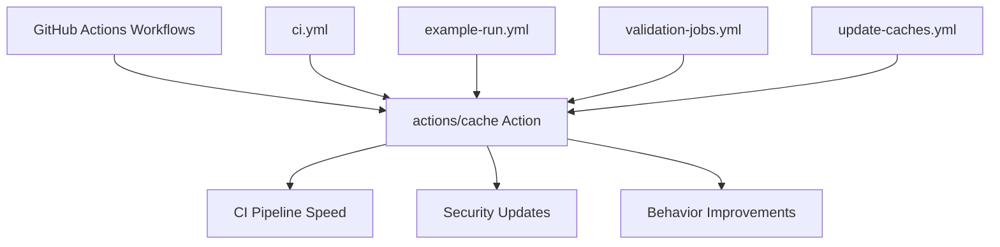

+++
title = "#22740 Bump actions/cache from 5.0.1 to 5.0.3"
date = "2026-01-30T00:00:00"
draft = false
template = "pull_request_page.html"
in_search_index = true

[taxonomies]
list_display = ["show"]

[extra]
current_language = "en"
available_languages = {"en" = { name = "English", url = "/pull_request/bevy/2026-01/pr-22740-en-20260130" }, "zh-cn" = { name = "中文", url = "/pull_request/bevy/2026-01/pr-22740-zh-cn-20260130" }}
labels = ["C-Dependencies"]
+++

# Title

## Basic Information
- **Title**: Bump actions/cache from 5.0.1 to 5.0.3
- **PR Link**: https://github.com/bevyengine/bevy/pull/22740
- **Author**: app/dependabot
- **Status**: MERGED
- **Labels**: C-Dependencies
- **Created**: 2026-01-30T06:52:58Z
- **Merged**: 2026-01-30T07:45:43Z
- **Merged By**: mockersf

## Description Translation
Bumps [actions/cache](https://github.com/actions/cache) from 5.0.1 to 5.0.3.
<details>
<summary>Release notes</summary>
<p><em>Sourced from <a href="https://github.com/actions/cache/releases">actions/cache's releases</a>.</em></p>
<blockquote>
<h2>v5.0.3</h2>
<h2>What's Changed</h2>
<ul>
<li>Bump <code>@actions/cache</code> to v5.0.5 (Resolves: <a href="https://github.com/actions/cache/security/dependabot/33">https://github.com/actions/cache/security/dependabot/33</a>)</li>
<li>Bump <code>@actions/core</code> to v2.0.3</li>
</ul>
<p><strong>Full Changelog</strong>: <a href="https://github.com/actions/cache/compare/v5...v5.0.3">https://github.com/actions/cache/compare/v5...v5.0.3</a></p>
<h2>v.5.0.2</h2>
<h1>v5.0.2</h1>
<h2>What's Changed</h2>
<p>When creating cache entries, 429s returned from the cache service will not be retried.</p>
</blockquote>
</details>
<details>
<summary>Changelog</summary>
<p><em>Sourced from <a href="https://github.com/actions/cache/blob/main/RELEASES.md">actions/cache's changelog</a>.</em></p>
<blockquote>
<h1>Releases</h1>
<h2>How to prepare a release</h2>
<blockquote>
<p>[!NOTE]<br />
Relevant for maintainers with write access only.</p>
</blockquote>
<ol>
<li>Switch to a new branch from <code>main</code>.</li>
<li>Run <code>npm test</code> to ensure all tests are passing.</li>
<li>Update the version in <a href="https://github.com/actions/cache/blob/main/package.json"><code>https://github.com/actions/cache/blob/main/package.json</code></a>.</li>
<li>Run <code>npm run build</code> to update the compiled files.</li>
<li>Update this <a href="https://github.com/actions/cache/blob/main/RELEASES.md"><code>https://github.com/actions/cache/blob/main/RELEASES.md</code></a> with the new version and changes in the <code>## Changelog</code> section.</li>
<li>Run <code>licensed cache</code> to update the license report.</li>
<li>Run <code>licensed status</code> and resolve any warnings by updating the <a href="https://github.com/actions/cache/blob/main/.licensed.yml"><code>https://github.com/actions/cache/blob/main/.licensed.yml</code></a> file with the exceptions.</li>
<li>Commit your changes and push your branch upstream.</li>
<li>Open a pull request against <code>main</code> and get it reviewed and merged.</li>
<li>Draft a new release <a href="https://github.com/actions/cache/releases">https://github.com/actions/cache/releases</a> use the same version number used in <code>package.json</code>
<ol>
<li>Create a new tag with the version number.</li>
<li>Auto generate release notes and update them to match the changes you made in <code>RELEASES.md</code>.</li>
<li>Toggle the set as the latest release option.</li>
<li>Publish the release.</li>
</ol>
</li>
<li>Navigate to <a href="https://github.com/actions/cache/actions/workflows/release-new-action-version.yml">https://github.com/actions/cache/actions/workflows/release-new-action-version.yml</a>
<ol>
<li>There should be a workflow run queued with the same version number.</li>
<li>Approve the run to publish the new version and update the major tags for this action.</li>
</ol>
</li>
</ol>
<h2>Changelog</h2>
<h3>5.0.3</h3>
<ul>
<li>Bump <code>@actions/cache</code> to v5.0.5 (Resolves: <a href="https://github.com/actions/cache/security/dependabot/33">https://github.com/actions/cache/security/dependabot/33</a>)</li>
<li>Bump <code>@actions/core</code> to v2.0.3</li>
</ul>
<h3>5.0.2</h3>
<ul>
<li>Bump <code>@actions/cache</code> to v5.0.3 <a href="https://redirect.github.com/actions/cache/pull/1692">#1692</a></li>
</ul>
<h3>5.0.1</h3>
<ul>
<li>Update <code>@azure/storage-blob</code> to <code>^12.29.1</code> via <code>@actions/cache@5.0.1</code> <a href="https://redirect.github.com/actions/cache/pull/1685">#1685</a></li>
</ul>
<h3>5.0.0</h3>
<blockquote>
<p>[!IMPORTANT]
<code>actions/cache@v5</code> runs on the Node.js 24 runtime and requires a minimum Actions Runner version of <code>2.327.1</code>.
If you are using self-hosted runners, ensure they are updated before upgrading.</p>
</blockquote>
<h3>4.3.0</h3>
<ul>
<li>Bump <code>@actions/cache</code> to <a href="https://redirect.github.com/actions/toolkit/pull/2132">v4.1.0</a></li>
</ul>
<!-- raw HTML omitted -->
</blockquote>
<p>... (truncated)</p>
</details>
<details>
<summary>Commits</summary>
<ul>
<li><a href="https://github.com/actions/cache/commit/cdf6c1fa76f9f475f3d7449005a359c84ca0f306"><code>cdf6c1f</code></a> Merge pull request <a href="https://redirect.github.com/actions/cache/issues/1695">#1695</a> from actions/Link-/prepare-5.0.3</li>
<li><a href="https://github.com/actions/cache/commit/a1bee22673bee4afb9ce4e0a1dc3da1c44060b7d"><code>a1bee22</code></a> Add review for the <code>@​actions/http-client</code> license</li>
<li><a href="https://github.com/actions/cache/commit/46957638dc5c5ff0c34c0143f443c07d3a7c769f"><code>4695763</code></a> Add licensed output</li>
<li><a href="https://github.com/actions/cache/commit/dc73bb9f7bf74a733c05ccd2edfd1f2ac9e5f502"><code>dc73bb9</code></a> Upgrade dependencies and address security warnings</li>
<li><a href="https://github.com/actions/cache/commit/345d5c2f761565bace4b6da356737147e9041e3a"><code>345d5c2</code></a> Add 5.0.3 builds</li>
<li><a href="https://github.com/actions/cache/commit/8b402f58fbc84540c8b491a91e594a4576fec3d7"><code>8b402f5</code></a> Merge pull request <a href="https://redirect.github.com/actions/cache/issues/1692">#1692</a> from GhadimiR/main</li>
<li><a href="https://github.com/actions/cache/commit/304ab5a0701ee61908ccb4b5822347949a2e2002"><code>304ab5a</code></a> license for httpclient</li>
<li><a href="https://github.com/actions/cache/commit/609fc19e67cd310e97eb36af42355843ffcb35be"><code>609fc19</code></a> Update licensed record for cache</li>
<li><a href="https://github.com/actions/cache/commit/b22231e43df11a67538c05e88835f1fa097599c5"><code>b22231e</code></a> Build</li>
<li><a href="https://github.com/actions/cache/commit/93150cdfb36a9d84d4e8628c8870bec84aedcf8a"><code>93150cd</code></a> Add PR link to releases</li>
<li>Additional commits viewable in <a href="https://github.com/actions/cache/compare/9255dc7a253b0ccc959486e2bca901246202afeb...cdf6c1fa76f9f475f3d7449005a359c84ca0f306">compare view</a></li>
</ul>
</details>
<br />


[](https://docs.github.com/en/github/managing-security-vulnerabilities/about-dependabot-security-updates#about-compatibility-scores)

Dependabot will resolve any conflicts with this PR as long as you don't alter it yourself. You can also trigger a rebase manually by commenting `@dependabot rebase`.

[//]: # (dependabot-automerge-start)
[//]: # (dependabot-automerge-end)

---

<details>
<summary>Dependabot commands and options</summary>
<br />

You can trigger Dependabot actions by commenting on this PR:
- `@dependabot rebase` will rebase this PR
- `@dependabot recreate` will recreate this PR, overwriting any edits that have been made to it
- `@dependabot merge` will merge this PR after your CI passes on it
- `@dependabot squash and merge` will squash and merge this PR after your CI passes on it
- `@dependabot cancel merge` will cancel a previously requested merge and block automerging
- `@dependabot reopen` will reopen this PR if it is closed
- `@dependabot close` will close this PR and stop Dependabot recreating it. You can achieve the same result by closing it manually
- `@dependabot show <dependency name> ignore conditions` will show all of the ignore conditions of the specified dependency
- `@dependabot ignore this major version` will close this PR and stop Dependabot creating any more for this major version (unless you reopen the PR or upgrade to it yourself)
- `@dependabot ignore this minor version` will close this PR and stop Dependabot creating any more for this minor version (unless you reopen the PR or upgrade to it yourself)
- `@dependabot ignore this dependency` will close this PR and stop Dependabot creating any more for this dependency (unless you reopen the PR or upgrade to it yourself)


</details>

## The Story of This Pull Request

This PR is a straightforward dependency update for the GitHub Actions workflows in the Bevy repository. Dependabot, GitHub's automated dependency management tool, identified that the `actions/cache` action used across multiple workflow files was outdated. The tool automatically created this PR to update from version 5.0.1 to 5.0.3.

The changes affect four GitHub Actions workflow files, all of which rely on `actions/cache` to speed up CI builds by caching Rust build artifacts. Caching is particularly important in Rust projects where dependencies can take significant time to download and compile. Without caching, each CI run would need to rebuild the entire dependency tree from scratch, wasting computational resources and slowing down development workflows.

Looking at the release notes for the updated versions, this update brings two main benefits:

1. **Security fixes**: Version 5.0.3 bumps `@actions/cache` to v5.0.5 to resolve a security vulnerability tracked as dependabot/33. While the specific details of the vulnerability aren't provided in the PR description, it's clear this addresses a known security issue in the underlying cache implementation.

2. **Behavior improvements**: Version 5.0.2 introduces a change where HTTP 429 (rate limit) responses from the cache service are no longer retried when creating cache entries. This prevents excessive retry loops that could potentially worsen rate limiting situations.

The implementation approach here is simple but systematic. Dependabot scans all workflow files for references to the `actions/cache` action and updates them consistently. The update replaces the specific commit hash (`9255dc7a253b0ccc959486e2bca901246202afeb`) with the newer one (`cdf6c1fa76f9f475f3d7449005a359c84ca0f306`) while also updating the version comment from `# v5.0.1` to `# v5.0.3`.

All changes follow the same pattern across files. For example, in the `ci.yml` workflow, multiple jobs that previously used `actions/cache/restore@9255dc7a253b0ccc959486e2bca901246202afeb # v5.0.1` now use `actions/cache/restore@cdf6c1fa76f9f475f3d7449005a359c84ca0f306 # v5.0.3`. This consistency is important because it ensures all cache operations use the same version throughout the CI system.

The PR was merged quickly (within about 53 minutes of creation), which is typical for dependency updates that don't introduce breaking changes. The compatibility score badge in the PR description shows a high compatibility score, indicating that the update is unlikely to cause issues with existing workflows.

From a technical perspective, this update demonstrates good dependency hygiene. Regularly updating dependencies, even for CI/CD tooling, helps maintain security and benefit from performance improvements and bug fixes. It also shows the value of automated dependency management tools like Dependabot in modern software development workflows.

## Visual Representation



## Key Files Changed

### `.github/workflows/ci.yml` (+11/-11)
This is the main CI workflow file. The changes update all instances of `actions/cache/restore` from version 5.0.1 to 5.0.3. This workflow includes multiple jobs for different platforms and toolchains (stable, nightly, various targets like WASM, and embedded systems).

```yaml
# File: .github/workflows/ci.yml
# Before:
- uses: actions/cache/restore@9255dc7a253b0ccc959486e2bca901246202afeb # v5.0.1

# After:
- uses: actions/cache/restore@cdf6c1fa76f9f475f3d7449005a359c84ca0f306 # v5.0.3
```

### `.github/workflows/validation-jobs.yml` (+5/-5)
This workflow handles validation jobs for specific platforms like iOS, Android, and WASM. Each job uses `actions/cache/restore` to cache build artifacts for these specialized targets.

```yaml
# File: .github/workflows/validation-jobs.yml
# Before:
- uses: actions/cache/restore@9255dc7a253b0ccc959486e2bca901246202afeb # v5.0.1

# After:
- uses: actions/cache/restore@cdf6c1fa76f9f475f3d7449005a359c84ca0f306 # v5.0.3
```

### `.github/workflows/example-run.yml` (+3/-3)
This workflow runs examples to ensure they compile and work correctly. It uses caching to speed up the compilation of example dependencies.

```yaml
# File: .github/workflows/example-run.yml
# Before:
- uses: actions/cache/restore@9255dc7a253b0ccc959486e2bca901246202afeb # v5.0.1

# After:
- uses: actions/cache/restore@cdf6c1fa76f9f475f3d7449005a359c84ca0f306 # v5.0.3
```

### `.github/workflows/update-caches.yml` (+2/-2)
This workflow specifically manages cache updates. It uses both `actions/cache/restore` and `actions/cache/save`, both of which are updated to version 5.0.3.

```yaml
# File: .github/workflows/update-caches.yml
# Before:
- uses: actions/cache/restore@9255dc7a253b0ccc959486e2bca901246202afeb # v5.0.1
- uses: actions/cache/save@9255dc7a253b0ccc959486e2bca901246202afeb # v5.0.1

# After:
- uses: actions/cache/restore@cdf6c1fa76f9f475f3d7449005a359c84ca0f306 # v5.0.3
- uses: actions/cache/save@cdf6c1fa76f9f475f3d7449005a359c84ca0f306 # v5.0.3
```

## Further Reading

1. [GitHub Actions Cache Documentation](https://docs.github.com/en/actions/using-workflows/caching-dependencies-to-speed-up-workflows)
2. [Dependabot Security Updates](https://docs.github.com/en/code-security/dependabot/dependabot-security-updates/about-dependabot-security-updates)
3. [GitHub Actions Version Pinning](https://docs.github.com/en/actions/using-workflows/workflow-syntax-for-github-actions#jobsjob_idstepsuses)
4. [actions/cache Repository](https://github.com/actions/cache)

# Full Code Diff
diff --git a/.github/workflows/ci.yml b/.github/workflows/ci.yml
index 48b184b717085..e1b4dad558391 100644
--- a/.github/workflows/ci.yml
+++ b/.github/workflows/ci.yml
@@ -35,7 +35,7 @@ jobs:
       - uses: actions/checkout@de0fac2e4500dabe0009e67214ff5f5447ce83dd # v6.0.2
         with:
           persist-credentials: false
-      - uses: actions/cache/restore@9255dc7a253b0ccc959486e2bca901246202afeb # v5.0.1
+      - uses: actions/cache/restore@cdf6c1fa76f9f475f3d7449005a359c84ca0f306 # v5.0.3
         with:
           # key won't match, will rely on restore-keys
           key: ${{ runner.os }}-stable--${{ hashFiles('**/Cargo.toml') }}-
@@ -67,7 +67,7 @@ jobs:
       - uses: actions/checkout@de0fac2e4500dabe0009e67214ff5f5447ce83dd # v6.0.2
         with:
           persist-credentials: false
-      - uses: actions/cache/restore@9255dc7a253b0ccc959486e2bca901246202afeb # v5.0.1
+      - uses: actions/cache/restore@cdf6c1fa76f9f475f3d7449005a359c84ca0f306 # v5.0.3
         with:
           # key won't match, will rely on restore-keys
           key: ${{ runner.os }}-stable--${{ hashFiles('**/Cargo.toml') }}-
@@ -102,7 +102,7 @@ jobs:
       - uses: actions/checkout@de0fac2e4500dabe0009e67214ff5f5447ce83dd # v6.0.2
         with:
           persist-credentials: false
-      - uses: actions/cache/restore@9255dc7a253b0ccc959486e2bca901246202afeb # v5.0.1
+      - uses: actions/cache/restore@cdf6c1fa76f9f475f3d7449005a359c84ca0f306 # v5.0.3
         with:
           # key won't match, will rely on restore-keys
           key: ${{ runner.os }}-${{ env.NIGHTLY_TOOLCHAIN }}--${{ hashFiles('**/Cargo.toml') }}-
@@ -140,7 +140,7 @@ jobs:
       - uses: actions/checkout@de0fac2e4500dabe0009e67214ff5f5447ce83dd # v6.0.2
         with:
           persist-credentials: false
-      - uses: actions/cache/restore@9255dc7a253b0ccc959486e2bca901246202afeb # v5.0.1
+      - uses: actions/cache/restore@cdf6c1fa76f9f475f3d7449005a359c84ca0f306 # v5.0.3
         with:
           # key won't match, will rely on restore-keys
           key: ${{ runner.os }}-stable--${{ hashFiles('**/Cargo.toml') }}-
@@ -171,7 +171,7 @@ jobs:
       - uses: actions/checkout@de0fac2e4500dabe0009e67214ff5f5447ce83dd # v6.0.2
         with:
           persist-credentials: false
-      - uses: actions/cache/restore@9255dc7a253b0ccc959486e2bca901246202afeb # v5.0.1
+      - uses: actions/cache/restore@cdf6c1fa76f9f475f3d7449005a359c84ca0f306 # v5.0.3
         with:
           # key won't match, will rely on restore-keys
           key: ${{ runner.os }}-stable-x86_64-unknown-none-${{ hashFiles('**/Cargo.toml') }}-
@@ -207,7 +207,7 @@ jobs:
       - uses: actions/checkout@de0fac2e4500dabe0009e67214ff5f5447ce83dd # v6.0.2
         with:
           persist-credentials: false
-      - uses: actions/cache/restore@9255dc7a253b0ccc959486e2bca901246202afeb # v5.0.1
+      - uses: actions/cache/restore@cdf6c1fa76f9f475f3d7449005a359c84ca0f306 # v5.0.3
         with:
           # key won't match, will rely on restore-keys
           key: ${{ runner.os }}-stable-thumbv6m-none-eabi-${{ hashFiles('**/Cargo.toml') }}-
@@ -238,7 +238,7 @@ jobs:
       - uses: actions/checkout@de0fac2e4500dabe0009e67214ff5f5447ce83dd # v6.0.2
         with:
           persist-credentials: false
-      - uses: actions/cache/restore@9255dc7a253b0ccc959486e2bca901246202afeb # v5.0.1
+      - uses: actions/cache/restore@cdf6c1fa76f9f475f3d7449005a359c84ca0f306 # v5.0.3
         with:
           # key won't match, will rely on restore-keys
           key: ${{ runner.os }}-stable-x86_64-unknown-none-${{ hashFiles('**/Cargo.toml') }}-
@@ -269,7 +269,7 @@ jobs:
       - uses: actions/checkout@de0fac2e4500dabe0009e67214ff5f5447ce83dd # v6.0.2
         with:
           persist-credentials: false
-      - uses: actions/cache/restore@9255dc7a253b0ccc959486e2bca901246202afeb # v5.0.1
+      - uses: actions/cache/restore@cdf6c1fa76f9f475f3d7449005a359c84ca0f306 # v5.0.3
         with:
           # key won't match, will rely on restore-keys
           key: ${{ runner.os }}-stable-wasm32-unknown-unknown-${{ hashFiles('**/Cargo.toml') }}-
@@ -300,7 +300,7 @@ jobs:
       - uses: actions/checkout@de0fac2e4500dabe0009e67214ff5f5447ce83dd # v6.0.2
         with:
           persist-credentials: false
-      - uses: actions/cache/restore@9255dc7a253b0ccc959486e2bca901246202afeb # v5.0.1
+      - uses: actions/cache/restore@cdf6c1fa76f9f475f3d7449005a359c84ca0f306 # v5.0.3
         with:
           # key won't match, will rely on restore-keys
           key: ${{ runner.os }}-${{ env.NIGHTLY_TOOLCHAIN }}-wasm32-unknown-unknown-${{ hashFiles('**/Cargo.toml') }}-
@@ -389,7 +389,7 @@ jobs:
       - uses: actions/checkout@de0fac2e4500dabe0009e67214ff5f5447ce83dd # v6.0.2
         with:
           persist-credentials: false
-      - uses: actions/cache/restore@9255dc7a253b0ccc959486e2bca901246202afeb # v5.0.1
+      - uses: actions/cache/restore@cdf6c1fa76f9f475f3d7449005a359c84ca0f306 # v5.0.3
         with:
           # key won't match, will rely on restore-keys
           key: ${{ runner.os }}-stable--${{ hashFiles('**/Cargo.toml') }}-
@@ -521,7 +521,7 @@ jobs:
       - uses: dtolnay/rust-toolchain@f7ccc83f9ed1e5b9c81d8a67d7ad1a747e22a561
         with:
           toolchain: ${{ steps.msrv.outputs.msrv }}
-      - uses: actions/cache/restore@9255dc7a253b0ccc959486e2bca901246202afeb # v5.0.1
+      - uses: actions/cache/restore@cdf6c1fa76f9f475f3d7449005a359c84ca0f306 # v5.0.3
         with:
           # key won't match, will rely on restore-keys
           key: ${{ runner.os }}-${{ steps.msrv.outputs.msrv }}--${{ hashFiles('**/Cargo.toml') }}-
diff --git a/.github/workflows/example-run.yml b/.github/workflows/example-run.yml
index e5110c9f16c44..9530d283d18ab 100644
--- a/.github/workflows/example-run.yml
+++ b/.github/workflows/example-run.yml
@@ -32,7 +32,7 @@ jobs:
       - name: Disable audio
         # Disable audio through a patch. on github m1 runners, audio timeouts after 15 minutes
         run: git apply --ignore-whitespace tools/example-showcase/disable-audio.patch
-      - uses: actions/cache/restore@9255dc7a253b0ccc959486e2bca901246202afeb # v5.0.1
+      - uses: actions/cache/restore@cdf6c1fa76f9f475f3d7449005a359c84ca0f306 # v5.0.3
         with:
           # key won't match, will rely on restore-keys
           key: ${{ runner.os }}-stable--${{ hashFiles('**/Cargo.toml') }}-
@@ -111,7 +111,7 @@ jobs:
       - uses: dtolnay/rust-toolchain@f7ccc83f9ed1e5b9c81d8a67d7ad1a747e22a561
         with:
           toolchain: stable
-      - uses: actions/cache/restore@9255dc7a253b0ccc959486e2bca901246202afeb # v5.0.1
+      - uses: actions/cache/restore@cdf6c1fa76f9f475f3d7449005a359c84ca0f306 # v5.0.3
         with:
           # key won't match, will rely on restore-keys
           key: ${{ runner.os }}-stable--${{ hashFiles('**/Cargo.toml') }}-
@@ -178,7 +178,7 @@ jobs:
       - uses: dtolnay/rust-toolchain@f7ccc83f9ed1e5b9c81d8a67d7ad1a747e22a561
         with:
           toolchain: stable
-      - uses: actions/cache/restore@9255dc7a253b0ccc959486e2bca901246202afeb # v5.0.1
+      - uses: actions/cache/restore@cdf6c1fa76f9f475f3d7449005a359c84ca0f306 # v5.0.3
         with:
           # key won't match, will rely on restore-keys
           key: ${{ runner.os }}-stable--${{ hashFiles('**/Cargo.toml') }}-
diff --git a/.github/workflows/update-caches.yml b/.github/workflows/update-caches.yml
index 29515615cb6a5..b17102309b7ad 100644
--- a/.github/workflows/update-caches.yml
+++ b/.github/workflows/update-caches.yml
@@ -123,7 +123,7 @@ jobs:
           x264: true
 
       # Fetch the cache using the complete key - to avoid rebuilding the cache if nothing changed
-      - uses: actions/cache/restore@9255dc7a253b0ccc959486e2bca901246202afeb # v5.0.1
+      - uses: actions/cache/restore@cdf6c1fa76f9f475f3d7449005a359c84ca0f306 # v5.0.3
         id: cache
         with:
           path: |
@@ -146,7 +146,7 @@ jobs:
 
       - name: Save cache
         if: steps.cache.outputs.cache-hit != 'true'
-        uses: actions/cache/save@9255dc7a253b0ccc959486e2bca901246202afeb # v5.0.1
+        uses: actions/cache/save@cdf6c1fa76f9f475f3d7449005a359c84ca0f306 # v5.0.3
         with:
           path: |
             ~/.cargo/bin/
diff --git a/.github/workflows/validation-jobs.yml b/.github/workflows/validation-jobs.yml
index 326a987a924b8..a3e365ba60a83 100644
--- a/.github/workflows/validation-jobs.yml
+++ b/.github/workflows/validation-jobs.yml
@@ -37,7 +37,7 @@ jobs:
         with:
           toolchain: stable
 
-      - uses: actions/cache/restore@9255dc7a253b0ccc959486e2bca901246202afeb # v5.0.1
+      - uses: actions/cache/restore@cdf6c1fa76f9f475f3d7449005a359c84ca0f306 # v5.0.3
         with:
           # key won't match, will rely on restore-keys
           key: ${{ runner.os }}-stable-aarch64-apple-ios-sim-${{ hashFiles('**/Cargo.toml') }}-
@@ -77,7 +77,7