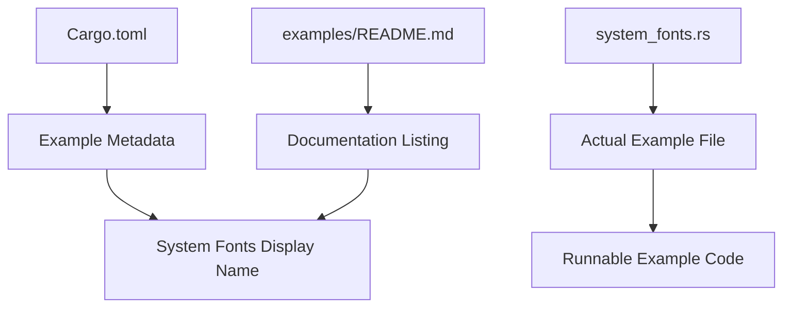

+++
title = "#22745 Rename the `system_fonts` example"
date = "2026-01-30T00:00:00"
draft = false
template = "pull_request_page.html"
in_search_index = true

[taxonomies]
list_display = ["show"]

[extra]
current_language = "en"
available_languages = {"en" = { name = "English", url = "/pull_request/bevy/2026-01/pr-22745-en-20260130" }, "zh-cn" = { name = "中文", url = "/pull_request/bevy/2026-01/pr-22745-zh-cn-20260130" }}
labels = ["D-Trivial", "C-Examples"]
+++

# Title

## Basic Information
- **Title**: Rename the `system_fonts` example
- **PR Link**: https://github.com/bevyengine/bevy/pull/22745
- **Author**: ickshonpe
- **Status**: MERGED
- **Labels**: D-Trivial, C-Examples, S-Needs-Review
- **Created**: 2026-01-30T11:57:07Z
- **Merged**: 2026-01-30T23:04:09Z
- **Merged By**: mockersf

## Description Translation

# Objective

The "system_fonts" example's name in its package meta data is the same as its filename, when the names of the other examples are capitalized and use spaces.

## Solution

Rename it.

## The Story of This Pull Request

This PR addresses a straightforward consistency issue in the Bevy examples documentation. The examples in Bevy's repository serve dual purposes: they are both runnable code demonstrating specific features and documented examples listed in the project's README. Consistency in how these examples are presented improves the developer experience by making the documentation more predictable and easier to navigate.

The problem was that the `system_fonts` example had inconsistent naming between its actual filename and its displayed name in documentation. The file itself follows Rust's snake_case naming convention (`system_fonts.rs`), which is standard for Rust source files. However, the package metadata in `Cargo.toml` and the entry in the examples README were using the same snake_case naming (`system_fonts`) instead of following the established pattern of using capitalized titles with spaces for display purposes.

Looking at other examples in the codebase, the standard pattern is clear. For instance, the "Standard Widgets" example appears in the README with that capitalized, spaced title, even though its filename is `standard_widgets.rs`. Similarly, "Text Background Colors" corresponds to `text_background_colors.rs`. The `system_fonts` example was an outlier that didn't follow this convention.

The solution is simple and mechanical: update the metadata to use the consistent display format. This involved two changes:

1. In `Cargo.toml`, the package metadata for the example needed to be updated from `name = "system_fonts"` to `name = "System Fonts"`.

2. In `examples/README.md`, the entry needed to be updated from the snake_case version to the capitalized version, and also needed to be moved to the correct alphabetical position since the README is sorted by the display names.

This change doesn't affect the functionality of the example itself - it only changes how the example is presented in documentation and metadata. The example code continues to work exactly as before, and developers can still run it using `cargo run --example system_fonts` (the command-line invocation uses the filename, not the display name).

The implementation follows the established conventions in the Bevy codebase without introducing any new patterns or complexity. It's a minor but important maintenance task that improves the overall consistency of the project's documentation.

## Visual Representation



## Key Files Changed

1. **`Cargo.toml` (+1/-1)**

This file contains the package metadata for Bevy examples. The change updates the display name of the `system_fonts` example from snake_case to a capitalized title with spaces.

```toml
# File: Cargo.toml
# Before:
[package.metadata.example.system_fonts]
name = "system_fonts"
description = "Demonstrates how to use system fonts"
category = "UI (User Interface)"
wasm = true

# After:
[package.metadata.example.system_fonts]
name = "System Fonts"
description = "Demonstrates how to use system fonts"
category = "UI (User Interface)"
wasm = true
```

2. **`examples/README.md` (+1/-1)**

This file contains the documentation listing all examples available in Bevy. The change updates the entry for the system fonts example and repositions it to maintain alphabetical order.

```markdown
# File: examples/README.md
# Before (two separate locations in the file):
[Strikethrough and Underline](../examples/ui/strikethrough_and_underline.rs) | Demonstrates how to display text with strikethrough and underline.
[Tab Navigation](../examples/ui/tab_navigation.rs) | Demonstration of Tab Navigation between UI elements

# ... later in the file ...
[Virtual Keyboard](../examples/ui/virtual_keyboard.rs) | Example demonstrating a virtual keyboard widget
[Window Fallthrough](../examples/ui/window_fallthrough.rs) | Illustrates how to access `winit::window::Window`'s `hittest` functionality.
[system_fonts](../examples/ui/system_fonts.rs) | Demonstrates how to use system fonts

# After (consolidated to correct alphabetical position):
[Strikethrough and Underline](../examples/ui/strikethrough_and_underline.rs) | Demonstrates how to display text with strikethrough and underline.
[System Fonts](../examples/ui/system_fonts.rs) | Demonstrates how to use system fonts
[Tab Navigation](../examples/ui/tab_navigation.rs) | Demonstration of Tab Navigation between UI elements

# ... and the old snake_case entry is completely removed ...
```

## Further Reading

- [Bevy Examples Documentation](https://github.com/bevyengine/bevy/tree/main/examples) - The main examples directory in the Bevy repository
- [Cargo Package Metadata Documentation](https://doc.rust-lang.org/cargo/reference/manifest.html#the-metadata-table) - Official documentation for Cargo metadata fields
- [Rust Naming Conventions](https://rust-lang.github.io/api-guidelines/naming.html) - Rust API guidelines for naming conventions
- [Bevy UI Examples](https://bevyengine.org/examples/ui/) - Official Bevy examples showcasing UI features

# Full Code Diff
diff --git a/Cargo.toml b/Cargo.toml
index 5e9f2d26060bb..717b40d97aa57 100644
--- a/Cargo.toml
+++ b/Cargo.toml
@@ -5360,7 +5360,7 @@ path = "examples/ui/system_fonts.rs"
 doc-scrape-examples = true
 
 [package.metadata.example.system_fonts]
-name = "system_fonts"
+name = "System Fonts"
 description = "Demonstrates how to use system fonts"
 category = "UI (User Interface)"
 wasm = true
diff --git a/examples/README.md b/examples/README.md
index 082ac278517fe..70c7cbfb8d442 100644
--- a/examples/README.md
+++ b/examples/README.md
@@ -597,6 +597,7 @@ Example | Description
 [Standard Widgets](../examples/ui/standard_widgets.rs) | Demonstrates use of core (headless) widgets in Bevy UI
 [Standard Widgets (w/Observers)](../examples/ui/standard_widgets_observers.rs) | Demonstrates use of core (headless) widgets in Bevy UI, with Observers
 [Strikethrough and Underline](../examples/ui/strikethrough_and_underline.rs) | Demonstrates how to display text with strikethrough and underline.
+[System Fonts](../examples/ui/system_fonts.rs) | Demonstrates how to use system fonts
 [Tab Navigation](../examples/ui/tab_navigation.rs) | Demonstration of Tab Navigation between UI elements
 [Text](../examples/ui/text.rs) | Illustrates creating and updating text
 [Text Background Colors](../examples/ui/text_background_colors.rs) | Demonstrates text background colors
@@ -617,7 +618,6 @@ Example | Description
 [Viewport Node](../examples/ui/viewport_node.rs) | Demonstrates how to create a viewport node with picking support
 [Virtual Keyboard](../examples/ui/virtual_keyboard.rs) | Example demonstrating a virtual keyboard widget
 [Window Fallthrough](../examples/ui/window_fallthrough.rs) | Illustrates how to access `winit::window::Window`'s `hittest` functionality.
-[system_fonts](../examples/ui/system_fonts.rs) | Demonstrates how to use system fonts
 
 ### Usage