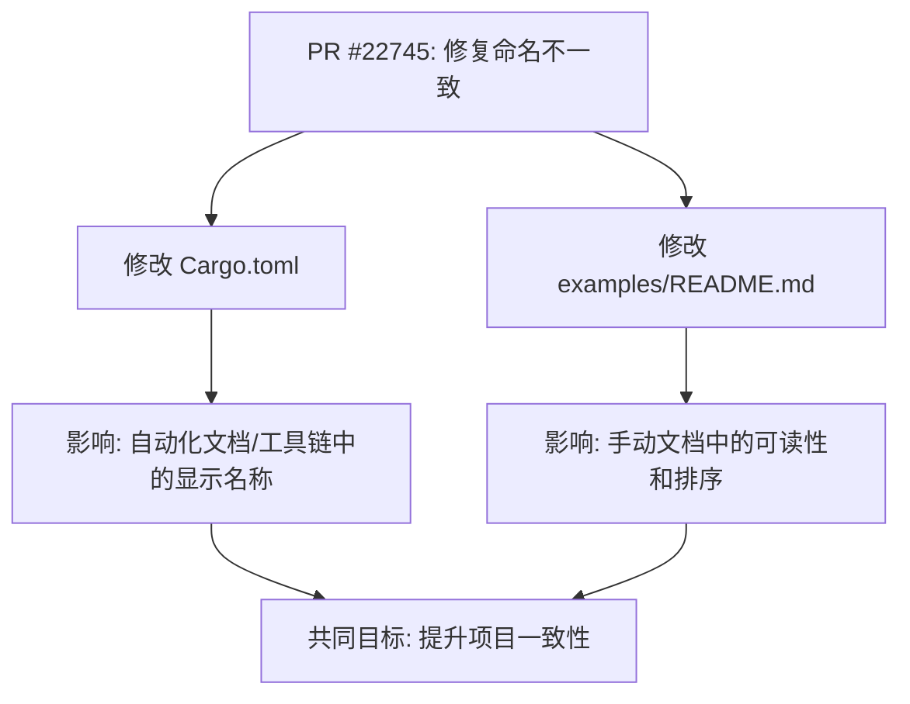

+++
title = "#22745 Rename the `system_fonts` example"
date = "2026-01-30T00:00:00"
draft = false
template = "pull_request_page.html"
in_search_index = false

[extra]
current_language = "zh-cn"
available_languages = {"en" = { name = "English", url = "/pull_request/bevy/2026-01/pr-22745-en-20260130" }, "zh-cn" = { name = "中文", url = "/pull_request/bevy/2026-01/pr-22745-zh-cn-20260130" }}
labels = ["D-Trivial", "C-Examples"]
+++

# Title

## Basic Information
- **Title**: Rename the `system_fonts` example
- **PR Link**: https://github.com/bevyengine/bevy/pull/22745
- **Author**: ickshonpe
- **Status**: MERGED
- **Labels**: D-Trivial, C-Examples, S-Needs-Review
- **Created**: 2026-01-30T11:57:07Z
- **Merged**: 2026-01-30T23:04:09Z
- **Merged By**: mockersf

## Description Translation
# 目标

"system_fonts" 示例在其包元数据中的名称与其文件名相同，而其他示例的名称使用首字母大写并包含空格。

## 解决方案

重命名它。

## The Story of This Pull Request

这个PR源于一次简单的代码库一致性检查。开发者 `ickshonpe` 注意到，在 Bevy 引擎的示例代码中，存在一个命名风格不一致的问题。具体来说，示例的展示名称（`name`）在元数据中应该遵循一种更友好、可读性更高的格式，例如 "System Fonts"，而不是直接使用代码文件名 "system_fonts"。

这种不一致性虽然不影响功能，但破坏了项目内部的一致性规范。在一个大型开源项目中，保持这类元数据（metadata）的格式统一非常重要。它直接影响到自动生成的文档、示例列表的可读性，以及开发者体验。当所有其他UI示例都使用首字母大写和空格的格式（如 "Standard Widgets"）时，一个使用蛇形命名法（snake_case）的条目会显得突兀，可能给贡献者造成困惑，不知道应该遵循哪种命名约定。

因此，这个PR的目标非常明确：修复这个单一的命名不一致问题，使其符合项目已有的标准。解决方案也极其直接：修改两个文件中的字符串。

首先，在 `Cargo.toml` 文件的 `[package.metadata.example.system_fonts]` 部分，将 `name` 字段的值从 `"system_fonts"` 改为 `"System Fonts"`。这个文件中的元数据通常用于工具链，例如生成文档网站上的示例列表。修改这里确保了在自动化流程中，该示例会以正确的格式显示。

其次，需要更新手写的 `examples/README.md` 文件。这个文件包含了一个所有示例的表格，开发者可以快速浏览。原先，`system_fonts` 条目被错误地以小写蛇形命名法放在列表底部。修复包含两步操作：第一，在列表的正确排序位置（按字母顺序在 "Strikethrough and Underline" 之后，"Tab Navigation" 之前）插入格式正确的新条目 `[System Fonts]`。第二，删除位于列表底部格式错误的老条目 `[system_fonts]`。这一步确保了手动维护的文档与自动生成的元数据保持一致。

这个PR虽然改动很小，只涉及两行代码的增删，但它体现了良好的软件工程实践：关注细节，保持代码库的整洁和一致性。这种维护工作有助于降低项目的认知负荷，让新开发者更容易理解和遵循现有的约定。

## Visual Representation

由于本次修改仅涉及两个独立文件中的字符串常量，它们之间没有运行时或编译时的依赖关系，因此关系图较为简单，主要展示修改的文件及其作用。



## Key Files Changed

1.  **`Cargo.toml`**
    *   **修改内容**：修改了 `system_fonts` 示例在 `package.metadata` 中的 `name` 字段。
    *   **原因**：使该示例在自动化工具（如文档生成器）中的显示名称与其他示例的格式（首字母大写+空格）保持一致。
    *   **代码差异**:
        ```toml
        # Before:
        name = "system_fonts"

        # After:
        name = "System Fonts"
        ```

2.  **`examples/README.md`**
    *   **修改内容**：在列表的正确位置插入了格式正确的 `[System Fonts]` 条目，并删除了列表底部格式错误的 `[system_fonts]` 条目。
    *   **原因**：保持手动维护的示例列表的格式一致性和正确的字母排序，避免混淆。
    *   **代码差异** (摘要):
        ```markdown
        # 文件：examples/README.md
        # Before:
        | [Strikethrough and Underline]... | Demonstrates how to display text...
        | [Tab Navigation]... | Demonstration of Tab Navigation...
        ...
        | [Window Fallthrough]... | Illustrates how to access...
        | [system_fonts]... | Demonstrates how to use system fonts

        # After:
        | [Strikethrough and Underline]... | Demonstrates how to display text...
        | [System Fonts]... | Demonstrates how to use system fonts # <- 新增行，格式正确且位置正确
        | [Tab Navigation]... | Demonstration of Tab Navigation...
        ...
        | [Window Fallthrough]... | Illustrates how to access...
        # 格式错误的 `[system_fonts]` 行已被删除
        ```

## Further Reading

1.  **Cargo 工作空间和示例**：要了解 Cargo 如何管理示例以及 `[[example]]` 和 `[package.metadata.example]` 部分的用途，可以查阅 [The Cargo Book - Workspaces](https://doc.rust-lang.org/cargo/reference/workspaces.html) 和 [The Cargo Book - Configuration](https://doc.rust-lang.org/cargo/reference/config.html)。
2.  **Rust 命名约定**：关于 Rust 语言中不同标识符（如函数、变量、模块）推荐的命名风格（蛇形命名法 `snake_case`，大驼峰命名法 `PascalCase` 等），参考 [Rust API Guidelines - Naming](https://rust-lang.github.io/api-guidelines/naming.html)。需要注意的是，本例中修改的是面向用户的*显示名称*，而非代码标识符，因此不受代码命名约定的严格限制。
3.  **Bevy 示例库**：要探索 Bevy 引擎的其他示例，了解其功能和 API 用法，可以直接查看 GitHub 仓库中的 [examples 目录](https://github.com/bevyengine/bevy/tree/main/examples)。