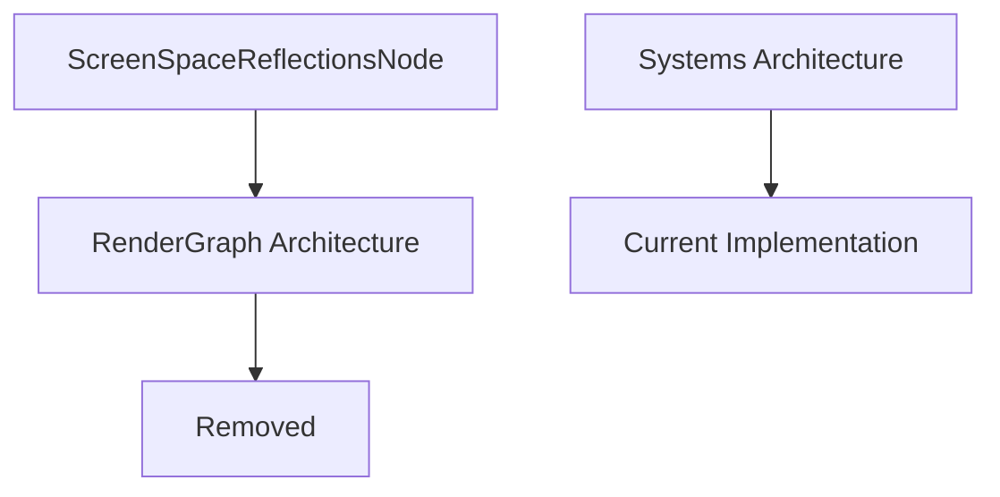

+++
title = "#22751 Remove unused `ScreenSpaceReflectionNode`."
date = "2026-01-31T00:00:00"
draft = false
template = "pull_request_page.html"
in_search_index = true

[taxonomies]
list_display = ["show"]

[extra]
current_language = "en"
available_languages = {"en" = { name = "English", url = "/pull_request/bevy/2026-01/pr-22751-en-20260131" }, "zh-cn" = { name = "中文", url = "/pull_request/bevy/2026-01/pr-22751-zh-cn-20260131" }}
labels = ["A-Rendering"]
+++

# Title

## Basic Information
- **Title**: Remove unused `ScreenSpaceReflectionNode`.
- **PR Link**: https://github.com/bevyengine/bevy/pull/22751
- **Author**: Breakdown-Dog
- **Status**: MERGED
- **Labels**: A-Rendering, S-Ready-For-Final-Review
- **Created**: 2026-01-31T07:51:25Z
- **Merged**: 2026-01-31T22:12:41Z
- **Merged By**: mockersf

## Description Translation

# Objective

- Since `RenderGraph` and `ViewNode` have been removed in favor of systems, the `ScreenSpaceReflectionNode` is no longer needed.

## Solution

- I just deleted the struct.

## Testing

- CI

---

## The Story of This Pull Request

This PR represents a cleanup task in the Bevy rendering codebase. The developer identified that a specific rendering component, `ScreenSpaceReflectionsNode`, had become obsolete due to architectural changes in Bevy's rendering system.

The context for this change stems from Bevy's ongoing migration from a `RenderGraph`-based rendering architecture to a system-based approach. In earlier versions of Bevy, rendering operations were organized into a graph structure where nodes like `ScreenSpaceReflectionsNode` represented specific rendering passes. Each node in the render graph would execute rendering logic in a specific order, with data flowing between nodes.

With the transition to systems, the rendering logic was restructured to use Bevy's ECS (Entity Component System) architecture more directly. Systems replaced render graph nodes as the primary way to organize rendering operations. This architectural shift left behind several render graph node definitions that were no longer being used in the codebase.

The solution implemented in this PR is straightforward: removing the dead code. The `ScreenSpaceReflectionsNode` struct was defined but no longer referenced anywhere in the codebase after the render graph migration. The developer correctly identified this as technical debt and removed it.

From a technical perspective, this change demonstrates good code maintenance practices. The struct had become:
1. Unused - No other code was creating instances of `ScreenSpaceReflectionsNode`
2. Unnecessary - The functionality it represented was now handled by systems
3. Potentially confusing - New developers encountering this code might think render graph nodes were still part of the rendering architecture

The implementation consists of simply deleting four lines of code from the SSR (Screen Space Reflections) module. The struct was decorated with `#[derive(Default)]` and had a doc comment explaining its purpose as "The node in the render graph that traces screen space reflections," which further confirms its render graph origins.

This cleanup has several positive impacts:
- Reduces codebase complexity by removing unused types
- Eliminates potential confusion about the current rendering architecture
- Follows the principle of removing dead code to keep the codebase maintainable
- May slightly improve compilation times by reducing the amount of code the compiler needs to process

The testing approach was appropriate for this type of change. Since the struct was unused, running the existing CI tests was sufficient to verify that the removal didn't break any functionality. If the struct had been accidentally used somewhere, the CI tests would have failed due to compilation errors.

This PR exemplifies a common pattern in software development where architectural migrations leave behind orphaned code. Regular cleanup of such code is important for long-term maintainability. The change is minimal but contributes to the overall health of the codebase by aligning it with the current architectural patterns.

## Visual Representation



## Key Files Changed

### `crates/bevy_pbr/src/ssr/mod.rs` (+0/-4)

This file contains the screen space reflections implementation. The change removed a struct that was no longer used after the migration from render graph nodes to systems.

**Before:**
```rust
/// The node in the render graph that traces screen space reflections.
#[derive(Default)]
pub struct ScreenSpaceReflectionsNode;
```

**After:**
The struct and its doc comment were completely removed.

The `ScreenSpaceReflectionsNode` struct was part of Bevy's previous render graph architecture. It would have been used as a node in the render graph to execute screen space reflection calculations. With the transition to systems-based rendering, this node-based approach was replaced, making the struct obsolete.

## Further Reading

- [Bevy Render Graph Migration Documentation](https://bevyengine.org/learn/book/migration-guides/)
- [Bevy ECS and Systems Documentation](https://bevyengine.org/learn/book/getting-started/ecs/)
- [Screen Space Reflections in Computer Graphics](https://en.wikipedia.org/wiki/Screen_space_reflection)
- [Code Smells: Dead Code](https://refactoring.guru/smells/dead-code)

# Full Code Diff

```diff
diff --git a/crates/bevy_pbr/src/ssr/mod.rs b/crates/bevy_pbr/src/ssr/mod.rs
index 978441aeab3ba..7c2c238e4e644 100644
--- a/crates/bevy_pbr/src/ssr/mod.rs
+++ b/crates/bevy_pbr/src/ssr/mod.rs
@@ -160,10 +160,6 @@ pub struct ScreenSpaceReflectionsUniform {
     use_secant: u32,
 }
 
-/// The node in the render graph that traces screen space reflections.
-#[derive(Default)]
-pub struct ScreenSpaceReflectionsNode;
-
 /// Identifies which screen space reflections render pipeline a view needs.
 #[derive(Component, Deref, DerefMut)]
 pub struct ScreenSpaceReflectionsPipelineId(pub CachedRenderPipelineId);
```