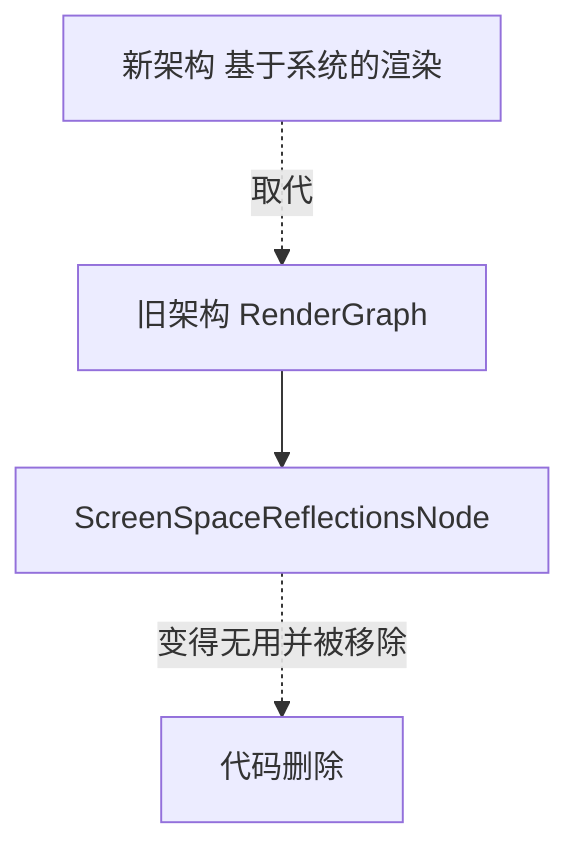

+++
title = "#22751 Remove unused `ScreenSpaceReflectionNode`."
date = "2026-01-31T00:00:00"
draft = false
template = "pull_request_page.html"
in_search_index = false

[extra]
current_language = "zh-cn"
available_languages = {"en" = { name = "English", url = "/pull_request/bevy/2026-01/pr-22751-en-20260131" }, "zh-cn" = { name = "中文", url = "/pull_request/bevy/2026-01/pr-22751-zh-cn-20260131" }}
+++

# Title

## 基本信息
- **标题**: Remove unused `ScreenSpaceReflectionNode`.
- **PR 链接**: https://github.com/bevyengine/bevy/pull/22751
- **作者**: Breakdown-Dog
- **状态**: 已合并
- **标签**: A-Rendering, S-Ready-For-Final-Review
- **创建时间**: 2026-01-31T07:51:25Z
- **合并时间**: 2026-01-31T22:12:41Z
- **合并者**: mockersf

## 描述翻译
**目标**
- 由于 `RenderGraph` 和 `ViewNode` 已被系统（systems）取代，`ScreenSpaceReflectionNode` 不再需要。

**解决方案**
- 我只是删除了这个结构体（struct）。

**测试**
- CI（持续集成）

---

## 这个 Pull Request 的故事

这个 PR 是一次简单的代码清理，它反映了一个更大规模的架构迁移正在 B evy 渲染系统中发生。故事的核心是：一个过时的组件被识别并移除，以确保代码库的整洁和架构的一致性。

问题的根源在于 Bevy 渲染模块的演进。在过去的版本中，Bevy 使用一种基于 `RenderGraph` 和 `ViewNode` 的声明式系统来组织渲染管线。屏幕空间反射（Screen Space Reflection, SSR）特性作为其中的一部分，有一个对应的节点 `ScreenSpaceReflectionsNode`，负责在渲染图中安排 SSR 计算任务。

然而，Bevy 的渲染架构方向发生了转变。团队决定采用更符合 ECS（Entity Component System）范式、更灵活且性能可能更优的方案：直接用系统（systems）来驱动渲染逻辑。这意味着整个 `RenderGraph` 和 `ViewNode` 的抽象层都被逐步废弃和移除。在这个 PR 被创建时，那次迁移的主体工作已经完成。结果就是，像 `ScreenSpaceReflectionsNode` 这样专门为旧渲染图模型设计的组件，虽然其定义还在代码中，但已经没有任何代码路径会实例化或调用它。它变成了“死代码”（dead code）。

识别并移除死代码是软件维护中的一项重要实践。它减少了代码库的认知负担，让新开发者不会被无用的接口所迷惑，也消除了未来可能由这些无用代码引发编译警告或错误的风险。因此，解决这个问题的方案非常直接：删除不再使用的结构体定义。

从技术实现来看，这个更改极其简单，只涉及删除四行代码。但这简单的背后，是对项目架构状态的清晰理解和对代码“卫生”的坚持。开发者 `Breakdown-Dog` 准确地识别出这个结构体是旧架构的遗物，并提交了删除它的 PR。在审查和合并过程中，没有引入新的测试，而是依赖现有的 CI（持续集成）流程来确保这次删除不会意外破坏任何功能——如果这个节点还在被使用，那么 CI 的编译检查就会失败。

这个 PR 虽然微小，但它代表了软件项目健康演进的一个环节：随着底层抽象的重构，及时清理上层的、依赖于旧抽象的实现细节。它使得代码库与当前活跃的架构（基于系统的渲染）保持同步，避免了技术债的积累。

## 视觉表示



## 关键文件更改

**crates/bevy_pbr/src/ssr/mod.rs** (+0/-4)
这个文件是屏幕空间反射（SSR）特性的主模块。更改内容是移除了一个为废弃的 `RenderGraph` 架构设计的节点结构体。

**代码差异：**
```rust
// File: crates/bevy_pbr/src/ssr/mod.rs
// 删除前的代码片段：
pub struct ScreenSpaceReflectionsUniform {
    use_secant: u32,
}

/// The node in the render graph that traces screen space reflections.
#[derive(Default)]
pub struct ScreenSpaceReflectionsNode; // <-- 此结构体被删除

/// Identifies which screen space reflections render pipeline a view needs.
#[derive(Component, Deref, DerefMut)]
pub struct ScreenSpaceReflectionsPipelineId(pub CachedRenderPipelineId);

// 删除后，`ScreenSpaceReflectionsNode` 的定义及其上方的注释行被移除。
```

**说明：**
`ScreenSpaceReflectionsNode` 结构体原本是 `RenderGraph` 中的一个节点（Node），用于在旧的渲染图系统中执行 SSR 计算。随着渲染架构迁移到纯系统驱动，这个节点不再被使用。此次 PR 将其定义从模块中删除，是紧跟架构变化、保持代码整洁的直接操作。

## 进一步阅读

1.  **Bevy 官方文档 - 渲染（Rendering）**：了解 Bevy 当前渲染系统的组织方式。
2.  **ECS（实体组件系统）模式**：理解 Bevy 核心架构思想，有助于明白为何从“图”转向“系统”。
3.  **代码重构（Refactoring）与死代码消除（Dead Code Elimination）**：关于保持代码库健康的最佳实践。
4.  **Bevy 项目相关的其他 PR**：寻找关于移除 `RenderGraph` 和 `ViewNode` 的大型迁移 PR，以获取完整的架构变更背景。