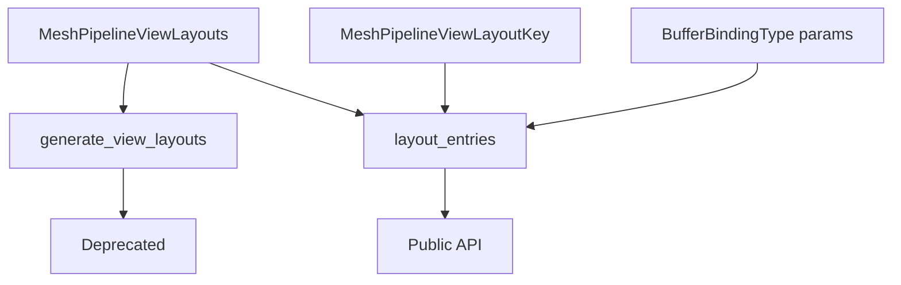

+++
title = "#17714 deprecated generate_view_layouts in favor of layout_entries (#17537)"
date = "2026-02-06T00:00:00"
draft = false
template = "pull_request_page.html"
in_search_index = true

[taxonomies]
list_display = ["show"]

[extra]
current_language = "en"
available_languages = {"en" = { name = "English", url = "/pull_request/bevy/2026-02/pr-17714-en-20260206" }, "zh-cn" = { name = "中文", url = "/pull_request/bevy/2026-02/pr-17714-zh-cn-20260206" }}
labels = ["A-Rendering", "C-Code-Quality"]
+++

# Title

## Basic Information
- **Title**: deprecated generate_view_layouts in favor of layout_entries (#17537)
- **PR Link**: https://github.com/bevyengine/bevy/pull/17714
- **Author**: Utope
- **Status**: MERGED
- **Labels**: A-Rendering, C-Code-Quality, S-Ready-For-Final-Review
- **Created**: 2025-02-07T00:18:05Z
- **Merged**: 2026-02-06T20:39:02Z
- **Merged By**: alice-i-cecile

## Description Translation
**Objective**

Deprecated `generate_view_layouts` in favor of `layout_entries` as described in #17537.

## The Story of This Pull Request

This PR implements a straightforward API evolution in Bevy's rendering system, specifically within the mesh pipeline's view binding infrastructure. The core issue addressed is moving from a function that pre-generates all possible view layouts to one that generates layouts on-demand based on specific configuration keys.

The problem stemmed from the `generate_view_layouts` function's approach of iterating through all possible combinations of `MeshPipelineViewLayoutKey` flags to create layout entries. This brute-force method had inherent inefficiencies when only a subset of configurations was needed. The function's internal logic for creating layout entries was already encapsulated in the `layout_entries` function, but this function was marked as private, limiting its utility for developers who needed more granular control.

The solution approach is a classic API refactoring pattern: expose the underlying building block function and deprecate the higher-level convenience function. The developer made the previously private `layout_entries` function public and added a deprecation notice to `generate_view_layouts`, guiding users toward the new, more flexible API. This approach maintains backward compatibility while steering the codebase toward more efficient patterns.

From an implementation perspective, the changes are minimal but significant. The `layout_entries` function signature already contained the necessary parameters: `clustered_forward_buffer_binding_type`, `visibility_ranges_buffer_binding_type`, and most importantly, `layout_key: MeshPipelineViewLayoutKey`. This key-based approach allows callers to generate only the specific layout they need, avoiding unnecessary computation for unused combinations. The function returns a vector of `BindGroupLayoutEntry` structures, which can be used directly to create bind group layouts.

The technical insight here is about API design trade-offs. While `generate_view_layouts` provided convenience by handling all cases automatically, it came with performance overhead and reduced flexibility. The new approach empowers developers to optimize their rendering pipeline by only creating the layouts actually needed for their specific use case. This aligns with Bevy's overall philosophy of giving developers control over performance-critical paths.

The impact of this change is primarily on API usage patterns. Existing code using `generate_view_layouts` will continue to work but will generate deprecation warnings, encouraging migration to the new approach. New code can use `layout_entries` directly for better performance when the specific layout key is known. This change also potentially reduces memory usage by avoiding the storage of unused layout combinations.

## Visual Representation



## Key Files Changed

### `crates/bevy_pbr/src/render/mesh_view_bindings.rs` (+2/-1)

This file contains the core rendering logic for mesh view bindings in Bevy's PBR (Physically Based Rendering) pipeline. The changes modify how bind group layouts are generated for mesh views.

**Key modifications:**

1. **Making `layout_entries` function public:**
   ```rust
   // Before:
   fn layout_entries(
       clustered_forward_buffer_binding_type: BufferBindingType,
       visibility_ranges_buffer_binding_type: BufferBindingType,
       layout_key: MeshPipelineViewLayoutKey,
   ) -> Vec<BindGroupLayoutEntry> {
   ```

   ```rust
   // After:
   pub fn layout_entries(
       clustered_forward_buffer_binding_type: BufferBindingType,
       visibility_ranges_buffer_binding_type: BufferBindingType,
       layout_key: MeshPipelineViewLayoutKey,
   ) -> Vec<BindGroupLayoutEntry> {
   ```

   This change exposes the previously internal layout generation logic, allowing developers to generate specific layout entries on demand.

2. **Deprecating `generate_view_layouts` function:**
   ```rust
   // Before:
   /// Generates all possible view layouts for the mesh pipeline, based on all combinations of
   /// [`MeshPipelineViewLayoutKey`] flags.
   pub fn generate_view_layouts(
       render_device: &RenderDevice,
       render_adapter: &RenderAdapter,
   // ... function implementation
   ```

   ```rust
   // After:
   /// Generates all possible view layouts for the mesh pipeline, based on all combinations of
   /// [`MeshPipelineViewLayoutKey`] flags.
   #[deprecated(since = "0.16.0", note = "Use `layout_entries` instead")]
   pub fn generate_view_layouts(
       render_device: &RenderDevice,
       render_adapter: &RenderAdapter,
   // ... function implementation (unchanged)
   ```

   The deprecation attribute signals that this function should no longer be used in new code and provides guidance for migration.

## Further Reading

1. **Bevy Render Graph Documentation**: Understanding how bind groups and layouts work within Bevy's render graph system
2. **WGSL Bind Group Layouts**: The underlying WebGPU Shading Language concepts for resource binding
3. **API Evolution Patterns**: Best practices for deprecating and evolving public APIs in Rust libraries
4. **Issue #17537**: The original issue that proposed this API change, providing additional context about the motivation

# Full Code Diff
```diff
diff --git a/crates/bevy_pbr/src/render/mesh_view_bindings.rs b/crates/bevy_pbr/src/render/mesh_view_bindings.rs
index 796ae096c2e26..e527a49daa719 100644
--- a/crates/bevy_pbr/src/render/mesh_view_bindings.rs
+++ b/crates/bevy_pbr/src/render/mesh_view_bindings.rs
@@ -195,7 +195,7 @@ pub(crate) fn buffer_layout(
 }
 
 /// Returns the appropriate bind group layout vec based on the parameters
-fn layout_entries(
+pub fn layout_entries(
     clustered_forward_buffer_binding_type: BufferBindingType,
     visibility_ranges_buffer_binding_type: BufferBindingType,
     layout_key: MeshPipelineViewLayoutKey,
@@ -470,6 +470,7 @@ impl MeshPipelineViewLayouts {
 
 /// Generates all possible view layouts for the mesh pipeline, based on all combinations of
 /// [`MeshPipelineViewLayoutKey`] flags.
+#[deprecated(since = "0.16.0", note = "Use `layout_entries` instead")]
 pub fn generate_view_layouts(
     render_device: &RenderDevice,
     render_adapter: &RenderAdapter,
```