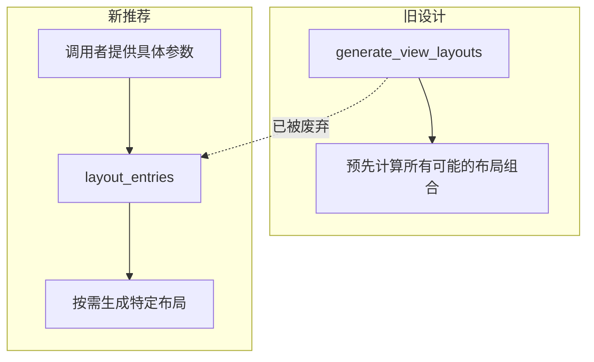

+++
title = "#17714 deprecated generate_view_layouts in favor of layout_entries (#17537)"
date = "2026-02-06T00:00:00"
draft = false
template = "pull_request_page.html"
in_search_index = false

[extra]
current_language = "zh-cn"
available_languages = {"en" = { name = "English", url = "/pull_request/bevy/2026-02/pr-17714-en-20260206" }, "zh-cn" = { name = "中文", url = "/pull_request/bevy/2026-02/pr-17714-zh-cn-20260206" }}
+++

# Title

## Basic Information
- **标题**: deprecated generate_view_layouts in favor of layout_entries (#17537)
- **PR 链接**: https://github.com/bevyengine/bevy/pull/17714
- **作者**: Utope
- **状态**: 已合并
- **标签**: A-Rendering, C-Code-Quality, S-Ready-For-Final-Review
- **创建时间**: 2025-02-07T00:18:05Z
- **合并时间**: 2026-02-06T20:39:02Z
- **合并者**: alice-i-cecile

## Description Translation
# Objective

按照 #17537 中的描述，将 `generate_view_layouts` 函数标记为已废弃 (deprecated)，并推荐使用 `layout_entries` 作为替代。

## The Story of This Pull Request

这个 PR 解决了一个关于渲染管线布局 (layout) 生成的 API 设计问题。在 `bevy_pbr` 模块中，`MeshPipelineViewLayouts` 结构体负责管理视图相关的绑定组布局 (bind group layouts)。原先，系统提供了一个 `generate_view_layouts` 函数，它的设计是基于 `MeshPipelineViewLayoutKey` 的所有可能标志位组合，预先生成所有可能的布局。

然而，这种预先全部生成 (`generate`) 的方式在设计和性能上存在可以优化的空间。问题在于，一个具体的渲染场景通常只使用所有可能布局组合中的一个子集。每次都调用 `generate_view_layouts` 来创建所有布局，即使大部分不会被用到，也会带来不必要的开销。

实际上，在代码库内部，已经存在一个更精细化的 `layout_entries` 函数。这个函数接受具体的参数，如 `clustered_forward_buffer_binding_type`、`visibility_ranges_buffer_binding_type` 和 `layout_key`，并基于这些精确的参数动态生成对应的布局条目。这种按需生成的方式更为高效和灵活。

因此，这个 PR 的核心思路是引导用户从粗粒度的“批量生成”模式转向细粒度的“按需创建”模式。实现方法非常直接：
1.  将原本私有的 `fn layout_entries(...)` 函数修改为 `pub fn layout_entries(...)`，使其对外公开可用。
2.  在原有的 `pub fn generate_view_layouts(...)` 函数上添加 `#[deprecated]` 属性，并指明应该使用 `layout_entries` 作为替代方案。这为现有用户提供了清晰的迁移路径，同时保持了向后兼容性，避免立即造成破坏性变更。

这种改动体现了 API 设计中的一个常见优化模式：当发现一个更通用、更高效的底层原语时，将其暴露出来，并逐步废弃掉那个基于它构建的、但可能不够灵活或效率较低的旧接口。从工程角度看，这是一个干净利落的重构。它没有改变系统的核心逻辑，只是调整了功能的访问级别和使用建议，从而提升了代码库的长期健康度和使用效率。

## Visual Representation

这个 PR 修改了两个关键函数的关系，下图展示了它们设计理念的对比：



## Key Files Changed

### `crates/bevy_pbr/src/render/mesh_view_bindings.rs` (+2/-1)

这个文件是 PR 修改的唯一文件，它包含了与网格渲染视图相关的绑定组布局逻辑。修改点非常集中：

1.  **将 `layout_entries` 函数公开**：此前它是一个内部辅助函数，现在变为公有 API，允许外部代码直接调用它来生成特定参数的布局条目。
2.  **废弃 `generate_view_layouts` 函数**：给这个函数添加了废弃注解，引导用户转向新的 `layout_entries` 函数。

关键代码修改如下：
```rust
// 修改前 (第198行):
fn layout_entries(

// 修改后 (第198行):
pub fn layout_entries(

// 新增的废弃注解 (第473行，在 generate_view_layouts 函数上方):
#[deprecated(since = "0.16.0", note = "Use `layout_entries` instead")]
```
第一处修改将 `layout_entries` 的可见性从 `crate` 私有提升为公开 (`pub`)，这是新 API 得以使用的前提。
第二处修改是标准的 Rust 废弃标记，它会在编译时向仍在使用旧函数的开发者发出警告，并提供清晰的迁移指导 (`note`)。

## Further Reading

*   Rust `#[deprecated]` 属性官方文档：了解如何在 Rust 中正确地废弃 API 并管理版本迁移。
*   Bevy 渲染管线文档：深入理解 `MeshPipelineViewLayouts`、`BindGroupLayout` 及其在 Bevy 渲染架构中的作用。
*   API 设计原则：关于何时以及如何重构和演进公共 API 的通用最佳实践。

# Full Code Diff
```
diff --git a/crates/bevy_pbr/src/render/mesh_view_bindings.rs b/crates/bevy_pbr/src/render/mesh_view_bindings.rs
index 796ae096c2e26..e527a49daa719 100644
--- a/crates/bevy_pbr/src/render/mesh_view_bindings.rs
+++ b/crates/bevy_pbr/src/render/mesh_view_bindings.rs
@@ -195,7 +195,7 @@ pub(crate) fn buffer_layout(
 }
 
 /// Returns the appropriate bind group layout vec based on the parameters
-fn layout_entries(
+pub fn layout_entries(
     clustered_forward_buffer_binding_type: BufferBindingType,
     visibility_ranges_buffer_binding_type: BufferBindingType,
     layout_key: MeshPipelineViewLayoutKey,
@@ -470,6 +470,7 @@ impl MeshPipelineViewLayouts {
 
 /// Generates all possible view layouts for the mesh pipeline, based on all combinations of
 /// [`MeshPipelineViewLayoutKey`] flags.
+#[deprecated(since = "0.16.0", note = "Use `layout_entries` instead")]
 pub fn generate_view_layouts(
     render_device: &RenderDevice,
     render_adapter: &RenderAdapter,
```