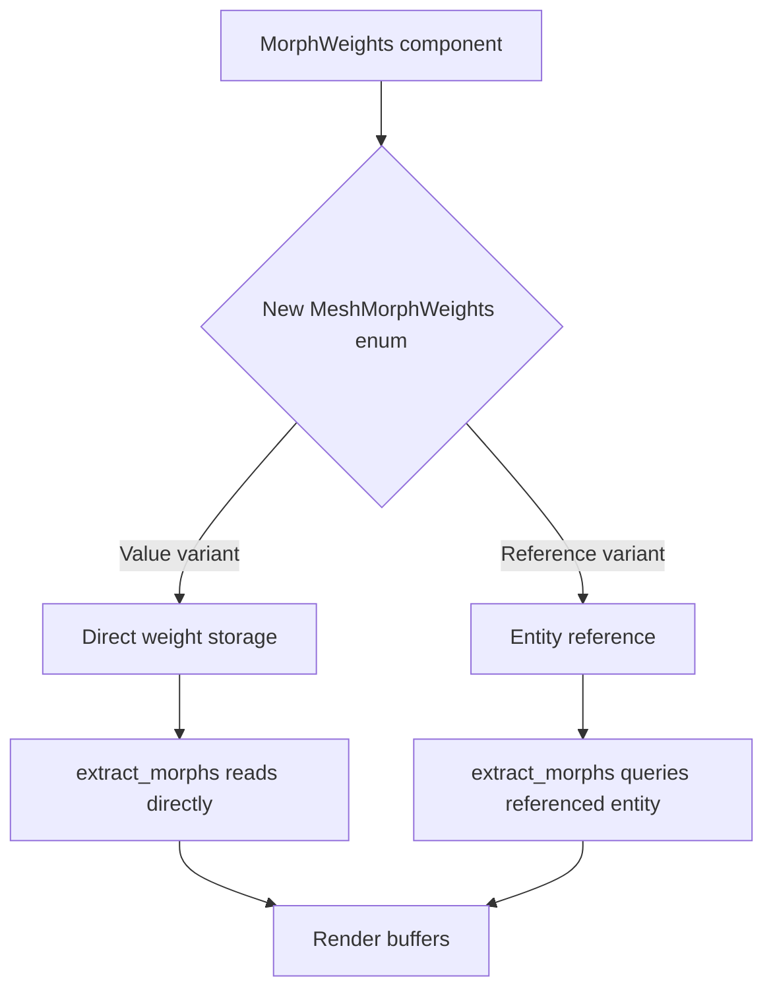

+++
title = "#18465 Restructure morph target pipeline to reduce crate dependencies"
date = "2026-02-13T00:00:00"
draft = false
template = "pull_request_page.html"
in_search_index = true

[taxonomies]
list_display = ["show"]

[extra]
current_language = "en"
available_languages = {"en" = { name = "English", url = "/pull_request/bevy/2026-02/pr-18465-en-20260213" }, "zh-cn" = { name = "中文", url = "/pull_request/bevy/2026-02/pr-18465-zh-cn-20260213" }}
labels = ["A-Rendering", "C-Code-Quality", "A-Animation", "M-Migration-Guide"]
+++

# Title

## Basic Information
- **Title**: Restructure morph target pipeline to reduce crate dependencies
- **PR Link**: https://github.com/bevyengine/bevy/pull/18465
- **Author**: greeble-dev
- **Status**: MERGED
- **Labels**: A-Rendering, C-Code-Quality, S-Ready-For-Final-Review, A-Animation, M-Migration-Guide
- **Created**: 2025-03-21T16:01:40Z
- **Merged**: 2026-02-13T04:20:26Z
- **Merged By**: alice-i-cecile

## Description Translation

The PR description is already in English, so we include it as-is:

## The Story of This Pull Request

This pull request addresses several interconnected problems in Bevy's morph target animation system. At its core, the issue was an architectural design that created unnecessary dependencies between crates and introduced redundant data copying. The previous implementation required a specific system ordering between `bevy_animation`, `bevy_mesh`, and `bevy_render`, creating brittle cross-crate dependencies.

The problem manifested in three concrete ways. First, there was a system ordering dependency where `animate_targets` in `bevy_animation` had to run before `InheritWeightSystems` (defined in `bevy_mesh`), which contained `inherit_weights` from `bevy_render`. This created a fragile dependency chain across three separate crates.

Second, the data flow involved unnecessary copying. The weights went from `MorphWeights` → `MeshMorphWeights` → render buffers. The intermediate copy from `MorphWeights` to `MeshMorphWeights` was redundant since the render extraction would copy them again anyway. This wasted CPU cycles and memory bandwidth.

Third, the system imposed rigid entity relationships - `MeshMorphWeights` components had to be on child entities of the entity with `MorphWeights`. While this worked for glTF imports, it limited flexibility for custom use cases.

The solution was to restructure the `MeshMorphWeights` component itself. Instead of being a simple container for weight values, it became an enum that could either hold its own weights directly or reference another entity containing a `MorphWeights` component:

```rust
// Before:
struct MeshMorphWeights { weights: Vec<f32> }

// After:
enum MeshMorphWeights {
    Value { weights: Vec<f32> },
    Reference(Entity),
}
```

This seemingly simple change had profound architectural implications. By making `MeshMorphWeights` capable of referencing another entity, the entire `inherit_weights` system could be eliminated. The render extraction system (`extract_morphs` in `bevy_pbr`) now handles both cases: for `Value` variants, it uses the stored weights directly; for `Reference` variants, it looks up the referenced entity's `MorphWeights` component.

The implementation required coordinated changes across multiple crates:

1. **Removing system dependencies**: In `bevy_animation`, the explicit ordering dependency was removed. In `bevy_mesh`, the `InheritWeightSystems` system set was eliminated entirely since no systems needed to run in that set anymore.

2. **Updating the GLTF loader**: The loader needed to adapt to the new enum structure. When loading glTF files with morph targets, it now creates `MeshMorphWeights::Reference` components that point to the parent node's entity, rather than copying weights into each mesh entity.

3. **Simplifying the render pipeline**: The entire `MorphPlugin` and its `inherit_weights` system were removed from `bevy_render`, as they were no longer needed.

4. **Updating extraction logic**: The `extract_morphs` system in `bevy_pbr` was updated to handle both variants of the enum, querying referenced entities when necessary.

The performance impact was significant. On the `many_morph_targets` example, the `inherit_weights` system time dropped from 30.3μs to zero. Although `extract_morphs` increased slightly from 42.5μs to 48.9μs (due to the entity lookup for references), the overall throughput improved by 50% - from 14 to 21 meshes processed per microsecond.

Beyond performance, the new design offers greater flexibility. A `MeshMorphWeights` component can now reference any entity with a `MorphWeights` component, not just its parent. This opens up possibilities for more complex animation setups where multiple meshes share weight values from arbitrary entities in the scene hierarchy.

One important technical detail is how the system handles missing or mismatched references. The extraction code gracefully handles cases where a referenced entity doesn't have `MorphWeights` by skipping that mesh. This provides robustness while maintaining performance.

The migration path for users is straightforward. Code that previously used `MeshMorphWeights::new()` needs to wrap weights in `MeshMorphWeights::Value`. Code that relied on the automatic parent-child copying needs to explicitly use `MeshMorphWeights::Reference` pointing to the appropriate entity.

This change demonstrates a common optimization pattern in ECS-based systems: reducing data movement and eliminating intermediate copies by using references or indices. It also shows how enum-based designs can provide flexibility while maintaining clear semantics - the `MeshMorphWeights` enum makes the two usage patterns explicit and type-safe.

## Visual Representation



## Key Files Changed

1. **`crates/bevy_mesh/src/morph.rs` (+42/-44)**
   - **What changed**: The `MeshMorphWeights` struct was changed to an enum with `Value` and `Reference` variants. This is the core change that enables the new architecture.
   - **Why it matters**: This change eliminates the need for the intermediate copy system while providing flexibility for both direct weight storage and entity references.

   **Key code change:**
   ```rust
   // Before:
   #[derive(Reflect, Default, Debug, Clone, Component)]
   pub struct MeshMorphWeights {
       weights: Vec<f32>,
   }
   
   // After:
   #[derive(Reflect, Debug, Clone, Component)]
   pub enum MeshMorphWeights {
       Value { weights: Vec<f32> },
       Reference(#[entities] Entity),
   }
   ```

2. **`crates/bevy_gltf/src/loader/mod.rs` (+28/-25)**
   - **What changed**: Updated GLTF loading to use the new `MeshMorphWeights::Reference` instead of copying weights to each mesh entity.
   - **Why it matters**: This ensures imported glTF files work correctly with the new system, creating references to the parent node's `MorphWeights` component.

   **Key code change:**
   ```rust
   // Before: Creating MeshMorphWeights with copied weights
   mesh_entity.insert(MeshMorphWeights::new(weights).unwrap());
   
   // After: Creating a reference to the parent entity
   mesh_entity.insert(MeshMorphWeights::Reference(parent_entity));
   ```

3. **`release-content/migration-guides/mesh_morph_weights.md` (+53/-0)**
   - **What changed**: Added a new migration guide explaining how to update code for the breaking changes.
   - **Why it matters**: Provides clear guidance for users migrating from Bevy 0.18 to 0.19, explaining both the architectural changes and practical code updates.

4. **`crates/bevy_render/src/mesh/mod.rs` (+1/-35)**
   - **What changed**: Removed the entire `MorphPlugin` and `inherit_weights` system.
   - **Why it matters**: These systems were made obsolete by the new architecture where weights are either stored directly or referenced.

5. **`crates/bevy_pbr/src/render/morph.rs` (+11/-3)**
   - **What changed**: Updated `extract_morphs` to handle both variants of `MeshMorphWeights`.
   - **Why it matters**: This is where the new design actually gets used - the extraction system now queries referenced entities when needed.

   **Key code change:**
   ```rust
   // Updated extraction logic:
   let Ok(weights) = (match mesh_weights {
       MeshMorphWeights::Reference(entity) => {
           weights_query.get(*entity).map(MorphWeights::weights)
       }
       MeshMorphWeights::Value { weights } => Ok(weights.as_slice()),
   }) else {
       continue;
   };
   ```

## Further Reading

- [Bevy's ECS documentation](https://docs.rs/bevy/latest/bevy/ecs/index.html) - Understanding Bevy's Entity Component System
- [Morph target animation concepts](https://en.wikipedia.org/wiki/Morph_target_animation) - Background on the animation technique
- [glTF morph targets specification](https://registry.khronos.org/glTF/specs/2.0/glTF-2.0.html#morph-targets) - How morph targets work in the glTF format
- [System ordering in Bevy](https://bevy-cheatbook.github.io/programming/systems.html#system-ordering) - Understanding system execution order
- [Rust enum patterns](https://doc.rust-lang.org/book/ch06-00-enums.html) - How Rust enums enable type-safe state representation