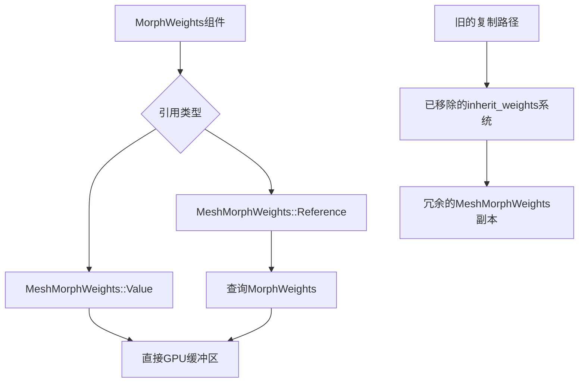

+++
title = "#18465 Restructure morph target pipeline to reduce crate dependencies"
date = "2026-02-13T00:00:00"
draft = false
template = "pull_request_page.html"
in_search_index = false

[extra]
current_language = "zh-cn"
available_languages = {"en" = { name = "English", url = "/pull_request/bevy/2026-02/pr-18465-en-20260213" }, "zh-cn" = { name = "中文", url = "/pull_request/bevy/2026-02/pr-18465-zh-cn-20260213" }}
+++

# 重构变形目标（Morph Target）管道以减少crate依赖

## 基本信息
- **标题**: Restructure morph target pipeline to reduce crate dependencies
- **PR链接**: https://github.com/bevyengine/bevy/pull/18465
- **作者**: greeble-dev
- **状态**: 已合并
- **标签**: A-Rendering, C-Code-Quality, S-Ready-For-Final-Review, A-Animation, M-Migration-Guide
- **创建时间**: 2025-03-21T16:01:40Z
- **合并时间**: 2026-02-13T04:20:26Z
- **合并者**: alice-i-cecile

## 描述翻译

### 目标

修改变形目标管道以：
- 避免多个crate之间的系统顺序依赖
- 优化主世界的CPU和内存使用
- 增加灵活性

### 概述

当前的变形目标管道依赖于在组件之间复制变形目标权重。这存在几个问题。

首先，复制需要在 `bevy_animation`、`bevy_mesh` 和 `bevy_render` 之间建立系统顺序依赖：

```rust
// bevy_mesh
pub struct InheritWeightSystems;

// bevy_animation
animate_targets.before(bevy_mesh::InheritWeightSystems)

// bevy_render
inherit_weights.in_set(InheritWeightSystems)
```

其次，复制可能是冗余的——权重将被再次复制到渲染缓冲区。

第三，复制要求某些实体必须是其他实体的子实体。这种不灵活性目前不是问题，但将来可能会成为问题。

这个PR避免了冗余复制并消除了系统顺序需求。

### 当前管道

在从glTF创建的场景中，变形权重存在于三个位置：
- 一个 `MorphWeights` 组件（基本上是 `Vec<f32>`）
  - 由 `bevy_animation` 或用户进行动画处理——参见 `bevy_animation::animate_targets`
  - 它必须位于一个或多个带有 `Mesh3d` 组件的实体的父实体上
- 一个 `MeshMorphWeights` 组件（也是 `Vec<f32>`）
  - 它必须位于带有 `Mesh3d` 组件的实体上
  - 在主世界更新中，`bevy_render::inherit_weights` 将权重从 `MorphWeights` 复制到子实体中的任何 `MeshMorphWeights` 组件
- 渲染缓冲区
  - 在渲染世界提取中，`bevy_render::extract_morphs` 将权重从 `MeshMorphWeights` 复制到渲染缓冲区

因此流程是 `MorphWeights` -> `MeshMorphWeights` -> 渲染缓冲区。`MorphWeights` 和 `MeshMorphWeights` 之间的分离允许单个 `MorphWeights` 组件驱动多个 `MeshMorphWeights` 组件。

建立自己管道的用户可以选择避免使用 `MorphWeights` 而仅使用 `MeshMorphWeights`。

### 解决方案

在新管道中，`MeshMorphWeights` 不再是 `MorphWeights` 的副本。它要么是一个独立的值，要么是对包含 `MorphWeights` 的实体的引用。

```diff
-struct MeshMorphWeights { weights: Vec<f32> }
+enum MeshMorphWeights {
+    Value { weights: Vec<f32> },
+    Reference(Entity),
+}
```

不再需要 `inherit_weights` 复制。如果 `MeshMorphWeights` 是一个引用，那么渲染提取会直接将 `MorphWeights` 复制到渲染缓冲区。

这也更加灵活——`inherit_weights` 的子实体要求消失了，因此 `MeshMorphWeights` 可以指向任何实体。

### 性能

在 `many_morph_targets` (#18536) 上测试，该示例使用 `MorphWeights` 和 `MeshMorphWeights`：
- `inherit_weights` 从 30.3us 降至零
- `extract_morphs` 从 42.5us 升至 48.9us (+6.4us)
- 总体而言，这意味着吞吐量从每微秒 14 个网格提高到 21 个网格 (+50%)

还有进一步优化的空间。渲染缓冲区为每个网格保存了权重的副本，但多个网格可以共享相同的权重。

### 测试

```sh
cargo run --example morph_targets
cargo run --example scene_viewer --features "free_camera" -- assets/models/animated/MorphStressTest.gltf

# 需要 #18536
cargo run --example many_morph_targets
```

还测试了一些其他的glTF，并修改了glTF导入器以模拟一些有效和无效的组合（缺失权重、数组不匹配）。

## 这个PR的故事

### 问题和背景

在Bevy 0.18中，变形目标动画系统存在一个设计上的效率问题。系统依赖于三个不同的crate（`bevy_animation`、`bevy_mesh` 和 `bevy_render`）之间的显式系统顺序依赖。这种依赖不仅增加了代码耦合度，还引入了不必要的CPU开销。

问题的核心在于权重数据的重复复制。当用户或动画系统更新 `MorphWeights` 组件时，这些权重需要被复制到子实体的 `MeshMorphWeights` 组件中，然后这些权重在渲染阶段再次被复制到GPU缓冲区。这种双重复制是冗余的，特别是考虑到最终只有GPU缓冲区中的数据才会被实际使用。

此外，这种设计还强制要求 `MeshMorphWeights` 组件必须位于 `MorphWeights` 组件的直接子实体上，这限制了系统的灵活性。虽然这对于大多数glTF场景来说是合适的，但对于需要更复杂实体关系的自定义使用场景来说可能过于严格。

### 解决方案方法

为了解决这些问题，开发团队采用了引用而不是复制的策略。核心思想是：让 `MeshMorphWeights` 能够直接引用包含权重数据的实体，而不是存储这些数据的副本。

这种方法的优势很明显：
1. 消除了 `inherit_weights` 系统及其相关的CPU开销
2. 减少了系统之间的耦合，不再需要跨crate的系统顺序依赖
3. 提供了更大的灵活性——权重引用可以指向任何实体，而不仅仅是父实体

技术实现上，通过将 `MeshMorphWeights` 从结构体改为枚举类型来实现这一改变：
- `Value` 变体：保留原有的行为，直接存储权重数据
- `Reference` 变体：存储对包含 `MorphWeights` 组件的实体的引用

### 具体实现

实现的核心变化主要集中在几个关键文件上。首先，`MeshMorphWeights` 的定义被彻底改变：

```rust
// 之前：
pub struct MeshMorphWeights {
    weights: Vec<f32>,
}

// 之后：
pub enum MeshMorphWeights {
    Value {
        weights: Vec<f32>,
    },
    Reference(#[entities] Entity),
}
```

这个改变使得 `MeshMorphWeights` 现在可以有两种使用方式：要么直接包含权重数据，要么引用另一个实体的权重数据。

在渲染提取阶段，代码需要处理这两种情况：

```rust
// bevy_pbr/src/render/morph.rs 中的 extract_morphs 函数
for (entity, view_visibility, mesh_weights) in &query {
    if !view_visibility.get() {
        continue;
    }
    let Ok(weights) = (match mesh_weights {
        MeshMorphWeights::Reference(entity) => {
            weights_query.get(*entity).map(MorphWeights::weights)
        }
        MeshMorphWeights::Value { weights } => Ok(weights.as_slice()),
    }) else {
        continue;
    };
    // ... 使用权重数据
}
```

这个改变使得 `inherit_weights` 系统变得多余，因此被完全移除。同时，相关的系统顺序依赖也一并被清理：

```rust
// 在 bevy_animation/src/lib.rs 中移除的代码
#[cfg(feature = "bevy_mesh")]
animate_targets
    .before(bevy_mesh::InheritWeightSystems)
    .ambiguous_with_all(),
```

glTF加载器也需要相应的修改，以正确处理新的 `MeshMorphWeights::Reference` 变体：

```rust
// bevy_gltf/src/loader/mod.rs 中的修改
if target_count != 0 {
    max_morph_target_count = max_morph_target_count.max(target_count);
    mesh_entity.insert(MeshMorphWeights::Reference(parent_entity));
}
```

### 技术洞察

这个重构展示了几个重要的工程原则：

1. **数据导向设计**：通过让数据表示更直接地反映其使用模式，可以减少中间副本和不必要的转换。在这个案例中，引用语义比复制语义更适合权重数据共享的场景。

2. **系统解耦**：通过消除跨crate的系统顺序依赖，代码库变得更加模块化，各组件更容易独立测试和修改。

3. **性能与灵活性的平衡**：新的设计不仅提高了性能（减少了50%的权重复制开销），还增加了系统的灵活性，允许更复杂的实体关系配置。

潜在的进一步优化是显而易见的：多个网格引用相同的 `MorphWeights` 组件时，GPU缓冲区中仍然存在重复的权重数据。未来可以考虑实现权重数据的共享缓冲区，进一步减少内存使用和复制开销。

### 影响

这个PR带来的影响是显著的：

1. **性能提升**：在 `many_morph_targets` 示例中，整体吞吐量提高了50%，主要得益于消除了 `inherit_weights` 系统的开销。

2. **代码简化**：移除了 `MorphPlugin` 和相关的系统设置，减少了代码复杂性和维护负担。

3. **使用灵活性**：开发者现在可以自由地将 `MeshMorphWeights` 组件指向任何包含 `MorphWeights` 的实体，不再受父子关系的限制。

4. **向后兼容性**：通过提供 `MeshMorphWeights::Value` 变体，现有的不使用权重共享的代码可以平滑迁移。

然而，这些改变也带来了迁移成本。使用旧管道自动复制功能的用户需要更新他们的代码，显式地使用 `MeshMorphWeights::Reference` 来建立权重引用关系。这个迁移过程在随PR添加的迁移指南中有详细说明。

## 可视化表示



## 关键文件更改

### `crates/bevy_mesh/src/morph.rs` (+42/-44)

这是变化最大的文件之一。`MeshMorphWeights` 从结构体改为了枚举类型，支持直接值存储或实体引用。

**关键修改**：
```rust
// 之前：
pub struct MeshMorphWeights {
    weights: Vec<f32>,
}

// 之后：
pub enum MeshMorphWeights {
    Value {
        weights: Vec<f32>,
    },
    Reference(#[entities] Entity),
}
```

这个改变是整个重构的核心，它移除了对权重副本的需求，并允许更灵活的实体关系。

### `crates/bevy_gltf/src/loader/mod.rs` (+28/-25)

glTF加载器需要更新以适应新的 `MeshMorphWeights` 类型。现在它为每个mesh实体创建 `MeshMorphWeights::Reference` 而不是复制权重。

**关键修改**：
```rust
// 之前为每个mesh创建独立的MeshMorphWeights
mesh_entity.insert(MeshMorphWeights::new(weights).unwrap());

// 之后创建对父实体的引用
mesh_entity.insert(MeshMorphWeights::Reference(parent_entity));
```

这个修改确保从glTF加载的场景能够正确使用新的引用机制。

### `release-content/migration-guides/mesh_morph_weights.md` (+53/-0)

添加了迁移指南，帮助用户从旧的数据复制模式迁移到新的引用模式。

**关键内容**：
```markdown
// 0.18 版本
parent_entity.insert(MorphWeights::new(...));
mesh_entity.insert((mesh, MeshMorphWeights::new(...)));

// 0.19 版本
parent_entity.insert(MorphWeights::new(...));
mesh_entity.insert((mesh, MeshMorphWeights::Reference(parent_entity)));
```

### `crates/bevy_render/src/mesh/mod.rs` (+1/-35)

移除了 `MorphPlugin` 和 `inherit_weights` 系统，因为它们在新设计中不再需要。

**关键修改**：
```rust
// 移除了整个MorphPlugin和inherit_weights函数
#[cfg(feature = "morph")]
pub struct MorphPlugin;
// ... 以及相关的实现
```

### `crates/bevy_pbr/src/render/morph.rs` (+11/-3)

更新了 `extract_morphs` 函数以处理新的 `MeshMorphWeights` 枚举类型，支持从引用实体查询权重数据。

**关键修改**：
```rust
// 添加了对MeshMorphWeights两种变体的处理
let Ok(weights) = (match mesh_weights {
    MeshMorphWeights::Reference(entity) => {
        weights_query.get(*entity).map(MorphWeights::weights)
    }
    MeshMorphWeights::Value { weights } => Ok(weights.as_slice()),
}) else {
    continue;
};
```

## 进一步阅读

1. **Bevy官方文档 - 变形目标动画**：了解如何在Bevy中使用变形目标动画系统
2. **GLTF 2.0规范 - Morph Targets**：深入了解glTF格式中变形目标的定义和实现
3. **实体组件系统（ECS）模式**：理解Bevy核心架构，特别是组件引用和查询机制
4. **数据导向设计原则**：探索如何通过数据布局优化性能，减少不必要的复制
5. **系统调度与依赖管理**：了解Bevy如何管理复杂系统之间的执行顺序和依赖关系