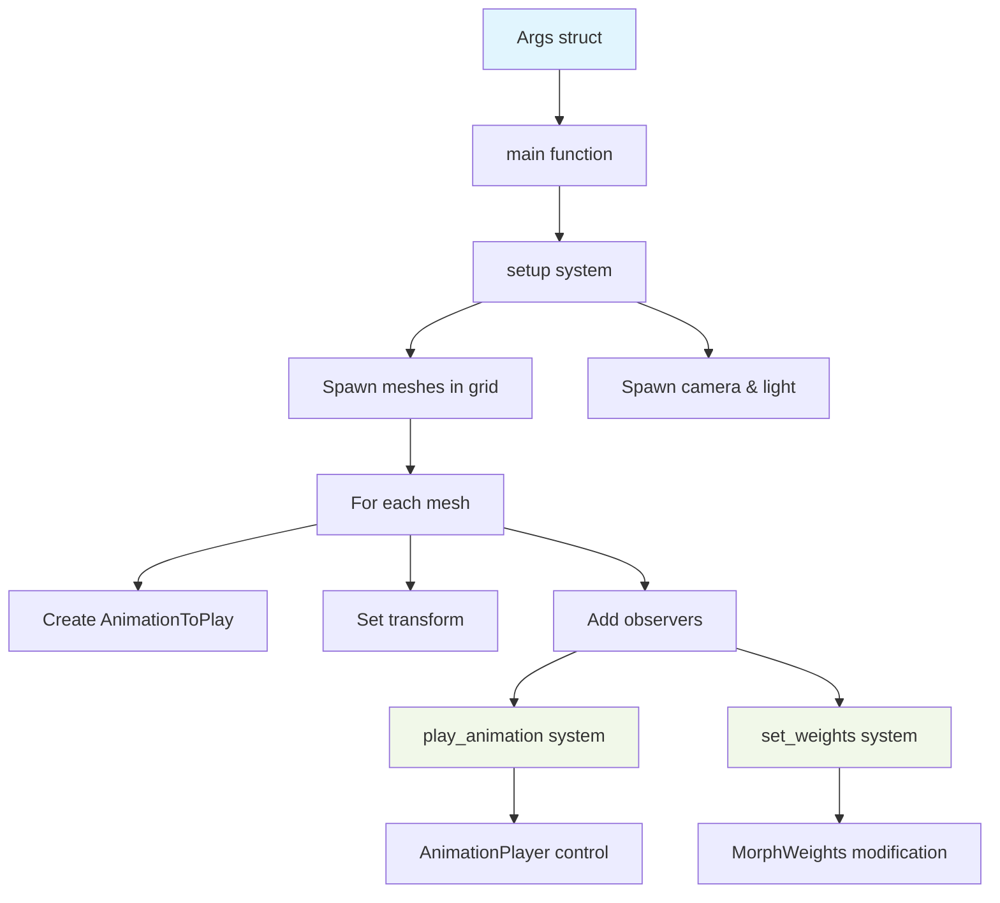

+++
title = "#18536 Add `many_morph_targets` stress test"
date = "2026-02-17T00:00:00"
draft = false
template = "pull_request_page.html"
in_search_index = true

[taxonomies]
list_display = ["show"]

[extra]
current_language = "en"
available_languages = {"en" = { name = "English", url = "/pull_request/bevy/2026-02/pr-18536-en-20260217" }, "zh-cn" = { name = "中文", url = "/pull_request/bevy/2026-02/pr-18536-zh-cn-20260217" }}
labels = ["A-Rendering", "C-Performance", "S-Ready-For-For-Review", "A-Animation", "D-Modest"]
+++

# Title
Add `many_morph_targets` stress test

## Basic Information
- **Title**: Add `many_morph_targets` stress test
- **PR Link**: https://github.com/bevyengine/bevy/pull/18536
- **Author**: greeble-dev
- **Status**: MERGED
- **Labels**: A-Rendering, C-Performance, S-Ready-For-For-Review, A-Animation, D-Modest
- **Created**: 2025-03-25T11:57:57Z
- **Merged**: 2026-02-16T23:24:56Z
- **Merged By**: alice-i-cecile

## Description Translation
The original description is in English and is included exactly as-is below:

### Objective

I wanted to benchmark the morph target changes in #18465. I also wanted to test morph targets on multiple meshes, which is not covered by existing examples.

### Solution

Add a stress test for morph targets, similar to `many_cubes` and `many_foxes`. Spawns a ton of meshes (defaults to 1024) and animates their morph target weights.


### Testing

```sh
cargo run --example many_morph_targets

# Test different mesh counts.
cargo run --example many_morph_targets -- --count 42
```

Tested on Win10/Vulkan/Nvidia, Wasm/WebGL/Chrome/Win10/Nvidia.

## The Story of This Pull Request

This PR addresses a specific gap in Bevy's stress testing suite by introducing a dedicated benchmark for morph target performance. The developer needed to evaluate changes from PR #18465, which likely involved optimizations or modifications to morph target handling, and recognized that existing examples didn't adequately test morph targets across multiple meshes simultaneously.

Morph targets (also known as blend shapes) are a technique for animating mesh deformations by interpolating between different vertex positions. They're commonly used for facial animations, where different expressions are stored as target shapes. The performance characteristics of morph targets are important because they affect both vertex processing (interpolating between shapes) and potentially pixel shading (if normal maps are affected).

The solution follows the established pattern of Bevy's stress tests like `many_cubes` and `many_foxes`. These tests serve dual purposes: they're useful for performance benchmarking and regression testing, and they also demonstrate engine capabilities to users. The implementation creates a configurable stress test that can spawn many meshes with animated morph targets, providing a controlled environment for measuring rendering performance under heavy morph target usage.

The implementation is thoughtful about test configuration. The developer added command-line arguments to control:
- The number of meshes (`--count`)
- How morph weights are set (`--weights` with options: animated, one, zero, tiny)
- Camera distance (`--camera` with options: near, far)

These options allow isolating different performance aspects. For example, setting weights to "zero" minimizes vertex shader cost while "tiny" keeps vertex shader work similar to "one" but reduces pixel shader impact. The camera distance control helps separate vertex processing costs (more visible when zoomed in) from pixel shading costs (more relevant when zoomed out).

The code structure is clean and follows Bevy conventions. It uses the `argh` crate for command-line parsing (consistent with other examples), sets up a 3D scene with appropriate lighting and camera positioning, and organizes the meshes in a grid pattern for predictable rendering. The animation system is well-implemented, loading three different animation clips from the glTF asset and applying them with randomized speeds to ensure stable morph target distribution across frames.

One technical insight from the implementation is the use of observer systems (`observe()` method) to trigger actions when scene instances become ready. This pattern is necessary because glTF assets load asynchronously - the animation players and morph weight components don't exist immediately when entities are spawned. The `play_animation` and `set_weights` systems wait for the `SceneInstanceReady` event before manipulating the animation players and morph weights.

The impact of this PR is straightforward but valuable: it provides a dedicated tool for benchmarking morph target performance, which is particularly important for games and applications that rely heavily on character animations. By adding this to the official examples, it becomes part of Bevy's continuous integration testing, helping catch performance regressions in morph target handling. The example also serves as educational material for developers wanting to understand how to work with morph targets in Bevy.

## Visual Representation



## Key Files Changed

### 1. `examples/stress_tests/many_morph_targets.rs` (+245/-0)
This is the main implementation file, created from scratch. It contains the complete stress test example.

**Key code sections:**

```rust
// Command-line argument definitions
#[derive(FromArgs, Resource)]
struct Args {
    #[argh(option, default = "1024")]
    count: usize,
    
    #[argh(option, default = "ArgWeights::Animated")]
    weights: ArgWeights,
    
    #[argh(option, default = "ArgCamera::Near")]
    camera: ArgCamera,
}

// Main setup function - arranges meshes in a grid
fn setup(args: Res<Args>, asset_server: Res<AssetServer>, /* ... */) {
    const ASSET_PATH: &str = "models/animated/MorphStressTest.gltf";
    let scene = SceneRoot(asset_server.load(GltfAssetLabel::Scene(0).from_asset(ASSET_PATH)));
    
    // Arrange meshes in a grid
    let count = args.count;
    let x_dim = ((count as f32).sqrt().ceil() as usize).max(1);
    let y_dim = count.div_ceil(x_dim);
    
    for mesh_index in 0..count {
        let x = 2.5 + (5.0 * ((mesh_index.rem_euclid(x_dim) as f32) - ((x_dim as f32) * 0.5)));
        let y = -2.2 - (3.0 * ((mesh_index.div_euclid(x_dim) as f32) - ((y_dim as f32) * 0.5)));
        
        commands.spawn((animation.with_speed(animation_speed), scene.clone(), Transform::from_xyz(x, y, 0.0)))
            .observe(play_animation)
            .observe(set_weights);
    }
}

// System to set morph weights when scene is ready
fn set_weights(trigger: On<SceneInstanceReady>, args: Res<Args>, /* ... */) {
    if let Some(weight_value) = match args.weights {
        ArgWeights::One => Some(1.0),
        ArgWeights::Zero => Some(0.0),
        ArgWeights::Tiny => Some(0.00001),
        _ => None,
    } {
        for child in children.iter_descendants(trigger.entity) {
            if let Ok(mut weight_component) = weight_components.get_mut(child) {
                weight_component.weights_mut().fill(weight_value);
            }
        }
    }
}
```

### 2. `Cargo.toml` (+11/-0)
Added the new example to the examples list with appropriate metadata.

```toml
[[example]]
name = "many_morph_targets"
path = "examples/stress_tests/many_morph_targets.rs"
doc-scrape-examples = true

[package.metadata.example.many_morph_targets]
name = "Many Morph Targets"
description = "Simple benchmark to test rendering many meshes with animated morph targets."
category = "Stress Tests"
wasm = true
```

### 3. `examples/README.md` (+1/-0)
Added documentation for the new example in the stress tests section.

```markdown
[Many Morph Targets](../examples/stress_tests/many_morph_targets.rs) | Simple benchmark to test rendering many meshes with animated morph targets.
```

## Further Reading

1. **Bevy Documentation on Morph Targets**: The official Bevy documentation provides information on how morph targets work in the engine.
2. **glTF Morph Target Specification**: The Khronos glTF specification details how morph targets are stored and animated in glTF files.
3. **Computer Graphics - Blend Shapes**: Academic and technical resources on blend shape animation techniques.
4. **Bevy Animation System**: Documentation on Bevy's animation system, including animation graphs and players.
5. **Performance Profiling in Bevy**: Resources on using Bevy's diagnostic plugins and performance measurement tools.