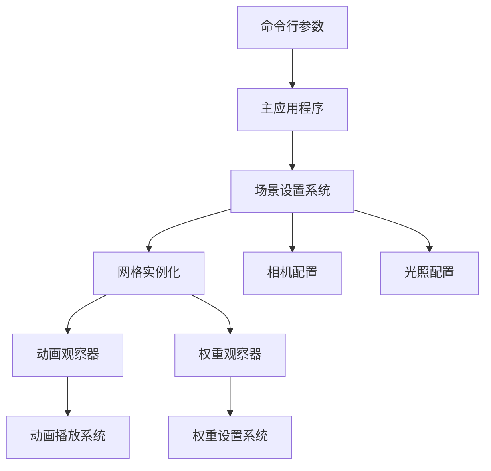

+++
title = "#18536 Add `many_morph_targets` stress test"
date = "2026-02-17T00:00:00"
draft = false
template = "pull_request_page.html"
in_search_index = false

[extra]
current_language = "zh-cn"
available_languages = {"en" = { name = "English", url = "/pull_request/bevy/2026-02/pr-18536-en-20260217" }, "zh-cn" = { name = "中文", url = "/pull_request/bevy/2026-02/pr-18536-zh-cn-20260217" }}
+++

# Title

## 基本信息
- **标题**: Add `many_morph_targets` stress test
- **PR 链接**: https://github.com/bevyengine/bevy/pull/18536
- **作者**: greeble-dev
- **状态**: 已合并
- **标签**: A-Rendering, C-Performance, S-Ready-For-Final-Review, A-Animation, D-Modest
- **创建时间**: 2025-03-25T11:57:57Z
- **合并时间**: 2026-02-16T23:24:56Z
- **合并者**: alice-i-cecile

## 描述翻译

### 目标

我希望对 PR #18465 中的 morph target（形变目标）变更进行基准测试。同时，我还想测试多个网格上的 morph target，这是现有示例未覆盖的场景。

### 解决方案

添加一个 morph target 的压力测试，类似于 `many_cubes` 和 `many_foxes`。生成大量网格（默认 1024 个）并动画化它们的 morph target 权重。


### 测试

```sh
cargo run --example many_morph_targets

# 测试不同的网格数量。
cargo run --example many_morph_targets -- --count 42
```

测试环境：Win10/Vulkan/Nvidia, Wasm/WebGL/Chrome/Win10/Nvidia。

## PR 分析报告

这个 PR 在 Bevy 引擎中新增了一个名为 `many_morph_targets` 的压力测试示例。开发者的主要目标是为 morph target 功能提供性能基准测试能力，特别是针对 PR #18465 的优化变更。同时，该示例填补了现有测试套件的一个空白——测试多个网格同时使用 morph target 的场景。

开发者采用了与现有压力测试（如 `many_cubes`、`many_foxes`）一致的设计模式。这个示例创建了一个命令行工具，允许用户通过参数控制测试条件：网格数量、权重模式和相机距离。这种设计使得测试更加灵活，可以针对不同的性能瓶颈进行针对性测试。

从技术实现上看，示例使用了 `argh` crate 来处理命令行参数。它定义了 `Args` 结构体，包含三个主要配置项：
- `count`: 要生成的网格数量，默认为 1024
- `weights`: 权重模式，支持 `animated`（动画化）、`one`（全部设为 1）、`zero`（全部设为 0）和 `tiny`（设为极小值）
- `camera`: 相机模式，`near`（靠近网格）或 `far`（远离网格）

权重的四种模式设计得很巧妙，分别针对不同的性能测试场景：
- `animated`：模拟实际使用场景，权重随时间变化
- `one`：最大化顶点着色器成本
- `zero`：最小化顶点着色器成本
- `tiny`：顶点着色器成本与 `one` 类似，但像素着色器成本与 `zero` 类似

相机距离的配置也考虑了性能分析需求：`near` 模式让网格填满屏幕，测试像素着色器性能；`far` 模式拉远相机，减少像素着色器负担，重点测试顶点着色器性能。

在实现细节上，代码加载了一个名为 `MorphStressTest.gltf` 的 3D 模型，该模型包含 3 个动画。示例使用了一个种子化的随机数生成器（`ChaCha8Rng`）为每个网格分配不同的动画速度，这样可以确保每帧中活跃的 morph target 数量更加稳定，避免所有网格同时处于相同动画状态导致的性能波动。

网格的布局采用了网格状排列，通过计算合适的行数和列数来均匀分布。动画系统使用了观察器（observer）模式：当场景实例准备就绪时，`play_animation` 系统会为每个网格播放动画，而 `set_weights` 系统会根据命令行参数设置权重值。

这个示例的加入对 Bevy 引擎有几个重要意义：
1. 为 morph target 功能提供了标准化的性能测试工具
2. 填补了多网格 morph target 测试的空白
3. 提供了可配置的测试场景，便于定位性能瓶颈
4. 采用了与其他压力测试一致的设计模式，保持了代码库的一致性

从工程角度看，这个实现展示了良好的关注点分离：命令行参数解析、场景设置、动画控制和权重管理都有清晰的边界。代码也考虑了跨平台兼容性，通过条件编译处理了 WebAssembly 环境的命令行参数解析差异。

## 可视化表示



## 主要文件变更

### 1. `examples/stress_tests/many_morph_targets.rs` (+245/-0)

**新增文件**：这是 PR 的核心实现文件，包含完整的压力测试示例代码。

**关键代码片段**：
```rust
// 命令行参数定义
#[derive(FromArgs, Resource)]
struct Args {
    /// number of meshes - default = 1024
    #[argh(option, default = "1024")]
    count: usize,

    /// options: 'animated', 'one', 'zero', 'tiny' - default = 'animated'
    #[argh(option, default = "ArgWeights::Animated")]
    weights: ArgWeights,

    /// options: 'near', 'far' - default = 'near'
    #[argh(option, default = "ArgCamera::Near")]
    camera: ArgCamera,
}

// 网格布局和动画设置
for mesh_index in 0..count {
    let animation = animations[mesh_index.rem_euclid(animations.len())].clone();
    let x = 2.5 + (5.0 * ((mesh_index.rem_euclid(x_dim) as f32) - ((x_dim as f32) * 0.5)));
    let y = -2.2 - (3.0 * ((mesh_index.div_euclid(x_dim) as f32) - ((y_dim as f32) * 0.5)));
    let animation_speed = rng.random_range(0.5..=1.5);
    
    commands
        .spawn((
            animation.with_speed(animation_speed),
            scene.clone(),
            Transform::from_xyz(x, y, 0.0),
        ))
        .observe(play_animation)
        .observe(set_weights);
}
```

**与 PR 目标的关系**：这个文件实现了完整的压力测试逻辑，包括参数解析、场景设置、网格生成和动画控制，是 PR 的核心实现。

### 2. `Cargo.toml` (+11/-0)

**修改内容**：在 `[[example]]` 部分新增了 `many_morph_targets` 示例的配置。

**关键代码片段**：
```toml
[[example]]
name = "many_morph_targets"
path = "examples/stress_tests/many_morph_targets.rs"
doc-scrape-examples = true

[package.metadata.example.many_morph_targets]
name = "Many Morph Targets"
description = "Simple benchmark to test rendering many meshes with animated morph targets."
category = "Stress Tests"
wasm = true
```

**与 PR 目标的关系**：这个变更为新示例添加了构建配置，使其能够被 Cargo 识别和编译，并指定了示例的元数据。

### 3. `examples/README.md` (+1/-0)

**修改内容**：在示例列表中新增了 `Many Morph Targets` 的条目。

**关键代码片段**：
```markdown
[Many Morph Targets](../examples/stress_tests/many_morph_targets.rs) | Simple benchmark to test rendering many meshes with animated morph targets.
```

**与 PR 目标的关系**：这个变更更新了文档，确保新示例在项目文档中可见，方便用户发现和使用。

## 扩展阅读

1. **Bevy 官方文档 - Morph Targets**：了解 Bevy 中 morph target 的基本概念和使用方法
2. **PR #18465**：这个压力测试主要针对的优化变更，了解其技术细节
3. **Bevy 示例目录**：查看其他压力测试示例（如 `many_cubes`、`many_foxes`），了解 Bevy 压力测试的设计模式
4. **计算机图形学 - Morph Target Animation**：深入了解 morph target 动画的技术原理和性能特性
5. **性能分析工具**：学习如何使用 Bevy 的诊断插件（如 `FrameTimeDiagnosticsPlugin`）进行性能分析