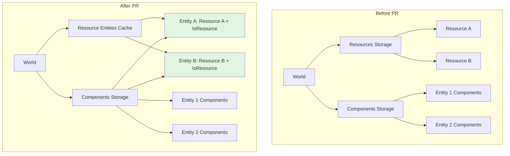

+++
title = "#20934 Store Resources as components on singleton entities"
date = "2026-02-10T00:00:00"
draft = false
template = "pull_request_page.html"
in_search_index = true

[taxonomies]
list_display = ["show"]

[extra]
current_language = "en"
available_languages = {"en" = { name = "English", url = "/pull_request/bevy/2026-02/pr-20934-en-20260210" }, "zh-cn" = { name = "中文", url = "/pull_request/bevy/2026-02/pr-20934-zh-cn-20260210" }}
labels = ["C-Feature", "A-ECS", "S-Needs-SME"]
+++

# Title
## Basic Information
- **Title**: Store Resources as components on singleton entities
- **PR Link**: https://github.com/bevyengine/bevy/pull/20934
- **Author**: Trashtalk217
- **Status**: MERGED
- **Labels**: C-Feature, A-ECS, S-Ready-For-Final-Review, S-Needs-SME
- **Created**: 2025-09-08T19:20:03Z
- **Merged**: 2026-02-10T19:28:27Z
- **Merged By**: alice-i-cecile

## Description Translation

This is part of #19731.

# Resources as Components

## Motivation

More things should be entities. This simplifies the API, the lower-level implementation and the tools we have for entities and components can be used for other things in the engine. In particular, for resources, it is really handy to have observers, which we currently don't have. See #20821 under 1A, for a more specific use.

## Current Work

This removes the `resources` field from the world storage and instead store the resources on singleton entities. For easy lookup, we add a `HashMap<ComponentId, Entity>` to `World`, in order to quickly find the singleton entity where the resource is stored.

Because we store resources on entities, we derive `Component` alongside `Resource`, this means that

```rust
#[derive(Resource)]
struct Foo;
```
turns into
```rust
#[derive(Resource, Component)]
struct Foo;
```

This was also done for reflections, meaning that

```rust
#[derive(Resource, Reflect)]
#[refect(Resource)]
struct Bar;
```
becomes
```rust
#[derive(Resource, Component, Reflect)]
#[refect(Resource, Component)]
struct Bar;
```

In order to distinguish resource entities, they are tagged with the `IsResource` component. Additionally, to ensure that they aren't queried by accident, they are also tagged as being internal entities, which means that they don't show up in queries by default.

## Drawbacks

- Currently you can't have a struct that is both a `Resource` and a `Component`, because `Resource` expands to also implement `Component`, this means that this throws a compiler error as it's implemented twice.
- Because every reflected Resource must also implement `ReflectComponent` you need to import `bevy_ecs::reflect::ReflectComponent` every time you use `#[reflect(Resource)]`. This is kind of unintuitive.

## Future Work

- Simplify `Access` in the ECS, to only deal with components (and not components *and* resources).
- Newtype `Res<Resource>` to `Single<Ref<Resource>>` (or something similair).
- Eliminate `ReflectResource`.
- Take stabs at simplifying the public facing API.

## The Story of This Pull Request

### The Problem and Context

In Bevy's ECS, resources and components have historically been separate concepts with distinct storage mechanisms. Resources were stored in dedicated `Resources` and `NonSendResources` storages, while components were stored in tables and sparse sets on entities. This separation created several issues:

1. **API Complexity**: The ECS had to maintain parallel systems for handling resources and components, leading to code duplication and complex access patterns.
2. **Missing Features**: Resources couldn't benefit from component features like lifecycle hooks, observers, and relations.
3. **Implementation Overhead**: The storage layer needed separate logic for resources, making the codebase harder to maintain and extend.

The primary motivation for this change was to unify the storage model, allowing resources to leverage the existing component infrastructure. This would enable features like resource observers (#20821) and simplify the overall architecture.

### The Solution Approach

The solution was to store resources as components on singleton entities. Each resource type gets its own dedicated entity that contains the resource as a component. To maintain the singleton property and enable fast lookups, the implementation adds:

1. A `ResourceEntities` cache mapping `ComponentId` to `Entity` for quick resource entity lookup.
2. An `IsResource` marker component to identify resource entities and manage uniqueness.
3. Automatic derivation of `Component` alongside `Resource` through the `#[derive(Resource)]` macro.

This approach transforms resources into a special case of components while preserving their singleton semantics through the `IsResource` component's hooks.

### The Implementation

The implementation required changes across multiple layers of the ECS:

**1. World Storage Restructuring**
The `World` struct's `storages` field was simplified by removing the dedicated `Resources<true>` storage for send resources. Non-send data continues to use the renamed `NonSends` storage (formerly `Resources<false>`). Instead, resources are now stored as components on entities.

```rust
// Before: Separate resource storage
pub struct Storages {
    pub resources: Resources<true>,
    pub non_send_resources: Resources<false>,
    // ...
}

// After: Resources are components on entities
pub struct Storages {
    pub non_sends: NonSends,  // Only for non-send data
    // ... (resources now stored in tables/sparse sets)
}
```

**2. Resource Entity Cache**
A new `ResourceEntities` type was added to `World` to map resource component IDs to their singleton entities:

```rust
pub struct World {
    // ...
    pub(crate) resource_entities: ResourceEntities,
    // ...
}

#[derive(Default)]
pub struct ResourceEntities(SyncUnsafeCell<SparseSet<ComponentId, Entity>>);
```

**3. IsResource Component and Hooks**
The `IsResource` component enforces singleton semantics and manages the resource entity cache:

```rust
#[derive(Component, Debug)]
pub struct IsResource(ComponentId);

impl IsResource {
    pub(crate) fn on_insert(mut world: DeferredWorld, context: HookContext) {
        // Prevent duplicate resources by removing component if another exists
        // Update resource_entities cache
    }
    
    pub(crate) fn on_replace(mut world: DeferredWorld, context: HookContext) {
        // Clean up cache when IsResource is replaced
    }
    
    pub(crate) fn on_despawn(_world: DeferredWorld, _context: HookContext) {
        warn!("Resource entities are not supposed to be despawned.");
    }
}
```

**4. Resource Trait Changes**
The `Resource` trait now extends `Component`, and the `#[derive(Resource)]` macro automatically implements both traits:

```rust
// Before: Resource was standalone
pub trait Resource: Send + Sync + 'static {}

// After: Resource extends Component
pub trait Resource: Component<Mutability = Mutable> {}
```

**5. System Parameter Access**
`Res` and `ResMut` system parameters were updated to access resources through the component system, requiring both component access and the `IsResource` filter:

```rust
unsafe impl<'a, T: Resource> SystemParam for ResMut<'a, T> {
    fn init_access(
        component_id: Self::State,
        system_meta: &mut SystemMeta,
        component_access_set: &mut FilteredAccessSet<ComponentId>,
    ) {
        let mut filter = FilteredAccess::default();
        filter.add_component_write(component_id);
        filter.add_resource_write(component_id);
        filter.and_with(IS_RESOURCE);  // Filter to resource entities
        
        component_access_set.add(filter);
    }
}
```

**6. Reflection Updates**
`ReflectResource` was simplified to a marker type, and resource reflection now uses `ReflectComponent`:

```rust
// Before: ReflectResource had full functionality
pub struct ReflectResource(ReflectResourceFns);

// After: ReflectResource is a zero-sized marker
#[derive(Clone)]
pub struct ReflectResource;
```

### Technical Insights

**Singleton Enforcement**: The `IsResource` component's hooks ensure that only one entity can have a particular resource component. If code attempts to insert a resource on a second entity, the component is automatically removed with a warning.

**Performance Considerations**: Resource access now involves an extra indirection through the `resource_entities` cache. However, this is a hash map lookup followed by a component access, which should be negligible for most use cases. The benefits of unified storage outweigh this minor overhead.

**Backward Compatibility**: The public API for resources remains largely unchanged. Methods like `world.resource::<T>()` and `world.insert_resource()` work as before, hiding the underlying entity storage from users.

**Non-Send Data**: The implementation distinguishes between send resources (stored as components) and non-send data (stored in the `NonSends` storage). This maintains thread safety guarantees while unifying the send resource storage model.

### The Impact

**Positive Impacts**:
1. **Feature Parity**: Resources can now use observers, lifecycle hooks, and other component features.
2. **Code Simplification**: Removes duplicate code for resource storage and access.
3. **Architectural Consistency**: Resources and components now use the same underlying infrastructure.
4. **Future Extensibility**: Enables future features like resource relationships and more sophisticated query patterns.

**Migration Requirements**:
1. Structs can no longer derive both `Component` and `Resource` (compile error due to duplicate implementation).
2. Reflected resources must import and use `ReflectComponent` instead of `ReflectResource`.
3. Queries that should exclude resources need to add `Without<IsResource>`.
4. Non-send resource APIs were renamed (e.g., `insert_non_send_resource` → `insert_non_send`).

**Performance Implications**: Initial benchmarks show negligible performance differences for resource access. The entity-based storage may have slightly higher memory overhead due to entity metadata, but this is offset by storage unification benefits.

The change represents a significant step toward a more unified and extensible ECS architecture, paving the way for further simplifications like eliminating `ReflectResource` and unifying access patterns.

## Visual Representation



## Key Files Changed

### `crates/bevy_ecs/src/world/mod.rs` (+364/-305)
**What changed**: The world storage was restructured to remove dedicated resource storage and add resource entity tracking.

**Key modifications**:
```rust
// Added resource entity cache
pub struct World {
    // ...
    pub(crate) resource_entities: ResourceEntities,
    // Removed: resources field from storages
}

// Resource insertion now uses entities
pub fn insert_resource_if_not_exists_with_caller<R: Resource>(
    &mut self,
    func: impl FnOnce(&mut World) -> R,
    caller: MaybeLocation,
) -> (ComponentId, EntityWorldMut<'_>) {
    // Look up or create resource entity
    // Insert resource as component on that entity
}
```

**Why it matters**: This is the core change that enables resources to be stored as components while maintaining singleton semantics.

### `crates/bevy_ecs/src/resource.rs` (+238/-1)
**What changed**: Added the `ResourceEntities` cache and `IsResource` component with lifecycle hooks.

**Key modifications**:
```rust
// New cache for resource entity lookup
#[derive(Default)]
pub struct ResourceEntities(SyncUnsafeCell<SparseSet<ComponentId, Entity>>);

// Marker component for resource entities
#[derive(Component, Debug)]
#[component(on_insert, on_replace, on_despawn)]
pub struct IsResource(ComponentId);

// Resource trait now extends Component
pub trait Resource: Component<Mutability = Mutable> {}
```

**Why it matters**: Provides the infrastructure for tracking resource entities and enforcing singleton behavior.

### `crates/bevy_ecs/src/reflect/resource.rs` (+22/-237)
**What changed**: `ReflectResource` was simplified to a marker type since resource reflection now uses `ReflectComponent`.

**Key modifications**:
```rust
// Before: Complex type with function pointers
pub struct ReflectResource(ReflectResourceFns);

// After: Zero-sized marker
#[derive(Clone)]
pub struct ReflectResource;

impl<R: Resource + FromReflect + TypePath> FromType<R> for ReflectResource {
    fn from_type() -> Self {
        ReflectResource
    }
    
    fn insert_dependencies(type_registration: &mut TypeRegistration) {
        type_registration.register_type_data::<ReflectComponent, R>();
    }
}
```

**Why it matters**: Simplifies the reflection system by eliminating duplicate functionality between `ReflectResource` and `ReflectComponent`.

### `crates/bevy_ecs/src/storage/non_send.rs` (+57/-137)
**What changed**: Renamed and refactored non-send storage to clarify its purpose distinct from send resources.

**Key modifications**:
```rust
// Before: Generic Resources<SEND> for both send and non-send
pub struct Resources<const SEND: bool>;

// After: Dedicated NonSends for non-send data only
pub struct NonSends {
    non_sends: SparseSet<ComponentId, NonSendData>,
}
```

**Why it matters**: Clarifies that non-send data uses different storage from send resources (which are now components).

### `crates/bevy_ecs/src/component/info.rs` and `register.rs`
**What changed**: Removed separate resource registration paths and unified component/resource registration.

**Key modifications**:
```rust
// Before: Separate resource registration
pub fn register_resource<T: Resource>(&mut self) -> ComponentId;

// After: Unified component registration
pub fn register_component<T: Component>(&mut self) -> ComponentId;
// Resources use register_component since Resource: Component
```

**Why it matters**: Eliminates code duplication and simplifies the registration system.

## Further Reading

1. **Bevy ECS Architecture**: [Bevy ECS Documentation](https://docs.rs/bevy_ecs/latest/bevy_ecs/)
2. **Component Lifecycle Hooks**: [Component Hooks Documentation](https://docs.rs/bevy_ecs/latest/bevy_ecs/component/struct.ComponentHooks.html)
3. **Observers Pattern**: [RFC #20821](https://github.com/bevyengine/bevy/issues/20821)
4. **Entity-Component-System Pattern**: [Wikipedia ECS](https://en.wikipedia.org/wiki/Entity_component_system)
5. **Rust Trait System**: [The Rust Programming Language - Traits](https://doc.rust-lang.org/book/ch10-02-traits.html)