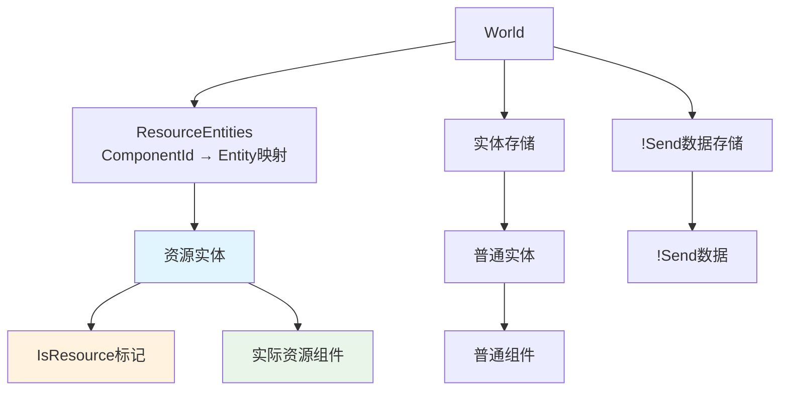

+++
title = "#20934 Store Resources as components on singleton entities"
date = "2026-02-10T00:00:00"
draft = false
template = "pull_request_page.html"
in_search_index = false

[extra]
current_language = "zh-cn"
available_languages = {"en" = { name = "English", url = "/pull_request/bevy/2026-02/pr-20934-en-20260210" }, "zh-cn" = { name = "中文", url = "/pull_request/bevy/2026-02/pr-20934-zh-cn-20260210" }}
+++

# Title

## 基本信息
- **标题**: Store Resources as components on singleton entities
- **PR链接**: https://github.com/bevyengine/bevy/pull/20934
- **作者**: Trashtalk217
- **状态**: 已合并
- **标签**: C-Feature, A-ECS, S-Ready-For-Final-Review, S-Needs-SME
- **创建时间**: 2025-09-08T19:20:03Z
- **合并时间**: 2026-02-10T19:28:27Z
- **合并者**: alice-i-cecile

## 描述翻译

这是 #19731 的一部分。

# 资源作为组件

## 动机

更多东西应该成为实体。这简化了API，底层实现以及我们为实体和组件提供的工具可以用于引擎中的其他东西。特别是对于资源，拥有观察者非常方便，这是我们目前没有的。有关更具体的用例，请参见 #20821 中的1A部分。

## 当前工作

这移除了世界存储中的`resources`字段，改为在单例实体上存储资源。为了便于查找，我们在`World`中添加了一个`HashMap<ComponentId, Entity>`，以便快速找到存储资源的单例实体。

由于我们在实体上存储资源，我们同时派生了`Component`和`Resource`，这意味着

```rust
#[derive(Resource)]
struct Foo;
```
变成
```rust
#[derive(Resource, Component)]
struct Foo;
```

这也适用于反射，意味着

```rust
#[derive(Resource, Reflect)]
#[refect(Resource)]
struct Bar;
```
变成
```rust
#[derive(Resource, Component, Reflect)]
#[refect(Resource, Component)]
struct Bar;
```

为了区分资源实体，它们被标记为`IsResource`组件。此外，为了确保它们不会被意外查询，它们也被标记为内部实体，这意味着默认情况下它们不会出现在查询中。

## 缺点

- 目前你不能有一个同时是`Resource`和`Component`的结构体，因为`Resource`扩展后也实现了`Component`，这会导致编译器错误，因为它被实现了两次。
- 因为每个反射的资源也必须实现`ReflectComponent`，所以每次使用`#[reflect(Resource)]`时都需要导入`bevy_ecs::reflect::ReflectComponent`。这有点不直观。

## 未来工作

- 简化ECS中的`Access`，只处理组件（而不是组件*和*资源）。
- 将`Res<Resource>`新类型化为`Single<Ref<Resource>>`（或类似的东西）。
- 消除`ReflectResource`。
- 尝试简化面向公众的API。

## 本Pull Request的故事

此PR是Bevy ECS架构的一次重要重构，将资源从独立存储迁移到作为组件存储在单例实体上。这个变化的核心目标是统一ECS内部的数据存储模型，减少代码重复，并为资源提供与组件相同的能力。

### 问题和背景

在Bevy 0.18及之前的版本中，资源和组件虽然概念相似，但在实现上是完全分离的：
- 组件存储在表（Table）或稀疏集（SparseSet）中，属于实体
- 资源存储在独立的`Resources`和`NonSendResources`结构中
- 这种分离导致了很多代码重复和维护负担

具体问题包括：
1. **功能不一致**：组件支持生命周期钩子、观察者、关系等高级功能，而资源不支持
2. **API复杂**：需要维护两套相似的API（`Component` vs `Resource`）
3. **实现冗余**：底层存储、变更检测、反射等逻辑都需要为资源和组件分别实现

特别是#20821中提到的用例——为资源添加观察者——由于当前的架构限制而无法实现。开发者希望资源也能像组件一样拥有完整的生命周期事件支持。

### 解决方案

PR作者采取了一个大胆但合理的方案：**将资源重构为存储在单例实体上的特殊组件**。这个方案包含以下几个关键设计决策：

1. **单例实体映射**：每个资源类型对应一个唯一的实体，通过`ResourceEntities`映射表（`HashMap<ComponentId, Entity>`）快速查找
2. **资源标记组件**：使用`IsResource`组件标记这些实体，防止它们被普通查询意外访问
3. **向后兼容**：保持现有的`Res<T>`、`ResMut<T>`等系统参数API不变，只改变底层实现

### 实现细节

#### 1. 宏层面的改变

`#[derive(Resource)]`宏现在会自动实现`Component` trait：

```rust
// crates/bevy_ecs/macros/src/component.rs
// 修改前：
impl #impl_generics #bevy_ecs_path::resource::Resource for #struct_name #type_generics #where_clause {
}

// 修改后：
impl #impl_generics #bevy_ecs_path::component::Component for #struct_name #type_generics #where_clause {
    // ... 完整的Component实现
}

impl #impl_generics #bevy_ecs_path::resource::Resource for #struct_name #type_generics #where_clause {
}
```

这个改变意味着所有资源现在都是组件，可以享受组件提供的所有功能。

#### 2. 资源实体管理

新增的`IsResource`组件负责管理资源实体的唯一性：

```rust
// crates/bevy_ecs/src/resource.rs
#[derive(Component, Debug)]
#[component(on_insert, on_replace, on_despawn)]
pub struct IsResource(ComponentId);

impl IsResource {
    pub(crate) fn on_insert(mut world: DeferredWorld, context: HookContext) {
        // 检查是否已存在相同资源的实体
        // 如果存在，移除新插入的组件
        // 如果不存在，更新ResourceEntities映射
    }
}
```

当插入`IsResource`组件时，系统会检查是否已存在相同资源类型的实体。如果存在，新插入的资源组件会被移除；如果不存在，则更新`ResourceEntities`映射。

#### 3. 存储层重构

旧的`Resources<const SEND: bool>`结构被拆分为：
- `Send`资源：现在作为组件存储在实体上，不再需要专门的存储
- `!Send`数据：重命名为`NonSends`，保持独立存储（因为需要线程安全验证）

```rust
// crates/bevy_ecs/src/storage/mod.rs
// 修改前：
pub struct Storages {
    pub tables: Tables,
    pub sparse_sets: SparseSets,
    pub resources: Resources<true>,      // Send资源
    pub non_send_resources: Resources<false>, // !Send资源
}

// 修改后：
pub struct Storages {
    pub tables: Tables,
    pub sparse_sets: SparseSets,
    pub non_sends: NonSends,  // 仅!Send数据
}
```

#### 4. 系统参数适配

`Res<T>`和`ResMut<T>`系统参数需要适配新的资源访问模式：

```rust
// crates/bevy_ecs/src/system/system_param.rs
unsafe impl<'a, T: Resource> SystemParam for Res<'a, T> {
    fn init_access(
        component_id: &Self::State,
        system_meta: &mut SystemMeta,
        component_access_set: &mut FilteredAccessSet<ComponentId>,
    ) {
        // 修改前：直接添加资源读取访问
        component_access_set.add_unfiltered_resource_read(component_id);
        
        // 修改后：添加组件读取+资源读取，并过滤掉IsResource实体
        let mut filter = FilteredAccess::default();
        filter.add_component_read(component_id);
        filter.add_resource_read(component_id);
        filter.and_with(IS_RESOURCE); // 排除资源实体
        component_access_set.add(filter);
    }
}
```

这种双重访问模式（既是组件又是资源）确保了向后兼容性，同时防止了资源实体被普通查询访问。

#### 5. 反射系统调整

`ReflectResource`被大幅简化，现在只是一个标记类型：

```rust
// crates/bevy_ecs/src/reflect/resource.rs
// 修改前：完整的反射方法实现
pub struct ReflectResource(ReflectResourceFns);

// 修改后：零大小标记类型
#[derive(Clone)]
pub struct ReflectResource;
```

现在资源的反射功能通过`ReflectComponent`提供，这简化了反射系统的实现。

### 技术洞察

#### 性能考虑

1. **查找性能**：通过`ResourceEntities`哈希映射，资源查找仍然是O(1)复杂度
2. **内存开销**：每个资源现在需要一个实体和`IsResource`组件，增加了少量内存开销
3. **缓存局部性**：资源现在存储在表中，可能获得更好的缓存局部性（与之前的独立存储相比）

#### 架构影响

1. **统一性**：组件和资源现在共享相同的存储、查询和生命周期系统
2. **扩展性**：资源现在可以轻松添加观察者、关系和其他组件功能
3. **简化**：移除了大量重复代码，特别是`Resources`存储和相关的管理逻辑

#### 兼容性处理

PR通过多种方式保持向后兼容：
- 所有公共API签名保持不变
- 系统参数自动适配新的底层实现
- 迁移指南帮助用户处理破坏性变化

### 影响

#### 正面影响

1. **功能增强**：资源现在支持观察者、生命周期钩子等高级功能
2. **代码简化**：移除了约400行代码，减少了维护负担
3. **架构统一**：组件和资源的处理更加一致
4. **未来扩展**：为资源添加更多组件特性变得容易

#### 负面影响和限制

1. **编译时限制**：结构体不能同时派生`Component`和`Resource`
2. **反射使用**：反射资源时需要额外导入`ReflectComponent`
3. **实体数量**：每个资源类型现在占用一个实体ID

#### 破坏性变化

1. `World::clear_entities()`现在也会清除所有资源（因为资源现在存储在实体上）
2. 某些反射API需要从`ReflectResource`切换到`ReflectComponent`
3. 非Send资源的API被重命名（如`insert_non_send_resource`变为`insert_non_send`）

### 工程考量

这个PR展示了几个重要的软件工程原则：

1. **统一抽象**：识别出资源和组件的本质相似性，并统一它们的实现
2. **渐进式重构**：在保持API兼容性的前提下进行底层重构
3. **关注点分离**：通过`IsResource`组件清晰地标记资源实体，避免混淆
4. **性能与可维护性平衡**：接受轻微的性能开销（额外的实体）来换取架构的简化和功能的增强

## 可视化表示



## 关键文件更改

### 1. `crates/bevy_ecs/src/world/mod.rs` (+364/-305)
**变化原因**：世界结构需要适应新的资源存储模型，移除独立的资源存储，添加资源实体映射。

**关键修改**：
```rust
// 添加资源实体映射
pub struct World {
    // ... 其他字段
    pub(crate) resource_entities: ResourceEntities,  // 新增
    // 移除了旧的resources字段
}

// 资源查找逻辑改变
impl World {
    pub fn contains_resource_by_id(&self, component_id: ComponentId) -> bool {
        // 修改前：检查resources存储
        self.storages.resources.get(component_id).is_some_and(ResourceData::is_present)
        
        // 修改后：通过ResourceEntities映射找到实体，再检查组件
        if let Some(entity) = self.resource_entities.get(component_id) {
            if let Ok(entity_ref) = self.get_entity(*entity) {
                return entity_ref.contains_id(component_id);
            }
        }
        false
    }
}
```

**关联性**：这是实现的核心，改变了资源的存储和查找方式。

### 2. `crates/bevy_ecs/src/resource.rs` (+238/-1)
**变化原因**：需要定义新的`IsResource`组件和资源实体映射管理。

**关键修改**：
```rust
// 新增：资源实体映射
#[derive(Default)]
pub struct ResourceEntities(SyncUnsafeCell<SparseSet<ComponentId, Entity>>);

// 新增：资源标记组件
#[derive(Component, Debug)]
#[component(on_insert, on_replace, on_despawn)]
pub struct IsResource(ComponentId);

impl IsResource {
    pub(crate) fn on_insert(mut world: DeferredWorld, context: HookContext) {
        // 确保资源唯一性的逻辑
        let resource_component_id = world.entity(context.entity)
            .get::<Self>().unwrap().resource_component_id();
            
        if let Some(&original_entity) = world.resource_entities.get(resource_component_id) {
            // 资源已存在，移除新插入的
            if original_entity != context.entity {
                world.commands().entity(context.entity)
                    .remove_by_id(resource_component_id);
                warn!("Tried inserting resource while one already exists");
            }
        } else {
            // 新资源，更新映射
            unsafe { &mut *world.as_unsafe_world_cell().resource_entities().0.get() }
                .insert(resource_component_id, context.entity);
        }
    }
}
```

**关联性**：提供了资源唯一性保证和实体映射管理。

### 3. `crates/bevy_ecs/src/storage/non_send.rs` (+57/-137)
**变化原因**：重命名和简化非Send数据存储，移除Send资源的存储。

**关键修改**：
```rust
// 修改前：通用的ResourceData，通过const SEND区分
pub struct ResourceData<const SEND: bool> { /* ... */ }
pub struct Resources<const SEND: bool> { /* ... */ }

// 修改后：专门用于!Send数据
pub struct NonSendData { /* ... */ }  // 原ResourceData<false>
pub struct NonSends { /* ... */ }     // 原Resources<false>
```

**关联性**：Send资源不再需要特殊存储，!Send数据保持独立存储（需要线程安全验证）。

### 4. `crates/bevy_ecs/src/reflect/resource.rs` (+22/-237)
**变化原因**：简化反射系统，`ReflectResource`现在只是标记，实际功能由`ReflectComponent`提供。

**关键修改**：
```rust
// 修改前：完整的反射方法集合
pub struct ReflectResource(ReflectResourceFns);
pub struct ReflectResourceFns {
    pub insert: fn(&mut World, &dyn PartialReflect, &TypeRegistry),
    pub apply: fn(&mut World, &dyn PartialReflect),
    // ... 其他方法
}

// 修改后：零大小标记类型
#[derive(Clone)]
pub struct ReflectResource;

impl<R: Resource + FromReflect + TypePath> FromType<R> for ReflectResource {
    fn from_type() -> Self {
        ReflectResource
    }
    
    fn insert_dependencies(type_registration: &mut TypeRegistration) {
        type_registration.register_type_data::<ReflectComponent, R>();
    }
}
```

**关联性**：反射系统现在统一通过`ReflectComponent`处理资源和组件。

### 5. `crates/bevy_ecs/src/system/system_param.rs` (多处修改)
**变化原因**：系统参数需要适配新的资源访问模式（通过实体访问组件）。

**关键修改**：
```rust
unsafe impl<'a, T: Resource> SystemParam for Res<'a, T> {
    fn validate_param(
        component_id: &Self::State,
        _system_meta: &SystemMeta,
        world: UnsafeWorldCell,
    ) -> Result<(), SystemParamValidationError> {
        // 修改前：检查resources存储
        if unsafe { world.storages() }.resources.get(component_id)
            .is_some_and(ResourceData::is_present) {
            Ok(())
        }
        
        // 修改后：通过ResourceEntities找到实体，再检查组件
        if let Some(entity) = unsafe { world.resource_entities() }.get(component_id) {
            if let Ok(entity_ref) = world.get_entity(*entity) {
                if entity_ref.contains_id(component_id) {
                    return Ok(());
                }
            }
        }
        Err(SystemParamValidationError::ResourceDoesNotExist)
    }
}
```

**关联性**：确保系统参数能够正确访问现在作为组件存储的资源。

## 进一步阅读

1. **Bevy ECS架构**：
   - [Bevy ECS官方文档](https://docs.rs/bevy_ecs/latest/bevy_ecs/)
   - [ECS模式详解](https://en.wikipedia.org/wiki/Entity_component_system)

2. **Rust所有权和借用**：
   - [Rust Book: Ownership](https://doc.rust-lang.org/book/ch04-00-understanding-ownership.html)
   - [Rust Book: Smart Pointers](https://doc.rust-lang.org/book/ch15-00-smart-pointers.html)

3. **设计模式**：
   - [单例模式](https://en.wikipedia.org/wiki/Singleton_pattern)
   - [标记接口模式](https://en.wikipedia.org/wiki/Marker_interface_pattern)

4. **相关PR和Issue**：
   - #19731: 更大的ECS重构计划
   - #20821: 资源观察者用例
   - [迁移指南：Resources as Components](https://github.com/bevyengine/bevy/blob/main/release-content/migration-guides/resources_as_components.md)

5. **性能优化**：
   - [Rust性能指南](https://nnethercote.github.io/perf-book/)
   - [ECS性能考量](https://www.flecs.dev/flecs/docs/Manuals/Performance.html)