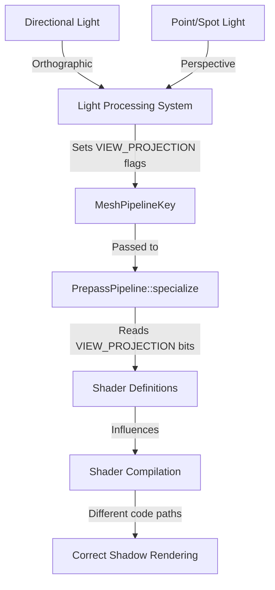

+++
title = "#20989 Implements specialization keys `VIEW_PROJECTION_*` in depth prepass for shadow maps"
date = "2026-02-09T00:00:00"
draft = false
template = "pull_request_page.html"
in_search_index = true

[taxonomies]
list_display = ["show"]

[extra]
current_language = "en"
available_languages = {"en" = { name = "English", url = "/pull_request/bevy/2026-02/pr-20989-en-20260209" }, "zh-cn" = { name = "中文", url = "/pull_request/bevy/2026-02/pr-20989-zh-cn-20260209" }}
labels = ["C-Feature", "A-Rendering", "D-Straightforward"]
+++

# Implements specialization keys `VIEW_PROJECTION_*` in depth prepass for shadow maps

## Basic Information
- **Title**: Implements specialization keys `VIEW_PROJECTION_*` in depth prepass for shadow maps
- **PR Link**: https://github.com/bevyengine/bevy/pull/20989
- **Author**: Lichtso
- **Status**: MERGED
- **Labels**: C-Feature, A-Rendering, X-Uncontroversial, D-Straightforward, S-Needs-Review
- **Created**: 2025-09-12T18:08:46Z
- **Merged**: 2026-02-09T07:25:18Z
- **Merged By**: superdump

## Description Translation
# Objective

Fixes #20941

## Solution

Implemented the missing `MeshPipelineKey::VIEW_PROJECTION_*` in `check_views_lights_need_specialization()` and `PrepassPipeline::specialize()`.

## Testing

I implemented a `Material` with a custom shader pipeline which uses these keys and added light sources with `shadows_enabled`. Before this change the material only appeared in the normal forward pass, after it also appears in the shadows.

## The Story of This Pull Request

The issue was straightforward but had significant implications for rendering systems that rely on projection-type awareness in shaders. In Bevy's rendering pipeline, shadow maps are generated using depth prepasses, and these prepasses need to correctly signal what type of projection is being used (orthographic or perspective) to shaders that might behave differently based on projection type.

The problem manifested in issue #20941 where custom materials using `VIEW_PROJECTION_*` shader specializations would only render correctly in the forward pass but not in shadow maps. This happened because two key locations in the codebase weren't handling these specialization keys for shadow map generation.

Looking at the implementation, the fix needed to address two separate but related code paths. First, in the light processing system (`light.rs`), when determining which specialization keys to use for shadow map rendering, the code wasn't setting the appropriate `VIEW_PROJECTION` flags. Directional lights use orthographic projection for their shadow maps, while point and spot lights use perspective projection.

The original code in `check_views_lights_need_specialization` only set the `UNCLIPPED_DEPTH_ORTHO` flag for directional lights:
```rust
let mut light_key = MeshPipelineKey::DEPTH_PREPASS;
light_key.set(MeshPipelineKey::UNCLIPPED_DEPTH_ORTHO, is_directional_light);
```

This was insufficient because it missed the `VIEW_PROJECTION` flags that shaders use to differentiate between projection types. The fix adds explicit handling for both projection types:
- Directional lights: `VIEW_PROJECTION_ORTHOGRAPHIC` and `UNCLIPPED_DEPTH_ORTHO`
- Non-directional lights: `VIEW_PROJECTION_PERSPECTIVE`

The second part of the fix is in the prepass pipeline specialization (`prepass/mod.rs`). The `PrepassPipeline::specialize` method needed to read these `VIEW_PROJECTION` flags from the `MeshPipelineKey` and translate them into shader definitions. This is crucial because shader compilation uses these definitions to conditionally compile different code paths.

The implementation follows a pattern already established in other parts of the codebase: it extracts the view projection bits from the mesh key using `intersection()` with `VIEW_PROJECTION_RESERVED_BITS`, then pushes the corresponding shader definitions (`VIEW_PROJECTION_NONSTANDARD`, `VIEW_PROJECTION_PERSPECTIVE`, or `VIEW_PROJECTION_ORTHOGRAPHIC`).

From an architectural perspective, this fix ensures consistency between different rendering passes. The specialization system in Bevy allows shaders to be optimized at compile time for specific scenarios, but only if all code paths that generate those scenarios properly signal their characteristics. Shadow map generation is a specialized rendering pass that wasn't fully integrated into this system for projection types.

The engineering considerations here are minimal but important. The changes are additive and don't break existing functionality. They follow established patterns in the codebase, making the implementation straightforward and maintainable. The bitmask approach (`VIEW_PROJECTION_RESERVED_BITS`) ensures that the projection type information is packed efficiently into the existing `MeshPipelineKey` structure.

The impact is significant for developers creating custom materials that need to behave differently based on projection type. Without this fix, such materials would render incorrectly in shadows, leading to visual artifacts or missing shadows entirely. The fix ensures that shadow map generation respects the same projection-aware specialization system as the main rendering passes.

## Visual Representation



## Key Files Changed

### 1. `crates/bevy_pbr/src/render/light.rs`
**Change**: Modified `check_views_lights_need_specialization` to properly set `VIEW_PROJECTION` flags for shadow map rendering.

**Why**: This ensures that when generating shadow maps, the pipeline key correctly indicates whether the projection is orthographic (for directional lights) or perspective (for point/spot lights).

**Code Snippet**:
```rust
// Before:
let mut light_key = MeshPipelineKey::DEPTH_PREPASS;
light_key.set(MeshPipelineKey::UNCLIPPED_DEPTH_ORTHO, is_directional_light);

// After:
let mut light_key = MeshPipelineKey::DEPTH_PREPASS;
light_key.set(
    MeshPipelineKey::VIEW_PROJECTION_ORTHOGRAPHIC
        | MeshPipelineKey::UNCLIPPED_DEPTH_ORTHO,
    is_directional_light,
);
light_key.set(
    MeshPipelineKey::VIEW_PROJECTION_PERSPECTIVE,
    !is_directional_light,
);
```

### 2. `crates/bevy_pbr/src/prepass/mod.rs`
**Change**: Modified `PrepassPipeline::specialize` to read `VIEW_PROJECTION` bits and push corresponding shader definitions.

**Why**: This translates the projection type information from the pipeline key into shader definitions that can be used for conditional compilation.

**Code Snippet**:
```rust
// Added after existing shader_defs.push("VERTEX_OUTPUT_INSTANCE_INDEX".into());
let view_projection = mesh_key.intersection(MeshPipelineKey::VIEW_PROJECTION_RESERVED_BITS);
if view_projection == MeshPipelineKey::VIEW_PROJECTION_NONSTANDARD {
    shader_defs.push("VIEW_PROJECTION_NONSTANDARD".into());
} else if view_projection == MeshPipelineKey::VIEW_PROJECTION_PERSPECTIVE {
    shader_defs.push("VIEW_PROJECTION_PERSPECTIVE".into());
} else if view_projection == MeshPipelineKey::VIEW_PROJECTION_ORTHOGRAPHIC {
    shader_defs.push("VIEW_PROJECTION_ORTHOGRAPHIC".into());
}
```

## Further Reading

- [Bevy Rendering Pipeline Documentation](https://bevyengine.org/learn/quick-start/3d/rendering/) - For understanding Bevy's rendering architecture
- [Shader Specialization in Bevy](https://bevyengine.org/learn/quick-start/3d/shader-specialization/) - For learning about how shader specialization works
- [Shadow Mapping Techniques](https://learnopengl.com/Advanced-Lighting/Shadows/Shadow-Mapping) - General concepts of shadow mapping in computer graphics
- [Orthographic vs Perspective Projection](https://www.scratchapixel.com/lessons/3d-basic-rendering/perspective-and-orthographic-projection-matrix) - Technical details about different projection types