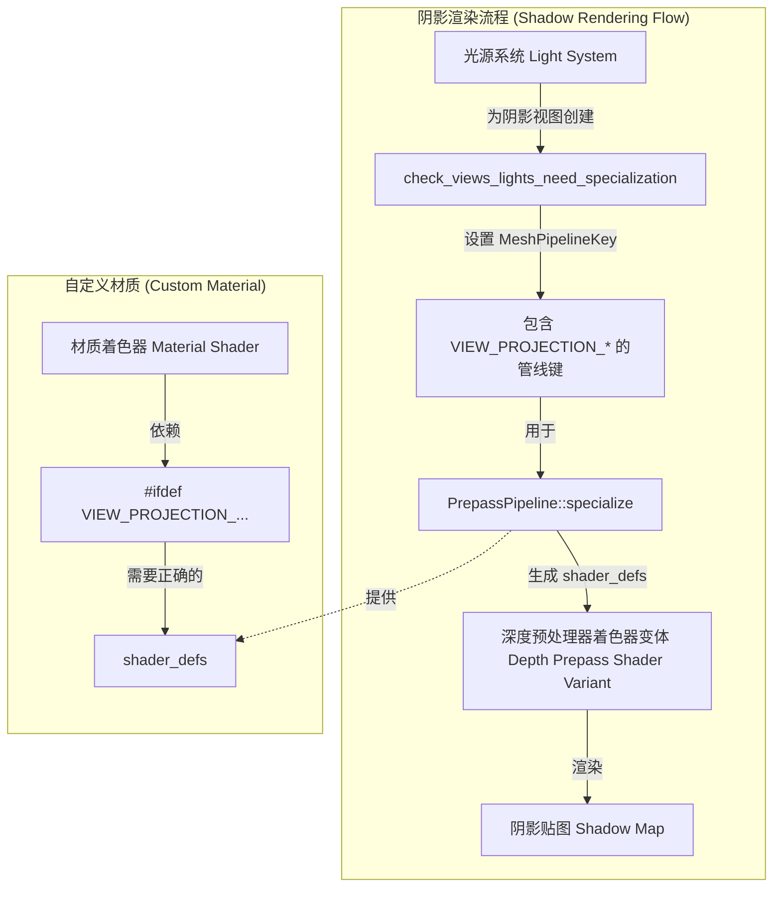

+++
title = "#20989 Implements specialization keys `VIEW_PROJECTION_*` in depth prepass for shadow maps"
date = "2026-02-09T00:00:00"
draft = false
template = "pull_request_page.html"
in_search_index = false

[extra]
current_language = "zh-cn"
available_languages = {"en" = { name = "English", url = "/pull_request/bevy/2026-02/pr-20989-en-20260209" }, "zh-cn" = { name = "中文", url = "/pull_request/bevy/2026-02/pr-20989-zh-cn-20260209" }}
labels = ["C-Feature", "A-Rendering", "D-Straightforward"]
+++

# Title: Implements specialization keys `VIEW_PROJECTION_*` in depth prepass for shadow maps

## Basic Information
- **Title**: Implements specialization keys `VIEW_PROJECTION_*` in depth prepass for shadow maps
- **PR Link**: https://github.com/bevyengine/bevy/pull/20989
- **Author**: Lichtso
- **Status**: MERGED
- **Labels**: C-Feature, A-Rendering, X-Uncontroversial, D-Straightforward, S-Needs-Review
- **Created**: 2025-09-12T18:08:46Z
- **Merged**: 2026-02-09T07:25:18Z
- **Merged By**: superdump

## Description Translation

# 目标 (Objective)
修复 issue #20941。

# 解决方案 (Solution)
在 `check_views_lights_need_specialization()` 和 `PrepassPipeline::specialize()` 中实现了缺失的 `MeshPipelineKey::VIEW_PROJECTION_*` 键。

# 测试 (Testing)
我实现了一个使用这些键的自定义着色器管线的 `Material`（材质），并添加了启用阴影的光源。在此变更之前，该材质仅出现在正常的前向渲染通道中；变更之后，它也出现在阴影中。

## The Story of This Pull Request

这个问题始于一个缺失的功能实现。在 Bevy 的渲染管线中，`MeshPipelineKey` 用于在不同渲染阶段（如主通道、深度预处理器等）对渲染管线进行特殊化，以生成最优化的着色器变体。其中包含一组 `VIEW_PROJECTION_*` 位标志，用于指示视图投影矩阵的类型（正交投影、透视投影或非标准投影）。这个信息对于某些着色器计算，尤其是在处理阴影时，至关重要。

然而，在构建用于渲染阴影的深度预处理器管线时，系统没有正确地设置这些 `VIEW_PROJECTION_*` 键。具体来说，函数 `check_views_lights_need_specialization()` 负责为阴影映射视图准备管线键，但它只设置了 `DEPTH_PREPASS` 和 `UNCLIPPED_DEPTH_ORTHO` 键，漏掉了 `VIEW_PROJECTION_ORTHOGRAPHIC` 和 `VIEW_PROJECTION_PERSPECTIVE`。同样地，`PrepassPipeline::specialize()` 方法在根据管线键生成最终的着色器定义时，也没有处理这些视图投影键。

这种遗漏导致了一个具体问题：如果开发者创建了一个自定义材质，其着色器逻辑依赖于 `VIEW_PROJECTION_*` 相关的着色器定义（例如 `#ifdef VIEW_PROJECTION_ORTHOGRAPHIC`），那么这个材质在用于生成阴影的深度预处理器中将无法正确渲染。着色器会因为缺少预期的定义而编译失败或执行错误的代码路径，导致材质在阴影中“消失”，正如作者在测试中观察到的那样。Issue #20941 很可能就是报告了此类问题。

为了解决这个问题，提交者在两个关键位置添加了缺失的逻辑。首先，在 `light.rs` 的 `check_views_lights_need_specialization()` 函数中，需要根据光源类型决定使用哪种投影。在 Bevy 中，定向光（directional lights）通常使用正交投影来渲染阴影，而点光源和聚光灯则使用透视投影。因此，代码被修改为：当 `is_directional_light` 为真时，设置 `VIEW_PROJECTION_ORTHOGRAPHIC` 键；为假时，设置 `VIEW_PROJECTION_PERSPECTIVE` 键。这里使用 `light_key.set()` 方法，利用位掩码来同时设置多个相关的键。

其次，在 `prepass/mod.rs` 的 `PrepassPipeline::specialize()` 方法中，需要将新设置的管线键转换为着色器能够理解的 `shader_defs`。代码通过 `mesh_key.intersection(MeshPipelineKey::VIEW_PROJECTION_RESERVED_BITS)` 提取出视图投影相关的位，然后通过一系列 `if` 判断，将对应的键值（`VIEW_PROJECTION_NONSTANDARD`， `VIEW_PROJECTION_PERSPECTIVE`， `VIEW_PROJECTION_ORTHOGRAPHIC`）转换为同名的字符串并推入 `shader_defs` 向量。这样，当管线被特殊化时，正确的 `#define` 就会被传入着色器。

这个修复是直接且符合现有模式的。它没有改变架构，只是填补了实现上的空白。`MeshPipelineKey` 的位标志系统和 `specialize` 方法中键到着色器定义的映射是 Bevy 渲染管线标准的工作方式。此次修改确保了阴影深度预处理器管线的特殊化流程与其他渲染通道（如主前向通道）保持一致，使得依赖这些投影类型的自定义着色器能够在所有预期的上下文中正常工作。

从工程角度看，这个 PR 展示了在复杂的、基于阶段的渲染引擎中，保持所有管线配置路径同步的重要性。一个看似微小的遗漏（缺少几个键的设置）就可能导致特定用户功能失效。这也凸显了 `MeshPipelineKey` 这种位掩码设计的好处：它提供了一种紧凑且高效的方式来组合和传递大量的管线配置选项。修复本身的风险很低，因为它只是启用了原本就设计好但未完全实现的功能路径。

## Visual Representation



## Key Files Changed

### 1. `crates/bevy_pbr/src/render/light.rs` (+9/-1)
**变更说明**：此文件中的函数负责为阴影映射准备渲染视图和管线键。变更确保了为阴影深度预处理器正确设置视图投影类型键（`VIEW_PROJECTION_ORTHOGRAPHIC` 或 `VIEW_PROJECTION_PERSPECTIVE`），以匹配光源类型。

**关键代码片段**：
```rust
// 变更后代码：
let is_directional_light = matches!(light_entity, LightEntity::Directional { .. });
let mut light_key = MeshPipelineKey::DEPTH_PREPASS;
light_key.set(
    MeshPipelineKey::VIEW_PROJECTION_ORTHOGRAPHIC
        | MeshPipelineKey::UNCLIPPED_DEPTH_ORTHO,
    is_directional_light,
);
light_key.set(
    MeshPipelineKey::VIEW_PROJECTION_PERSPECTIVE,
    !is_directional_light,
);
```
**关系**：这个修改是问题的根源修复点。它确保在管线特殊化的早期阶段，正确的投影信息就被编码到 `MeshPipelineKey` 中，从而传递到后续阶段。

### 2. `crates/bevy_pbr/src/prepass/mod.rs` (+8/-0)
**变更说明**：`PrepassPipeline` 的 `specialize` 方法根据传入的 `MeshPipelineKey` 生成最终的着色器定义列表。变更添加了处理 `VIEW_PROJECTION_*` 键的逻辑，将其转换为对应的着色器宏定义。

**关键代码片段**：
```rust
// 变更后代码：
let view_projection = mesh_key.intersection(MeshPipelineKey::VIEW_PROJECTION_RESERVED_BITS);
if view_projection == MeshPipelineKey::VIEW_PROJECTION_NONSTANDARD {
    shader_defs.push("VIEW_PROJECTION_NONSTANDARD".into());
} else if view_projection == MeshPipelineKey::VIEW_PROJECTION_PERSPECTIVE {
    shader_defs.push("VIEW_PROJECTION_PERSPECTIVE".into());
} else if view_projection == MeshPipelineKey::VIEW_PROJECTION_ORTHOGRAPHIC {
    shader_defs.push("VIEW_PROJECTION_ORTHOGRAPHIC".into());
}
```
**关系**：这个修改是解决方案的另一半。它将上一步设置好的管线键“翻译”成着色器预处理器可以识别的定义，使得自定义材质着色器中的条件编译 (`#ifdef`) 能够生效，从而在阴影深度渲染中执行正确的代码路径。

## Further Reading
1.  Bevy 官方文档中关于 [渲染管线](https://bevyengine.org/learn/quick-start/features/) 和 [材质系统](https://bevyengine.org/examples/3d-rendering/materials/) 的部分。
2.  `MeshPipelineKey` 的 API 文档，了解所有可用的特殊化标志。
3.   关于实时渲染中阴影映射技术的基础知识，例如“Shadow Mapping”算法，有助于理解深度预处理器（Depth Prepass）在此上下文中的作用。
4.   WebGPU 和着色器特殊化（Shader Specialization）的概念，这是现代图形 API 中用于优化着色器性能的常见技术。