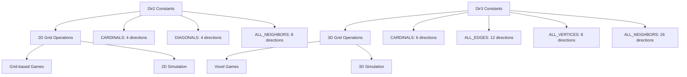

+++
title = "#21561 Feature/glam cross constants"
date = "2026-02-07T00:00:00"
draft = false
template = "pull_request_page.html"
in_search_index = true

[taxonomies]
list_display = ["show"]

[extra]
current_language = "en"
available_languages = {"en" = { name = "English", url = "/pull_request/bevy/2026-02/pr-21561-en-20260207" }, "zh-cn" = { name = "中文", url = "/pull_request/bevy/2026-02/pr-21561-zh-cn-20260207" }}
labels = ["C-Feature", "A-Math", "D-Straightforward"]
+++

# Title

## Basic Information
- **Title**: Feature/glam cross constants
- **PR Link**: https://github.com/bevyengine/bevy/pull/21561
- **Author**: pine-free
- **Status**: MERGED
- **Labels**: C-Feature, S-Ready-For-Final-Review, A-Math, X-Uncontroversial, D-Straightforward
- **Created**: 2025-10-16T11:53:29Z
- **Merged**: 2026-02-07T00:35:02Z
- **Merged By**: alice-i-cecile

## Description Translation

# Objective

Fixes #21333

## Solution

This PR introduces several new constants for Dir2 and Dir3,
providing convenient shorthands for popular directions on a grid, such as:
- All the cardinal directions
- All diagonals
- All neighboring directions (cardinals + diagonals)

## Testing

Changes were not tested via autotests, but I did check my math to make sure I didn't mess up.

You can look at the changed files and make sure that the constants contain the directions they are supposed to

## Showcase

For example. if you have a grid and wish to get all neighboring cells on it,
you don't have to define the directions yourself and can do the following

```rust
let valid_positions = Dir2::ALL_NEIGHBORS.iter().filter_map(|offset| {
    grid.get(current_position + offset)
}.collect();
```

## The Story of This Pull Request

The Bevy math library provides `Dir2` and `Dir3` types for representing normalized 2D and 3D directions. Before this PR, developers working with grid-based systems had to manually define arrays of neighboring directions each time they needed to perform operations like finding adjacent cells. This was repetitive and error-prone.

The core problem was straightforward: the library provided individual direction constants but didn't offer convenient groupings for common use cases. Issue #21333 highlighted this gap, noting that developers were reinventing the wheel for basic grid operations.

The solution approach was pragmatic. The developer identified the most useful groupings for 2D and 3D grid operations and added them as compile-time constants. For `Dir2`, this included the four cardinal directions, four diagonal directions, and all eight neighbors in a 3x3 neighborhood. For `Dir3`, the implementation was more complex due to the additional dimension, requiring groupings for cardinal directions (6), edge directions (12), vertex directions (8), and all 26 neighbors in a 3x3x3 neighborhood.

The implementation details reveal careful attention to mathematical precision. In the `Dir3` implementation, the developer added a `FRAC_1_SQRT_3` constant with a precise f32 value (0.577350269189625764509148780501957456) to maintain consistency with the existing `FRAC_1_SQRT_2` constant. This ensures that all direction vectors remain properly normalized.

From an engineering perspective, these changes follow established patterns in the codebase. The new constants are placed logically within their respective `impl` blocks, following similar patterns for `AXES` arrays. The use of `const` arrays ensures zero runtime overhead - these directions are computed at compile time and baked into the binary.

The impact is practical: developers no longer need to manually define these common direction groupings. This reduces boilerplate code and eliminates potential errors from mistyping coordinates. The example in the PR description demonstrates the improvement clearly - what previously required manually defining eight `Dir2` values can now be accessed via `Dir2::ALL_NEIGHBORS`.

One technical consideration worth noting is the naming convention. The constants use clear, descriptive names that align with geometric terminology: `CARDINALS`, `DIAGONALS`, `ALL_NEIGHBORS` for 2D, and `CARDINALS`, `ALL_EDGES`, `ALL_VERTICES`, `ALL_NEIGHBORS` for 3D. This consistency makes the API intuitive to use.

The PR follows the principle of providing "batteries included" convenience while maintaining the low-level flexibility of the existing API. Developers can still create custom direction arrays when needed, but for common cases, they now have reliable, tested constants available.

## Visual Representation



## Key Files Changed

### `crates/bevy_math/src/direction.rs` (+154/-0)

This file contains the core implementation changes for both `Dir2` and `Dir3` types. The modifications add new constant arrays that group common directions for grid-based operations.

**Key changes for Dir2:**

```rust
/// The cardinal directions.
pub const CARDINALS: [Self; 4] = [Self::X, Self::NEG_X, Self::Y, Self::NEG_Y];

/// The diagonals between the cardinal directions.
pub const DIAGONALS: [Self; 4] = [
    Self::NORTH_EAST,
    Self::NORTH_WEST,
    Self::SOUTH_EAST,
    Self::SOUTH_WEST,
];

/// All neighbors of a tile on a square grid in a 3x3 neighborhood.
pub const ALL_NEIGHBORS: [Self; 8] = [
    Self::X,
    Self::NEG_X,
    Self::Y,
    Self::NEG_Y,
    Self::NORTH_EAST,
    Self::NORTH_WEST,
    Self::SOUTH_EAST,
    Self::SOUTH_WEST,
];
```

**Key changes for Dir3:**

```rust
/// The cardinal directions.
pub const CARDINALS: [Self; 6] = [
    Self::X,
    Self::NEG_X,
    Self::Y,
    Self::NEG_Y,
    Self::Z,
    Self::NEG_Z,
];

// Precision constant for 3D diagonals
const FRAC_1_SQRT_3: f32 = 0.577350269189625764509148780501957456_f32;

/// The directions pointing towards the vertices of a cube centered at the origin.
pub const ALL_VERTICES: [Self; 8] = [
    Self(Vec3::new(Self::FRAC_1_SQRT_3, Self::FRAC_1_SQRT_3, Self::FRAC_1_SQRT_3)),
    // ... 7 more vertices
];

/// The directions towards centers of each edge of a cube
pub const ALL_EDGES: [Self; 12] = [
    Self(Vec3::new(FRAC_1_SQRT_2, FRAC_1_SQRT_2, 0.)),
    // ... 11 more edges
];

/// All neighbors of a tile on a cube grid a 3x3x3 neighborhood.
pub const ALL_NEIGHBORS: [Self; 26] = [
    Self::X,
    Self::NEG_X,
    Self::Y,
    Self::NEG_Y,
    Self::Z,
    Self::NEG_Z,
    // ... plus all edges and vertices
];
```

These changes provide convenient groupings of directions that are commonly needed in grid-based algorithms, pathfinding, neighbor detection, and procedural generation systems.

## Further Reading

1. **Bevy Math Documentation**: The official Bevy documentation for mathematical types and operations
2. **Grid-Based Algorithms**: Common patterns in game development for grid navigation and neighbor detection
3. **Normalized Vectors**: Mathematical background on unit vectors and their applications in game physics
4. **Compile-Time Computation in Rust**: How Rust's const evaluation allows for zero-cost abstractions like these direction constants